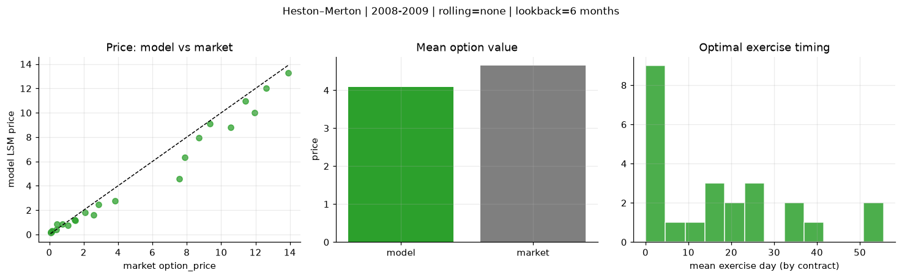
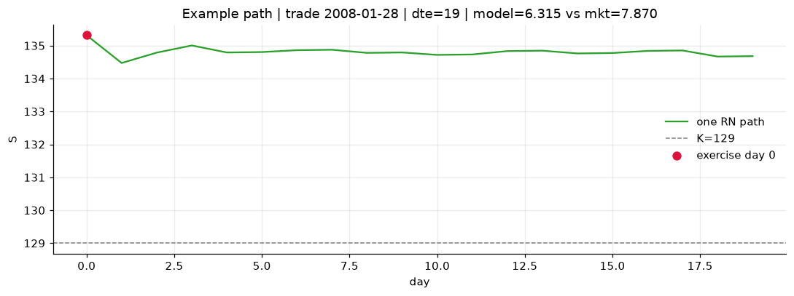
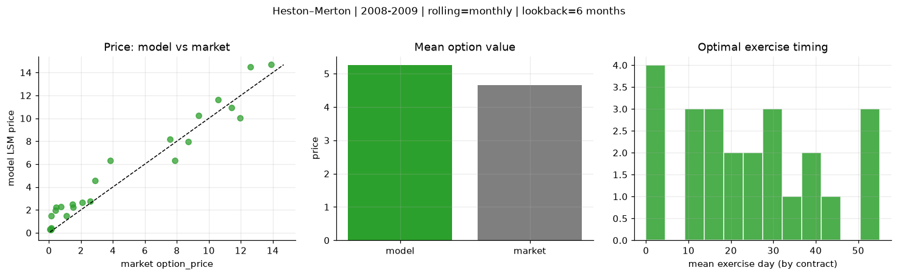
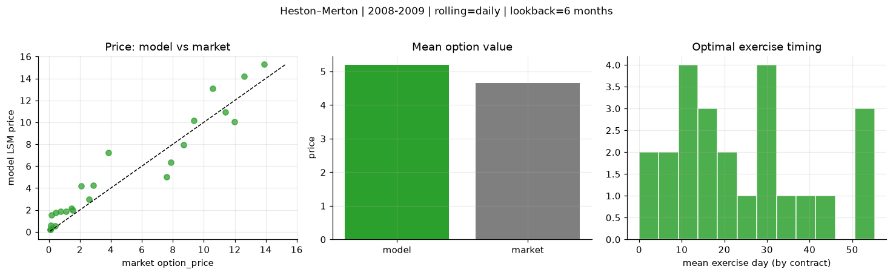
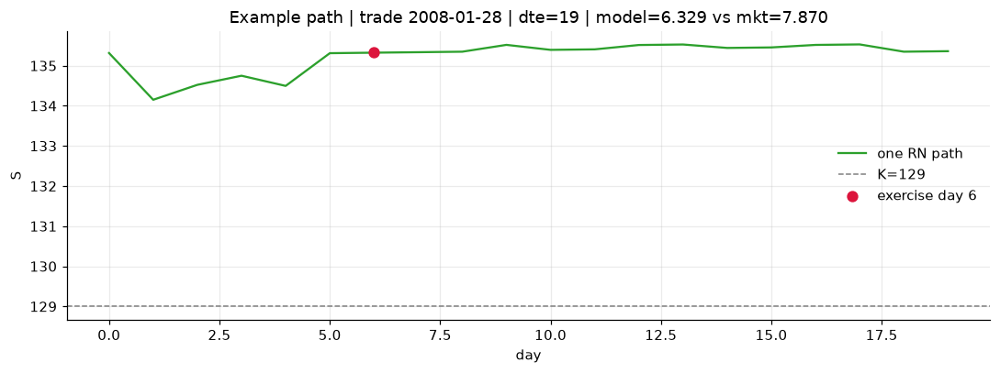

# Optimal stopping — Heston–Merton — 2008-2009

**Model:** Heston–Merton  
**Regime / period:** 2008-2009  
**Lookback:** 6 months (fixed)  
**Rolling modes:** none, monthly, daily  
**Pricing:** LSM American calls on SPY | n_paths=2000 | seed=42 | contracts=24

## Comparison (same contracts, same lookback)

| Rolling | RMSE | MAE | Bias (model−mkt) | Mean early-ex frac | Cal updates | Cal s | LSM s |
|---------|-----:|----:|-----------------:|-------------------:|------------:|------:|------:|
| `none` | 0.9793 | 0.6536 | -0.5699 | 0.478 | 1 | 0.0 | 0.1 |
| `monthly` | 1.1936 | 1.0002 | 0.6076 | 0.315 | 25 | 0.0 | 0.1 |
| `daily` | 1.4352 | 1.1503 | 0.5439 | 0.327 | 505 | 0.5 | 0.1 |

**Lowest RMSE (this study):** `none` = 0.9793

## Rolling = `none`

- **RMSE:** 0.9793  
- **MAE:** 0.6536  
- **Bias:** -0.5699  
- **Mean early-exercise fraction:** 0.478  
- **Calibration updates (SPY):** 1

Contract errors (compact)

| date | K | dte | market | model | error | early_ex |
|------|--:|----:|-------:|------:|------:|---------:|
| 2008-01-28 | 129 | 19 | 7.870 | 6.315 | -1.555 | 1.000 |
| 2008-08-01 | 117 | 15 | 9.350 | 9.087 | -0.263 | 1.000 |
| 2008-05-21 | 126 | 31 | 13.910 | 13.273 | -0.637 | 1.000 |
| 2008-05-14 | 129 | 38 | 12.610 | 12.022 | -0.588 | 1.000 |
| 2008-07-25 | 117 | 57 | 10.570 | 8.788 | -1.782 | 1.000 |
| 2008-02-04 | 128 | 47 | 11.960 | 10.033 | -1.927 | 1.000 |
| 2008-07-03 | 126 | 16 | 2.590 | 1.601 | -0.989 | 0.129 |
| 2008-09-08 | 125 | 12 | 2.880 | 2.470 | -0.410 | 0.815 |
| 2009-10-16 | 111 | 36 | 1.520 | 1.176 | -0.344 | 0.115 |
| 2009-10-23 | 111 | 29 | 1.100 | 0.773 | -0.327 | 0.124 |
| 2008-08-08 | 129 | 43 | 3.830 | 2.753 | -1.077 | 0.501 |
| 2009-10-23 | 111 | 57 | 2.080 | 1.799 | -0.281 | 0.126 |
| 2009-12-07 | 117 | 12 | 0.070 | 0.184 | 0.114 | 0.029 |
| 2009-10-02 | 110 | 15 | 0.140 | 0.198 | 0.058 | 0.011 |
| 2009-09-25 | 110 | 22 | 0.410 | 0.413 | 0.003 | 0.074 |
| 2009-08-26 | 111 | 24 | 0.150 | 0.290 | 0.140 | 0.054 |
| 2009-11-06 | 113 | 43 | 0.760 | 0.839 | 0.079 | 0.155 |
| 2009-11-20 | 118 | 57 | 0.430 | 0.868 | 0.438 | 0.093 |
| 2009-11-20 | 111 | 29 | 1.460 | 1.212 | -0.248 | 0.185 |
| 2009-10-30 | 113 | 22 | 0.120 | 0.225 | 0.105 | 0.029 |
| 2008-03-04 | 122 | 18 | 11.410 | 10.946 | -0.464 | 1.000 |
| 2008-09-22 | 116 | 26 | 7.580 | 4.552 | -3.028 | 1.000 |
| 2008-03-04 | 125 | 18 | 8.710 | 7.946 | -0.764 | 1.000 |
| 2009-10-02 | 111 | 15 | 0.080 | 0.147 | 0.067 | 0.029 |

## Rolling = `monthly`

- **RMSE:** 1.1936  
- **MAE:** 1.0002  
- **Bias:** 0.6076  
- **Mean early-exercise fraction:** 0.315  
- **Calibration updates (SPY):** 25

Contract errors (compact)

| date | K | dte | market | model | error | early_ex |
|------|--:|----:|-------:|------:|------:|---------:|
| 2008-01-28 | 129 | 19 | 7.870 | 6.315 | -1.555 | 1.000 |
| 2008-08-01 | 117 | 15 | 9.350 | 10.245 | 0.895 | 0.867 |
| 2008-05-21 | 126 | 31 | 13.910 | 14.682 | 0.772 | 0.272 |
| 2008-05-14 | 129 | 38 | 12.610 | 14.491 | 1.881 | 0.093 |
| 2008-07-25 | 117 | 57 | 10.570 | 11.621 | 1.051 | 0.501 |
| 2008-02-04 | 128 | 47 | 11.960 | 10.033 | -1.927 | 1.000 |
| 2008-07-03 | 126 | 16 | 2.590 | 2.772 | 0.182 | 0.167 |
| 2008-09-08 | 125 | 12 | 2.880 | 4.564 | 1.684 | 0.023 |
| 2009-10-16 | 111 | 36 | 1.520 | 2.230 | 0.710 | 0.075 |
| 2009-10-23 | 111 | 29 | 1.100 | 1.486 | 0.386 | 0.018 |
| 2008-08-08 | 129 | 43 | 3.830 | 6.327 | 2.497 | 0.475 |
| 2009-10-23 | 111 | 57 | 2.080 | 2.663 | 0.583 | 0.277 |
| 2009-12-07 | 117 | 12 | 0.070 | 0.293 | 0.223 | 0.050 |
| 2009-10-02 | 110 | 15 | 0.140 | 0.334 | 0.194 | 0.025 |
| 2009-09-25 | 110 | 22 | 0.410 | 1.956 | 1.546 | 0.100 |
| 2009-08-26 | 111 | 24 | 0.150 | 1.458 | 1.308 | 0.037 |
| 2009-11-06 | 113 | 43 | 0.760 | 2.268 | 1.508 | 0.080 |
| 2009-11-20 | 118 | 57 | 0.430 | 2.201 | 1.771 | 0.103 |
| 2009-11-20 | 111 | 29 | 1.460 | 2.474 | 1.014 | 0.225 |
| 2009-10-30 | 113 | 22 | 0.120 | 0.444 | 0.324 | 0.029 |
| 2008-03-04 | 122 | 18 | 11.410 | 10.946 | -0.464 | 1.000 |
| 2008-09-22 | 116 | 26 | 7.580 | 8.179 | 0.599 | 0.120 |
| 2008-03-04 | 125 | 18 | 8.710 | 7.946 | -0.764 | 1.000 |
| 2009-10-02 | 111 | 15 | 0.080 | 0.244 | 0.164 | 0.018 |

## Rolling = `daily`

- **RMSE:** 1.4352  
- **MAE:** 1.1503  
- **Bias:** 0.5439  
- **Mean early-exercise fraction:** 0.327  
- **Calibration updates (SPY):** 505

Contract errors (compact)

| date | K | dte | market | model | error | early_ex |
|------|--:|----:|-------:|------:|------:|---------:|
| 2008-01-28 | 129 | 19 | 7.870 | 6.329 | -1.541 | 0.811 |
| 2008-08-01 | 117 | 15 | 9.350 | 10.170 | 0.820 | 0.768 |
| 2008-05-21 | 126 | 31 | 13.910 | 15.274 | 1.364 | 0.110 |
| 2008-05-14 | 129 | 38 | 12.610 | 14.209 | 1.599 | 0.611 |
| 2008-07-25 | 117 | 57 | 10.570 | 13.114 | 2.544 | 0.353 |
| 2008-02-04 | 128 | 47 | 11.960 | 10.035 | -1.925 | 0.944 |
| 2008-07-03 | 126 | 16 | 2.590 | 2.952 | 0.362 | 0.139 |
| 2008-09-08 | 125 | 12 | 2.880 | 4.268 | 1.388 | 0.024 |
| 2009-10-16 | 111 | 36 | 1.520 | 1.997 | 0.477 | 0.074 |
| 2009-10-23 | 111 | 29 | 1.100 | 1.894 | 0.794 | 0.044 |
| 2008-08-08 | 129 | 43 | 3.830 | 7.209 | 3.379 | 0.380 |
| 2009-10-23 | 111 | 57 | 2.080 | 4.165 | 2.085 | 0.288 |
| 2009-12-07 | 117 | 12 | 0.070 | 0.203 | 0.133 | 0.047 |
| 2009-10-02 | 110 | 15 | 0.140 | 0.295 | 0.155 | 0.038 |
| 2009-09-25 | 110 | 22 | 0.410 | 0.534 | 0.124 | 0.024 |
| 2009-08-26 | 111 | 24 | 0.150 | 1.532 | 1.382 | 0.015 |
| 2009-11-06 | 113 | 43 | 0.760 | 1.878 | 1.118 | 0.078 |
| 2009-11-20 | 118 | 57 | 0.430 | 1.742 | 1.312 | 0.140 |
| 2009-11-20 | 111 | 29 | 1.460 | 2.156 | 0.696 | 0.232 |
| 2009-10-30 | 113 | 22 | 0.120 | 0.578 | 0.458 | 0.030 |
| 2008-03-04 | 122 | 18 | 11.410 | 10.946 | -0.464 | 1.000 |
| 2008-09-22 | 116 | 26 | 7.580 | 4.998 | -2.582 | 0.683 |
| 2008-03-04 | 125 | 18 | 8.710 | 7.946 | -0.764 | 1.000 |
| 2009-10-02 | 111 | 15 | 0.080 | 0.222 | 0.142 | 0.014 |

