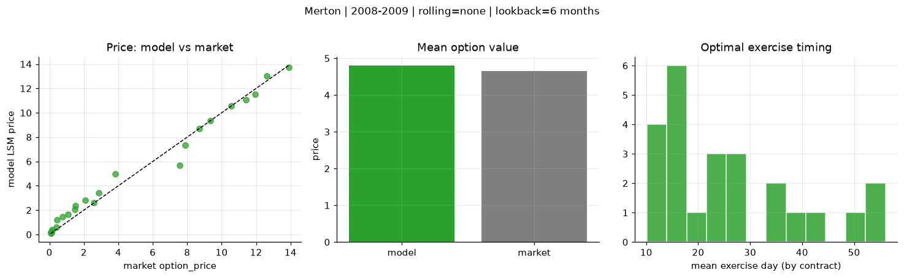
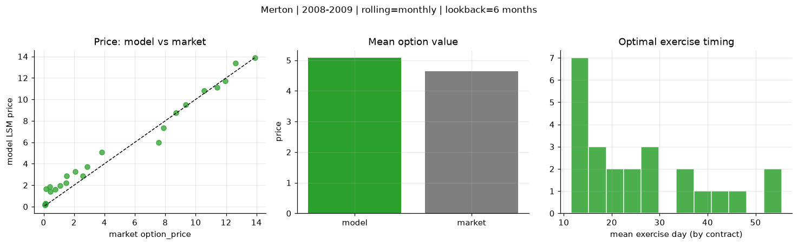
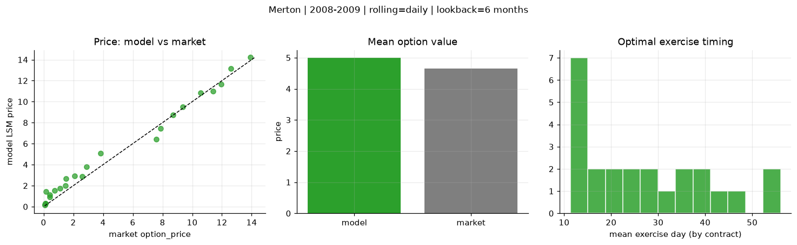
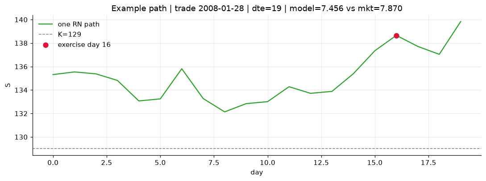

# Optimal stopping — Merton — 2008-2009

**Model:** Merton  
**Regime / period:** 2008-2009  
**Lookback:** 6 months (fixed)  
**Rolling modes:** none, monthly, daily  
**Pricing:** LSM American calls on SPY | n_paths=2000 | seed=42 | contracts=24

## Comparison (same contracts, same lookback)

| Rolling | RMSE | MAE | Bias (model−mkt) | Mean early-ex frac | Cal updates | Cal s | LSM s |
|---------|-----:|----:|-----------------:|-------------------:|------------:|------:|------:|
| `none` | 0.6200 | 0.4401 | 0.1531 | 0.299 | 1 | 0.0 | 0.1 |
| `monthly` | 0.8325 | 0.6505 | 0.4311 | 0.299 | 25 | 0.0 | 0.1 |
| `daily` | 0.6597 | 0.5367 | 0.3461 | 0.285 | 505 | 0.1 | 0.1 |

**Lowest RMSE (this study):** `none` = 0.6200

## Rolling = `none`

- **RMSE:** 0.6200  
- **MAE:** 0.4401  
- **Bias:** 0.1531  
- **Mean early-exercise fraction:** 0.299  
- **Calibration updates (SPY):** 1

Contract errors (compact)

| date | K | dte | market | model | error | early_ex |
|------|--:|----:|-------:|------:|------:|---------:|
| 2008-01-28 | 129 | 19 | 7.870 | 7.360 | -0.510 | 0.521 |
| 2008-08-01 | 117 | 15 | 9.350 | 9.363 | 0.013 | 0.328 |
| 2008-05-21 | 126 | 31 | 13.910 | 13.729 | -0.181 | 0.624 |
| 2008-05-14 | 129 | 38 | 12.610 | 13.045 | 0.435 | 0.631 |
| 2008-07-25 | 117 | 57 | 10.570 | 10.551 | -0.019 | 0.521 |
| 2008-02-04 | 128 | 47 | 11.960 | 11.499 | -0.461 | 0.617 |
| 2008-07-03 | 126 | 16 | 2.590 | 2.615 | 0.025 | 0.287 |
| 2008-09-08 | 125 | 12 | 2.880 | 3.439 | 0.559 | 0.229 |
| 2009-10-16 | 111 | 36 | 1.520 | 2.345 | 0.825 | 0.165 |
| 2009-10-23 | 111 | 29 | 1.100 | 1.658 | 0.558 | 0.217 |
| 2008-08-08 | 129 | 43 | 3.830 | 4.955 | 1.125 | 0.439 |
| 2009-10-23 | 111 | 57 | 2.080 | 2.834 | 0.754 | 0.148 |
| 2009-12-07 | 117 | 12 | 0.070 | 0.201 | 0.131 | 0.008 |
| 2009-10-02 | 110 | 15 | 0.140 | 0.170 | 0.030 | 0.029 |
| 2009-09-25 | 110 | 22 | 0.410 | 0.607 | 0.197 | 0.075 |
| 2009-08-26 | 111 | 24 | 0.150 | 0.385 | 0.235 | 0.076 |
| 2009-11-06 | 113 | 43 | 0.760 | 1.465 | 0.705 | 0.156 |
| 2009-11-20 | 118 | 57 | 0.430 | 1.215 | 0.785 | 0.101 |
| 2009-11-20 | 111 | 29 | 1.460 | 2.052 | 0.592 | 0.259 |
| 2009-10-30 | 113 | 22 | 0.120 | 0.238 | 0.118 | 0.018 |
| 2008-03-04 | 122 | 18 | 11.410 | 11.054 | -0.356 | 0.776 |
| 2008-09-22 | 116 | 26 | 7.580 | 5.662 | -1.918 | 0.509 |
| 2008-03-04 | 125 | 18 | 8.710 | 8.711 | 0.001 | 0.447 |
| 2009-10-02 | 111 | 15 | 0.080 | 0.113 | 0.033 | 0.001 |

## Rolling = `monthly`

- **RMSE:** 0.8325  
- **MAE:** 0.6505  
- **Bias:** 0.4311  
- **Mean early-exercise fraction:** 0.299  
- **Calibration updates (SPY):** 25

Contract errors (compact)

| date | K | dte | market | model | error | early_ex |
|------|--:|----:|-------:|------:|------:|---------:|
| 2008-01-28 | 129 | 19 | 7.870 | 7.360 | -0.510 | 0.521 |
| 2008-08-01 | 117 | 15 | 9.350 | 9.486 | 0.136 | 0.790 |
| 2008-05-21 | 126 | 31 | 13.910 | 13.903 | -0.007 | 0.617 |
| 2008-05-14 | 129 | 38 | 12.610 | 13.360 | 0.750 | 0.604 |
| 2008-07-25 | 117 | 57 | 10.570 | 10.797 | 0.227 | 0.469 |
| 2008-02-04 | 128 | 47 | 11.960 | 11.717 | -0.243 | 0.594 |
| 2008-07-03 | 126 | 16 | 2.590 | 2.867 | 0.277 | 0.186 |
| 2008-09-08 | 125 | 12 | 2.880 | 3.734 | 0.854 | 0.150 |
| 2009-10-16 | 111 | 36 | 1.520 | 2.854 | 1.334 | 0.183 |
| 2009-10-23 | 111 | 29 | 1.100 | 1.984 | 0.884 | 0.185 |
| 2008-08-08 | 129 | 43 | 3.830 | 5.075 | 1.245 | 0.295 |
| 2009-10-23 | 111 | 57 | 2.080 | 3.292 | 1.212 | 0.229 |
| 2009-12-07 | 117 | 12 | 0.070 | 0.163 | 0.093 | 0.006 |
| 2009-10-02 | 110 | 15 | 0.140 | 0.271 | 0.131 | 0.044 |
| 2009-09-25 | 110 | 22 | 0.410 | 1.872 | 1.462 | 0.083 |
| 2009-08-26 | 111 | 24 | 0.150 | 1.649 | 1.499 | 0.123 |
| 2009-11-06 | 113 | 43 | 0.760 | 1.630 | 0.870 | 0.159 |
| 2009-11-20 | 118 | 57 | 0.430 | 1.383 | 0.953 | 0.124 |
| 2009-11-20 | 111 | 29 | 1.460 | 2.204 | 0.744 | 0.260 |
| 2009-10-30 | 113 | 22 | 0.120 | 0.284 | 0.164 | 0.043 |
| 2008-03-04 | 122 | 18 | 11.410 | 11.134 | -0.276 | 0.777 |
| 2008-09-22 | 116 | 26 | 7.580 | 5.983 | -1.597 | 0.273 |
| 2008-03-04 | 125 | 18 | 8.710 | 8.755 | 0.045 | 0.442 |
| 2009-10-02 | 111 | 15 | 0.080 | 0.180 | 0.100 | 0.025 |

## Rolling = `daily`

- **RMSE:** 0.6597  
- **MAE:** 0.5367  
- **Bias:** 0.3461  
- **Mean early-exercise fraction:** 0.285  
- **Calibration updates (SPY):** 505

Contract errors (compact)

| date | K | dte | market | model | error | early_ex |
|------|--:|----:|-------:|------:|------:|---------:|
| 2008-01-28 | 129 | 19 | 7.870 | 7.456 | -0.414 | 0.510 |
| 2008-08-01 | 117 | 15 | 9.350 | 9.480 | 0.130 | 0.805 |
| 2008-05-21 | 126 | 31 | 13.910 | 14.210 | 0.300 | 0.633 |
| 2008-05-14 | 129 | 38 | 12.610 | 13.140 | 0.530 | 0.420 |
| 2008-07-25 | 117 | 57 | 10.570 | 10.842 | 0.272 | 0.429 |
| 2008-02-04 | 128 | 47 | 11.960 | 11.648 | -0.312 | 0.601 |
| 2008-07-03 | 126 | 16 | 2.590 | 2.872 | 0.282 | 0.189 |
| 2008-09-08 | 125 | 12 | 2.880 | 3.775 | 0.895 | 0.154 |
| 2009-10-16 | 111 | 36 | 1.520 | 2.666 | 1.146 | 0.176 |
| 2009-10-23 | 111 | 29 | 1.100 | 1.719 | 0.619 | 0.220 |
| 2008-08-08 | 129 | 43 | 3.830 | 5.097 | 1.267 | 0.279 |
| 2009-10-23 | 111 | 57 | 2.080 | 2.924 | 0.844 | 0.151 |
| 2009-12-07 | 117 | 12 | 0.070 | 0.150 | 0.080 | 0.007 |
| 2009-10-02 | 110 | 15 | 0.140 | 0.296 | 0.156 | 0.013 |
| 2009-09-25 | 110 | 22 | 0.410 | 0.900 | 0.490 | 0.112 |
| 2009-08-26 | 111 | 24 | 0.150 | 1.424 | 1.274 | 0.120 |
| 2009-11-06 | 113 | 43 | 0.760 | 1.540 | 0.780 | 0.158 |
| 2009-11-20 | 118 | 57 | 0.430 | 1.136 | 0.706 | 0.099 |
| 2009-11-20 | 111 | 29 | 1.460 | 1.978 | 0.518 | 0.259 |
| 2009-10-30 | 113 | 22 | 0.120 | 0.288 | 0.168 | 0.021 |
| 2008-03-04 | 122 | 18 | 11.410 | 11.011 | -0.399 | 0.786 |
| 2008-09-22 | 116 | 26 | 7.580 | 6.418 | -1.162 | 0.220 |
| 2008-03-04 | 125 | 18 | 8.710 | 8.745 | 0.035 | 0.443 |
| 2009-10-02 | 111 | 15 | 0.080 | 0.181 | 0.101 | 0.025 |

