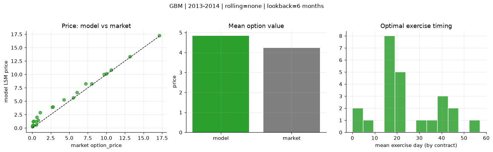
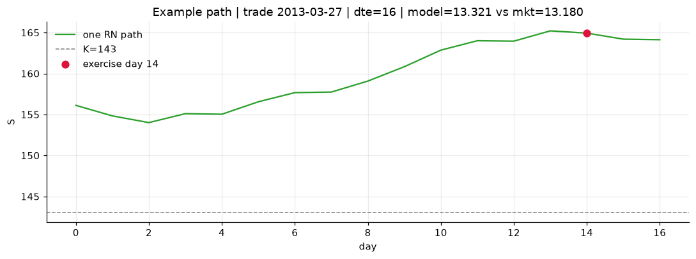
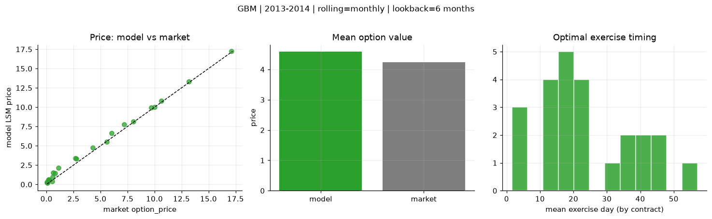
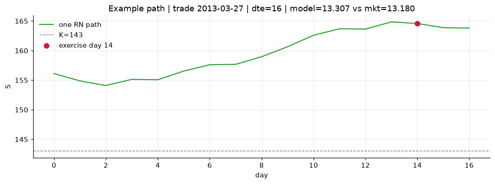
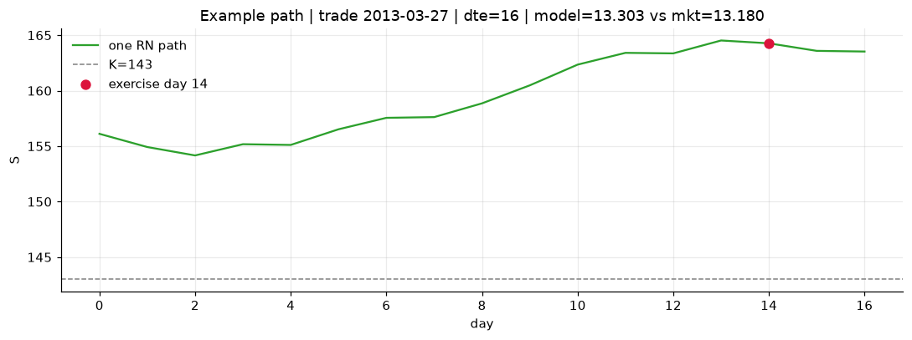

# Optimal stopping — GBM — 2013-2014

**Model:** GBM  
**Regime / period:** 2013-2014  
**Lookback:** 6 months (fixed)  
**Rolling modes:** none, monthly, daily  
**Pricing:** LSM American calls on SPY | n_paths=2000 | seed=42 | contracts=24

## Comparison (same contracts, same lookback)

| Rolling | RMSE | MAE | Bias (model−mkt) | Mean early-ex frac | Cal updates | Cal s | LSM s |
|---------|-----:|----:|-----------------:|-------------------:|------------:|------:|------:|
| `none` | 0.7724 | 0.6020 | 0.6020 | 0.346 | 1 | 0.0 | 0.1 |
| `monthly` | 0.4572 | 0.3682 | 0.3536 | 0.354 | 25 | 0.0 | 0.1 |
| `daily` | 0.4021 | 0.3317 | 0.3199 | 0.349 | 505 | 0.1 | 0.1 |

**Lowest RMSE (this study):** `daily` = 0.4021

## Rolling = `none`

- **RMSE:** 0.7724  
- **MAE:** 0.6020  
- **Bias:** 0.6020  
- **Mean early-exercise fraction:** 0.346  
- **Calibration updates (SPY):** 1

Contract errors (compact)

| date | K | dte | market | model | error | early_ex |
|------|--:|----:|-------:|------:|------:|---------:|
| 2013-03-27 | 143 | 16 | 13.180 | 13.321 | 0.141 | 0.681 |
| 2014-08-29 | 183.5 | 7 | 17.120 | 17.227 | 0.107 | 1.000 |
| 2013-12-04 | 170 | 27 | 10.000 | 10.108 | 0.108 | 0.684 |
| 2013-11-26 | 173 | 25 | 8.040 | 8.279 | 0.239 | 0.689 |
| 2014-05-29 | 186 | 51 | 7.200 | 8.262 | 1.062 | 0.338 |
| 2013-03-06 | 149 | 45 | 6.040 | 6.657 | 0.617 | 0.606 |
| 2013-04-25 | 163 | 15 | 0.120 | 0.517 | 0.397 | 0.054 |
| 2014-04-01 | 183 | 10 | 5.560 | 5.634 | 0.074 | 0.682 |
| 2014-08-29 | 199 | 22 | 2.680 | 3.912 | 1.232 | 0.389 |
| 2014-09-15 | 204 | 25 | 0.210 | 1.268 | 1.058 | 0.154 |
| 2014-05-07 | 186 | 45 | 4.300 | 5.246 | 0.946 | 0.369 |
| 2014-08-15 | 199 | 46 | 1.100 | 2.905 | 1.805 | 0.204 |
| 2014-11-17 | 212 | 18 | 0.070 | 0.512 | 0.442 | 0.019 |
| 2014-02-03 | 180 | 19 | 0.530 | 0.597 | 0.067 | 0.015 |
| 2013-12-11 | 188 | 23 | 0.060 | 0.294 | 0.234 | 0.050 |
| 2013-07-08 | 169 | 40 | 0.810 | 1.473 | 0.663 | 0.161 |
| 2014-04-23 | 195 | 59 | 0.640 | 1.991 | 1.351 | 0.124 |
| 2014-09-15 | 208 | 46 | 0.150 | 1.218 | 1.068 | 0.082 |
| 2013-06-07 | 154 | 7 | 10.620 | 10.810 | 0.190 | 1.000 |
| 2014-09-08 | 198.5 | 18 | 2.780 | 3.985 | 1.205 | 0.132 |
| 2014-04-08 | 189.5 | 24 | 0.580 | 1.186 | 0.606 | 0.123 |
| 2013-02-20 | 157 | 16 | 0.060 | 0.273 | 0.213 | 0.064 |
| 2014-03-11 | 177.5 | 17 | 9.680 | 10.030 | 0.350 | 0.626 |
| 2013-08-26 | 177 | 35 | 0.050 | 0.320 | 0.270 | 0.048 |

## Rolling = `monthly`

- **RMSE:** 0.4572  
- **MAE:** 0.3682  
- **Bias:** 0.3536  
- **Mean early-exercise fraction:** 0.354  
- **Calibration updates (SPY):** 25

Contract errors (compact)

| date | K | dte | market | model | error | early_ex |
|------|--:|----:|-------:|------:|------:|---------:|
| 2013-03-27 | 143 | 16 | 13.180 | 13.307 | 0.127 | 0.673 |
| 2014-08-29 | 183.5 | 7 | 17.120 | 17.228 | 0.108 | 1.000 |
| 2013-12-04 | 170 | 27 | 10.000 | 10.035 | 0.035 | 0.711 |
| 2013-11-26 | 173 | 25 | 8.040 | 8.152 | 0.112 | 0.689 |
| 2014-05-29 | 186 | 51 | 7.200 | 7.770 | 0.570 | 0.453 |
| 2013-03-06 | 149 | 45 | 6.040 | 6.642 | 0.602 | 0.597 |
| 2013-04-25 | 163 | 15 | 0.120 | 0.421 | 0.301 | 0.052 |
| 2014-04-01 | 183 | 10 | 5.560 | 5.543 | -0.017 | 0.709 |
| 2014-08-29 | 199 | 22 | 2.680 | 3.394 | 0.714 | 0.403 |
| 2014-09-15 | 204 | 25 | 0.210 | 0.652 | 0.442 | 0.106 |
| 2014-05-07 | 186 | 45 | 4.300 | 4.780 | 0.480 | 0.379 |
| 2014-08-15 | 199 | 46 | 1.100 | 2.167 | 1.067 | 0.198 |
| 2014-11-17 | 212 | 18 | 0.070 | 0.317 | 0.247 | 0.022 |
| 2014-02-03 | 180 | 19 | 0.530 | 0.371 | -0.159 | 0.020 |
| 2013-12-11 | 188 | 23 | 0.060 | 0.206 | 0.146 | 0.021 |
| 2013-07-08 | 169 | 40 | 0.810 | 1.468 | 0.658 | 0.160 |
| 2014-04-23 | 195 | 59 | 0.640 | 1.523 | 0.883 | 0.121 |
| 2014-09-15 | 208 | 46 | 0.150 | 0.573 | 0.423 | 0.033 |
| 2013-06-07 | 154 | 7 | 10.620 | 10.822 | 0.202 | 1.000 |
| 2014-09-08 | 198.5 | 18 | 2.780 | 3.346 | 0.566 | 0.138 |
| 2014-04-08 | 189.5 | 24 | 0.580 | 0.933 | 0.353 | 0.111 |
| 2013-02-20 | 157 | 16 | 0.060 | 0.201 | 0.141 | 0.056 |
| 2014-03-11 | 177.5 | 17 | 9.680 | 9.950 | 0.270 | 0.813 |
| 2013-08-26 | 177 | 35 | 0.050 | 0.265 | 0.215 | 0.040 |

## Rolling = `daily`

- **RMSE:** 0.4021  
- **MAE:** 0.3317  
- **Bias:** 0.3199  
- **Mean early-exercise fraction:** 0.349  
- **Calibration updates (SPY):** 505

Contract errors (compact)

| date | K | dte | market | model | error | early_ex |
|------|--:|----:|-------:|------:|------:|---------:|
| 2013-03-27 | 143 | 16 | 13.180 | 13.303 | 0.123 | 0.683 |
| 2014-08-29 | 183.5 | 7 | 17.120 | 17.246 | 0.126 | 0.898 |
| 2013-12-04 | 170 | 27 | 10.000 | 10.045 | 0.045 | 0.715 |
| 2013-11-26 | 173 | 25 | 8.040 | 8.164 | 0.124 | 0.683 |
| 2014-05-29 | 186 | 51 | 7.200 | 7.755 | 0.555 | 0.464 |
| 2013-03-06 | 149 | 45 | 6.040 | 6.557 | 0.517 | 0.607 |
| 2013-04-25 | 163 | 15 | 0.120 | 0.475 | 0.355 | 0.053 |
| 2014-04-01 | 183 | 10 | 5.560 | 5.533 | -0.027 | 0.719 |
| 2014-08-29 | 199 | 22 | 2.680 | 3.221 | 0.541 | 0.394 |
| 2014-09-15 | 204 | 25 | 0.210 | 0.580 | 0.370 | 0.104 |
| 2014-05-07 | 186 | 45 | 4.300 | 4.771 | 0.471 | 0.376 |
| 2014-08-15 | 199 | 46 | 1.100 | 1.912 | 0.812 | 0.196 |
| 2014-11-17 | 212 | 18 | 0.070 | 0.297 | 0.227 | 0.022 |
| 2014-02-03 | 180 | 19 | 0.530 | 0.416 | -0.114 | 0.021 |
| 2013-12-11 | 188 | 23 | 0.060 | 0.171 | 0.111 | 0.025 |
| 2013-07-08 | 169 | 40 | 0.810 | 1.334 | 0.524 | 0.151 |
| 2014-04-23 | 195 | 59 | 0.640 | 1.523 | 0.883 | 0.119 |
| 2014-09-15 | 208 | 46 | 0.150 | 0.523 | 0.373 | 0.030 |
| 2013-06-07 | 154 | 7 | 10.620 | 10.828 | 0.208 | 1.000 |
| 2014-09-08 | 198.5 | 18 | 2.780 | 3.293 | 0.513 | 0.142 |
| 2014-04-08 | 189.5 | 24 | 0.580 | 0.919 | 0.339 | 0.108 |
| 2013-02-20 | 157 | 16 | 0.060 | 0.210 | 0.150 | 0.057 |
| 2014-03-11 | 177.5 | 17 | 9.680 | 9.943 | 0.263 | 0.789 |
| 2013-08-26 | 177 | 35 | 0.050 | 0.239 | 0.189 | 0.028 |

