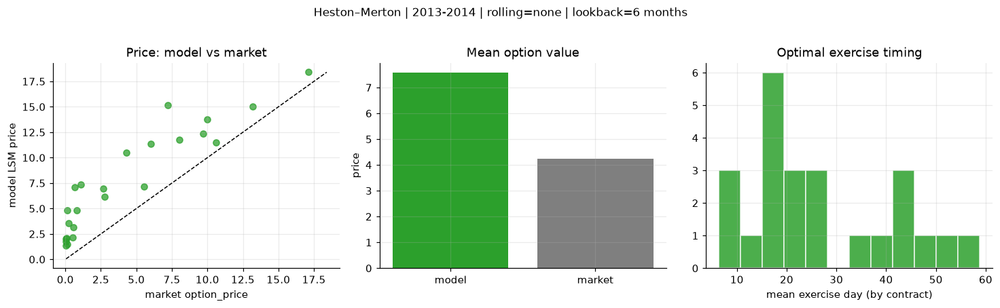
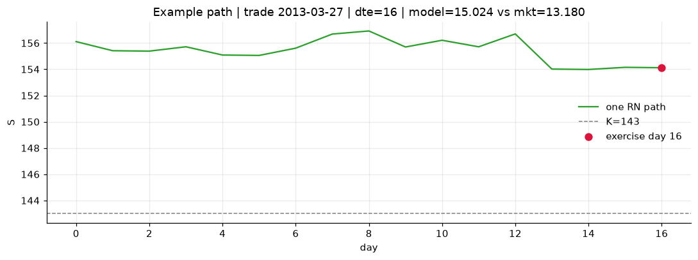
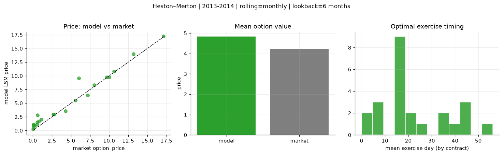
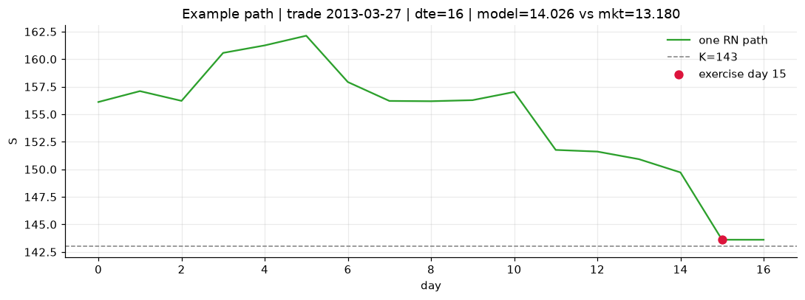
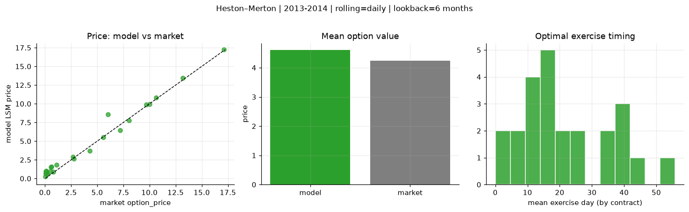
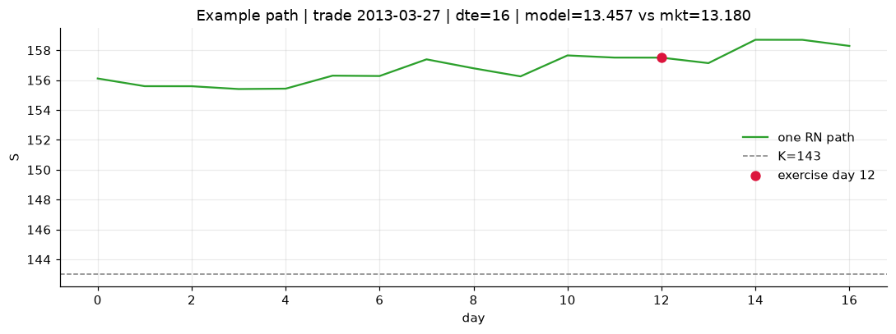

# Optimal stopping — Heston–Merton — 2013-2014

**Model:** Heston–Merton  
**Regime / period:** 2013-2014  
**Lookback:** 6 months (fixed)  
**Rolling modes:** none, monthly, daily  
**Pricing:** LSM American calls on SPY | n_paths=2000 | seed=42 | contracts=24

## Comparison (same contracts, same lookback)

| Rolling | RMSE | MAE | Bias (model−mkt) | Mean early-ex frac | Cal updates | Cal s | LSM s |
|---------|-----:|----:|-----------------:|-------------------:|------------:|------:|------:|
| `none` | 3.8582 | 3.3421 | 3.3421 | 0.107 | 1 | 0.0 | 0.1 |
| `monthly` | 1.0534 | 0.7449 | 0.5993 | 0.367 | 25 | 0.0 | 0.1 |
| `daily` | 0.7332 | 0.5264 | 0.3724 | 0.392 | 505 | 0.6 | 0.1 |

**Lowest RMSE (this study):** `daily` = 0.7332

## Rolling = `none`

- **RMSE:** 3.8582  
- **MAE:** 3.3421  
- **Bias:** 3.3421  
- **Mean early-exercise fraction:** 0.107  
- **Calibration updates (SPY):** 1

Contract errors (compact)

| date | K | dte | market | model | error | early_ex |
|------|--:|----:|-------:|------:|------:|---------:|
| 2013-03-27 | 143 | 16 | 13.180 | 15.024 | 1.844 | 0.041 |
| 2014-08-29 | 183.5 | 7 | 17.120 | 18.401 | 1.281 | 0.588 |
| 2013-12-04 | 170 | 27 | 10.000 | 13.749 | 3.749 | 0.090 |
| 2013-11-26 | 173 | 25 | 8.040 | 11.746 | 3.706 | 0.065 |
| 2014-05-29 | 186 | 51 | 7.200 | 15.151 | 7.951 | 0.209 |
| 2013-03-06 | 149 | 45 | 6.040 | 11.369 | 5.329 | 0.017 |
| 2013-04-25 | 163 | 15 | 0.120 | 1.499 | 1.379 | 0.059 |
| 2014-04-01 | 183 | 10 | 5.560 | 7.176 | 1.616 | 0.051 |
| 2014-08-29 | 199 | 22 | 2.680 | 6.971 | 4.291 | 0.142 |
| 2014-09-15 | 204 | 25 | 0.210 | 3.549 | 3.339 | 0.006 |
| 2014-05-07 | 186 | 45 | 4.300 | 10.525 | 6.225 | 0.185 |
| 2014-08-15 | 199 | 46 | 1.100 | 7.359 | 6.259 | 0.204 |
| 2014-11-17 | 212 | 18 | 0.070 | 2.058 | 1.988 | 0.021 |
| 2014-02-03 | 180 | 19 | 0.530 | 2.140 | 1.610 | 0.094 |
| 2013-12-11 | 188 | 23 | 0.060 | 1.728 | 1.668 | 0.015 |
| 2013-07-08 | 169 | 40 | 0.810 | 4.798 | 3.988 | 0.028 |
| 2014-04-23 | 195 | 59 | 0.640 | 7.116 | 6.476 | 0.044 |
| 2014-09-15 | 208 | 46 | 0.150 | 4.812 | 4.662 | 0.029 |
| 2013-06-07 | 154 | 7 | 10.620 | 11.526 | 0.906 | 0.269 |
| 2014-09-08 | 198.5 | 18 | 2.780 | 6.179 | 3.399 | 0.016 |
| 2014-04-08 | 189.5 | 24 | 0.580 | 3.174 | 2.594 | 0.108 |
| 2013-02-20 | 157 | 16 | 0.060 | 1.325 | 1.265 | 0.044 |
| 2014-03-11 | 177.5 | 17 | 9.680 | 12.365 | 2.685 | 0.171 |
| 2013-08-26 | 177 | 35 | 0.050 | 2.051 | 2.001 | 0.064 |

## Rolling = `monthly`

- **RMSE:** 1.0534  
- **MAE:** 0.7449  
- **Bias:** 0.5993  
- **Mean early-exercise fraction:** 0.367  
- **Calibration updates (SPY):** 25

Contract errors (compact)

| date | K | dte | market | model | error | early_ex |
|------|--:|----:|-------:|------:|------:|---------:|
| 2013-03-27 | 143 | 16 | 13.180 | 14.026 | 0.846 | 0.280 |
| 2014-08-29 | 183.5 | 7 | 17.120 | 17.226 | 0.106 | 1.000 |
| 2013-12-04 | 170 | 27 | 10.000 | 9.783 | -0.217 | 0.894 |
| 2013-11-26 | 173 | 25 | 8.040 | 8.298 | 0.258 | 0.591 |
| 2014-05-29 | 186 | 51 | 7.200 | 6.445 | -0.755 | 0.805 |
| 2013-03-06 | 149 | 45 | 6.040 | 9.592 | 3.552 | 0.054 |
| 2013-04-25 | 163 | 15 | 0.120 | 0.986 | 0.866 | 0.092 |
| 2014-04-01 | 183 | 10 | 5.560 | 5.514 | -0.046 | 0.775 |
| 2014-08-29 | 199 | 22 | 2.680 | 2.982 | 0.302 | 0.369 |
| 2014-09-15 | 204 | 25 | 0.210 | 0.869 | 0.659 | 0.145 |
| 2014-05-07 | 186 | 45 | 4.300 | 3.572 | -0.728 | 0.406 |
| 2014-08-15 | 199 | 46 | 1.100 | 2.002 | 0.902 | 0.185 |
| 2014-11-17 | 212 | 18 | 0.070 | 1.104 | 1.034 | 0.087 |
| 2014-02-03 | 180 | 19 | 0.530 | 1.089 | 0.559 | 0.072 |
| 2013-12-11 | 188 | 23 | 0.060 | 0.617 | 0.557 | 0.086 |
| 2013-07-08 | 169 | 40 | 0.810 | 1.678 | 0.868 | 0.154 |
| 2014-04-23 | 195 | 59 | 0.640 | 2.840 | 2.200 | 0.161 |
| 2014-09-15 | 208 | 46 | 0.150 | 1.031 | 0.881 | 0.087 |
| 2013-06-07 | 154 | 7 | 10.620 | 10.810 | 0.190 | 1.000 |
| 2014-09-08 | 198.5 | 18 | 2.780 | 2.944 | 0.164 | 0.382 |
| 2014-04-08 | 189.5 | 24 | 0.580 | 1.495 | 0.915 | 0.136 |
| 2013-02-20 | 157 | 16 | 0.060 | 1.047 | 0.987 | 0.076 |
| 2014-03-11 | 177.5 | 17 | 9.680 | 9.770 | 0.090 | 0.940 |
| 2013-08-26 | 177 | 35 | 0.050 | 0.244 | 0.194 | 0.040 |

## Rolling = `daily`

- **RMSE:** 0.7332  
- **MAE:** 0.5264  
- **Bias:** 0.3724  
- **Mean early-exercise fraction:** 0.392  
- **Calibration updates (SPY):** 505

Contract errors (compact)

| date | K | dte | market | model | error | early_ex |
|------|--:|----:|-------:|------:|------:|---------:|
| 2013-03-27 | 143 | 16 | 13.180 | 13.457 | 0.277 | 0.698 |
| 2014-08-29 | 183.5 | 7 | 17.120 | 17.226 | 0.106 | 1.000 |
| 2013-12-04 | 170 | 27 | 10.000 | 9.927 | -0.073 | 0.793 |
| 2013-11-26 | 173 | 25 | 8.040 | 7.757 | -0.283 | 0.829 |
| 2014-05-29 | 186 | 51 | 7.200 | 6.448 | -0.752 | 0.836 |
| 2013-03-06 | 149 | 45 | 6.040 | 8.550 | 2.510 | 0.354 |
| 2013-04-25 | 163 | 15 | 0.120 | 1.052 | 0.932 | 0.110 |
| 2014-04-01 | 183 | 10 | 5.560 | 5.516 | -0.044 | 0.777 |
| 2014-08-29 | 199 | 22 | 2.680 | 2.872 | 0.192 | 0.351 |
| 2014-09-15 | 204 | 25 | 0.210 | 0.578 | 0.368 | 0.087 |
| 2014-05-07 | 186 | 45 | 4.300 | 3.711 | -0.589 | 0.341 |
| 2014-08-15 | 199 | 46 | 1.100 | 1.816 | 0.716 | 0.222 |
| 2014-11-17 | 212 | 18 | 0.070 | 0.719 | 0.649 | 0.063 |
| 2014-02-03 | 180 | 19 | 0.530 | 0.948 | 0.418 | 0.072 |
| 2013-12-11 | 188 | 23 | 0.060 | 0.632 | 0.572 | 0.090 |
| 2013-07-08 | 169 | 40 | 0.810 | 0.907 | 0.097 | 0.149 |
| 2014-04-23 | 195 | 59 | 0.640 | 1.556 | 0.916 | 0.173 |
| 2014-09-15 | 208 | 46 | 0.150 | 0.742 | 0.592 | 0.095 |
| 2013-06-07 | 154 | 7 | 10.620 | 10.810 | 0.190 | 1.000 |
| 2014-09-08 | 198.5 | 18 | 2.780 | 2.674 | -0.106 | 0.464 |
| 2014-04-08 | 189.5 | 24 | 0.580 | 1.524 | 0.944 | 0.126 |
| 2013-02-20 | 157 | 16 | 0.060 | 0.966 | 0.906 | 0.015 |
| 2014-03-11 | 177.5 | 17 | 9.680 | 9.868 | 0.188 | 0.722 |
| 2013-08-26 | 177 | 35 | 0.050 | 0.262 | 0.212 | 0.042 |

