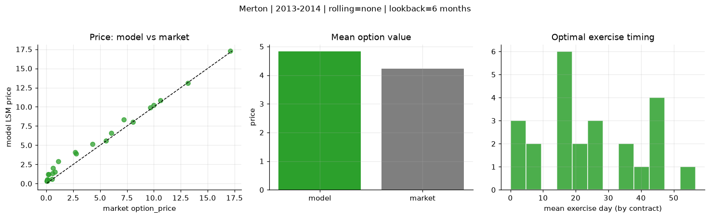
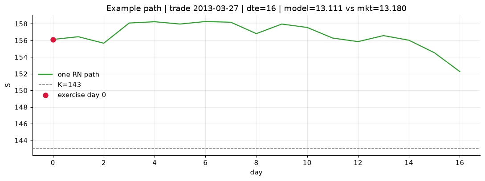
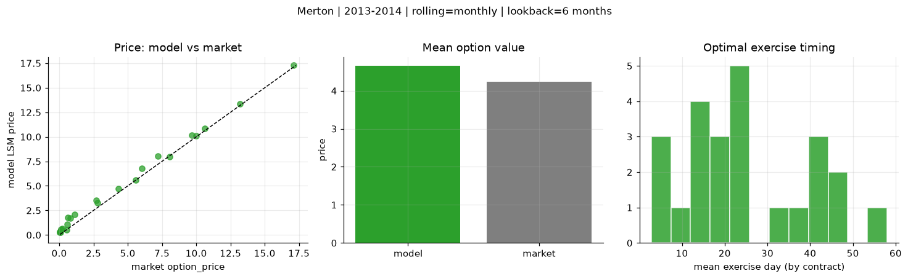
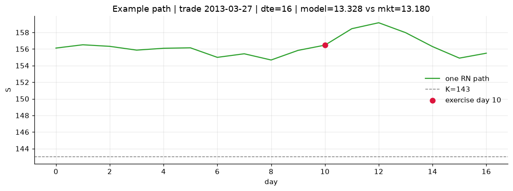
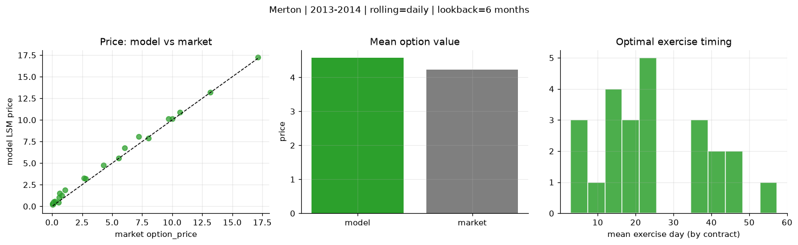
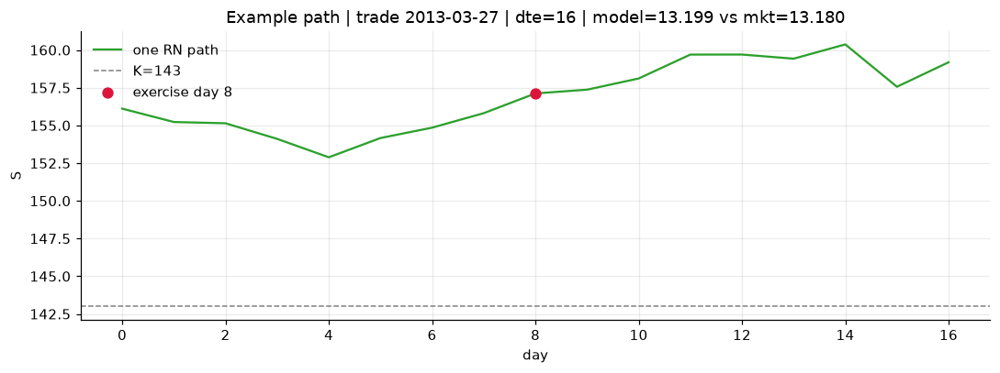

# Optimal stopping — Merton — 2013-2014

**Model:** Merton  
**Regime / period:** 2013-2014  
**Lookback:** 6 months (fixed)  
**Rolling modes:** none, monthly, daily  
**Pricing:** LSM American calls on SPY | n_paths=2000 | seed=42 | contracts=24

## Comparison (same contracts, same lookback)

| Rolling | RMSE | MAE | Bias (model−mkt) | Mean early-ex frac | Cal updates | Cal s | LSM s |
|---------|-----:|----:|-----------------:|-------------------:|------------:|------:|------:|
| `none` | 0.7831 | 0.6031 | 0.5966 | 0.345 | 1 | 0.0 | 0.1 |
| `monthly` | 0.5367 | 0.4316 | 0.4224 | 0.311 | 25 | 0.0 | 0.1 |
| `daily` | 0.4398 | 0.3624 | 0.3438 | 0.325 | 505 | 0.1 | 0.1 |

**Lowest RMSE (this study):** `daily` = 0.4398

## Rolling = `none`

- **RMSE:** 0.7831  
- **MAE:** 0.6031  
- **Bias:** 0.5966  
- **Mean early-exercise fraction:** 0.345  
- **Calibration updates (SPY):** 1

Contract errors (compact)

| date | K | dte | market | model | error | early_ex |
|------|--:|----:|-------:|------:|------:|---------:|
| 2013-03-27 | 143 | 16 | 13.180 | 13.111 | -0.069 | 1.000 |
| 2014-08-29 | 183.5 | 7 | 17.120 | 17.258 | 0.138 | 0.994 |
| 2013-12-04 | 170 | 27 | 10.000 | 10.218 | 0.218 | 0.406 |
| 2013-11-26 | 173 | 25 | 8.040 | 8.030 | -0.010 | 0.576 |
| 2014-05-29 | 186 | 51 | 7.200 | 8.322 | 1.122 | 0.410 |
| 2013-03-06 | 149 | 45 | 6.040 | 6.588 | 0.548 | 0.515 |
| 2013-04-25 | 163 | 15 | 0.120 | 0.498 | 0.378 | 0.045 |
| 2014-04-01 | 183 | 10 | 5.560 | 5.569 | 0.009 | 0.565 |
| 2014-08-29 | 199 | 22 | 2.680 | 4.058 | 1.378 | 0.310 |
| 2014-09-15 | 204 | 25 | 0.210 | 1.224 | 1.014 | 0.117 |
| 2014-05-07 | 186 | 45 | 4.300 | 5.136 | 0.836 | 0.249 |
| 2014-08-15 | 199 | 46 | 1.100 | 2.927 | 1.827 | 0.169 |
| 2014-11-17 | 212 | 18 | 0.070 | 0.520 | 0.450 | 0.028 |
| 2014-02-03 | 180 | 19 | 0.530 | 0.613 | 0.083 | 0.112 |
| 2013-12-11 | 188 | 23 | 0.060 | 0.376 | 0.316 | 0.037 |
| 2013-07-08 | 169 | 40 | 0.810 | 1.547 | 0.737 | 0.212 |
| 2014-04-23 | 195 | 59 | 0.640 | 2.033 | 1.393 | 0.139 |
| 2014-09-15 | 208 | 46 | 0.150 | 1.228 | 1.078 | 0.053 |
| 2013-06-07 | 154 | 7 | 10.620 | 10.857 | 0.237 | 1.000 |
| 2014-09-08 | 198.5 | 18 | 2.780 | 3.883 | 1.103 | 0.337 |
| 2014-04-08 | 189.5 | 24 | 0.580 | 1.315 | 0.735 | 0.110 |
| 2013-02-20 | 157 | 16 | 0.060 | 0.332 | 0.272 | 0.035 |
| 2014-03-11 | 177.5 | 17 | 9.680 | 9.924 | 0.244 | 0.814 |
| 2013-08-26 | 177 | 35 | 0.050 | 0.330 | 0.280 | 0.048 |

## Rolling = `monthly`

- **RMSE:** 0.5367  
- **MAE:** 0.4316  
- **Bias:** 0.4224  
- **Mean early-exercise fraction:** 0.311  
- **Calibration updates (SPY):** 25

Contract errors (compact)

| date | K | dte | market | model | error | early_ex |
|------|--:|----:|-------:|------:|------:|---------:|
| 2013-03-27 | 143 | 16 | 13.180 | 13.328 | 0.148 | 0.888 |
| 2014-08-29 | 183.5 | 7 | 17.120 | 17.273 | 0.153 | 0.641 |
| 2013-12-04 | 170 | 27 | 10.000 | 10.119 | 0.119 | 0.445 |
| 2013-11-26 | 173 | 25 | 8.040 | 7.954 | -0.086 | 0.662 |
| 2014-05-29 | 186 | 51 | 7.200 | 8.046 | 0.846 | 0.577 |
| 2013-03-06 | 149 | 45 | 6.040 | 6.770 | 0.730 | 0.372 |
| 2013-04-25 | 163 | 15 | 0.120 | 0.533 | 0.413 | 0.045 |
| 2014-04-01 | 183 | 10 | 5.560 | 5.569 | 0.009 | 0.537 |
| 2014-08-29 | 199 | 22 | 2.680 | 3.548 | 0.868 | 0.197 |
| 2014-09-15 | 204 | 25 | 0.210 | 0.663 | 0.453 | 0.096 |
| 2014-05-07 | 186 | 45 | 4.300 | 4.703 | 0.403 | 0.311 |
| 2014-08-15 | 199 | 46 | 1.100 | 2.070 | 0.970 | 0.157 |
| 2014-11-17 | 212 | 18 | 0.070 | 0.273 | 0.203 | 0.018 |
| 2014-02-03 | 180 | 19 | 0.530 | 0.505 | -0.025 | 0.046 |
| 2013-12-11 | 188 | 23 | 0.060 | 0.324 | 0.264 | 0.043 |
| 2013-07-08 | 169 | 40 | 0.810 | 1.739 | 0.929 | 0.119 |
| 2014-04-23 | 195 | 59 | 0.640 | 1.789 | 1.149 | 0.240 |
| 2014-09-15 | 208 | 46 | 0.150 | 0.576 | 0.426 | 0.077 |
| 2013-06-07 | 154 | 7 | 10.620 | 10.867 | 0.247 | 0.974 |
| 2014-09-08 | 198.5 | 18 | 2.780 | 3.274 | 0.494 | 0.147 |
| 2014-04-08 | 189.5 | 24 | 0.580 | 1.075 | 0.495 | 0.121 |
| 2013-02-20 | 157 | 16 | 0.060 | 0.291 | 0.231 | 0.050 |
| 2014-03-11 | 177.5 | 17 | 9.680 | 10.175 | 0.495 | 0.670 |
| 2013-08-26 | 177 | 35 | 0.050 | 0.255 | 0.205 | 0.036 |

## Rolling = `daily`

- **RMSE:** 0.4398  
- **MAE:** 0.3624  
- **Bias:** 0.3438  
- **Mean early-exercise fraction:** 0.325  
- **Calibration updates (SPY):** 505

Contract errors (compact)

| date | K | dte | market | model | error | early_ex |
|------|--:|----:|-------:|------:|------:|---------:|
| 2013-03-27 | 143 | 16 | 13.180 | 13.199 | 0.019 | 0.853 |
| 2014-08-29 | 183.5 | 7 | 17.120 | 17.234 | 0.114 | 0.689 |
| 2013-12-04 | 170 | 27 | 10.000 | 10.121 | 0.121 | 0.439 |
| 2013-11-26 | 173 | 25 | 8.040 | 7.909 | -0.131 | 0.676 |
| 2014-05-29 | 186 | 51 | 7.200 | 8.069 | 0.869 | 0.522 |
| 2013-03-06 | 149 | 45 | 6.040 | 6.778 | 0.738 | 0.751 |
| 2013-04-25 | 163 | 15 | 0.120 | 0.422 | 0.302 | 0.076 |
| 2014-04-01 | 183 | 10 | 5.560 | 5.584 | 0.024 | 0.537 |
| 2014-08-29 | 199 | 22 | 2.680 | 3.281 | 0.601 | 0.205 |
| 2014-09-15 | 204 | 25 | 0.210 | 0.593 | 0.383 | 0.095 |
| 2014-05-07 | 186 | 45 | 4.300 | 4.763 | 0.463 | 0.304 |
| 2014-08-15 | 199 | 46 | 1.100 | 1.886 | 0.786 | 0.209 |
| 2014-11-17 | 212 | 18 | 0.070 | 0.282 | 0.212 | 0.032 |
| 2014-02-03 | 180 | 19 | 0.530 | 0.438 | -0.092 | 0.043 |
| 2013-12-11 | 188 | 23 | 0.060 | 0.286 | 0.226 | 0.041 |
| 2013-07-08 | 169 | 40 | 0.810 | 1.241 | 0.431 | 0.138 |
| 2014-04-23 | 195 | 59 | 0.640 | 1.492 | 0.852 | 0.116 |
| 2014-09-15 | 208 | 46 | 0.150 | 0.496 | 0.346 | 0.065 |
| 2013-06-07 | 154 | 7 | 10.620 | 10.867 | 0.247 | 0.969 |
| 2014-09-08 | 198.5 | 18 | 2.780 | 3.223 | 0.443 | 0.144 |
| 2014-04-08 | 189.5 | 24 | 0.580 | 1.007 | 0.427 | 0.085 |
| 2013-02-20 | 157 | 16 | 0.060 | 0.307 | 0.247 | 0.033 |
| 2014-03-11 | 177.5 | 17 | 9.680 | 10.124 | 0.444 | 0.781 |
| 2013-08-26 | 177 | 35 | 0.050 | 0.230 | 0.180 | 0.009 |

