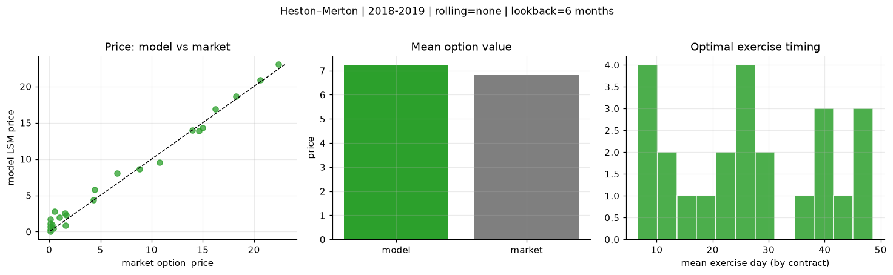
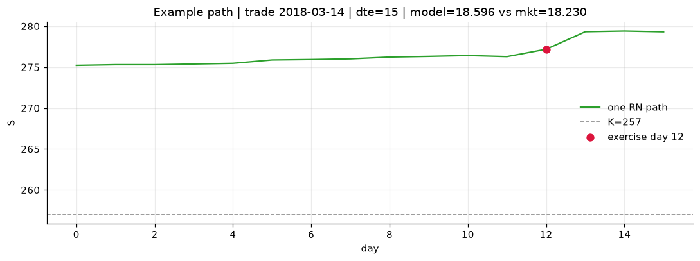
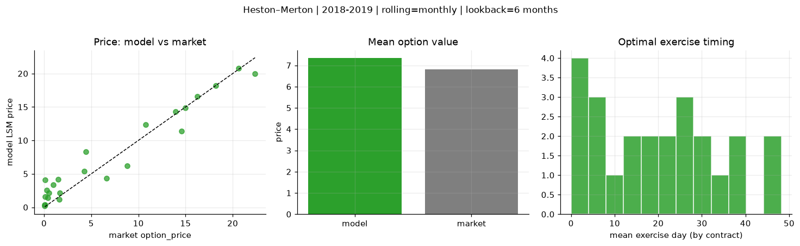
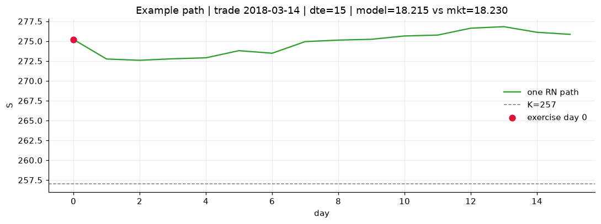
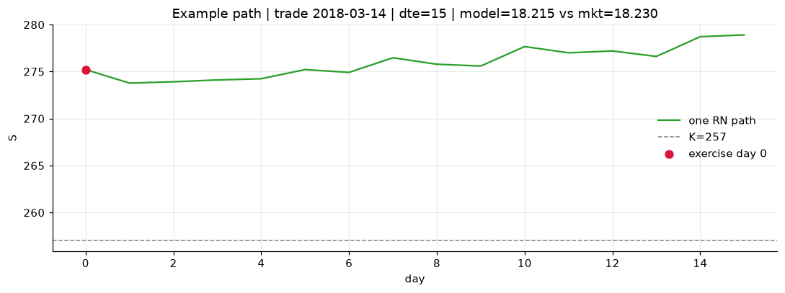

# Optimal stopping — Heston–Merton — 2018-2019

**Model:** Heston–Merton  
**Regime / period:** 2018-2019  
**Lookback:** 6 months (fixed)  
**Rolling modes:** none, monthly, daily  
**Pricing:** LSM American calls on SPY | n_paths=2000 | seed=42 | contracts=24

## Comparison (same contracts, same lookback)

| Rolling | RMSE | MAE | Bias (model−mkt) | Mean early-ex frac | Cal updates | Cal s | LSM s |
|---------|-----:|----:|-----------------:|-------------------:|------------:|------:|------:|
| `none` | 0.9086 | 0.7250 | 0.4286 | 0.294 | 1 | 0.0 | 0.1 |
| `monthly` | 1.9075 | 1.4632 | 0.5341 | 0.361 | 25 | 0.0 | 0.1 |
| `daily` | 1.7732 | 1.3327 | 0.4463 | 0.361 | 503 | 0.5 | 0.2 |

**Lowest RMSE (this study):** `none` = 0.9086

## Rolling = `none`

- **RMSE:** 0.9086  
- **MAE:** 0.7250  
- **Bias:** 0.4286  
- **Mean early-exercise fraction:** 0.294  
- **Calibration updates (SPY):** 1

Contract errors (compact)

| date | K | dte | market | model | error | early_ex |
|------|--:|----:|-------:|------:|------:|---------:|
| 2018-03-14 | 257 | 15 | 18.230 | 18.596 | 0.366 | 0.421 |
| 2019-09-05 | 277 | 8 | 20.620 | 20.922 | 0.302 | 0.446 |
| 2019-01-15 | 247 | 31 | 14.990 | 14.338 | -0.652 | 0.826 |
| 2019-01-15 | 247.5 | 24 | 13.960 | 13.995 | 0.035 | 0.348 |
| 2019-06-03 | 261 | 46 | 16.230 | 16.845 | 0.615 | 0.326 |
| 2018-02-28 | 260 | 51 | 14.600 | 13.844 | -0.756 | 0.879 |
| 2018-04-05 | 269 | 11 | 1.600 | 0.912 | -0.688 | 0.035 |
| 2019-02-06 | 269 | 7 | 4.290 | 4.352 | 0.062 | 0.196 |
| 2019-07-09 | 303 | 31 | 1.520 | 2.566 | 1.046 | 0.070 |
| 2019-07-30 | 307 | 27 | 0.990 | 1.932 | 0.942 | 0.092 |
| 2019-02-21 | 277.5 | 43 | 4.450 | 5.766 | 1.316 | 0.404 |
| 2019-09-05 | 293 | 50 | 8.840 | 8.610 | -0.230 | 0.586 |
| 2019-07-23 | 309 | 15 | 0.110 | 0.682 | 0.572 | 0.031 |
| 2018-11-29 | 291 | 8 | 0.080 | 0.076 | -0.004 | 0.004 |
| 2018-11-21 | 286 | 21 | 0.080 | 0.326 | 0.246 | 0.013 |
| 2018-05-10 | 287.5 | 29 | 0.110 | 1.092 | 0.982 | 0.028 |
| 2019-05-03 | 320 | 49 | 0.100 | 1.748 | 1.648 | 0.065 |
| 2019-08-13 | 308 | 48 | 0.510 | 2.793 | 2.283 | 0.059 |
| 2018-10-02 | 293 | 20 | 1.670 | 2.302 | 0.632 | 0.205 |
| 2018-11-07 | 261 | 54 | 22.370 | 23.019 | 0.649 | 0.771 |
| 2019-11-29 | 311 | 42 | 6.650 | 8.015 | 1.365 | 0.458 |
| 2019-03-07 | 279.5 | 8 | 0.410 | 0.492 | 0.082 | 0.045 |
| 2019-07-09 | 290 | 45 | 10.750 | 9.522 | -1.228 | 0.698 |
| 2019-06-24 | 307.5 | 25 | 0.270 | 0.971 | 0.701 | 0.045 |

## Rolling = `monthly`

- **RMSE:** 1.9075  
- **MAE:** 1.4632  
- **Bias:** 0.5341  
- **Mean early-exercise fraction:** 0.361  
- **Calibration updates (SPY):** 25

Contract errors (compact)

| date | K | dte | market | model | error | early_ex |
|------|--:|----:|-------:|------:|------:|---------:|
| 2018-03-14 | 257 | 15 | 18.230 | 18.215 | -0.015 | 1.000 |
| 2019-09-05 | 277 | 8 | 20.620 | 20.811 | 0.191 | 1.000 |
| 2019-01-15 | 247 | 31 | 14.990 | 14.868 | -0.122 | 0.623 |
| 2019-01-15 | 247.5 | 24 | 13.960 | 14.322 | 0.362 | 0.600 |
| 2019-06-03 | 261 | 46 | 16.230 | 16.545 | 0.315 | 0.516 |
| 2018-02-28 | 260 | 51 | 14.600 | 11.394 | -3.206 | 1.000 |
| 2018-04-05 | 269 | 11 | 1.600 | 1.138 | -0.462 | 0.105 |
| 2019-02-06 | 269 | 7 | 4.290 | 5.363 | 1.073 | 0.055 |
| 2019-07-09 | 303 | 31 | 1.520 | 4.202 | 2.682 | 0.139 |
| 2019-07-30 | 307 | 27 | 0.990 | 3.362 | 2.372 | 0.128 |
| 2019-02-21 | 277.5 | 43 | 4.450 | 8.277 | 3.827 | 0.275 |
| 2019-09-05 | 293 | 50 | 8.840 | 6.176 | -2.664 | 0.601 |
| 2019-07-23 | 309 | 15 | 0.110 | 1.544 | 1.434 | 0.070 |
| 2018-11-29 | 291 | 8 | 0.080 | 0.218 | 0.138 | 0.005 |
| 2018-11-21 | 286 | 21 | 0.080 | 0.407 | 0.327 | 0.034 |
| 2018-05-10 | 287.5 | 29 | 0.110 | 0.381 | 0.271 | 0.035 |
| 2019-05-03 | 320 | 49 | 0.100 | 4.117 | 4.017 | 0.083 |
| 2019-08-13 | 308 | 48 | 0.510 | 2.134 | 1.624 | 0.138 |
| 2018-10-02 | 293 | 20 | 1.670 | 2.154 | 0.484 | 0.222 |
| 2018-11-07 | 261 | 54 | 22.370 | 19.965 | -2.405 | 1.000 |
| 2019-11-29 | 311 | 42 | 6.650 | 4.374 | -2.276 | 0.483 |
| 2019-03-07 | 279.5 | 8 | 0.410 | 1.417 | 1.007 | 0.065 |
| 2019-07-09 | 290 | 45 | 10.750 | 12.343 | 1.593 | 0.368 |
| 2019-06-24 | 307.5 | 25 | 0.270 | 2.521 | 2.251 | 0.108 |

## Rolling = `daily`

- **RMSE:** 1.7732  
- **MAE:** 1.3327  
- **Bias:** 0.4463  
- **Mean early-exercise fraction:** 0.361  
- **Calibration updates (SPY):** 503

Contract errors (compact)

| date | K | dte | market | model | error | early_ex |
|------|--:|----:|-------:|------:|------:|---------:|
| 2018-03-14 | 257 | 15 | 18.230 | 18.215 | -0.015 | 1.000 |
| 2019-09-05 | 277 | 8 | 20.620 | 20.811 | 0.191 | 1.000 |
| 2019-01-15 | 247 | 31 | 14.990 | 15.201 | 0.211 | 0.615 |
| 2019-01-15 | 247.5 | 24 | 13.960 | 14.601 | 0.641 | 0.642 |
| 2019-06-03 | 261 | 46 | 16.230 | 18.648 | 2.418 | 0.460 |
| 2018-02-28 | 260 | 51 | 14.600 | 11.394 | -3.206 | 1.000 |
| 2018-04-05 | 269 | 11 | 1.600 | 1.211 | -0.389 | 0.112 |
| 2019-02-06 | 269 | 7 | 4.290 | 4.847 | 0.557 | 0.110 |
| 2019-07-09 | 303 | 31 | 1.520 | 3.454 | 1.934 | 0.228 |
| 2019-07-30 | 307 | 27 | 0.990 | 2.254 | 1.264 | 0.100 |
| 2019-02-21 | 277.5 | 43 | 4.450 | 8.193 | 3.743 | 0.263 |
| 2019-09-05 | 293 | 50 | 8.840 | 6.138 | -2.702 | 0.589 |
| 2019-07-23 | 309 | 15 | 0.110 | 1.053 | 0.943 | 0.108 |
| 2018-11-29 | 291 | 8 | 0.080 | 0.222 | 0.142 | 0.002 |
| 2018-11-21 | 286 | 21 | 0.080 | 0.466 | 0.386 | 0.035 |
| 2018-05-10 | 287.5 | 29 | 0.110 | 0.299 | 0.189 | 0.035 |
| 2019-05-03 | 320 | 49 | 0.100 | 4.096 | 3.996 | 0.084 |
| 2019-08-13 | 308 | 48 | 0.510 | 1.239 | 0.729 | 0.083 |
| 2018-10-02 | 293 | 20 | 1.670 | 2.312 | 0.642 | 0.160 |
| 2018-11-07 | 261 | 54 | 22.370 | 19.965 | -2.405 | 1.000 |
| 2019-11-29 | 311 | 42 | 6.650 | 4.730 | -1.920 | 0.417 |
| 2019-03-07 | 279.5 | 8 | 0.410 | 1.251 | 0.841 | 0.134 |
| 2019-07-09 | 290 | 45 | 10.750 | 11.579 | 0.829 | 0.368 |
| 2019-06-24 | 307.5 | 25 | 0.270 | 1.963 | 1.693 | 0.112 |

