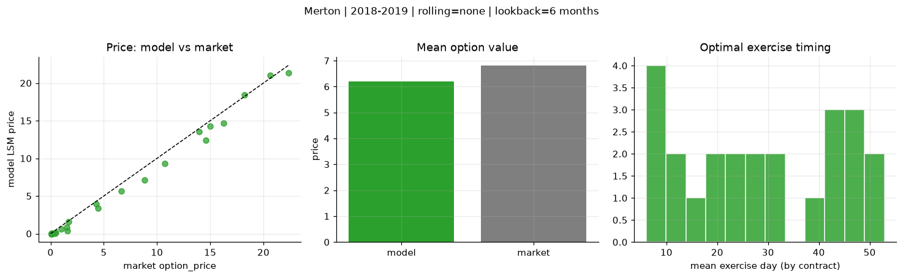
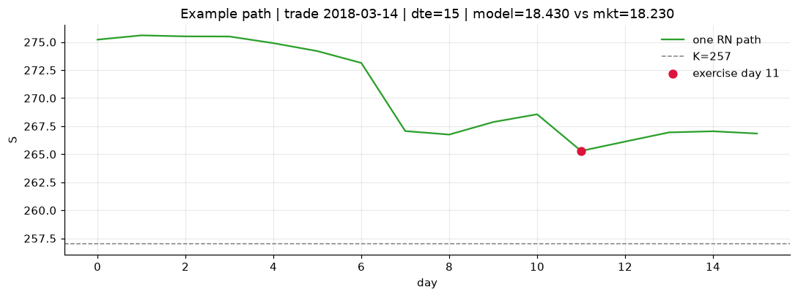
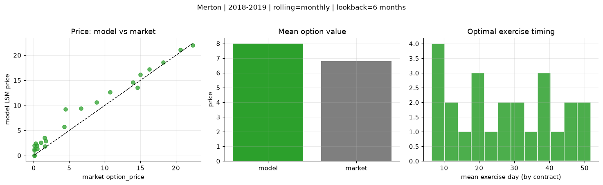
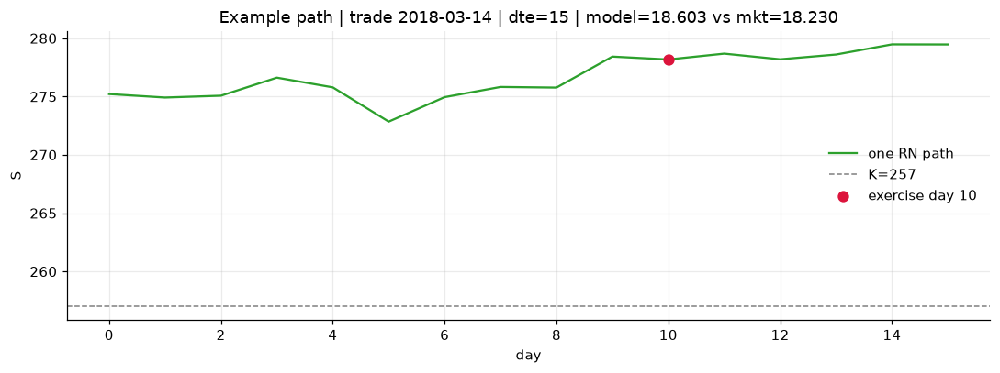
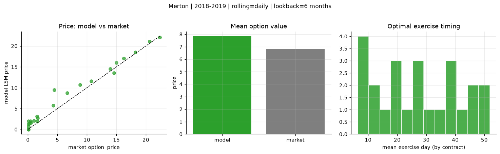
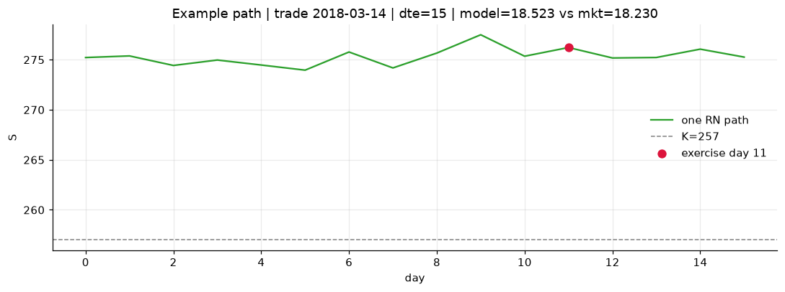

# Optimal stopping — Merton — 2018-2019

**Model:** Merton  
**Regime / period:** 2018-2019  
**Lookback:** 6 months (fixed)  
**Rolling modes:** none, monthly, daily  
**Pricing:** LSM American calls on SPY | n_paths=2000 | seed=42 | contracts=24

## Comparison (same contracts, same lookback)

| Rolling | RMSE | MAE | Bias (model−mkt) | Mean early-ex frac | Cal updates | Cal s | LSM s |
|---------|-----:|----:|-----------------:|-------------------:|------------:|------:|------:|
| `none` | 0.8815 | 0.6545 | -0.6065 | 0.213 | 1 | 0.0 | 0.1 |
| `monthly` | 1.6459 | 1.3049 | 1.1760 | 0.228 | 25 | 0.0 | 0.1 |
| `daily` | 1.5070 | 1.1418 | 1.0225 | 0.240 | 503 | 0.1 | 0.1 |

**Lowest RMSE (this study):** `none` = 0.8815

## Rolling = `none`

- **RMSE:** 0.8815  
- **MAE:** 0.6545  
- **Bias:** -0.6065  
- **Mean early-exercise fraction:** 0.213  
- **Calibration updates (SPY):** 1

Contract errors (compact)

| date | K | dte | market | model | error | early_ex |
|------|--:|----:|-------:|------:|------:|---------:|
| 2018-03-14 | 257 | 15 | 18.230 | 18.430 | 0.200 | 0.645 |
| 2019-09-05 | 277 | 8 | 20.620 | 20.996 | 0.376 | 0.301 |
| 2019-01-15 | 247 | 31 | 14.990 | 14.257 | -0.733 | 0.096 |
| 2019-01-15 | 247.5 | 24 | 13.960 | 13.531 | -0.429 | 0.272 |
| 2019-06-03 | 261 | 46 | 16.230 | 14.721 | -1.509 | 0.252 |
| 2018-02-28 | 260 | 51 | 14.600 | 12.396 | -2.204 | 0.747 |
| 2018-04-05 | 269 | 11 | 1.600 | 0.335 | -1.265 | 0.024 |
| 2019-02-06 | 269 | 7 | 4.290 | 3.968 | -0.322 | 0.657 |
| 2019-07-09 | 303 | 31 | 1.520 | 0.869 | -0.651 | 0.086 |
| 2019-07-30 | 307 | 27 | 0.990 | 0.610 | -0.380 | 0.098 |
| 2019-02-21 | 277.5 | 43 | 4.450 | 3.400 | -1.050 | 0.287 |
| 2019-09-05 | 293 | 50 | 8.840 | 7.141 | -1.699 | 0.437 |
| 2019-07-23 | 309 | 15 | 0.110 | 0.055 | -0.055 | 0.011 |
| 2018-11-29 | 291 | 8 | 0.080 | 0.000 | -0.080 | 0.000 |
| 2018-11-21 | 286 | 21 | 0.080 | 0.000 | -0.080 | 0.000 |
| 2018-05-10 | 287.5 | 29 | 0.110 | 0.004 | -0.106 | 0.002 |
| 2019-05-03 | 320 | 49 | 0.100 | 0.001 | -0.099 | 0.000 |
| 2019-08-13 | 308 | 48 | 0.510 | 0.099 | -0.411 | 0.024 |
| 2018-10-02 | 293 | 20 | 1.670 | 1.591 | -0.079 | 0.034 |
| 2018-11-07 | 261 | 54 | 22.370 | 21.377 | -0.993 | 0.376 |
| 2019-11-29 | 311 | 42 | 6.650 | 5.635 | -1.015 | 0.313 |
| 2019-03-07 | 279.5 | 8 | 0.410 | 0.084 | -0.326 | 0.001 |
| 2019-07-09 | 290 | 45 | 10.750 | 9.353 | -1.397 | 0.439 |
| 2019-06-24 | 307.5 | 25 | 0.270 | 0.022 | -0.248 | 0.006 |

## Rolling = `monthly`

- **RMSE:** 1.6459  
- **MAE:** 1.3049  
- **Bias:** 1.1760  
- **Mean early-exercise fraction:** 0.228  
- **Calibration updates (SPY):** 25

Contract errors (compact)

| date | K | dte | market | model | error | early_ex |
|------|--:|----:|-------:|------:|------:|---------:|
| 2018-03-14 | 257 | 15 | 18.230 | 18.603 | 0.373 | 0.573 |
| 2019-09-05 | 277 | 8 | 20.620 | 21.078 | 0.458 | 0.064 |
| 2019-01-15 | 247 | 31 | 14.990 | 16.136 | 1.146 | 0.339 |
| 2019-01-15 | 247.5 | 24 | 13.960 | 14.622 | 0.662 | 0.397 |
| 2019-06-03 | 261 | 46 | 16.230 | 17.230 | 1.000 | 0.468 |
| 2018-02-28 | 260 | 51 | 14.600 | 13.533 | -1.067 | 0.570 |
| 2018-04-05 | 269 | 11 | 1.600 | 1.798 | 0.198 | 0.077 |
| 2019-02-06 | 269 | 7 | 4.290 | 5.771 | 1.481 | 0.353 |
| 2019-07-09 | 303 | 31 | 1.520 | 3.564 | 2.044 | 0.116 |
| 2019-07-30 | 307 | 27 | 0.990 | 2.585 | 1.595 | 0.130 |
| 2019-02-21 | 277.5 | 43 | 4.450 | 9.226 | 4.776 | 0.244 |
| 2019-09-05 | 293 | 50 | 8.840 | 10.599 | 1.759 | 0.213 |
| 2019-07-23 | 309 | 15 | 0.110 | 1.054 | 0.944 | 0.019 |
| 2018-11-29 | 291 | 8 | 0.080 | 0.002 | -0.078 | 0.000 |
| 2018-11-21 | 286 | 21 | 0.080 | 0.042 | -0.038 | 0.006 |
| 2018-05-10 | 287.5 | 29 | 0.110 | 1.249 | 1.139 | 0.025 |
| 2019-05-03 | 320 | 49 | 0.100 | 2.002 | 1.902 | 0.092 |
| 2019-08-13 | 308 | 48 | 0.510 | 1.320 | 0.810 | 0.070 |
| 2018-10-02 | 293 | 20 | 1.670 | 2.855 | 1.185 | 0.041 |
| 2018-11-07 | 261 | 54 | 22.370 | 22.007 | -0.363 | 0.613 |
| 2019-11-29 | 311 | 42 | 6.650 | 9.375 | 2.725 | 0.329 |
| 2019-03-07 | 279.5 | 8 | 0.410 | 2.015 | 1.605 | 0.155 |
| 2019-07-09 | 290 | 45 | 10.750 | 12.614 | 1.864 | 0.508 |
| 2019-06-24 | 307.5 | 25 | 0.270 | 2.375 | 2.105 | 0.073 |

## Rolling = `daily`

- **RMSE:** 1.5070  
- **MAE:** 1.1418  
- **Bias:** 1.0225  
- **Mean early-exercise fraction:** 0.240  
- **Calibration updates (SPY):** 503

Contract errors (compact)

| date | K | dte | market | model | error | early_ex |
|------|--:|----:|-------:|------:|------:|---------:|
| 2018-03-14 | 257 | 15 | 18.230 | 18.523 | 0.293 | 0.865 |
| 2019-09-05 | 277 | 8 | 20.620 | 21.080 | 0.460 | 0.060 |
| 2019-01-15 | 247 | 31 | 14.990 | 16.008 | 1.018 | 0.458 |
| 2019-01-15 | 247.5 | 24 | 13.960 | 14.520 | 0.560 | 0.411 |
| 2019-06-03 | 261 | 46 | 16.230 | 17.077 | 0.847 | 0.479 |
| 2018-02-28 | 260 | 51 | 14.600 | 13.533 | -1.067 | 0.570 |
| 2018-04-05 | 269 | 11 | 1.600 | 1.934 | 0.334 | 0.087 |
| 2019-02-06 | 269 | 7 | 4.290 | 5.772 | 1.482 | 0.353 |
| 2019-07-09 | 303 | 31 | 1.520 | 3.171 | 1.651 | 0.001 |
| 2019-07-30 | 307 | 27 | 0.990 | 2.120 | 1.130 | 0.186 |
| 2019-02-21 | 277.5 | 43 | 4.450 | 9.448 | 4.998 | 0.249 |
| 2019-09-05 | 293 | 50 | 8.840 | 10.662 | 1.822 | 0.200 |
| 2019-07-23 | 309 | 15 | 0.110 | 0.679 | 0.569 | 0.050 |
| 2018-11-29 | 291 | 8 | 0.080 | 0.006 | -0.074 | 0.000 |
| 2018-11-21 | 286 | 21 | 0.080 | 0.087 | 0.007 | 0.008 |
| 2018-05-10 | 287.5 | 29 | 0.110 | 1.245 | 1.135 | 0.070 |
| 2019-05-03 | 320 | 49 | 0.100 | 1.990 | 1.890 | 0.091 |
| 2019-08-13 | 308 | 48 | 0.510 | 1.571 | 1.061 | 0.059 |
| 2018-10-02 | 293 | 20 | 1.670 | 2.719 | 1.049 | 0.220 |
| 2018-11-07 | 261 | 54 | 22.370 | 22.079 | -0.291 | 0.640 |
| 2019-11-29 | 311 | 42 | 6.650 | 8.735 | 2.085 | 0.350 |
| 2019-03-07 | 279.5 | 8 | 0.410 | 1.984 | 1.574 | 0.107 |
| 2019-07-09 | 290 | 45 | 10.750 | 11.601 | 0.851 | 0.181 |
| 2019-06-24 | 307.5 | 25 | 0.270 | 1.427 | 1.157 | 0.057 |

