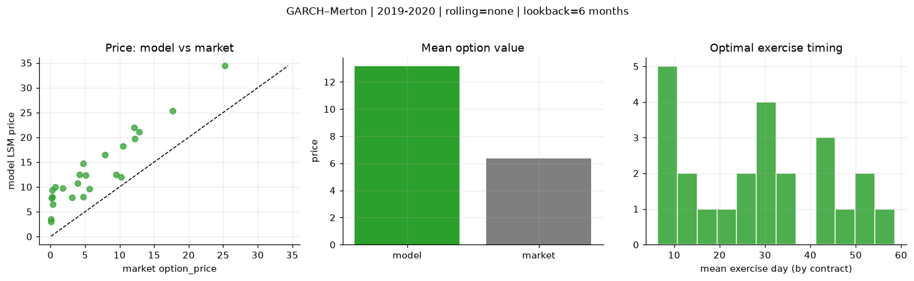
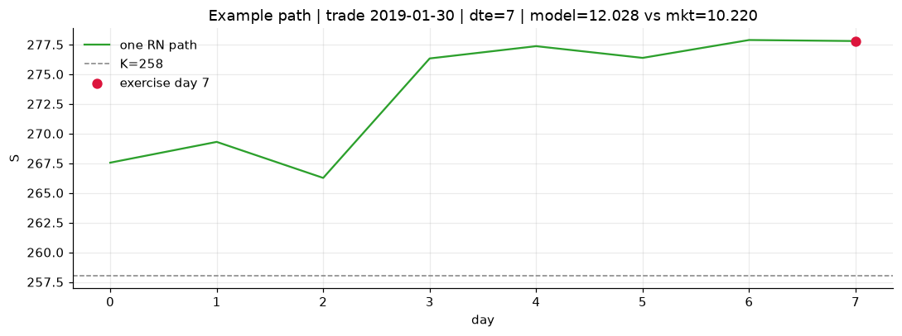
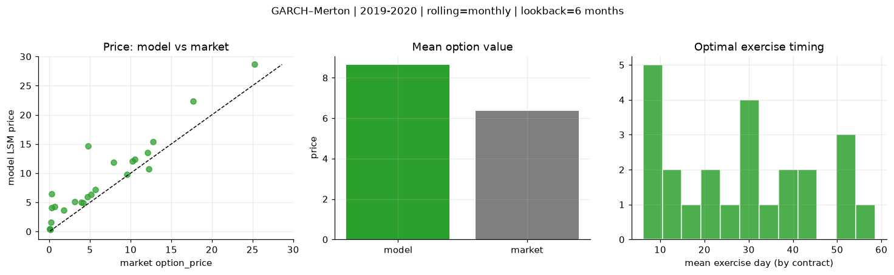
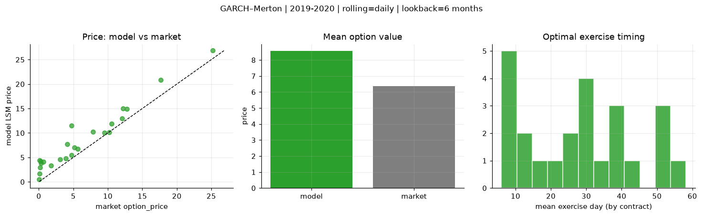
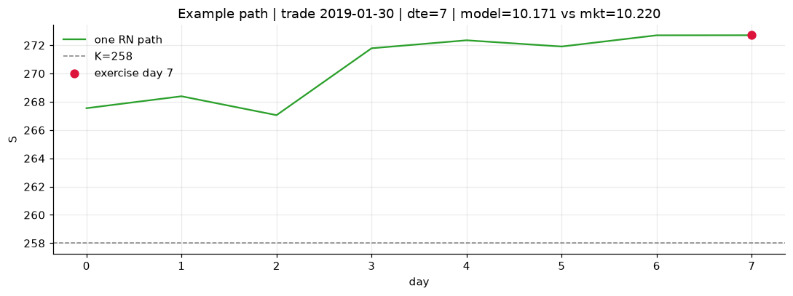

# Optimal stopping — GARCH–Merton — 2019-2020

**Model:** GARCH–Merton  
**Regime / period:** 2019-2020  
**Lookback:** 6 months (fixed)  
**Rolling modes:** none, monthly, daily  
**Pricing:** LSM American calls on SPY | n_paths=2000 | seed=42 | contracts=24

## Comparison (same contracts, same lookback)

| Rolling | RMSE | MAE | Bias (model−mkt) | Mean early-ex frac | Cal updates | Cal s | LSM s |
|---------|-----:|----:|-----------------:|-------------------:|------------:|------:|------:|
| `none` | 7.2019 | 6.7792 | 6.7792 | 0.188 | 1 | 0.0 | 0.1 |
| `monthly` | 3.2224 | 2.3905 | 2.2648 | 0.197 | 25 | 0.7 | 0.1 |
| `daily` | 2.6584 | 2.1964 | 2.1923 | 0.191 | 505 | 10.3 | 0.1 |

**Lowest RMSE (this study):** `daily` = 2.6584

## Rolling = `none`

- **RMSE:** 7.2019  
- **MAE:** 6.7792  
- **Bias:** 6.7792  
- **Mean early-exercise fraction:** 0.188  
- **Calibration updates (SPY):** 1

Contract errors (compact)

| date | K | dte | market | model | error | early_ex |
|------|--:|----:|-------:|------:|------:|---------:|
| 2019-01-30 | 258 | 7 | 10.220 | 12.028 | 1.808 | 0.098 |
| 2019-10-17 | 290 | 8 | 9.520 | 12.476 | 2.956 | 0.000 |
| 2019-06-17 | 280 | 25 | 10.520 | 18.272 | 7.752 | 0.102 |
| 2019-06-10 | 278 | 39 | 12.790 | 21.103 | 8.313 | 0.346 |
| 2019-09-19 | 277 | 57 | 25.220 | 34.392 | 9.172 | 0.473 |
| 2019-02-06 | 257 | 51 | 17.690 | 25.304 | 7.614 | 0.202 |
| 2019-02-06 | 271 | 9 | 3.100 | 7.865 | 4.765 | 0.143 |
| 2019-07-09 | 295.5 | 17 | 3.910 | 10.692 | 6.782 | 0.255 |
| 2019-10-03 | 294 | 32 | 4.150 | 12.439 | 8.289 | 0.274 |
| 2019-10-17 | 297 | 22 | 5.130 | 12.420 | 7.290 | 0.247 |
| 2019-08-06 | 281 | 45 | 12.210 | 19.704 | 7.494 | 0.256 |
| 2019-11-07 | 299 | 43 | 12.070 | 22.030 | 9.960 | 0.233 |
| 2019-10-03 | 303 | 13 | 0.080 | 3.562 | 3.482 | 0.074 |
| 2019-06-10 | 303 | 11 | 0.070 | 3.018 | 2.948 | 0.104 |
| 2019-06-03 | 283 | 32 | 1.760 | 9.799 | 8.039 | 0.075 |
| 2019-03-14 | 292 | 34 | 0.260 | 9.432 | 9.172 | 0.086 |
| 2019-08-27 | 315 | 52 | 0.140 | 7.782 | 7.642 | 0.255 |
| 2019-10-10 | 313 | 43 | 0.210 | 8.043 | 7.833 | 0.142 |
| 2019-02-06 | 268.5 | 7 | 4.720 | 8.000 | 3.280 | 0.192 |
| 2019-02-13 | 270 | 9 | 5.640 | 9.592 | 3.952 | 0.240 |
| 2019-01-15 | 275 | 31 | 0.290 | 6.475 | 6.185 | 0.108 |
| 2019-09-12 | 295 | 27 | 7.870 | 16.526 | 8.656 | 0.310 |
| 2019-03-21 | 294 | 32 | 0.640 | 10.045 | 9.405 | 0.157 |
| 2019-01-15 | 264 | 59 | 4.770 | 14.683 | 9.913 | 0.141 |

## Rolling = `monthly`

- **RMSE:** 3.2224  
- **MAE:** 2.3905  
- **Bias:** 2.2648  
- **Mean early-exercise fraction:** 0.197  
- **Calibration updates (SPY):** 25

Contract errors (compact)

| date | K | dte | market | model | error | early_ex |
|------|--:|----:|-------:|------:|------:|---------:|
| 2019-01-30 | 258 | 7 | 10.220 | 12.028 | 1.808 | 0.098 |
| 2019-10-17 | 290 | 8 | 9.520 | 9.800 | 0.280 | 0.398 |
| 2019-06-17 | 280 | 25 | 10.520 | 12.385 | 1.865 | 0.385 |
| 2019-06-10 | 278 | 39 | 12.790 | 15.426 | 2.636 | 0.327 |
| 2019-09-19 | 277 | 57 | 25.220 | 28.635 | 3.415 | 0.333 |
| 2019-02-06 | 257 | 51 | 17.690 | 22.381 | 4.691 | 0.208 |
| 2019-02-06 | 271 | 9 | 3.100 | 5.163 | 2.063 | 0.153 |
| 2019-07-09 | 295.5 | 17 | 3.910 | 4.994 | 1.084 | 0.308 |
| 2019-10-03 | 294 | 32 | 4.150 | 4.938 | 0.788 | 0.218 |
| 2019-10-17 | 297 | 22 | 5.130 | 6.404 | 1.274 | 0.188 |
| 2019-08-06 | 281 | 45 | 12.210 | 10.701 | -1.509 | 0.349 |
| 2019-11-07 | 299 | 43 | 12.070 | 13.504 | 1.434 | 0.459 |
| 2019-10-03 | 303 | 13 | 0.080 | 0.464 | 0.384 | 0.032 |
| 2019-06-10 | 303 | 11 | 0.070 | 0.457 | 0.387 | 0.010 |
| 2019-06-03 | 283 | 32 | 1.760 | 3.683 | 1.923 | 0.110 |
| 2019-03-14 | 292 | 34 | 0.260 | 4.060 | 3.800 | 0.072 |
| 2019-08-27 | 315 | 52 | 0.140 | 0.342 | 0.202 | 0.021 |
| 2019-10-10 | 313 | 43 | 0.210 | 1.568 | 1.358 | 0.079 |
| 2019-02-06 | 268.5 | 7 | 4.720 | 5.929 | 1.209 | 0.261 |
| 2019-02-13 | 270 | 9 | 5.640 | 7.189 | 1.549 | 0.292 |
| 2019-01-15 | 275 | 31 | 0.290 | 6.475 | 6.185 | 0.108 |
| 2019-09-12 | 295 | 27 | 7.870 | 11.869 | 3.999 | 0.073 |
| 2019-03-21 | 294 | 32 | 0.640 | 4.258 | 3.618 | 0.099 |
| 2019-01-15 | 264 | 59 | 4.770 | 14.683 | 9.913 | 0.141 |

## Rolling = `daily`

- **RMSE:** 2.6584  
- **MAE:** 2.1964  
- **Bias:** 2.1923  
- **Mean early-exercise fraction:** 0.191  
- **Calibration updates (SPY):** 505

Contract errors (compact)

| date | K | dte | market | model | error | early_ex |
|------|--:|----:|-------:|------:|------:|---------:|
| 2019-01-30 | 258 | 7 | 10.220 | 10.171 | -0.049 | 0.144 |
| 2019-10-17 | 290 | 8 | 9.520 | 10.012 | 0.492 | 0.370 |
| 2019-06-17 | 280 | 25 | 10.520 | 11.938 | 1.418 | 0.272 |
| 2019-06-10 | 278 | 39 | 12.790 | 14.943 | 2.153 | 0.076 |
| 2019-09-19 | 277 | 57 | 25.220 | 26.832 | 1.612 | 0.367 |
| 2019-02-06 | 257 | 51 | 17.690 | 20.833 | 3.143 | 0.184 |
| 2019-02-06 | 271 | 9 | 3.100 | 4.559 | 1.459 | 0.166 |
| 2019-07-09 | 295.5 | 17 | 3.910 | 4.788 | 0.878 | 0.267 |
| 2019-10-03 | 294 | 32 | 4.150 | 7.677 | 3.527 | 0.218 |
| 2019-10-17 | 297 | 22 | 5.130 | 7.006 | 1.876 | 0.150 |
| 2019-08-06 | 281 | 45 | 12.210 | 15.024 | 2.814 | 0.344 |
| 2019-11-07 | 299 | 43 | 12.070 | 12.992 | 0.922 | 0.490 |
| 2019-10-03 | 303 | 13 | 0.080 | 1.660 | 1.580 | 0.046 |
| 2019-06-10 | 303 | 11 | 0.070 | 0.498 | 0.428 | 0.026 |
| 2019-06-03 | 283 | 32 | 1.760 | 3.289 | 1.529 | 0.110 |
| 2019-03-14 | 292 | 34 | 0.260 | 4.228 | 3.968 | 0.125 |
| 2019-08-27 | 315 | 52 | 0.140 | 4.383 | 4.243 | 0.099 |
| 2019-10-10 | 313 | 43 | 0.210 | 2.909 | 2.699 | 0.098 |
| 2019-02-06 | 268.5 | 7 | 4.720 | 5.522 | 0.802 | 0.292 |
| 2019-02-13 | 270 | 9 | 5.640 | 6.726 | 1.086 | 0.327 |
| 2019-01-15 | 275 | 31 | 0.290 | 3.809 | 3.519 | 0.015 |
| 2019-09-12 | 295 | 27 | 7.870 | 10.229 | 2.359 | 0.075 |
| 2019-03-21 | 294 | 32 | 0.640 | 4.106 | 3.466 | 0.115 |
| 2019-01-15 | 264 | 59 | 4.770 | 11.462 | 6.692 | 0.207 |

