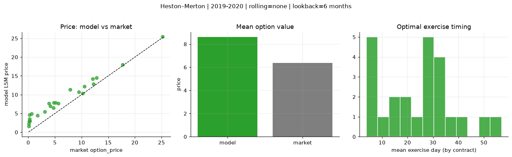
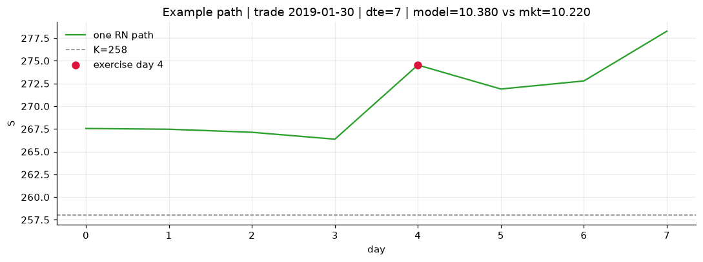
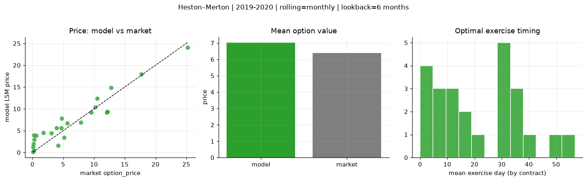
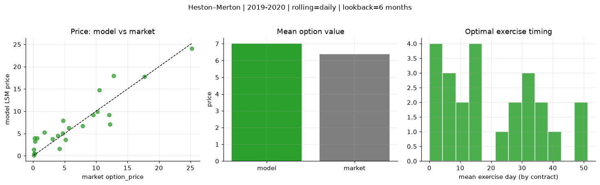
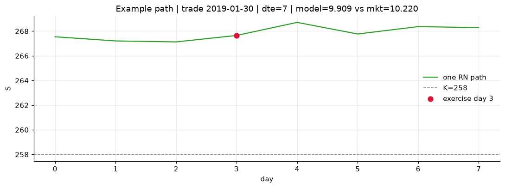

# Optimal stopping — Heston–Merton — 2019-2020

**Model:** Heston–Merton  
**Regime / period:** 2019-2020  
**Lookback:** 6 months (fixed)  
**Rolling modes:** none, monthly, daily  
**Pricing:** LSM American calls on SPY | n_paths=2000 | seed=42 | contracts=24

## Comparison (same contracts, same lookback)

| Rolling | RMSE | MAE | Bias (model−mkt) | Mean early-ex frac | Cal updates | Cal s | LSM s |
|---------|-----:|----:|-----------------:|-------------------:|------------:|------:|------:|
| `none` | 2.5245 | 2.2362 | 2.2362 | 0.339 | 1 | 0.0 | 0.2 |
| `monthly` | 1.9876 | 1.6766 | 0.6423 | 0.376 | 25 | 0.0 | 0.2 |
| `daily` | 2.5020 | 1.8965 | 0.6315 | 0.374 | 505 | 0.5 | 0.2 |

**Lowest RMSE (this study):** `monthly` = 1.9876

## Rolling = `none`

- **RMSE:** 2.5245  
- **MAE:** 2.2362  
- **Bias:** 2.2362  
- **Mean early-exercise fraction:** 0.339  
- **Calibration updates (SPY):** 1

Contract errors (compact)

| date | K | dte | market | model | error | early_ex |
|------|--:|----:|-------:|------:|------:|---------:|
| 2019-01-30 | 258 | 7 | 10.220 | 10.380 | 0.160 | 0.727 |
| 2019-10-17 | 290 | 8 | 9.520 | 10.751 | 1.231 | 0.483 |
| 2019-06-17 | 280 | 25 | 10.520 | 12.141 | 1.621 | 0.509 |
| 2019-06-10 | 278 | 39 | 12.790 | 14.516 | 1.726 | 0.480 |
| 2019-09-19 | 277 | 57 | 25.220 | 25.407 | 0.187 | 0.795 |
| 2019-02-06 | 257 | 51 | 17.690 | 18.006 | 0.316 | 0.494 |
| 2019-02-06 | 271 | 9 | 3.100 | 5.453 | 2.353 | 0.281 |
| 2019-07-09 | 295.5 | 17 | 3.910 | 7.698 | 3.788 | 0.269 |
| 2019-10-03 | 294 | 32 | 4.150 | 6.931 | 2.781 | 0.387 |
| 2019-10-17 | 297 | 22 | 5.130 | 7.850 | 2.720 | 0.266 |
| 2019-08-06 | 281 | 45 | 12.210 | 12.833 | 0.623 | 0.379 |
| 2019-11-07 | 299 | 43 | 12.070 | 14.207 | 2.137 | 0.452 |
| 2019-10-03 | 303 | 13 | 0.080 | 2.227 | 2.147 | 0.069 |
| 2019-06-10 | 303 | 11 | 0.070 | 1.583 | 1.513 | 0.048 |
| 2019-06-03 | 283 | 32 | 1.760 | 4.431 | 2.671 | 0.281 |
| 2019-03-14 | 292 | 34 | 0.260 | 4.617 | 4.357 | 0.139 |
| 2019-08-27 | 315 | 52 | 0.140 | 2.864 | 2.724 | 0.095 |
| 2019-10-10 | 313 | 43 | 0.210 | 3.552 | 3.342 | 0.102 |
| 2019-02-06 | 268.5 | 7 | 4.720 | 6.494 | 1.774 | 0.618 |
| 2019-02-13 | 270 | 9 | 5.640 | 7.664 | 2.024 | 0.424 |
| 2019-01-15 | 275 | 31 | 0.290 | 2.942 | 2.652 | 0.092 |
| 2019-09-12 | 295 | 27 | 7.870 | 11.364 | 3.494 | 0.266 |
| 2019-03-21 | 294 | 32 | 0.640 | 4.919 | 4.279 | 0.267 |
| 2019-01-15 | 264 | 59 | 4.770 | 7.818 | 3.048 | 0.221 |

## Rolling = `monthly`

- **RMSE:** 1.9876  
- **MAE:** 1.6766  
- **Bias:** 0.6423  
- **Mean early-exercise fraction:** 0.376  
- **Calibration updates (SPY):** 25

Contract errors (compact)

| date | K | dte | market | model | error | early_ex |
|------|--:|----:|-------:|------:|------:|---------:|
| 2019-01-30 | 258 | 7 | 10.220 | 10.380 | 0.160 | 0.727 |
| 2019-10-17 | 290 | 8 | 9.520 | 9.189 | -0.331 | 1.000 |
| 2019-06-17 | 280 | 25 | 10.520 | 12.326 | 1.806 | 0.365 |
| 2019-06-10 | 278 | 39 | 12.790 | 14.830 | 2.040 | 0.326 |
| 2019-09-19 | 277 | 57 | 25.220 | 24.096 | -1.124 | 1.000 |
| 2019-02-06 | 257 | 51 | 17.690 | 17.975 | 0.285 | 0.430 |
| 2019-02-06 | 271 | 9 | 3.100 | 4.425 | 1.325 | 0.284 |
| 2019-07-09 | 295.5 | 17 | 3.910 | 5.588 | 1.678 | 0.266 |
| 2019-10-03 | 294 | 32 | 4.150 | 1.603 | -2.547 | 0.142 |
| 2019-10-17 | 297 | 22 | 5.130 | 3.410 | -1.720 | 0.466 |
| 2019-08-06 | 281 | 45 | 12.210 | 9.364 | -2.846 | 0.481 |
| 2019-11-07 | 299 | 43 | 12.070 | 9.164 | -2.906 | 1.000 |
| 2019-10-03 | 303 | 13 | 0.080 | 0.125 | 0.045 | 0.021 |
| 2019-06-10 | 303 | 11 | 0.070 | 1.198 | 1.128 | 0.035 |
| 2019-06-03 | 283 | 32 | 1.760 | 4.548 | 2.788 | 0.110 |
| 2019-03-14 | 292 | 34 | 0.260 | 3.933 | 3.673 | 0.088 |
| 2019-08-27 | 315 | 52 | 0.140 | 1.950 | 1.810 | 0.073 |
| 2019-10-10 | 313 | 43 | 0.210 | 0.433 | 0.223 | 0.032 |
| 2019-02-06 | 268.5 | 7 | 4.720 | 5.572 | 0.852 | 0.665 |
| 2019-02-13 | 270 | 9 | 5.640 | 6.733 | 1.093 | 0.440 |
| 2019-01-15 | 275 | 31 | 0.290 | 2.942 | 2.652 | 0.092 |
| 2019-09-12 | 295 | 27 | 7.870 | 6.932 | -0.938 | 0.637 |
| 2019-03-21 | 294 | 32 | 0.640 | 3.860 | 3.220 | 0.115 |
| 2019-01-15 | 264 | 59 | 4.770 | 7.818 | 3.048 | 0.221 |

## Rolling = `daily`

- **RMSE:** 2.5020  
- **MAE:** 1.8965  
- **Bias:** 0.6315  
- **Mean early-exercise fraction:** 0.374  
- **Calibration updates (SPY):** 505

Contract errors (compact)

| date | K | dte | market | model | error | early_ex |
|------|--:|----:|-------:|------:|------:|---------:|
| 2019-01-30 | 258 | 7 | 10.220 | 9.909 | -0.311 | 0.928 |
| 2019-10-17 | 290 | 8 | 9.520 | 9.189 | -0.331 | 1.000 |
| 2019-06-17 | 280 | 25 | 10.520 | 14.725 | 4.205 | 0.103 |
| 2019-06-10 | 278 | 39 | 12.790 | 17.925 | 5.135 | 0.387 |
| 2019-09-19 | 277 | 57 | 25.220 | 24.096 | -1.124 | 1.000 |
| 2019-02-06 | 257 | 51 | 17.690 | 17.770 | 0.080 | 0.441 |
| 2019-02-06 | 271 | 9 | 3.100 | 3.803 | 0.703 | 0.290 |
| 2019-07-09 | 295.5 | 17 | 3.910 | 4.549 | 0.639 | 0.072 |
| 2019-10-03 | 294 | 32 | 4.150 | 1.574 | -2.576 | 0.151 |
| 2019-10-17 | 297 | 22 | 5.130 | 3.552 | -1.578 | 0.510 |
| 2019-08-06 | 281 | 45 | 12.210 | 7.062 | -5.148 | 0.732 |
| 2019-11-07 | 299 | 43 | 12.070 | 9.164 | -2.906 | 1.000 |
| 2019-10-03 | 303 | 13 | 0.080 | 0.142 | 0.062 | 0.026 |
| 2019-06-10 | 303 | 11 | 0.070 | 1.362 | 1.292 | 0.013 |
| 2019-06-03 | 283 | 32 | 1.760 | 5.272 | 3.512 | 0.115 |
| 2019-03-14 | 292 | 34 | 0.260 | 3.998 | 3.738 | 0.107 |
| 2019-08-27 | 315 | 52 | 0.140 | 0.478 | 0.338 | 0.040 |
| 2019-10-10 | 313 | 43 | 0.210 | 0.481 | 0.271 | 0.028 |
| 2019-02-06 | 268.5 | 7 | 4.720 | 5.088 | 0.368 | 0.431 |
| 2019-02-13 | 270 | 9 | 5.640 | 6.218 | 0.578 | 0.443 |
| 2019-01-15 | 275 | 31 | 0.290 | 3.205 | 2.915 | 0.115 |
| 2019-09-12 | 295 | 27 | 7.870 | 6.663 | -1.207 | 0.682 |
| 2019-03-21 | 294 | 32 | 0.640 | 3.997 | 3.357 | 0.111 |
| 2019-01-15 | 264 | 59 | 4.770 | 7.914 | 3.144 | 0.248 |

