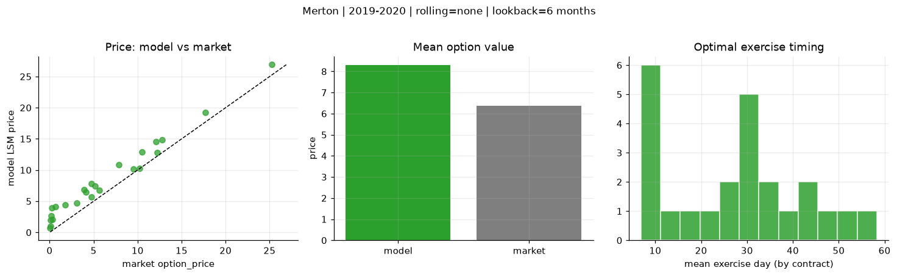
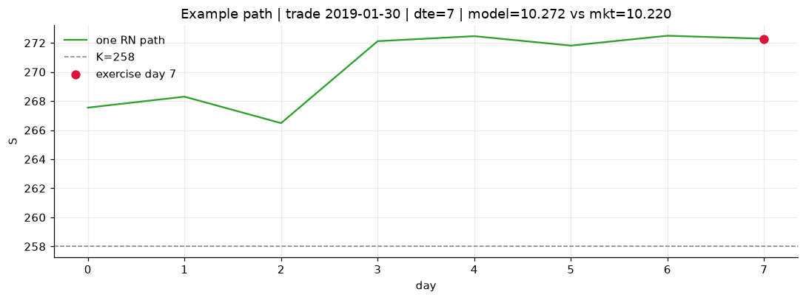
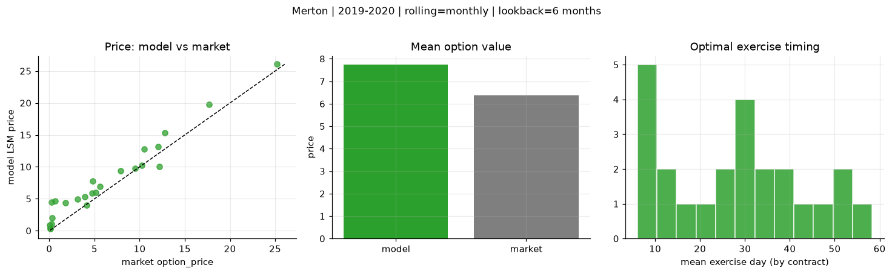
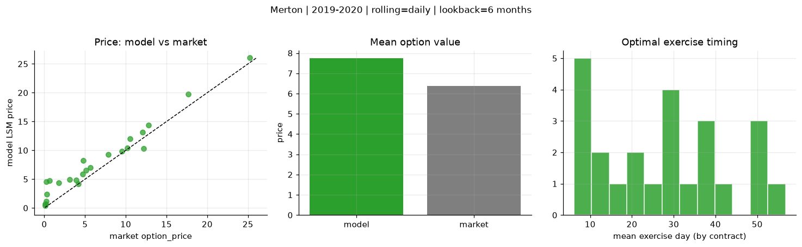
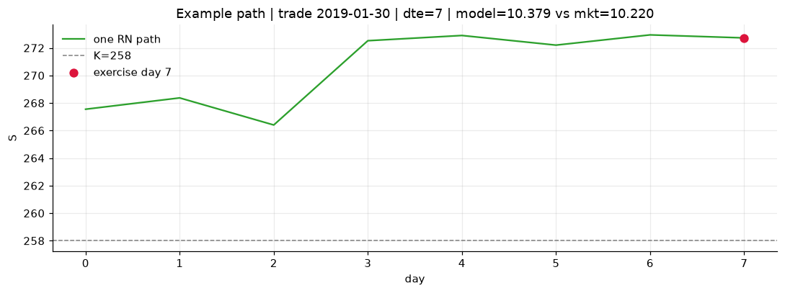

# Optimal stopping — Merton — 2019-2020

**Model:** Merton  
**Regime / period:** 2019-2020  
**Lookback:** 6 months (fixed)  
**Rolling modes:** none, monthly, daily  
**Pricing:** LSM American calls on SPY | n_paths=2000 | seed=42 | contracts=24

## Comparison (same contracts, same lookback)

| Rolling | RMSE | MAE | Bias (model−mkt) | Mean early-ex frac | Cal updates | Cal s | LSM s |
|---------|-----:|----:|-----------------:|-------------------:|------------:|------:|------:|
| `none` | 2.1481 | 1.9226 | 1.9226 | 0.196 | 1 | 0.0 | 0.1 |
| `monthly` | 1.9236 | 1.5539 | 1.3659 | 0.225 | 25 | 0.0 | 0.1 |
| `daily` | 1.8986 | 1.5285 | 1.3688 | 0.239 | 505 | 0.1 | 0.1 |

**Lowest RMSE (this study):** `daily` = 1.8986

## Rolling = `none`

- **RMSE:** 2.1481  
- **MAE:** 1.9226  
- **Bias:** 1.9226  
- **Mean early-exercise fraction:** 0.196  
- **Calibration updates (SPY):** 1

Contract errors (compact)

| date | K | dte | market | model | error | early_ex |
|------|--:|----:|-------:|------:|------:|---------:|
| 2019-01-30 | 258 | 7 | 10.220 | 10.272 | 0.052 | 0.070 |
| 2019-10-17 | 290 | 8 | 9.520 | 10.152 | 0.632 | 0.188 |
| 2019-06-17 | 280 | 25 | 10.520 | 12.857 | 2.337 | 0.081 |
| 2019-06-10 | 278 | 39 | 12.790 | 14.897 | 2.107 | 0.414 |
| 2019-09-19 | 277 | 57 | 25.220 | 26.897 | 1.677 | 0.548 |
| 2019-02-06 | 257 | 51 | 17.690 | 19.220 | 1.530 | 0.541 |
| 2019-02-06 | 271 | 9 | 3.100 | 4.673 | 1.573 | 0.232 |
| 2019-07-09 | 295.5 | 17 | 3.910 | 6.813 | 2.903 | 0.320 |
| 2019-10-03 | 294 | 32 | 4.150 | 6.449 | 2.299 | 0.235 |
| 2019-10-17 | 297 | 22 | 5.130 | 7.408 | 2.278 | 0.283 |
| 2019-08-06 | 281 | 45 | 12.210 | 12.847 | 0.637 | 0.196 |
| 2019-11-07 | 299 | 43 | 12.070 | 14.560 | 2.490 | 0.351 |
| 2019-10-03 | 303 | 13 | 0.080 | 0.987 | 0.907 | 0.026 |
| 2019-06-10 | 303 | 11 | 0.070 | 0.726 | 0.656 | 0.048 |
| 2019-06-03 | 283 | 32 | 1.760 | 4.401 | 2.641 | 0.121 |
| 2019-03-14 | 292 | 34 | 0.260 | 3.960 | 3.700 | 0.158 |
| 2019-08-27 | 315 | 52 | 0.140 | 2.017 | 1.877 | 0.077 |
| 2019-10-10 | 313 | 43 | 0.210 | 2.700 | 2.490 | 0.029 |
| 2019-02-06 | 268.5 | 7 | 4.720 | 5.714 | 0.994 | 0.040 |
| 2019-02-13 | 270 | 9 | 5.640 | 6.724 | 1.084 | 0.312 |
| 2019-01-15 | 275 | 31 | 0.290 | 2.029 | 1.739 | 0.097 |
| 2019-09-12 | 295 | 27 | 7.870 | 10.886 | 3.016 | 0.004 |
| 2019-03-21 | 294 | 32 | 0.640 | 4.126 | 3.486 | 0.199 |
| 2019-01-15 | 264 | 59 | 4.770 | 7.808 | 3.038 | 0.136 |

## Rolling = `monthly`

- **RMSE:** 1.9236  
- **MAE:** 1.5539  
- **Bias:** 1.3659  
- **Mean early-exercise fraction:** 0.225  
- **Calibration updates (SPY):** 25

Contract errors (compact)

| date | K | dte | market | model | error | early_ex |
|------|--:|----:|-------:|------:|------:|---------:|
| 2019-01-30 | 258 | 7 | 10.220 | 10.272 | 0.052 | 0.070 |
| 2019-10-17 | 290 | 8 | 9.520 | 9.775 | 0.255 | 0.379 |
| 2019-06-17 | 280 | 25 | 10.520 | 12.804 | 2.284 | 0.278 |
| 2019-06-10 | 278 | 39 | 12.790 | 15.339 | 2.549 | 0.234 |
| 2019-09-19 | 277 | 57 | 25.220 | 26.057 | 0.837 | 0.856 |
| 2019-02-06 | 257 | 51 | 17.690 | 19.734 | 2.044 | 0.523 |
| 2019-02-06 | 271 | 9 | 3.100 | 4.949 | 1.849 | 0.229 |
| 2019-07-09 | 295.5 | 17 | 3.910 | 5.350 | 1.440 | 0.140 |
| 2019-10-03 | 294 | 32 | 4.150 | 4.038 | -0.112 | 0.174 |
| 2019-10-17 | 297 | 22 | 5.130 | 5.949 | 0.819 | 0.151 |
| 2019-08-06 | 281 | 45 | 12.210 | 10.066 | -2.144 | 0.373 |
| 2019-11-07 | 299 | 43 | 12.070 | 13.135 | 1.065 | 0.505 |
| 2019-10-03 | 303 | 13 | 0.080 | 0.336 | 0.256 | 0.004 |
| 2019-06-10 | 303 | 11 | 0.070 | 0.893 | 0.823 | 0.036 |
| 2019-06-03 | 283 | 32 | 1.760 | 4.406 | 2.646 | 0.077 |
| 2019-03-14 | 292 | 34 | 0.260 | 4.455 | 4.195 | 0.162 |
| 2019-08-27 | 315 | 52 | 0.140 | 0.375 | 0.235 | 0.018 |
| 2019-10-10 | 313 | 43 | 0.210 | 1.068 | 0.858 | 0.046 |
| 2019-02-06 | 268.5 | 7 | 4.720 | 5.890 | 1.170 | 0.243 |
| 2019-02-13 | 270 | 9 | 5.640 | 6.952 | 1.312 | 0.304 |
| 2019-01-15 | 275 | 31 | 0.290 | 2.029 | 1.739 | 0.097 |
| 2019-09-12 | 295 | 27 | 7.870 | 9.385 | 1.515 | 0.257 |
| 2019-03-21 | 294 | 32 | 0.640 | 4.698 | 4.058 | 0.097 |
| 2019-01-15 | 264 | 59 | 4.770 | 7.808 | 3.038 | 0.136 |

## Rolling = `daily`

- **RMSE:** 1.8986  
- **MAE:** 1.5285  
- **Bias:** 1.3688  
- **Mean early-exercise fraction:** 0.239  
- **Calibration updates (SPY):** 505

Contract errors (compact)

| date | K | dte | market | model | error | early_ex |
|------|--:|----:|-------:|------:|------:|---------:|
| 2019-01-30 | 258 | 7 | 10.220 | 10.379 | 0.159 | 0.079 |
| 2019-10-17 | 290 | 8 | 9.520 | 9.853 | 0.333 | 0.448 |
| 2019-06-17 | 280 | 25 | 10.520 | 12.047 | 1.527 | 0.409 |
| 2019-06-10 | 278 | 39 | 12.790 | 14.365 | 1.575 | 0.416 |
| 2019-09-19 | 277 | 57 | 25.220 | 26.037 | 0.817 | 0.847 |
| 2019-02-06 | 257 | 51 | 17.690 | 19.733 | 2.043 | 0.523 |
| 2019-02-06 | 271 | 9 | 3.100 | 4.936 | 1.836 | 0.230 |
| 2019-07-09 | 295.5 | 17 | 3.910 | 4.843 | 0.933 | 0.265 |
| 2019-10-03 | 294 | 32 | 4.150 | 4.225 | 0.075 | 0.178 |
| 2019-10-17 | 297 | 22 | 5.130 | 6.494 | 1.364 | 0.000 |
| 2019-08-06 | 281 | 45 | 12.210 | 10.294 | -1.916 | 0.394 |
| 2019-11-07 | 299 | 43 | 12.070 | 13.133 | 1.063 | 0.416 |
| 2019-10-03 | 303 | 13 | 0.080 | 0.378 | 0.298 | 0.004 |
| 2019-06-10 | 303 | 11 | 0.070 | 0.691 | 0.621 | 0.035 |
| 2019-06-03 | 283 | 32 | 1.760 | 4.389 | 2.629 | 0.085 |
| 2019-03-14 | 292 | 34 | 0.260 | 4.539 | 4.279 | 0.160 |
| 2019-08-27 | 315 | 52 | 0.140 | 0.725 | 0.585 | 0.048 |
| 2019-10-10 | 313 | 43 | 0.210 | 1.154 | 0.944 | 0.065 |
| 2019-02-06 | 268.5 | 7 | 4.720 | 5.894 | 1.174 | 0.230 |
| 2019-02-13 | 270 | 9 | 5.640 | 6.974 | 1.334 | 0.307 |
| 2019-01-15 | 275 | 31 | 0.290 | 2.431 | 2.141 | 0.065 |
| 2019-09-12 | 295 | 27 | 7.870 | 9.323 | 1.453 | 0.260 |
| 2019-03-21 | 294 | 32 | 0.640 | 4.792 | 4.152 | 0.137 |
| 2019-01-15 | 264 | 59 | 4.770 | 8.203 | 3.433 | 0.141 |

