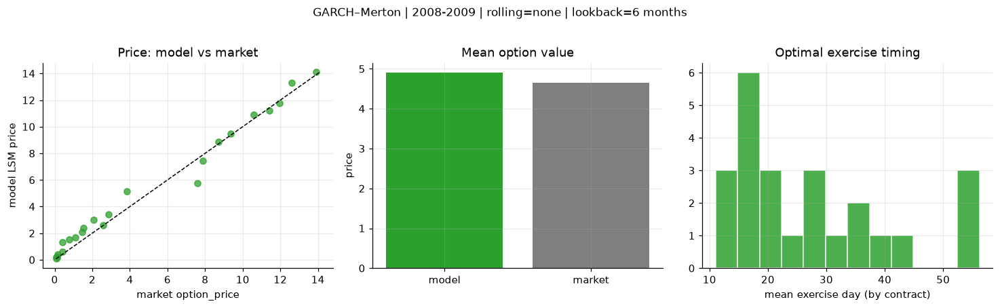
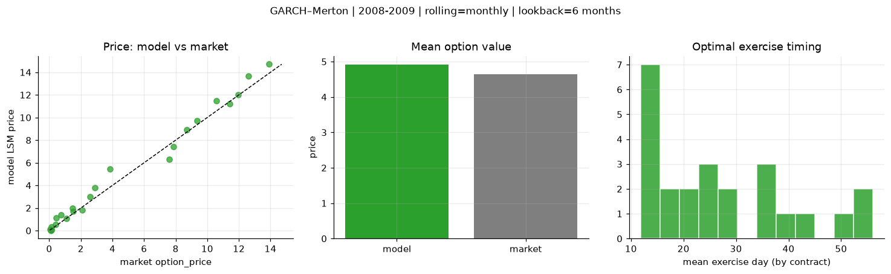
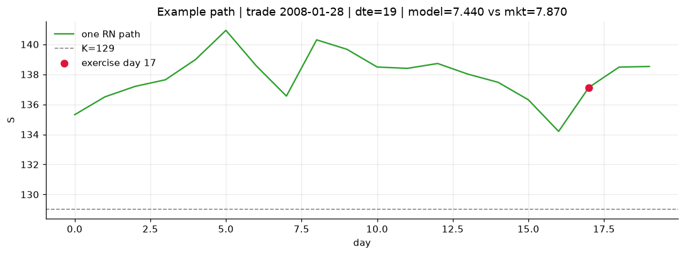
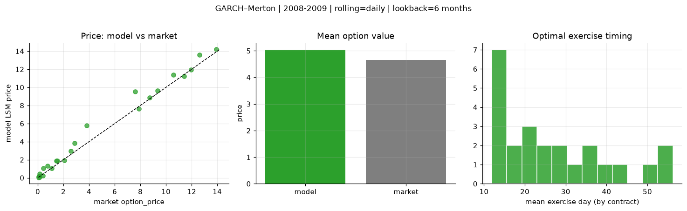
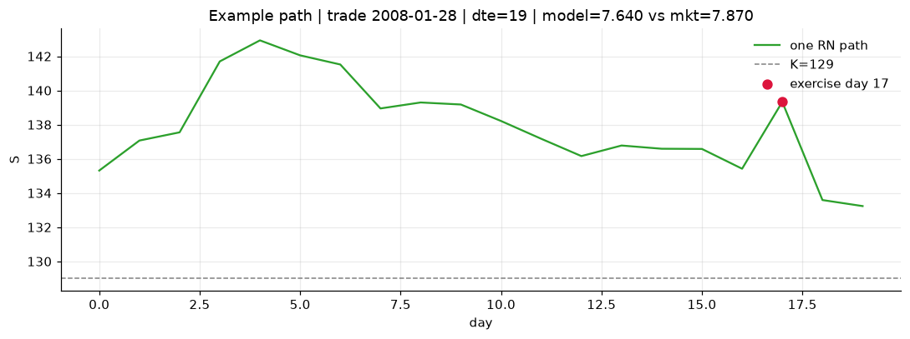

# Optimal stopping — GARCH–Merton — 2008-2009

**Model:** GARCH–Merton  
**Regime / period:** 2008-2009  
**Lookback:** 6 months (fixed)  
**Rolling modes:** none, monthly, daily  
**Pricing:** LSM American calls on SPY | n_paths=2000 | seed=42 | contracts=24

## Comparison (same contracts, same lookback)

| Rolling | RMSE | MAE | Bias (model−mkt) | Mean early-ex frac | Cal updates | Cal s | LSM s |
|---------|-----:|----:|-----------------:|-------------------:|------------:|------:|------:|
| `none` | 0.6538 | 0.4773 | 0.2535 | 0.241 | 1 | 0.0 | 0.1 |
| `monthly` | 0.6302 | 0.4605 | 0.2650 | 0.235 | 25 | 0.8 | 0.1 |
| `daily` | 0.6990 | 0.4570 | 0.3876 | 0.247 | 505 | 14.6 | 0.1 |

**Lowest RMSE (this study):** `monthly` = 0.6302

## Rolling = `none`

- **RMSE:** 0.6538  
- **MAE:** 0.4773  
- **Bias:** 0.2535  
- **Mean early-exercise fraction:** 0.241  
- **Calibration updates (SPY):** 1

Contract errors (compact)

| date | K | dte | market | model | error | early_ex |
|------|--:|----:|-------:|------:|------:|---------:|
| 2008-01-28 | 129 | 19 | 7.870 | 7.440 | -0.430 | 0.488 |
| 2008-08-01 | 117 | 15 | 9.350 | 9.467 | 0.117 | 0.200 |
| 2008-05-21 | 126 | 31 | 13.910 | 14.094 | 0.184 | 0.079 |
| 2008-05-14 | 129 | 38 | 12.610 | 13.316 | 0.706 | 0.548 |
| 2008-07-25 | 117 | 57 | 10.570 | 10.892 | 0.322 | 0.358 |
| 2008-02-04 | 128 | 47 | 11.960 | 11.772 | -0.188 | 0.568 |
| 2008-07-03 | 126 | 16 | 2.590 | 2.620 | 0.030 | 0.277 |
| 2008-09-08 | 125 | 12 | 2.880 | 3.425 | 0.545 | 0.109 |
| 2009-10-16 | 111 | 36 | 1.520 | 2.403 | 0.883 | 0.143 |
| 2009-10-23 | 111 | 29 | 1.100 | 1.675 | 0.575 | 0.198 |
| 2008-08-08 | 129 | 43 | 3.830 | 5.156 | 1.326 | 0.388 |
| 2009-10-23 | 111 | 57 | 2.080 | 3.027 | 0.947 | 0.131 |
| 2009-12-07 | 117 | 12 | 0.070 | 0.193 | 0.123 | 0.005 |
| 2009-10-02 | 110 | 15 | 0.140 | 0.173 | 0.033 | 0.025 |
| 2009-09-25 | 110 | 22 | 0.410 | 0.618 | 0.208 | 0.060 |
| 2009-08-26 | 111 | 24 | 0.150 | 0.388 | 0.238 | 0.077 |
| 2009-11-06 | 113 | 43 | 0.760 | 1.532 | 0.772 | 0.147 |
| 2009-11-20 | 118 | 57 | 0.430 | 1.302 | 0.872 | 0.097 |
| 2009-11-20 | 111 | 29 | 1.460 | 2.067 | 0.607 | 0.255 |
| 2009-10-30 | 113 | 22 | 0.120 | 0.236 | 0.116 | 0.018 |
| 2008-03-04 | 122 | 18 | 11.410 | 11.187 | -0.223 | 0.711 |
| 2008-09-22 | 116 | 26 | 7.580 | 5.735 | -1.845 | 0.495 |
| 2008-03-04 | 125 | 18 | 8.710 | 8.842 | 0.132 | 0.405 |
| 2009-10-02 | 111 | 15 | 0.080 | 0.112 | 0.032 | 0.002 |

## Rolling = `monthly`

- **RMSE:** 0.6302  
- **MAE:** 0.4605  
- **Bias:** 0.2650  
- **Mean early-exercise fraction:** 0.235  
- **Calibration updates (SPY):** 25

Contract errors (compact)

| date | K | dte | market | model | error | early_ex |
|------|--:|----:|-------:|------:|------:|---------:|
| 2008-01-28 | 129 | 19 | 7.870 | 7.440 | -0.430 | 0.488 |
| 2008-08-01 | 117 | 15 | 9.350 | 9.714 | 0.364 | 0.713 |
| 2008-05-21 | 126 | 31 | 13.910 | 14.708 | 0.798 | 0.439 |
| 2008-05-14 | 129 | 38 | 12.610 | 13.647 | 1.037 | 0.102 |
| 2008-07-25 | 117 | 57 | 10.570 | 11.471 | 0.901 | 0.374 |
| 2008-02-04 | 128 | 47 | 11.960 | 11.994 | 0.034 | 0.523 |
| 2008-07-03 | 126 | 16 | 2.590 | 3.008 | 0.418 | 0.176 |
| 2008-09-08 | 125 | 12 | 2.880 | 3.807 | 0.927 | 0.125 |
| 2009-10-16 | 111 | 36 | 1.520 | 1.727 | 0.207 | 0.128 |
| 2009-10-23 | 111 | 29 | 1.100 | 1.097 | -0.003 | 0.132 |
| 2008-08-08 | 129 | 43 | 3.830 | 5.463 | 1.633 | 0.256 |
| 2009-10-23 | 111 | 57 | 2.080 | 1.825 | -0.255 | 0.194 |
| 2009-12-07 | 117 | 12 | 0.070 | 0.135 | 0.065 | 0.008 |
| 2009-10-02 | 110 | 15 | 0.140 | 0.060 | -0.080 | 0.018 |
| 2009-09-25 | 110 | 22 | 0.410 | 0.543 | 0.133 | 0.092 |
| 2009-08-26 | 111 | 24 | 0.150 | 0.317 | 0.167 | 0.082 |
| 2009-11-06 | 113 | 43 | 0.760 | 1.371 | 0.611 | 0.149 |
| 2009-11-20 | 118 | 57 | 0.430 | 1.116 | 0.686 | 0.098 |
| 2009-11-20 | 111 | 29 | 1.460 | 1.971 | 0.511 | 0.260 |
| 2009-10-30 | 113 | 22 | 0.120 | 0.057 | -0.063 | 0.019 |
| 2008-03-04 | 122 | 18 | 11.410 | 11.221 | -0.189 | 0.707 |
| 2008-09-22 | 116 | 26 | 7.580 | 6.302 | -1.278 | 0.141 |
| 2008-03-04 | 125 | 18 | 8.710 | 8.924 | 0.214 | 0.404 |
| 2009-10-02 | 111 | 15 | 0.080 | 0.031 | -0.049 | 0.009 |

## Rolling = `daily`

- **RMSE:** 0.6990  
- **MAE:** 0.4570  
- **Bias:** 0.3876  
- **Mean early-exercise fraction:** 0.247  
- **Calibration updates (SPY):** 505

Contract errors (compact)

| date | K | dte | market | model | error | early_ex |
|------|--:|----:|-------:|------:|------:|---------:|
| 2008-01-28 | 129 | 19 | 7.870 | 7.640 | -0.230 | 0.484 |
| 2008-08-01 | 117 | 15 | 9.350 | 9.655 | 0.305 | 0.730 |
| 2008-05-21 | 126 | 31 | 13.910 | 14.183 | 0.273 | 0.068 |
| 2008-05-14 | 129 | 38 | 12.610 | 13.610 | 1.000 | 0.565 |
| 2008-07-25 | 117 | 57 | 10.570 | 11.407 | 0.837 | 0.380 |
| 2008-02-04 | 128 | 47 | 11.960 | 11.947 | -0.013 | 0.533 |
| 2008-07-03 | 126 | 16 | 2.590 | 2.965 | 0.375 | 0.173 |
| 2008-09-08 | 125 | 12 | 2.880 | 3.816 | 0.936 | 0.127 |
| 2009-10-16 | 111 | 36 | 1.520 | 1.869 | 0.349 | 0.132 |
| 2009-10-23 | 111 | 29 | 1.100 | 1.080 | -0.020 | 0.179 |
| 2008-08-08 | 129 | 43 | 3.830 | 5.762 | 1.932 | 0.388 |
| 2009-10-23 | 111 | 57 | 2.080 | 1.932 | -0.148 | 0.128 |
| 2009-12-07 | 117 | 12 | 0.070 | 0.131 | 0.061 | 0.007 |
| 2009-10-02 | 110 | 15 | 0.140 | 0.107 | -0.033 | 0.012 |
| 2009-09-25 | 110 | 22 | 0.410 | 0.226 | -0.184 | 0.039 |
| 2009-08-26 | 111 | 24 | 0.150 | 0.447 | 0.297 | 0.039 |
| 2009-11-06 | 113 | 43 | 0.760 | 1.311 | 0.551 | 0.146 |
| 2009-11-20 | 118 | 57 | 0.430 | 1.037 | 0.607 | 0.094 |
| 2009-11-20 | 111 | 29 | 1.460 | 1.864 | 0.404 | 0.255 |
| 2009-10-30 | 113 | 22 | 0.120 | 0.179 | 0.059 | 0.015 |
| 2008-03-04 | 122 | 18 | 11.410 | 11.232 | -0.178 | 0.701 |
| 2008-09-22 | 116 | 26 | 7.580 | 9.550 | 1.970 | 0.303 |
| 2008-03-04 | 125 | 18 | 8.710 | 8.889 | 0.179 | 0.417 |
| 2009-10-02 | 111 | 15 | 0.080 | 0.055 | -0.025 | 0.024 |

