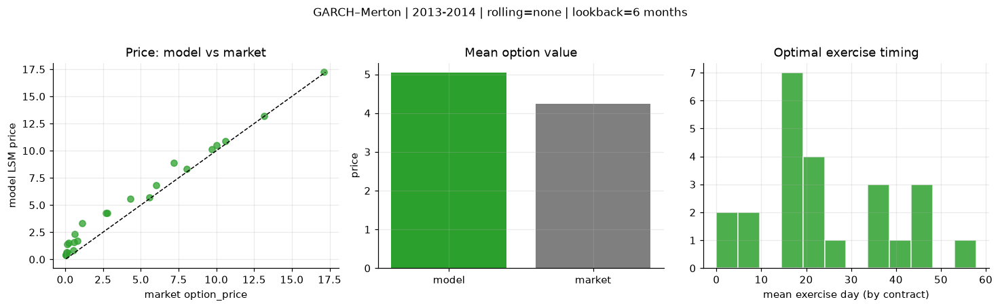
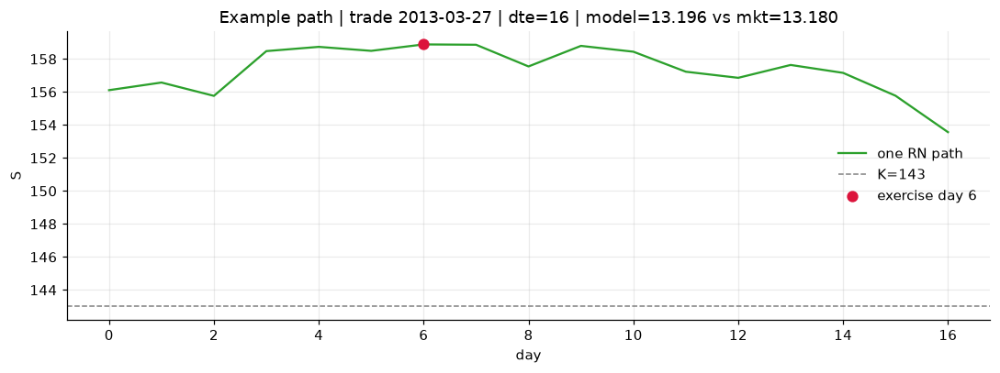
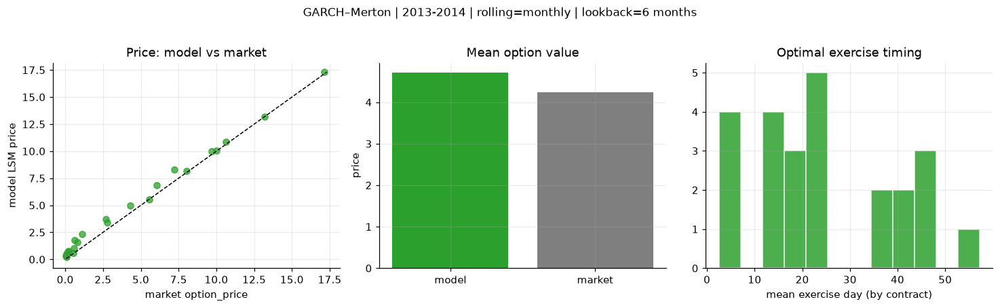
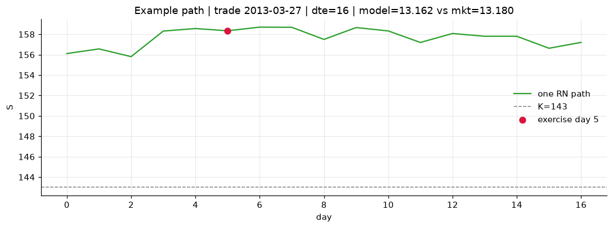
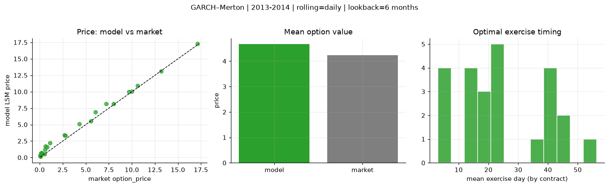
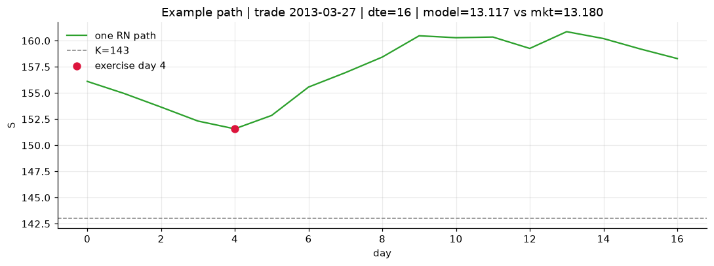

# Optimal stopping — GARCH–Merton — 2013-2014

**Model:** GARCH–Merton  
**Regime / period:** 2013-2014  
**Lookback:** 6 months (fixed)  
**Rolling modes:** none, monthly, daily  
**Pricing:** LSM American calls on SPY | n_paths=2000 | seed=42 | contracts=24

## Comparison (same contracts, same lookback)

| Rolling | RMSE | MAE | Bias (model−mkt) | Mean early-ex frac | Cal updates | Cal s | LSM s |
|---------|-----:|----:|-----------------:|-------------------:|------------:|------:|------:|
| `none` | 1.0072 | 0.8093 | 0.8093 | 0.300 | 1 | 0.0 | 0.1 |
| `monthly` | 0.6103 | 0.4818 | 0.4801 | 0.306 | 25 | 0.7 | 0.1 |
| `daily` | 0.5655 | 0.4460 | 0.4381 | 0.315 | 505 | 6.0 | 0.1 |

**Lowest RMSE (this study):** `daily` = 0.5655

## Rolling = `none`

- **RMSE:** 1.0072  
- **MAE:** 0.8093  
- **Bias:** 0.8093  
- **Mean early-exercise fraction:** 0.300  
- **Calibration updates (SPY):** 1

Contract errors (compact)

| date | K | dte | market | model | error | early_ex |
|------|--:|----:|-------:|------:|------:|---------:|
| 2013-03-27 | 143 | 16 | 13.180 | 13.196 | 0.016 | 0.908 |
| 2014-08-29 | 183.5 | 7 | 17.120 | 17.226 | 0.106 | 1.000 |
| 2013-12-04 | 170 | 27 | 10.000 | 10.515 | 0.515 | 0.410 |
| 2013-11-26 | 173 | 25 | 8.040 | 8.308 | 0.268 | 0.569 |
| 2014-05-29 | 186 | 51 | 7.200 | 8.862 | 1.662 | 0.414 |
| 2013-03-06 | 149 | 45 | 6.040 | 6.833 | 0.793 | 0.503 |
| 2013-04-25 | 163 | 15 | 0.120 | 0.642 | 0.522 | 0.054 |
| 2014-04-01 | 183 | 10 | 5.560 | 5.731 | 0.171 | 0.527 |
| 2014-08-29 | 199 | 22 | 2.680 | 4.276 | 1.596 | 0.272 |
| 2014-09-15 | 204 | 25 | 0.210 | 1.511 | 1.301 | 0.127 |
| 2014-05-07 | 186 | 45 | 4.300 | 5.577 | 1.277 | 0.247 |
| 2014-08-15 | 199 | 46 | 1.100 | 3.311 | 2.211 | 0.202 |
| 2014-11-17 | 212 | 18 | 0.070 | 0.636 | 0.566 | 0.041 |
| 2014-02-03 | 180 | 19 | 0.530 | 0.806 | 0.276 | 0.080 |
| 2013-12-11 | 188 | 23 | 0.060 | 0.461 | 0.401 | 0.039 |
| 2013-07-08 | 169 | 40 | 0.810 | 1.681 | 0.871 | 0.168 |
| 2014-04-23 | 195 | 59 | 0.640 | 2.362 | 1.722 | 0.084 |
| 2014-09-15 | 208 | 46 | 0.150 | 1.390 | 1.240 | 0.118 |
| 2013-06-07 | 154 | 7 | 10.620 | 10.896 | 0.276 | 0.999 |
| 2014-09-08 | 198.5 | 18 | 2.780 | 4.259 | 1.479 | 0.161 |
| 2014-04-08 | 189.5 | 24 | 0.580 | 1.584 | 1.004 | 0.128 |
| 2013-02-20 | 157 | 16 | 0.060 | 0.400 | 0.340 | 0.036 |
| 2014-03-11 | 177.5 | 17 | 9.680 | 10.158 | 0.478 | 0.089 |
| 2013-08-26 | 177 | 35 | 0.050 | 0.381 | 0.331 | 0.035 |

## Rolling = `monthly`

- **RMSE:** 0.6103  
- **MAE:** 0.4818  
- **Bias:** 0.4801  
- **Mean early-exercise fraction:** 0.306  
- **Calibration updates (SPY):** 25

Contract errors (compact)

| date | K | dte | market | model | error | early_ex |
|------|--:|----:|-------:|------:|------:|---------:|
| 2013-03-27 | 143 | 16 | 13.180 | 13.162 | -0.018 | 1.000 |
| 2014-08-29 | 183.5 | 7 | 17.120 | 17.296 | 0.176 | 0.613 |
| 2013-12-04 | 170 | 27 | 10.000 | 10.074 | 0.074 | 0.672 |
| 2013-11-26 | 173 | 25 | 8.040 | 8.189 | 0.149 | 0.675 |
| 2014-05-29 | 186 | 51 | 7.200 | 8.317 | 1.117 | 0.302 |
| 2013-03-06 | 149 | 45 | 6.040 | 6.878 | 0.838 | 0.578 |
| 2013-04-25 | 163 | 15 | 0.120 | 0.519 | 0.399 | 0.038 |
| 2014-04-01 | 183 | 10 | 5.560 | 5.558 | -0.002 | 0.637 |
| 2014-08-29 | 199 | 22 | 2.680 | 3.727 | 1.047 | 0.109 |
| 2014-09-15 | 204 | 25 | 0.210 | 0.756 | 0.546 | 0.085 |
| 2014-05-07 | 186 | 45 | 4.300 | 4.944 | 0.644 | 0.336 |
| 2014-08-15 | 199 | 46 | 1.100 | 2.371 | 1.271 | 0.129 |
| 2014-11-17 | 212 | 18 | 0.070 | 0.505 | 0.435 | 0.038 |
| 2014-02-03 | 180 | 19 | 0.530 | 0.603 | 0.073 | 0.038 |
| 2013-12-11 | 188 | 23 | 0.060 | 0.190 | 0.130 | 0.029 |
| 2013-07-08 | 169 | 40 | 0.810 | 1.604 | 0.794 | 0.067 |
| 2014-04-23 | 195 | 59 | 0.640 | 1.785 | 1.145 | 0.130 |
| 2014-09-15 | 208 | 46 | 0.150 | 0.721 | 0.571 | 0.103 |
| 2013-06-07 | 154 | 7 | 10.620 | 10.867 | 0.247 | 1.000 |
| 2014-09-08 | 198.5 | 18 | 2.780 | 3.381 | 0.601 | 0.152 |
| 2014-04-08 | 189.5 | 24 | 0.580 | 1.054 | 0.474 | 0.106 |
| 2013-02-20 | 157 | 16 | 0.060 | 0.311 | 0.251 | 0.029 |
| 2014-03-11 | 177.5 | 17 | 9.680 | 9.988 | 0.308 | 0.440 |
| 2013-08-26 | 177 | 35 | 0.050 | 0.305 | 0.255 | 0.039 |

## Rolling = `daily`

- **RMSE:** 0.5655  
- **MAE:** 0.4460  
- **Bias:** 0.4381  
- **Mean early-exercise fraction:** 0.315  
- **Calibration updates (SPY):** 505

Contract errors (compact)

| date | K | dte | market | model | error | early_ex |
|------|--:|----:|-------:|------:|------:|---------:|
| 2013-03-27 | 143 | 16 | 13.180 | 13.117 | -0.063 | 1.000 |
| 2014-08-29 | 183.5 | 7 | 17.120 | 17.276 | 0.156 | 0.625 |
| 2013-12-04 | 170 | 27 | 10.000 | 10.032 | 0.032 | 0.704 |
| 2013-11-26 | 173 | 25 | 8.040 | 8.171 | 0.131 | 0.694 |
| 2014-05-29 | 186 | 51 | 7.200 | 8.162 | 0.962 | 0.469 |
| 2013-03-06 | 149 | 45 | 6.040 | 6.932 | 0.892 | 0.398 |
| 2013-04-25 | 163 | 15 | 0.120 | 0.664 | 0.544 | 0.046 |
| 2014-04-01 | 183 | 10 | 5.560 | 5.527 | -0.033 | 0.629 |
| 2014-08-29 | 199 | 22 | 2.680 | 3.430 | 0.750 | 0.153 |
| 2014-09-15 | 204 | 25 | 0.210 | 0.706 | 0.496 | 0.086 |
| 2014-05-07 | 186 | 45 | 4.300 | 5.068 | 0.768 | 0.259 |
| 2014-08-15 | 199 | 46 | 1.100 | 2.198 | 1.098 | 0.222 |
| 2014-11-17 | 212 | 18 | 0.070 | 0.179 | 0.109 | 0.023 |
| 2014-02-03 | 180 | 19 | 0.530 | 0.533 | 0.003 | 0.061 |
| 2013-12-11 | 188 | 23 | 0.060 | 0.187 | 0.127 | 0.030 |
| 2013-07-08 | 169 | 40 | 0.810 | 1.593 | 0.783 | 0.137 |
| 2014-04-23 | 195 | 59 | 0.640 | 1.712 | 1.072 | 0.129 |
| 2014-09-15 | 208 | 46 | 0.150 | 0.642 | 0.492 | 0.086 |
| 2013-06-07 | 154 | 7 | 10.620 | 10.911 | 0.291 | 0.974 |
| 2014-09-08 | 198.5 | 18 | 2.780 | 3.345 | 0.565 | 0.154 |
| 2014-04-08 | 189.5 | 24 | 0.580 | 1.210 | 0.630 | 0.091 |
| 2013-02-20 | 157 | 16 | 0.060 | 0.246 | 0.186 | 0.040 |
| 2014-03-11 | 177.5 | 17 | 9.680 | 9.977 | 0.297 | 0.528 |
| 2013-08-26 | 177 | 35 | 0.050 | 0.275 | 0.225 | 0.031 |

