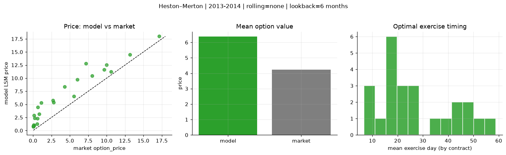
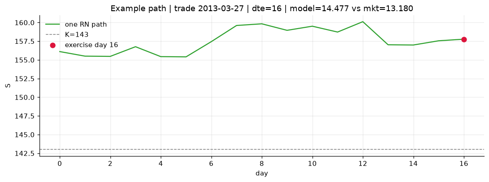
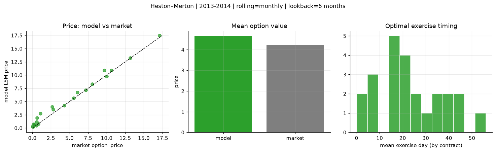
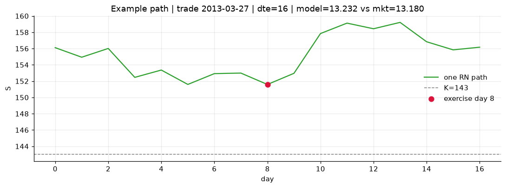
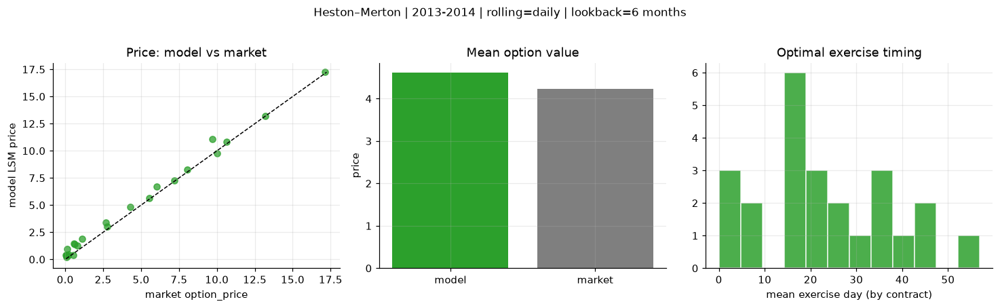
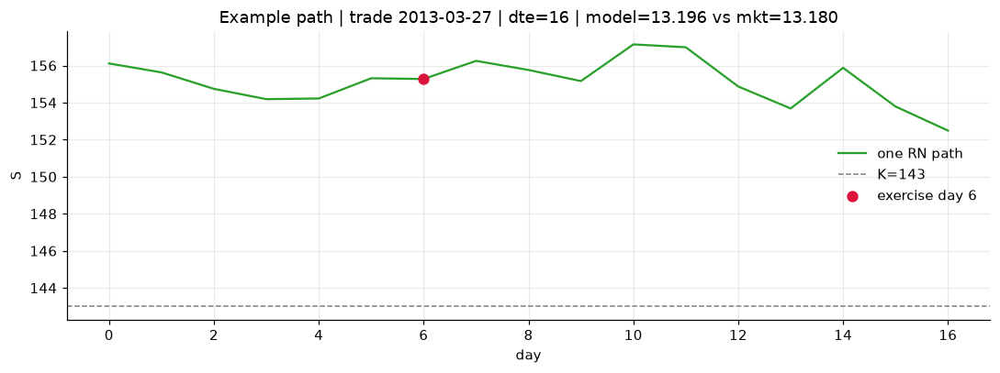

# Optimal stopping — Heston–Merton — 2013-2014

**Model:** Heston–Merton  
**Regime / period:** 2013-2014  
**Lookback:** 6 months (fixed)  
**Rolling modes:** none, monthly, daily  
**Pricing:** LSM American calls on SPY | n_paths=2000 | seed=42 | contracts=24

## Comparison (same contracts, same lookback)

| Rolling | RMSE | MAE | Bias (model−mkt) | Mean early-ex frac | Cal updates | Cal s | LSM s |
|---------|-----:|----:|-----------------:|-------------------:|------------:|------:|------:|
| `none` | 2.5391 | 2.1449 | 2.1449 | 0.033 | 1 | 0.0 | 0.1 |
| `monthly` | 0.6535 | 0.4730 | 0.4366 | 0.311 | 25 | 0.0 | 0.1 |
| `daily` | 0.5309 | 0.4135 | 0.3819 | 0.359 | 505 | 0.9 | 0.1 |

**Lowest RMSE (this study):** `daily` = 0.5309

## Rolling = `none`

- **RMSE:** 2.5391  
- **MAE:** 2.1449  
- **Bias:** 2.1449  
- **Mean early-exercise fraction:** 0.033  
- **Calibration updates (SPY):** 1

Contract errors (compact)

| date | K | dte | market | model | error | early_ex |
|------|--:|----:|-------:|------:|------:|---------:|
| 2013-03-27 | 143 | 16 | 13.180 | 14.477 | 1.297 | 0.004 |
| 2014-08-29 | 183.5 | 7 | 17.120 | 17.982 | 0.862 | 0.004 |
| 2013-12-04 | 170 | 27 | 10.000 | 12.507 | 2.507 | 0.046 |
| 2013-11-26 | 173 | 25 | 8.040 | 10.447 | 2.407 | 0.022 |
| 2014-05-29 | 186 | 51 | 7.200 | 12.814 | 5.614 | 0.021 |
| 2013-03-06 | 149 | 45 | 6.040 | 9.765 | 3.725 | 0.058 |
| 2013-04-25 | 163 | 15 | 0.120 | 0.954 | 0.834 | 0.011 |
| 2014-04-01 | 183 | 10 | 5.560 | 6.547 | 0.987 | 0.028 |
| 2014-08-29 | 199 | 22 | 2.680 | 5.787 | 3.107 | 0.056 |
| 2014-09-15 | 204 | 25 | 0.210 | 2.362 | 2.152 | 0.007 |
| 2014-05-07 | 186 | 45 | 4.300 | 8.374 | 4.074 | 0.000 |
| 2014-08-15 | 199 | 46 | 1.100 | 5.329 | 4.229 | 0.002 |
| 2014-11-17 | 212 | 18 | 0.070 | 1.091 | 1.021 | 0.009 |
| 2014-02-03 | 180 | 19 | 0.530 | 1.236 | 0.706 | 0.038 |
| 2013-12-11 | 188 | 23 | 0.060 | 0.828 | 0.768 | 0.006 |
| 2013-07-08 | 169 | 40 | 0.810 | 3.162 | 2.352 | 0.052 |
| 2014-04-23 | 195 | 59 | 0.640 | 4.442 | 3.802 | 0.034 |
| 2014-09-15 | 208 | 46 | 0.150 | 2.864 | 2.714 | 0.015 |
| 2013-06-07 | 154 | 7 | 10.620 | 11.222 | 0.602 | 0.167 |
| 2014-09-08 | 198.5 | 18 | 2.780 | 5.389 | 2.609 | 0.043 |
| 2014-04-08 | 189.5 | 24 | 0.580 | 2.284 | 1.704 | 0.000 |
| 2013-02-20 | 157 | 16 | 0.060 | 0.735 | 0.675 | 0.022 |
| 2014-03-11 | 177.5 | 17 | 9.680 | 11.621 | 1.941 | 0.120 |
| 2013-08-26 | 177 | 35 | 0.050 | 0.839 | 0.789 | 0.015 |

## Rolling = `monthly`

- **RMSE:** 0.6535  
- **MAE:** 0.4730  
- **Bias:** 0.4366  
- **Mean early-exercise fraction:** 0.311  
- **Calibration updates (SPY):** 25

Contract errors (compact)

| date | K | dte | market | model | error | early_ex |
|------|--:|----:|-------:|------:|------:|---------:|
| 2013-03-27 | 143 | 16 | 13.180 | 13.232 | 0.052 | 0.999 |
| 2014-08-29 | 183.5 | 7 | 17.120 | 17.447 | 0.327 | 0.139 |
| 2013-12-04 | 170 | 27 | 10.000 | 9.744 | -0.256 | 1.000 |
| 2013-11-26 | 173 | 25 | 8.040 | 8.280 | 0.240 | 0.638 |
| 2014-05-29 | 186 | 51 | 7.200 | 7.197 | -0.003 | 0.605 |
| 2013-03-06 | 149 | 45 | 6.040 | 6.699 | 0.659 | 0.419 |
| 2013-04-25 | 163 | 15 | 0.120 | 0.552 | 0.432 | 0.071 |
| 2014-04-01 | 183 | 10 | 5.560 | 5.680 | 0.120 | 0.690 |
| 2014-08-29 | 199 | 22 | 2.680 | 4.007 | 1.327 | 0.226 |
| 2014-09-15 | 204 | 25 | 0.210 | 0.697 | 0.487 | 0.126 |
| 2014-05-07 | 186 | 45 | 4.300 | 4.236 | -0.064 | 0.385 |
| 2014-08-15 | 199 | 46 | 1.100 | 2.739 | 1.639 | 0.173 |
| 2014-11-17 | 212 | 18 | 0.070 | 0.381 | 0.311 | 0.060 |
| 2014-02-03 | 180 | 19 | 0.530 | 0.462 | -0.068 | 0.022 |
| 2013-12-11 | 188 | 23 | 0.060 | 0.212 | 0.152 | 0.024 |
| 2013-07-08 | 169 | 40 | 0.810 | 0.764 | -0.046 | 0.151 |
| 2014-04-23 | 195 | 59 | 0.640 | 1.925 | 1.285 | 0.228 |
| 2014-09-15 | 208 | 46 | 0.150 | 0.728 | 0.578 | 0.081 |
| 2013-06-07 | 154 | 7 | 10.620 | 10.895 | 0.275 | 1.000 |
| 2014-09-08 | 198.5 | 18 | 2.780 | 3.478 | 0.698 | 0.301 |
| 2014-04-08 | 189.5 | 24 | 0.580 | 1.155 | 0.575 | 0.067 |
| 2013-02-20 | 157 | 16 | 0.060 | 0.323 | 0.263 | 0.022 |
| 2014-03-11 | 177.5 | 17 | 9.680 | 10.927 | 1.247 | 0.015 |
| 2013-08-26 | 177 | 35 | 0.050 | 0.295 | 0.245 | 0.021 |

## Rolling = `daily`

- **RMSE:** 0.5309  
- **MAE:** 0.4135  
- **Bias:** 0.3819  
- **Mean early-exercise fraction:** 0.359  
- **Calibration updates (SPY):** 505

Contract errors (compact)

| date | K | dte | market | model | error | early_ex |
|------|--:|----:|-------:|------:|------:|---------:|
| 2013-03-27 | 143 | 16 | 13.180 | 13.196 | 0.016 | 0.998 |
| 2014-08-29 | 183.5 | 7 | 17.120 | 17.236 | 0.116 | 0.987 |
| 2013-12-04 | 170 | 27 | 10.000 | 9.744 | -0.256 | 1.000 |
| 2013-11-26 | 173 | 25 | 8.040 | 8.250 | 0.210 | 0.656 |
| 2014-05-29 | 186 | 51 | 7.200 | 7.294 | 0.094 | 0.607 |
| 2013-03-06 | 149 | 45 | 6.040 | 6.715 | 0.675 | 0.529 |
| 2013-04-25 | 163 | 15 | 0.120 | 0.937 | 0.817 | 0.041 |
| 2014-04-01 | 183 | 10 | 5.560 | 5.674 | 0.114 | 0.692 |
| 2014-08-29 | 199 | 22 | 2.680 | 3.416 | 0.736 | 0.337 |
| 2014-09-15 | 204 | 25 | 0.210 | 0.431 | 0.221 | 0.115 |
| 2014-05-07 | 186 | 45 | 4.300 | 4.853 | 0.553 | 0.360 |
| 2014-08-15 | 199 | 46 | 1.100 | 1.900 | 0.800 | 0.216 |
| 2014-11-17 | 212 | 18 | 0.070 | 0.375 | 0.305 | 0.039 |
| 2014-02-03 | 180 | 19 | 0.530 | 0.407 | -0.123 | 0.029 |
| 2013-12-11 | 188 | 23 | 0.060 | 0.224 | 0.164 | 0.029 |
| 2013-07-08 | 169 | 40 | 0.810 | 1.258 | 0.448 | 0.148 |
| 2014-04-23 | 195 | 59 | 0.640 | 1.368 | 0.728 | 0.148 |
| 2014-09-15 | 208 | 46 | 0.150 | 0.359 | 0.209 | 0.078 |
| 2013-06-07 | 154 | 7 | 10.620 | 10.821 | 0.201 | 1.000 |
| 2014-09-08 | 198.5 | 18 | 2.780 | 2.998 | 0.218 | 0.411 |
| 2014-04-08 | 189.5 | 24 | 0.580 | 1.454 | 0.874 | 0.080 |
| 2013-02-20 | 157 | 16 | 0.060 | 0.349 | 0.289 | 0.057 |
| 2014-03-11 | 177.5 | 17 | 9.680 | 11.093 | 1.413 | 0.024 |
| 2013-08-26 | 177 | 35 | 0.050 | 0.394 | 0.344 | 0.025 |

