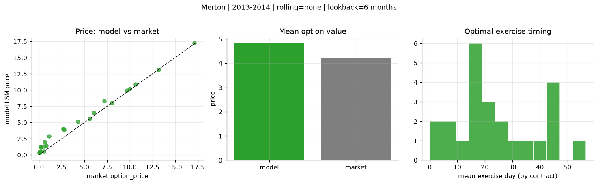
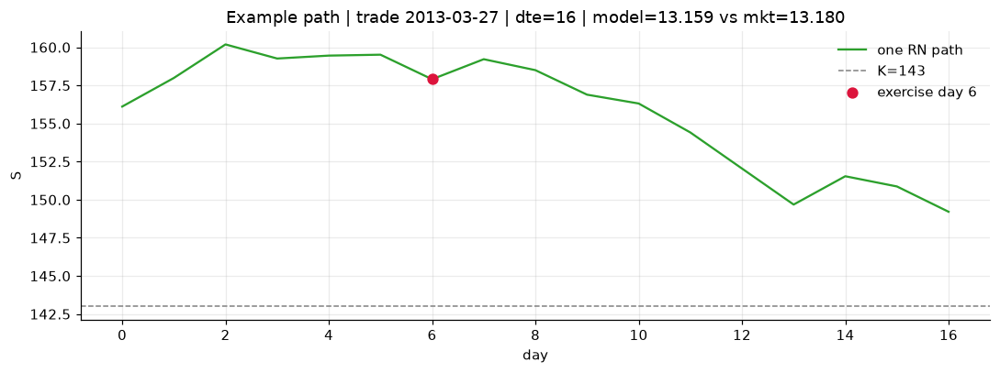
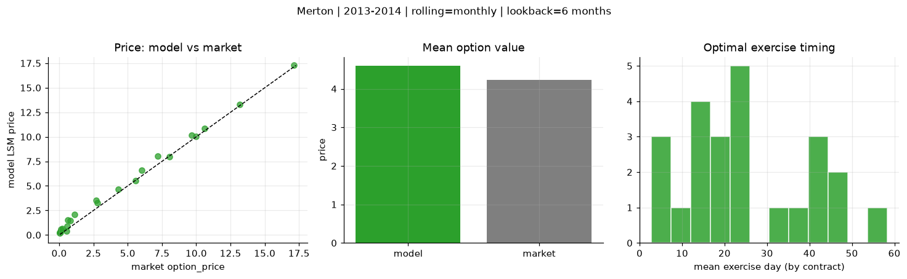
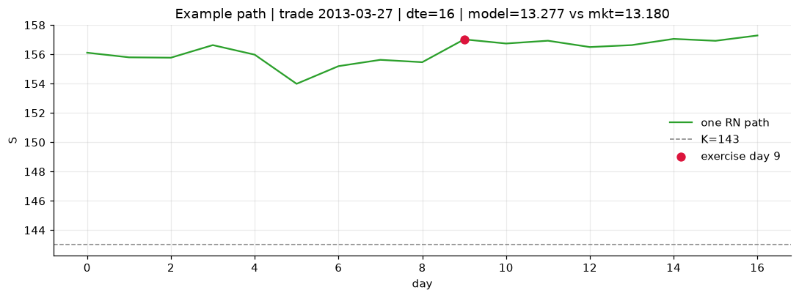
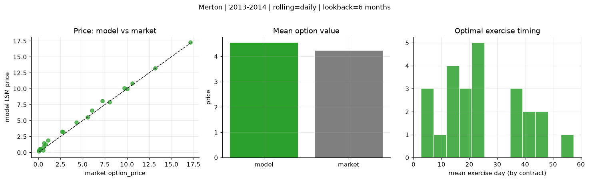
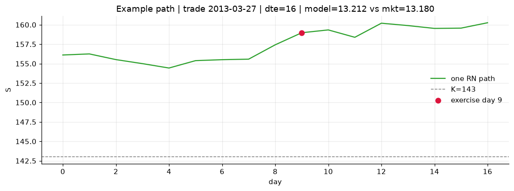

# Optimal stopping — Merton — 2013-2014

**Model:** Merton  
**Regime / period:** 2013-2014  
**Lookback:** 6 months (fixed)  
**Rolling modes:** none, monthly, daily  
**Pricing:** LSM American calls on SPY | n_paths=2000 | seed=42 | contracts=24

## Comparison (same contracts, same lookback)

| Rolling | RMSE | MAE | Bias (model−mkt) | Mean early-ex frac | Cal updates | Cal s | LSM s |
|---------|-----:|----:|-----------------:|-------------------:|------------:|------:|------:|
| `none` | 0.7667 | 0.5874 | 0.5846 | 0.336 | 1 | 0.0 | 0.1 |
| `monthly` | 0.4786 | 0.3845 | 0.3642 | 0.308 | 25 | 0.0 | 0.1 |
| `daily` | 0.4155 | 0.3381 | 0.3065 | 0.331 | 505 | 0.1 | 0.1 |

**Lowest RMSE (this study):** `daily` = 0.4155

## Rolling = `none`

- **RMSE:** 0.7667  
- **MAE:** 0.5874  
- **Bias:** 0.5846  
- **Mean early-exercise fraction:** 0.336  
- **Calibration updates (SPY):** 1

Contract errors (compact)

| date | K | dte | market | model | error | early_ex |
|------|--:|----:|-------:|------:|------:|---------:|
| 2013-03-27 | 143 | 16 | 13.180 | 13.159 | -0.021 | 0.986 |
| 2014-08-29 | 183.5 | 7 | 17.120 | 17.226 | 0.106 | 1.000 |
| 2013-12-04 | 170 | 27 | 10.000 | 10.206 | 0.206 | 0.425 |
| 2013-11-26 | 173 | 25 | 8.040 | 8.027 | -0.013 | 0.583 |
| 2014-05-29 | 186 | 51 | 7.200 | 8.320 | 1.120 | 0.406 |
| 2013-03-06 | 149 | 45 | 6.040 | 6.527 | 0.487 | 0.536 |
| 2013-04-25 | 163 | 15 | 0.120 | 0.489 | 0.369 | 0.041 |
| 2014-04-01 | 183 | 10 | 5.560 | 5.575 | 0.015 | 0.549 |
| 2014-08-29 | 199 | 22 | 2.680 | 4.047 | 1.367 | 0.309 |
| 2014-09-15 | 204 | 25 | 0.210 | 1.205 | 0.995 | 0.117 |
| 2014-05-07 | 186 | 45 | 4.300 | 5.122 | 0.822 | 0.249 |
| 2014-08-15 | 199 | 46 | 1.100 | 2.871 | 1.771 | 0.180 |
| 2014-11-17 | 212 | 18 | 0.070 | 0.513 | 0.443 | 0.028 |
| 2014-02-03 | 180 | 19 | 0.530 | 0.605 | 0.075 | 0.114 |
| 2013-12-11 | 188 | 23 | 0.060 | 0.367 | 0.307 | 0.036 |
| 2013-07-08 | 169 | 40 | 0.810 | 1.470 | 0.660 | 0.214 |
| 2014-04-23 | 195 | 59 | 0.640 | 2.024 | 1.384 | 0.141 |
| 2014-09-15 | 208 | 46 | 0.150 | 1.203 | 1.053 | 0.059 |
| 2013-06-07 | 154 | 7 | 10.620 | 10.874 | 0.254 | 1.000 |
| 2014-09-08 | 198.5 | 18 | 2.780 | 3.868 | 1.088 | 0.333 |
| 2014-04-08 | 189.5 | 24 | 0.580 | 1.307 | 0.727 | 0.109 |
| 2013-02-20 | 157 | 16 | 0.060 | 0.330 | 0.270 | 0.035 |
| 2014-03-11 | 177.5 | 17 | 9.680 | 9.947 | 0.267 | 0.571 |
| 2013-08-26 | 177 | 35 | 0.050 | 0.326 | 0.276 | 0.049 |

## Rolling = `monthly`

- **RMSE:** 0.4786  
- **MAE:** 0.3845  
- **Bias:** 0.3642  
- **Mean early-exercise fraction:** 0.308  
- **Calibration updates (SPY):** 25

Contract errors (compact)

| date | K | dte | market | model | error | early_ex |
|------|--:|----:|-------:|------:|------:|---------:|
| 2013-03-27 | 143 | 16 | 13.180 | 13.277 | 0.097 | 0.886 |
| 2014-08-29 | 183.5 | 7 | 17.120 | 17.273 | 0.153 | 0.690 |
| 2013-12-04 | 170 | 27 | 10.000 | 10.046 | 0.046 | 0.507 |
| 2013-11-26 | 173 | 25 | 8.040 | 7.942 | -0.098 | 0.657 |
| 2014-05-29 | 186 | 51 | 7.200 | 8.038 | 0.838 | 0.577 |
| 2013-03-06 | 149 | 45 | 6.040 | 6.616 | 0.576 | 0.351 |
| 2013-04-25 | 163 | 15 | 0.120 | 0.442 | 0.322 | 0.037 |
| 2014-04-01 | 183 | 10 | 5.560 | 5.539 | -0.021 | 0.537 |
| 2014-08-29 | 199 | 22 | 2.680 | 3.556 | 0.876 | 0.197 |
| 2014-09-15 | 204 | 25 | 0.210 | 0.665 | 0.455 | 0.096 |
| 2014-05-07 | 186 | 45 | 4.300 | 4.678 | 0.378 | 0.308 |
| 2014-08-15 | 199 | 46 | 1.100 | 2.108 | 1.008 | 0.142 |
| 2014-11-17 | 212 | 18 | 0.070 | 0.272 | 0.202 | 0.017 |
| 2014-02-03 | 180 | 19 | 0.530 | 0.405 | -0.125 | 0.045 |
| 2013-12-11 | 188 | 23 | 0.060 | 0.228 | 0.168 | 0.034 |
| 2013-07-08 | 169 | 40 | 0.810 | 1.493 | 0.683 | 0.106 |
| 2014-04-23 | 195 | 59 | 0.640 | 1.513 | 0.873 | 0.184 |
| 2014-09-15 | 208 | 46 | 0.150 | 0.577 | 0.427 | 0.076 |
| 2013-06-07 | 154 | 7 | 10.620 | 10.852 | 0.232 | 0.959 |
| 2014-09-08 | 198.5 | 18 | 2.780 | 3.276 | 0.496 | 0.147 |
| 2014-04-08 | 189.5 | 24 | 0.580 | 0.891 | 0.311 | 0.099 |
| 2013-02-20 | 157 | 16 | 0.060 | 0.229 | 0.169 | 0.043 |
| 2014-03-11 | 177.5 | 17 | 9.680 | 10.146 | 0.466 | 0.668 |
| 2013-08-26 | 177 | 35 | 0.050 | 0.258 | 0.208 | 0.037 |

## Rolling = `daily`

- **RMSE:** 0.4155  
- **MAE:** 0.3381  
- **Bias:** 0.3065  
- **Mean early-exercise fraction:** 0.331  
- **Calibration updates (SPY):** 505

Contract errors (compact)

| date | K | dte | market | model | error | early_ex |
|------|--:|----:|-------:|------:|------:|---------:|
| 2013-03-27 | 143 | 16 | 13.180 | 13.212 | 0.032 | 0.842 |
| 2014-08-29 | 183.5 | 7 | 17.120 | 17.251 | 0.131 | 0.688 |
| 2013-12-04 | 170 | 27 | 10.000 | 9.959 | -0.041 | 0.555 |
| 2013-11-26 | 173 | 25 | 8.040 | 7.902 | -0.138 | 0.683 |
| 2014-05-29 | 186 | 51 | 7.200 | 8.066 | 0.866 | 0.520 |
| 2013-03-06 | 149 | 45 | 6.040 | 6.568 | 0.528 | 0.768 |
| 2013-04-25 | 163 | 15 | 0.120 | 0.347 | 0.227 | 0.063 |
| 2014-04-01 | 183 | 10 | 5.560 | 5.537 | -0.023 | 0.539 |
| 2014-08-29 | 199 | 22 | 2.680 | 3.285 | 0.605 | 0.206 |
| 2014-09-15 | 204 | 25 | 0.210 | 0.597 | 0.387 | 0.094 |
| 2014-05-07 | 186 | 45 | 4.300 | 4.730 | 0.430 | 0.299 |
| 2014-08-15 | 199 | 46 | 1.100 | 1.883 | 0.783 | 0.209 |
| 2014-11-17 | 212 | 18 | 0.070 | 0.281 | 0.211 | 0.032 |
| 2014-02-03 | 180 | 19 | 0.530 | 0.353 | -0.177 | 0.038 |
| 2013-12-11 | 188 | 23 | 0.060 | 0.197 | 0.137 | 0.035 |
| 2013-07-08 | 169 | 40 | 0.810 | 1.257 | 0.447 | 0.139 |
| 2014-04-23 | 195 | 59 | 0.640 | 1.488 | 0.848 | 0.115 |
| 2014-09-15 | 208 | 46 | 0.150 | 0.499 | 0.349 | 0.066 |
| 2013-06-07 | 154 | 7 | 10.620 | 10.857 | 0.237 | 0.968 |
| 2014-09-08 | 198.5 | 18 | 2.780 | 3.225 | 0.445 | 0.146 |
| 2014-04-08 | 189.5 | 24 | 0.580 | 0.890 | 0.310 | 0.084 |
| 2013-02-20 | 157 | 16 | 0.060 | 0.243 | 0.183 | 0.031 |
| 2014-03-11 | 177.5 | 17 | 9.680 | 10.079 | 0.399 | 0.813 |
| 2013-08-26 | 177 | 35 | 0.050 | 0.233 | 0.183 | 0.008 |

