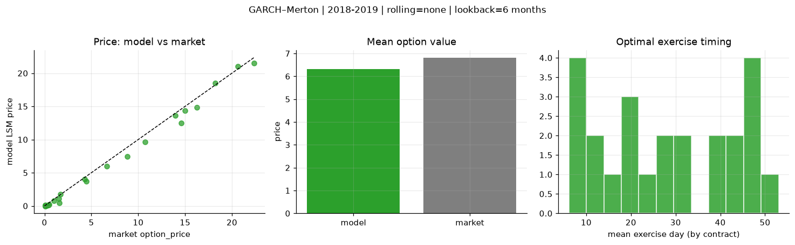
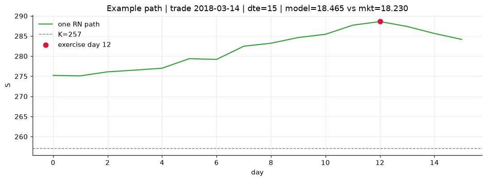
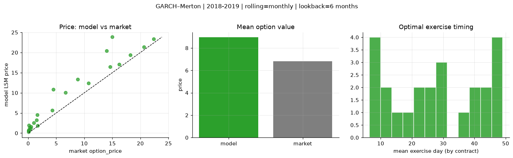
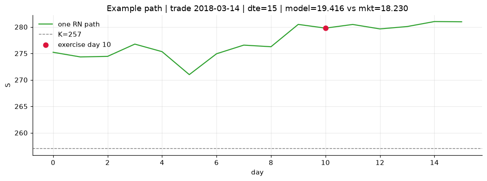
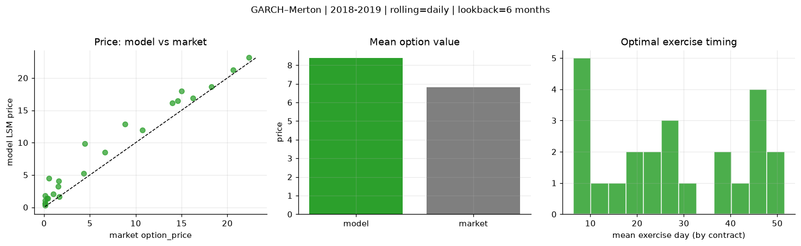
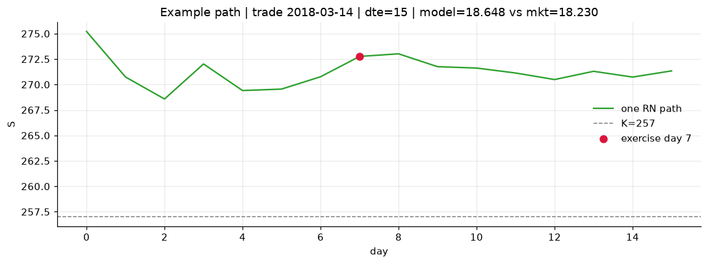

# Optimal stopping — GARCH–Merton — 2018-2019

**Model:** GARCH–Merton  
**Regime / period:** 2018-2019  
**Lookback:** 6 months (fixed)  
**Rolling modes:** none, monthly, daily  
**Pricing:** LSM American calls on SPY | n_paths=2000 | seed=42 | contracts=24

## Comparison (same contracts, same lookback)

| Rolling | RMSE | MAE | Bias (model−mkt) | Mean early-ex frac | Cal updates | Cal s | LSM s |
|---------|-----:|----:|-----------------:|-------------------:|------------:|------:|------:|
| `none` | 0.7625 | 0.5523 | -0.4911 | 0.210 | 1 | 0.0 | 0.1 |
| `monthly` | 3.0739 | 2.1487 | 2.1487 | 0.233 | 25 | 0.8 | 0.1 |
| `daily` | 2.0580 | 1.5759 | 1.5733 | 0.236 | 503 | 10.0 | 0.1 |

**Lowest RMSE (this study):** `none` = 0.7625

## Rolling = `none`

- **RMSE:** 0.7625  
- **MAE:** 0.5523  
- **Bias:** -0.4911  
- **Mean early-exercise fraction:** 0.210  
- **Calibration updates (SPY):** 1

Contract errors (compact)

| date | K | dte | market | model | error | early_ex |
|------|--:|----:|-------:|------:|------:|---------:|
| 2018-03-14 | 257 | 15 | 18.230 | 18.465 | 0.235 | 0.727 |
| 2019-09-05 | 277 | 8 | 20.620 | 21.017 | 0.397 | 0.278 |
| 2019-01-15 | 247 | 31 | 14.990 | 14.350 | -0.640 | 0.095 |
| 2019-01-15 | 247.5 | 24 | 13.960 | 13.601 | -0.359 | 0.280 |
| 2019-06-03 | 261 | 46 | 16.230 | 14.860 | -1.370 | 0.207 |
| 2018-02-28 | 260 | 51 | 14.600 | 12.520 | -2.080 | 0.682 |
| 2018-04-05 | 269 | 11 | 1.600 | 0.424 | -1.176 | 0.019 |
| 2019-02-06 | 269 | 7 | 4.290 | 4.002 | -0.288 | 0.584 |
| 2019-07-09 | 303 | 31 | 1.520 | 1.102 | -0.418 | 0.089 |
| 2019-07-30 | 307 | 27 | 0.990 | 0.803 | -0.187 | 0.102 |
| 2019-02-21 | 277.5 | 43 | 4.450 | 3.692 | -0.758 | 0.314 |
| 2019-09-05 | 293 | 50 | 8.840 | 7.407 | -1.433 | 0.466 |
| 2019-07-23 | 309 | 15 | 0.110 | 0.100 | -0.010 | 0.005 |
| 2018-11-29 | 291 | 8 | 0.080 | 0.000 | -0.080 | 0.000 |
| 2018-11-21 | 286 | 21 | 0.080 | 0.002 | -0.078 | 0.000 |
| 2018-05-10 | 287.5 | 29 | 0.110 | 0.017 | -0.093 | 0.006 |
| 2019-05-03 | 320 | 49 | 0.100 | 0.009 | -0.091 | 0.001 |
| 2019-08-13 | 308 | 48 | 0.510 | 0.186 | -0.324 | 0.031 |
| 2018-10-02 | 293 | 20 | 1.670 | 1.773 | 0.103 | 0.027 |
| 2018-11-07 | 261 | 54 | 22.370 | 21.502 | -0.868 | 0.375 |
| 2019-11-29 | 311 | 42 | 6.650 | 6.020 | -0.630 | 0.279 |
| 2019-03-07 | 279.5 | 8 | 0.410 | 0.122 | -0.288 | 0.024 |
| 2019-07-09 | 290 | 45 | 10.750 | 9.624 | -1.126 | 0.434 |
| 2019-06-24 | 307.5 | 25 | 0.270 | 0.046 | -0.224 | 0.009 |

## Rolling = `monthly`

- **RMSE:** 3.0739  
- **MAE:** 2.1487  
- **Bias:** 2.1487  
- **Mean early-exercise fraction:** 0.233  
- **Calibration updates (SPY):** 25

Contract errors (compact)

| date | K | dte | market | model | error | early_ex |
|------|--:|----:|-------:|------:|------:|---------:|
| 2018-03-14 | 257 | 15 | 18.230 | 19.416 | 1.186 | 0.678 |
| 2019-09-05 | 277 | 8 | 20.620 | 21.407 | 0.787 | 0.336 |
| 2019-01-15 | 247 | 31 | 14.990 | 23.835 | 8.845 | 0.200 |
| 2019-01-15 | 247.5 | 24 | 13.960 | 20.464 | 6.504 | 0.175 |
| 2019-06-03 | 261 | 46 | 16.230 | 17.075 | 0.845 | 0.701 |
| 2018-02-28 | 260 | 51 | 14.600 | 16.429 | 1.829 | 0.585 |
| 2018-04-05 | 269 | 11 | 1.600 | 4.554 | 2.954 | 0.126 |
| 2019-02-06 | 269 | 7 | 4.290 | 5.615 | 1.325 | 0.355 |
| 2019-07-09 | 303 | 31 | 1.520 | 3.227 | 1.707 | 0.134 |
| 2019-07-30 | 307 | 27 | 0.990 | 2.572 | 1.582 | 0.190 |
| 2019-02-21 | 277.5 | 43 | 4.450 | 10.836 | 6.386 | 0.106 |
| 2019-09-05 | 293 | 50 | 8.840 | 13.365 | 4.525 | 0.308 |
| 2019-07-23 | 309 | 15 | 0.110 | 0.847 | 0.737 | 0.050 |
| 2018-11-29 | 291 | 8 | 0.080 | 0.292 | 0.212 | 0.005 |
| 2018-11-21 | 286 | 21 | 0.080 | 0.612 | 0.532 | 0.047 |
| 2018-05-10 | 287.5 | 29 | 0.110 | 1.911 | 1.801 | 0.050 |
| 2019-05-03 | 320 | 49 | 0.100 | 0.625 | 0.525 | 0.019 |
| 2019-08-13 | 308 | 48 | 0.510 | 1.563 | 1.053 | 0.068 |
| 2018-10-02 | 293 | 20 | 1.670 | 1.850 | 0.180 | 0.100 |
| 2018-11-07 | 261 | 54 | 22.370 | 23.382 | 1.012 | 0.785 |
| 2019-11-29 | 311 | 42 | 6.650 | 10.062 | 3.412 | 0.203 |
| 2019-03-07 | 279.5 | 8 | 0.410 | 1.187 | 0.777 | 0.004 |
| 2019-07-09 | 290 | 45 | 10.750 | 12.429 | 1.679 | 0.290 |
| 2019-06-24 | 307.5 | 25 | 0.270 | 1.445 | 1.175 | 0.068 |

## Rolling = `daily`

- **RMSE:** 2.0580  
- **MAE:** 1.5759  
- **Bias:** 1.5733  
- **Mean early-exercise fraction:** 0.236  
- **Calibration updates (SPY):** 503

Contract errors (compact)

| date | K | dte | market | model | error | early_ex |
|------|--:|----:|-------:|------:|------:|---------:|
| 2018-03-14 | 257 | 15 | 18.230 | 18.648 | 0.418 | 0.940 |
| 2019-09-05 | 277 | 8 | 20.620 | 21.245 | 0.625 | 0.335 |
| 2019-01-15 | 247 | 31 | 14.990 | 17.993 | 3.003 | 0.331 |
| 2019-01-15 | 247.5 | 24 | 13.960 | 16.099 | 2.139 | 0.127 |
| 2019-06-03 | 261 | 46 | 16.230 | 16.856 | 0.626 | 0.434 |
| 2018-02-28 | 260 | 51 | 14.600 | 16.429 | 1.829 | 0.585 |
| 2018-04-05 | 269 | 11 | 1.600 | 4.054 | 2.454 | 0.122 |
| 2019-02-06 | 269 | 7 | 4.290 | 5.200 | 0.910 | 0.385 |
| 2019-07-09 | 303 | 31 | 1.520 | 3.188 | 1.668 | 0.129 |
| 2019-07-30 | 307 | 27 | 0.990 | 2.062 | 1.072 | 0.170 |
| 2019-02-21 | 277.5 | 43 | 4.450 | 9.812 | 5.362 | 0.141 |
| 2019-09-05 | 293 | 50 | 8.840 | 12.886 | 4.046 | 0.313 |
| 2019-07-23 | 309 | 15 | 0.110 | 0.602 | 0.492 | 0.039 |
| 2018-11-29 | 291 | 8 | 0.080 | 0.262 | 0.182 | 0.005 |
| 2018-11-21 | 286 | 21 | 0.080 | 0.544 | 0.464 | 0.052 |
| 2018-05-10 | 287.5 | 29 | 0.110 | 1.772 | 1.662 | 0.099 |
| 2019-05-03 | 320 | 49 | 0.100 | 1.012 | 0.912 | 0.030 |
| 2019-08-13 | 308 | 48 | 0.510 | 4.516 | 4.006 | 0.173 |
| 2018-10-02 | 293 | 20 | 1.670 | 1.639 | -0.031 | 0.038 |
| 2018-11-07 | 261 | 54 | 22.370 | 23.132 | 0.762 | 0.559 |
| 2019-11-29 | 311 | 42 | 6.650 | 8.519 | 1.869 | 0.263 |
| 2019-03-07 | 279.5 | 8 | 0.410 | 1.343 | 0.933 | 0.003 |
| 2019-07-09 | 290 | 45 | 10.750 | 11.975 | 1.225 | 0.335 |
| 2019-06-24 | 307.5 | 25 | 0.270 | 1.402 | 1.132 | 0.059 |

