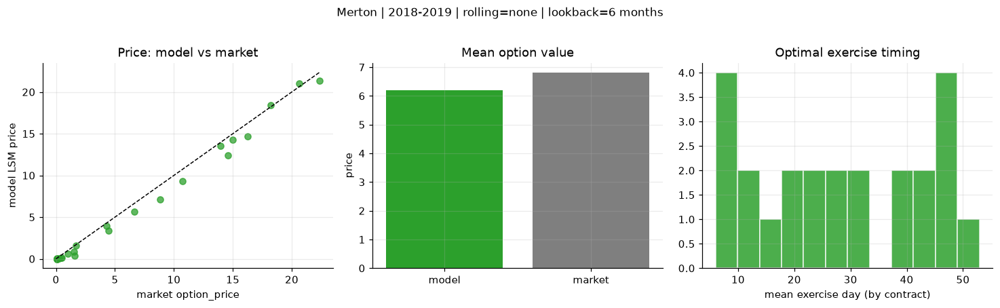
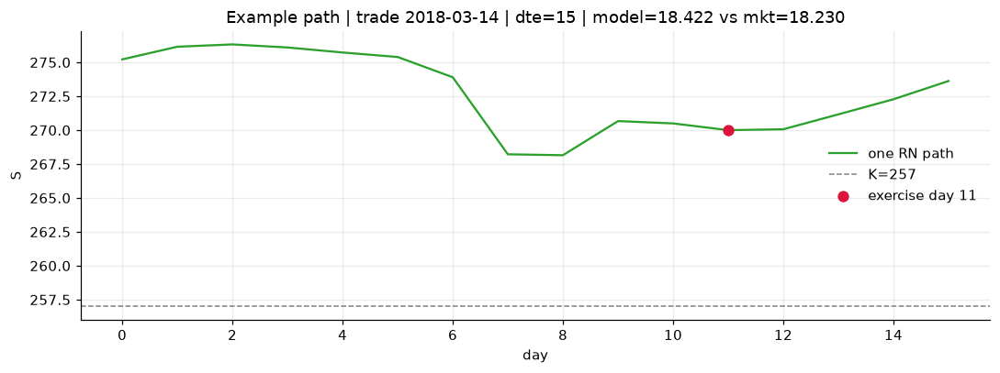
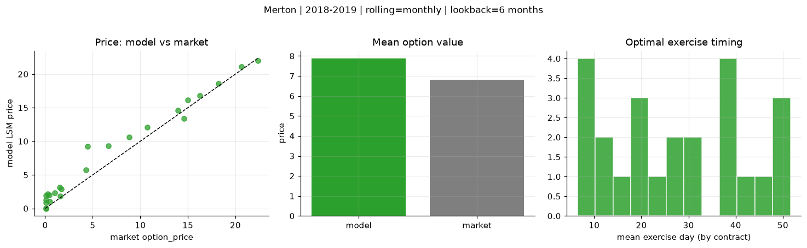
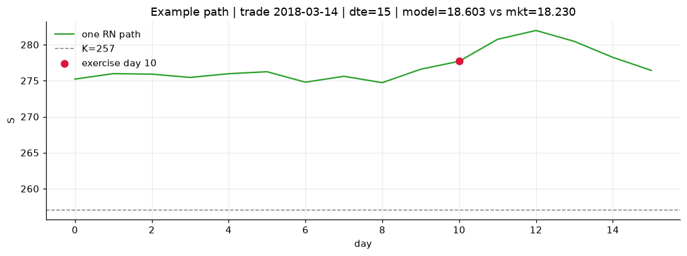
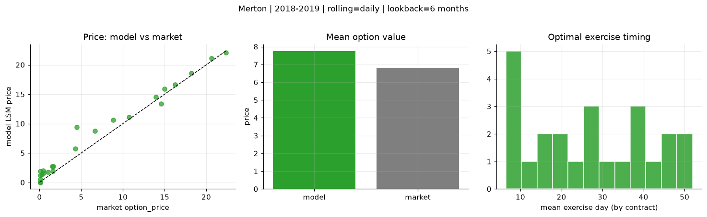
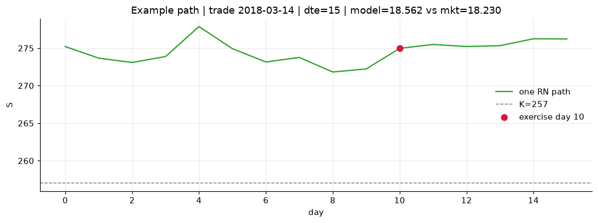

# Optimal stopping — Merton — 2018-2019

**Model:** Merton  
**Regime / period:** 2018-2019  
**Lookback:** 6 months (fixed)  
**Rolling modes:** none, monthly, daily  
**Pricing:** LSM American calls on SPY | n_paths=2000 | seed=42 | contracts=24

## Comparison (same contracts, same lookback)

| Rolling | RMSE | MAE | Bias (model−mkt) | Mean early-ex frac | Cal updates | Cal s | LSM s |
|---------|-----:|----:|-----------------:|-------------------:|------------:|------:|------:|
| `none` | 0.8772 | 0.6495 | -0.6022 | 0.215 | 1 | 0.0 | 0.1 |
| `monthly` | 1.5545 | 1.2042 | 1.0642 | 0.225 | 25 | 0.0 | 0.1 |
| `daily` | 1.4499 | 1.0616 | 0.9334 | 0.240 | 503 | 0.1 | 0.1 |

**Lowest RMSE (this study):** `none` = 0.8772

## Rolling = `none`

- **RMSE:** 0.8772  
- **MAE:** 0.6495  
- **Bias:** -0.6022  
- **Mean early-exercise fraction:** 0.215  
- **Calibration updates (SPY):** 1

Contract errors (compact)

| date | K | dte | market | model | error | early_ex |
|------|--:|----:|-------:|------:|------:|---------:|
| 2018-03-14 | 257 | 15 | 18.230 | 18.422 | 0.192 | 0.669 |
| 2019-09-05 | 277 | 8 | 20.620 | 20.996 | 0.376 | 0.302 |
| 2019-01-15 | 247 | 31 | 14.990 | 14.261 | -0.729 | 0.096 |
| 2019-01-15 | 247.5 | 24 | 13.960 | 13.520 | -0.440 | 0.278 |
| 2019-06-03 | 261 | 46 | 16.230 | 14.704 | -1.526 | 0.261 |
| 2018-02-28 | 260 | 51 | 14.600 | 12.405 | -2.195 | 0.740 |
| 2018-04-05 | 269 | 11 | 1.600 | 0.343 | -1.257 | 0.022 |
| 2019-02-06 | 269 | 7 | 4.290 | 3.968 | -0.322 | 0.659 |
| 2019-07-09 | 303 | 31 | 1.520 | 0.887 | -0.633 | 0.085 |
| 2019-07-30 | 307 | 27 | 0.990 | 0.626 | -0.364 | 0.098 |
| 2019-02-21 | 277.5 | 43 | 4.450 | 3.406 | -1.044 | 0.301 |
| 2019-09-05 | 293 | 50 | 8.840 | 7.160 | -1.680 | 0.438 |
| 2019-07-23 | 309 | 15 | 0.110 | 0.059 | -0.051 | 0.011 |
| 2018-11-29 | 291 | 8 | 0.080 | 0.000 | -0.080 | 0.000 |
| 2018-11-21 | 286 | 21 | 0.080 | 0.000 | -0.080 | 0.000 |
| 2018-05-10 | 287.5 | 29 | 0.110 | 0.005 | -0.105 | 0.002 |
| 2019-05-03 | 320 | 49 | 0.100 | 0.001 | -0.099 | 0.000 |
| 2019-08-13 | 308 | 48 | 0.510 | 0.106 | -0.404 | 0.025 |
| 2018-10-02 | 293 | 20 | 1.670 | 1.608 | -0.062 | 0.034 |
| 2018-11-07 | 261 | 54 | 22.370 | 21.383 | -0.987 | 0.366 |
| 2019-11-29 | 311 | 42 | 6.650 | 5.659 | -0.991 | 0.312 |
| 2019-03-07 | 279.5 | 8 | 0.410 | 0.086 | -0.324 | 0.011 |
| 2019-07-09 | 290 | 45 | 10.750 | 9.349 | -1.401 | 0.450 |
| 2019-06-24 | 307.5 | 25 | 0.270 | 0.023 | -0.247 | 0.006 |

## Rolling = `monthly`

- **RMSE:** 1.5545  
- **MAE:** 1.2042  
- **Bias:** 1.0642  
- **Mean early-exercise fraction:** 0.225  
- **Calibration updates (SPY):** 25

Contract errors (compact)

| date | K | dte | market | model | error | early_ex |
|------|--:|----:|-------:|------:|------:|---------:|
| 2018-03-14 | 257 | 15 | 18.230 | 18.603 | 0.373 | 0.579 |
| 2019-09-05 | 277 | 8 | 20.620 | 21.078 | 0.458 | 0.064 |
| 2019-01-15 | 247 | 31 | 14.990 | 16.122 | 1.132 | 0.344 |
| 2019-01-15 | 247.5 | 24 | 13.960 | 14.619 | 0.659 | 0.397 |
| 2019-06-03 | 261 | 46 | 16.230 | 16.796 | 0.566 | 0.468 |
| 2018-02-28 | 260 | 51 | 14.600 | 13.414 | -1.186 | 0.582 |
| 2018-04-05 | 269 | 11 | 1.600 | 1.800 | 0.200 | 0.077 |
| 2019-02-06 | 269 | 7 | 4.290 | 5.756 | 1.466 | 0.352 |
| 2019-07-09 | 303 | 31 | 1.520 | 3.104 | 1.584 | 0.119 |
| 2019-07-30 | 307 | 27 | 0.990 | 2.348 | 1.358 | 0.097 |
| 2019-02-21 | 277.5 | 43 | 4.450 | 9.196 | 4.746 | 0.244 |
| 2019-09-05 | 293 | 50 | 8.840 | 10.599 | 1.759 | 0.215 |
| 2019-07-23 | 309 | 15 | 0.110 | 0.866 | 0.756 | 0.005 |
| 2018-11-29 | 291 | 8 | 0.080 | 0.002 | -0.078 | 0.000 |
| 2018-11-21 | 286 | 21 | 0.080 | 0.042 | -0.038 | 0.006 |
| 2018-05-10 | 287.5 | 29 | 0.110 | 1.243 | 1.133 | 0.025 |
| 2019-05-03 | 320 | 49 | 0.100 | 1.928 | 1.828 | 0.091 |
| 2019-08-13 | 308 | 48 | 0.510 | 1.026 | 0.516 | 0.029 |
| 2018-10-02 | 293 | 20 | 1.670 | 2.870 | 1.200 | 0.041 |
| 2018-11-07 | 261 | 54 | 22.370 | 21.992 | -0.378 | 0.612 |
| 2019-11-29 | 311 | 42 | 6.650 | 9.322 | 2.672 | 0.319 |
| 2019-03-07 | 279.5 | 8 | 0.410 | 2.015 | 1.605 | 0.156 |
| 2019-07-09 | 290 | 45 | 10.750 | 12.106 | 1.356 | 0.535 |
| 2019-06-24 | 307.5 | 25 | 0.270 | 2.124 | 1.854 | 0.055 |

## Rolling = `daily`

- **RMSE:** 1.4499  
- **MAE:** 1.0616  
- **Bias:** 0.9334  
- **Mean early-exercise fraction:** 0.240  
- **Calibration updates (SPY):** 503

Contract errors (compact)

| date | K | dte | market | model | error | early_ex |
|------|--:|----:|-------:|------:|------:|---------:|
| 2018-03-14 | 257 | 15 | 18.230 | 18.562 | 0.332 | 0.861 |
| 2019-09-05 | 277 | 8 | 20.620 | 21.080 | 0.460 | 0.060 |
| 2019-01-15 | 247 | 31 | 14.990 | 15.928 | 0.938 | 0.467 |
| 2019-01-15 | 247.5 | 24 | 13.960 | 14.552 | 0.592 | 0.443 |
| 2019-06-03 | 261 | 46 | 16.230 | 16.675 | 0.445 | 0.486 |
| 2018-02-28 | 260 | 51 | 14.600 | 13.414 | -1.186 | 0.582 |
| 2018-04-05 | 269 | 11 | 1.600 | 1.934 | 0.334 | 0.087 |
| 2019-02-06 | 269 | 7 | 4.290 | 5.756 | 1.466 | 0.352 |
| 2019-07-09 | 303 | 31 | 1.520 | 2.747 | 1.227 | 0.002 |
| 2019-07-30 | 307 | 27 | 0.990 | 1.743 | 0.753 | 0.178 |
| 2019-02-21 | 277.5 | 43 | 4.450 | 9.378 | 4.928 | 0.252 |
| 2019-09-05 | 293 | 50 | 8.840 | 10.638 | 1.798 | 0.200 |
| 2019-07-23 | 309 | 15 | 0.110 | 0.532 | 0.422 | 0.039 |
| 2018-11-29 | 291 | 8 | 0.080 | 0.006 | -0.074 | 0.000 |
| 2018-11-21 | 286 | 21 | 0.080 | 0.084 | 0.004 | 0.008 |
| 2018-05-10 | 287.5 | 29 | 0.110 | 1.227 | 1.117 | 0.069 |
| 2019-05-03 | 320 | 49 | 0.100 | 1.937 | 1.837 | 0.088 |
| 2019-08-13 | 308 | 48 | 0.510 | 1.566 | 1.056 | 0.059 |
| 2018-10-02 | 293 | 20 | 1.670 | 2.723 | 1.053 | 0.220 |
| 2018-11-07 | 261 | 54 | 22.370 | 22.091 | -0.279 | 0.632 |
| 2019-11-29 | 311 | 42 | 6.650 | 8.776 | 2.126 | 0.351 |
| 2019-03-07 | 279.5 | 8 | 0.410 | 1.979 | 1.569 | 0.107 |
| 2019-07-09 | 290 | 45 | 10.750 | 11.138 | 0.388 | 0.154 |
| 2019-06-24 | 307.5 | 25 | 0.270 | 1.364 | 1.094 | 0.057 |

