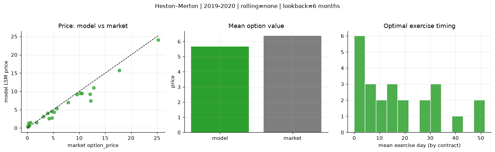
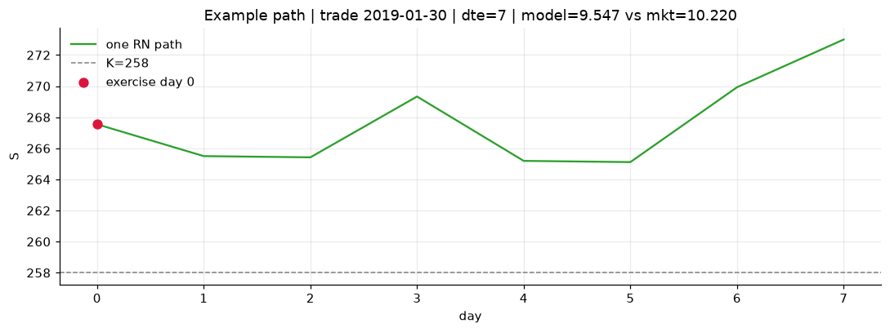
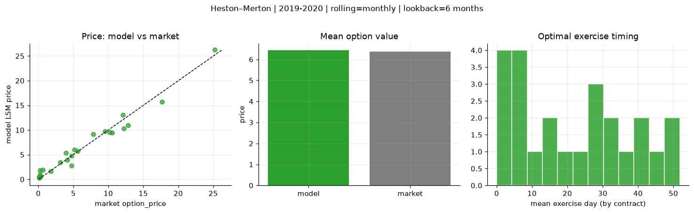
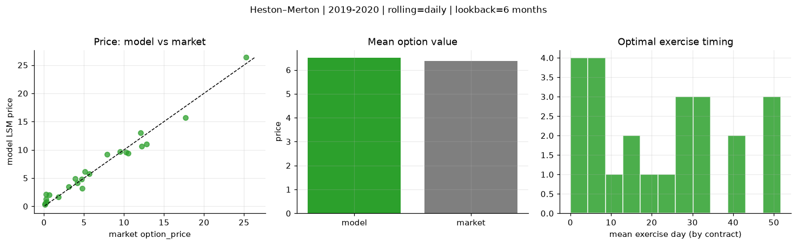
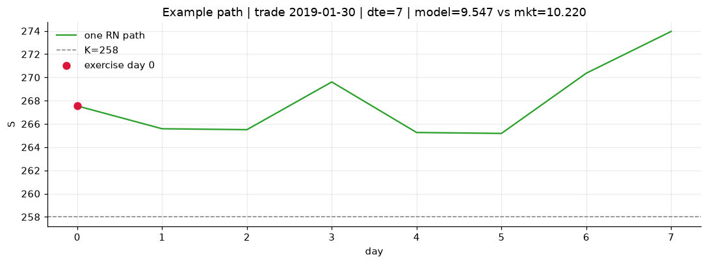

# Optimal stopping — Heston–Merton — 2019-2020

**Model:** Heston–Merton  
**Regime / period:** 2019-2020  
**Lookback:** 6 months (fixed)  
**Rolling modes:** none, monthly, daily  
**Pricing:** LSM American calls on SPY | n_paths=2000 | seed=42 | contracts=24

## Comparison (same contracts, same lookback)

| Rolling | RMSE | MAE | Bias (model−mkt) | Mean early-ex frac | Cal updates | Cal s | LSM s |
|---------|-----:|----:|-----------------:|-------------------:|------------:|------:|------:|
| `none` | 1.4705 | 1.0153 | -0.7097 | 0.473 | 1 | 0.0 | 0.1 |
| `monthly` | 1.0868 | 0.8753 | 0.0601 | 0.383 | 25 | 0.0 | 0.1 |
| `daily` | 1.0636 | 0.8733 | 0.1333 | 0.390 | 505 | 0.8 | 0.1 |

**Lowest RMSE (this study):** `daily` = 1.0636

## Rolling = `none`

- **RMSE:** 1.4705  
- **MAE:** 1.0153  
- **Bias:** -0.7097  
- **Mean early-exercise fraction:** 0.473  
- **Calibration updates (SPY):** 1

Contract errors (compact)

| date | K | dte | market | model | error | early_ex |
|------|--:|----:|-------:|------:|------:|---------:|
| 2019-01-30 | 258 | 7 | 10.220 | 9.547 | -0.673 | 1.000 |
| 2019-10-17 | 290 | 8 | 9.520 | 9.189 | -0.331 | 1.000 |
| 2019-06-17 | 280 | 25 | 10.520 | 9.425 | -1.095 | 1.000 |
| 2019-06-10 | 278 | 39 | 12.790 | 10.991 | -1.799 | 1.000 |
| 2019-09-19 | 277 | 57 | 25.220 | 24.096 | -1.124 | 1.000 |
| 2019-02-06 | 257 | 51 | 17.690 | 15.708 | -1.982 | 1.000 |
| 2019-02-06 | 271 | 9 | 3.100 | 3.179 | 0.079 | 0.415 |
| 2019-07-09 | 295.5 | 17 | 3.910 | 4.022 | 0.112 | 0.333 |
| 2019-10-03 | 294 | 32 | 4.150 | 2.623 | -1.527 | 0.220 |
| 2019-10-17 | 297 | 22 | 5.130 | 4.288 | -0.842 | 0.399 |
| 2019-08-06 | 281 | 45 | 12.210 | 7.391 | -4.819 | 0.638 |
| 2019-11-07 | 299 | 43 | 12.070 | 9.232 | -2.838 | 0.695 |
| 2019-10-03 | 303 | 13 | 0.080 | 0.516 | 0.436 | 0.060 |
| 2019-06-10 | 303 | 11 | 0.070 | 0.282 | 0.212 | 0.055 |
| 2019-06-03 | 283 | 32 | 1.760 | 1.512 | -0.248 | 0.128 |
| 2019-03-14 | 292 | 34 | 0.260 | 1.308 | 1.048 | 0.117 |
| 2019-08-27 | 315 | 52 | 0.140 | 0.396 | 0.256 | 0.038 |
| 2019-10-10 | 313 | 43 | 0.210 | 0.580 | 0.370 | 0.053 |
| 2019-02-06 | 268.5 | 7 | 4.720 | 4.502 | -0.218 | 0.540 |
| 2019-02-13 | 270 | 9 | 5.640 | 5.346 | -0.294 | 0.642 |
| 2019-01-15 | 275 | 31 | 0.290 | 0.624 | 0.334 | 0.066 |
| 2019-09-12 | 295 | 27 | 7.870 | 6.974 | -0.896 | 0.600 |
| 2019-03-21 | 294 | 32 | 0.640 | 1.458 | 0.818 | 0.139 |
| 2019-01-15 | 264 | 59 | 4.770 | 2.757 | -2.013 | 0.207 |

## Rolling = `monthly`

- **RMSE:** 1.0868  
- **MAE:** 0.8753  
- **Bias:** 0.0601  
- **Mean early-exercise fraction:** 0.383  
- **Calibration updates (SPY):** 25

Contract errors (compact)

| date | K | dte | market | model | error | early_ex |
|------|--:|----:|-------:|------:|------:|---------:|
| 2019-01-30 | 258 | 7 | 10.220 | 9.547 | -0.673 | 1.000 |
| 2019-10-17 | 290 | 8 | 9.520 | 9.737 | 0.217 | 0.477 |
| 2019-06-17 | 280 | 25 | 10.520 | 9.425 | -1.095 | 1.000 |
| 2019-06-10 | 278 | 39 | 12.790 | 10.991 | -1.799 | 1.000 |
| 2019-09-19 | 277 | 57 | 25.220 | 26.229 | 1.009 | 0.590 |
| 2019-02-06 | 257 | 51 | 17.690 | 15.708 | -1.982 | 1.000 |
| 2019-02-06 | 271 | 9 | 3.100 | 3.497 | 0.397 | 0.392 |
| 2019-07-09 | 295.5 | 17 | 3.910 | 5.359 | 1.449 | 0.258 |
| 2019-10-03 | 294 | 32 | 4.150 | 3.948 | -0.202 | 0.162 |
| 2019-10-17 | 297 | 22 | 5.130 | 5.993 | 0.863 | 0.304 |
| 2019-08-06 | 281 | 45 | 12.210 | 10.334 | -1.876 | 0.431 |
| 2019-11-07 | 299 | 43 | 12.070 | 13.063 | 0.993 | 0.393 |
| 2019-10-03 | 303 | 13 | 0.080 | 0.297 | 0.217 | 0.011 |
| 2019-06-10 | 303 | 11 | 0.070 | 0.502 | 0.432 | 0.034 |
| 2019-06-03 | 283 | 32 | 1.760 | 1.618 | -0.142 | 0.136 |
| 2019-03-14 | 292 | 34 | 0.260 | 1.857 | 1.597 | 0.135 |
| 2019-08-27 | 315 | 52 | 0.140 | 0.335 | 0.195 | 0.022 |
| 2019-10-10 | 313 | 43 | 0.210 | 0.947 | 0.737 | 0.030 |
| 2019-02-06 | 268.5 | 7 | 4.720 | 4.802 | 0.082 | 0.509 |
| 2019-02-13 | 270 | 9 | 5.640 | 5.756 | 0.116 | 0.621 |
| 2019-01-15 | 275 | 31 | 0.290 | 0.624 | 0.334 | 0.066 |
| 2019-09-12 | 295 | 27 | 7.870 | 9.126 | 1.256 | 0.274 |
| 2019-03-21 | 294 | 32 | 0.640 | 1.970 | 1.330 | 0.147 |
| 2019-01-15 | 264 | 59 | 4.770 | 2.757 | -2.013 | 0.207 |

## Rolling = `daily`

- **RMSE:** 1.0636  
- **MAE:** 0.8733  
- **Bias:** 0.1333  
- **Mean early-exercise fraction:** 0.390  
- **Calibration updates (SPY):** 505

Contract errors (compact)

| date | K | dte | market | model | error | early_ex |
|------|--:|----:|-------:|------:|------:|---------:|
| 2019-01-30 | 258 | 7 | 10.220 | 9.547 | -0.673 | 1.000 |
| 2019-10-17 | 290 | 8 | 9.520 | 9.686 | 0.166 | 0.675 |
| 2019-06-17 | 280 | 25 | 10.520 | 9.425 | -1.095 | 1.000 |
| 2019-06-10 | 278 | 39 | 12.790 | 10.991 | -1.799 | 1.000 |
| 2019-09-19 | 277 | 57 | 25.220 | 26.347 | 1.127 | 0.568 |
| 2019-02-06 | 257 | 51 | 17.690 | 15.708 | -1.982 | 1.000 |
| 2019-02-06 | 271 | 9 | 3.100 | 3.457 | 0.357 | 0.385 |
| 2019-07-09 | 295.5 | 17 | 3.910 | 4.937 | 1.027 | 0.006 |
| 2019-10-03 | 294 | 32 | 4.150 | 4.102 | -0.048 | 0.156 |
| 2019-10-17 | 297 | 22 | 5.130 | 6.137 | 1.007 | 0.323 |
| 2019-08-06 | 281 | 45 | 12.210 | 10.663 | -1.547 | 0.347 |
| 2019-11-07 | 299 | 43 | 12.070 | 13.048 | 0.978 | 0.540 |
| 2019-10-03 | 303 | 13 | 0.080 | 0.336 | 0.256 | 0.013 |
| 2019-06-10 | 303 | 11 | 0.070 | 0.371 | 0.301 | 0.036 |
| 2019-06-03 | 283 | 32 | 1.760 | 1.616 | -0.144 | 0.136 |
| 2019-03-14 | 292 | 34 | 0.260 | 2.110 | 1.850 | 0.183 |
| 2019-08-27 | 315 | 52 | 0.140 | 0.613 | 0.473 | 0.029 |
| 2019-10-10 | 313 | 43 | 0.210 | 1.281 | 1.071 | 0.060 |
| 2019-02-06 | 268.5 | 7 | 4.720 | 4.823 | 0.103 | 0.534 |
| 2019-02-13 | 270 | 9 | 5.640 | 5.764 | 0.124 | 0.615 |
| 2019-01-15 | 275 | 31 | 0.290 | 0.821 | 0.531 | 0.097 |
| 2019-09-12 | 295 | 27 | 7.870 | 9.170 | 1.300 | 0.238 |
| 2019-03-21 | 294 | 32 | 0.640 | 2.049 | 1.409 | 0.169 |
| 2019-01-15 | 264 | 59 | 4.770 | 3.179 | -1.591 | 0.262 |

