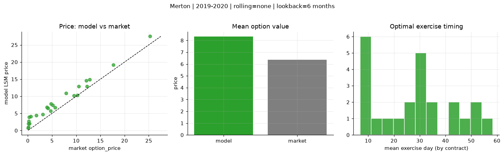
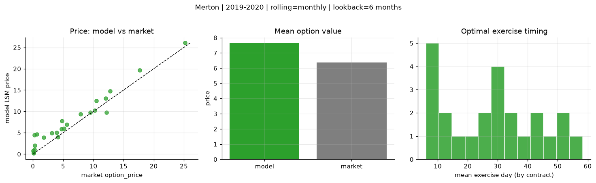
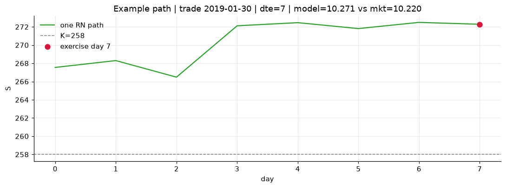
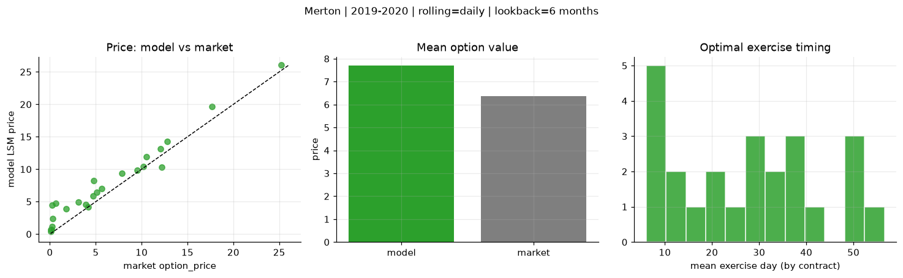
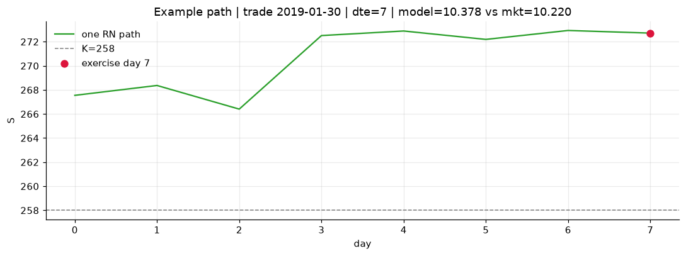

# Optimal stopping — Merton — 2019-2020

**Model:** Merton  
**Regime / period:** 2019-2020  
**Lookback:** 6 months (fixed)  
**Rolling modes:** none, monthly, daily  
**Pricing:** LSM American calls on SPY | n_paths=2000 | seed=42 | contracts=24

## Comparison (same contracts, same lookback)

| Rolling | RMSE | MAE | Bias (model−mkt) | Mean early-ex frac | Cal updates | Cal s | LSM s |
|---------|-----:|----:|-----------------:|-------------------:|------------:|------:|------:|
| `none` | 2.1733 | 1.9500 | 1.9500 | 0.190 | 1 | 0.0 | 0.1 |
| `monthly` | 1.8482 | 1.4788 | 1.2675 | 0.222 | 25 | 0.0 | 0.1 |
| `daily` | 1.8588 | 1.4838 | 1.3243 | 0.240 | 505 | 0.1 | 0.1 |

**Lowest RMSE (this study):** `monthly` = 1.8482

## Rolling = `none`

- **RMSE:** 2.1733  
- **MAE:** 1.9500  
- **Bias:** 1.9500  
- **Mean early-exercise fraction:** 0.190  
- **Calibration updates (SPY):** 1

Contract errors (compact)

| date | K | dte | market | model | error | early_ex |
|------|--:|----:|-------:|------:|------:|---------:|
| 2019-01-30 | 258 | 7 | 10.220 | 10.271 | 0.051 | 0.070 |
| 2019-10-17 | 290 | 8 | 9.520 | 10.154 | 0.634 | 0.187 |
| 2019-06-17 | 280 | 25 | 10.520 | 12.856 | 2.336 | 0.081 |
| 2019-06-10 | 278 | 39 | 12.790 | 14.912 | 2.122 | 0.409 |
| 2019-09-19 | 277 | 57 | 25.220 | 27.501 | 2.281 | 0.413 |
| 2019-02-06 | 257 | 51 | 17.690 | 19.219 | 1.529 | 0.541 |
| 2019-02-06 | 271 | 9 | 3.100 | 4.673 | 1.573 | 0.232 |
| 2019-07-09 | 295.5 | 17 | 3.910 | 6.820 | 2.910 | 0.321 |
| 2019-10-03 | 294 | 32 | 4.150 | 6.503 | 2.353 | 0.233 |
| 2019-10-17 | 297 | 22 | 5.130 | 7.387 | 2.257 | 0.282 |
| 2019-08-06 | 281 | 45 | 12.210 | 12.842 | 0.632 | 0.197 |
| 2019-11-07 | 299 | 43 | 12.070 | 14.584 | 2.514 | 0.354 |
| 2019-10-03 | 303 | 13 | 0.080 | 0.987 | 0.907 | 0.026 |
| 2019-06-10 | 303 | 11 | 0.070 | 0.726 | 0.656 | 0.048 |
| 2019-06-03 | 283 | 32 | 1.760 | 4.399 | 2.639 | 0.121 |
| 2019-03-14 | 292 | 34 | 0.260 | 3.952 | 3.692 | 0.158 |
| 2019-08-27 | 315 | 52 | 0.140 | 2.025 | 1.885 | 0.079 |
| 2019-10-10 | 313 | 43 | 0.210 | 2.699 | 2.489 | 0.029 |
| 2019-02-06 | 268.5 | 7 | 4.720 | 5.714 | 0.994 | 0.040 |
| 2019-02-13 | 270 | 9 | 5.640 | 6.723 | 1.083 | 0.312 |
| 2019-01-15 | 275 | 31 | 0.290 | 2.028 | 1.738 | 0.097 |
| 2019-09-12 | 295 | 27 | 7.870 | 10.885 | 3.015 | 0.004 |
| 2019-03-21 | 294 | 32 | 0.640 | 4.114 | 3.474 | 0.198 |
| 2019-01-15 | 264 | 59 | 4.770 | 7.807 | 3.037 | 0.136 |

## Rolling = `monthly`

- **RMSE:** 1.8482  
- **MAE:** 1.4788  
- **Bias:** 1.2675  
- **Mean early-exercise fraction:** 0.222  
- **Calibration updates (SPY):** 25

Contract errors (compact)

| date | K | dte | market | model | error | early_ex |
|------|--:|----:|-------:|------:|------:|---------:|
| 2019-01-30 | 258 | 7 | 10.220 | 10.271 | 0.051 | 0.070 |
| 2019-10-17 | 290 | 8 | 9.520 | 9.780 | 0.260 | 0.379 |
| 2019-06-17 | 280 | 25 | 10.520 | 12.462 | 1.942 | 0.269 |
| 2019-06-10 | 278 | 39 | 12.790 | 14.781 | 1.991 | 0.246 |
| 2019-09-19 | 277 | 57 | 25.220 | 26.056 | 0.836 | 0.875 |
| 2019-02-06 | 257 | 51 | 17.690 | 19.669 | 1.979 | 0.523 |
| 2019-02-06 | 271 | 9 | 3.100 | 4.943 | 1.843 | 0.229 |
| 2019-07-09 | 295.5 | 17 | 3.910 | 5.043 | 1.133 | 0.146 |
| 2019-10-03 | 294 | 32 | 4.150 | 4.034 | -0.116 | 0.174 |
| 2019-10-17 | 297 | 22 | 5.130 | 5.946 | 0.816 | 0.144 |
| 2019-08-06 | 281 | 45 | 12.210 | 9.791 | -2.419 | 0.299 |
| 2019-11-07 | 299 | 43 | 12.070 | 13.090 | 1.020 | 0.504 |
| 2019-10-03 | 303 | 13 | 0.080 | 0.335 | 0.255 | 0.004 |
| 2019-06-10 | 303 | 11 | 0.070 | 0.800 | 0.730 | 0.035 |
| 2019-06-03 | 283 | 32 | 1.760 | 3.928 | 2.168 | 0.062 |
| 2019-03-14 | 292 | 34 | 0.260 | 4.441 | 4.181 | 0.162 |
| 2019-08-27 | 315 | 52 | 0.140 | 0.259 | 0.119 | 0.015 |
| 2019-10-10 | 313 | 43 | 0.210 | 1.063 | 0.853 | 0.049 |
| 2019-02-06 | 268.5 | 7 | 4.720 | 5.884 | 1.164 | 0.245 |
| 2019-02-13 | 270 | 9 | 5.640 | 6.946 | 1.306 | 0.314 |
| 2019-01-15 | 275 | 31 | 0.290 | 2.028 | 1.738 | 0.097 |
| 2019-09-12 | 295 | 27 | 7.870 | 9.379 | 1.509 | 0.255 |
| 2019-03-21 | 294 | 32 | 0.640 | 4.667 | 4.027 | 0.096 |
| 2019-01-15 | 264 | 59 | 4.770 | 7.807 | 3.037 | 0.136 |

## Rolling = `daily`

- **RMSE:** 1.8588  
- **MAE:** 1.4838  
- **Bias:** 1.3243  
- **Mean early-exercise fraction:** 0.240  
- **Calibration updates (SPY):** 505

Contract errors (compact)

| date | K | dte | market | model | error | early_ex |
|------|--:|----:|-------:|------:|------:|---------:|
| 2019-01-30 | 258 | 7 | 10.220 | 10.378 | 0.158 | 0.079 |
| 2019-10-17 | 290 | 8 | 9.520 | 9.850 | 0.330 | 0.444 |
| 2019-06-17 | 280 | 25 | 10.520 | 11.943 | 1.423 | 0.415 |
| 2019-06-10 | 278 | 39 | 12.790 | 14.298 | 1.508 | 0.419 |
| 2019-09-19 | 277 | 57 | 25.220 | 26.032 | 0.812 | 0.848 |
| 2019-02-06 | 257 | 51 | 17.690 | 19.685 | 1.995 | 0.524 |
| 2019-02-06 | 271 | 9 | 3.100 | 4.944 | 1.844 | 0.229 |
| 2019-07-09 | 295.5 | 17 | 3.910 | 4.555 | 0.645 | 0.260 |
| 2019-10-03 | 294 | 32 | 4.150 | 4.204 | 0.054 | 0.184 |
| 2019-10-17 | 297 | 22 | 5.130 | 6.479 | 1.349 | 0.000 |
| 2019-08-06 | 281 | 45 | 12.210 | 10.296 | -1.914 | 0.403 |
| 2019-11-07 | 299 | 43 | 12.070 | 13.110 | 1.040 | 0.418 |
| 2019-10-03 | 303 | 13 | 0.080 | 0.371 | 0.291 | 0.004 |
| 2019-06-10 | 303 | 11 | 0.070 | 0.673 | 0.603 | 0.035 |
| 2019-06-03 | 283 | 32 | 1.760 | 3.907 | 2.147 | 0.064 |
| 2019-03-14 | 292 | 34 | 0.260 | 4.506 | 4.246 | 0.163 |
| 2019-08-27 | 315 | 52 | 0.140 | 0.718 | 0.578 | 0.046 |
| 2019-10-10 | 313 | 43 | 0.210 | 1.146 | 0.936 | 0.063 |
| 2019-02-06 | 268.5 | 7 | 4.720 | 5.886 | 1.166 | 0.243 |
| 2019-02-13 | 270 | 9 | 5.640 | 6.989 | 1.349 | 0.305 |
| 2019-01-15 | 275 | 31 | 0.290 | 2.427 | 2.137 | 0.065 |
| 2019-09-12 | 295 | 27 | 7.870 | 9.330 | 1.460 | 0.267 |
| 2019-03-21 | 294 | 32 | 0.640 | 4.789 | 4.149 | 0.137 |
| 2019-01-15 | 264 | 59 | 4.770 | 8.246 | 3.476 | 0.146 |

