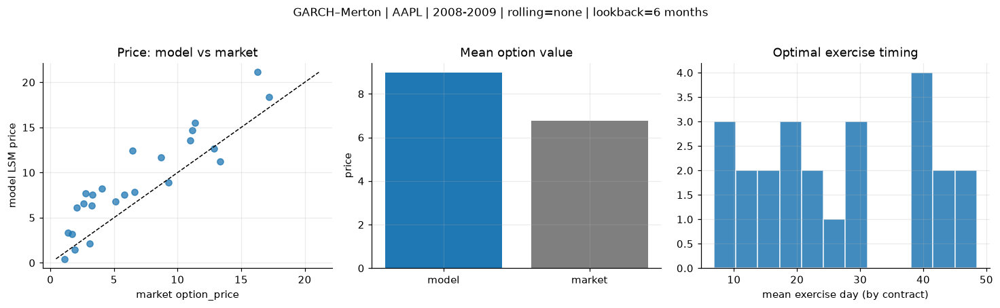
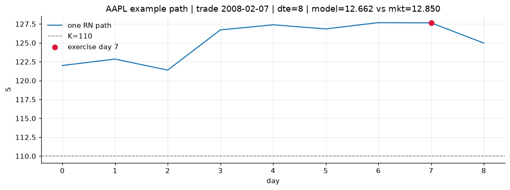
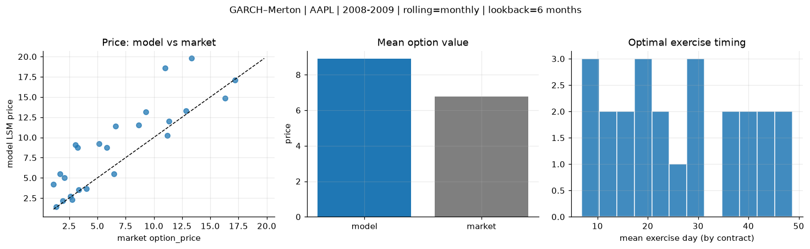
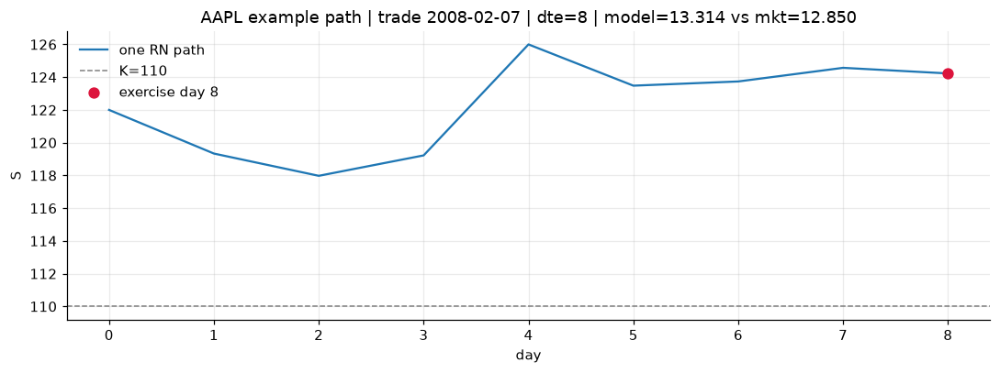
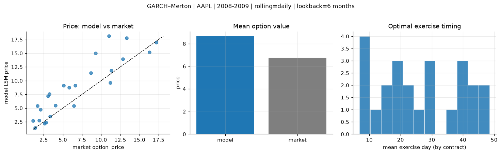
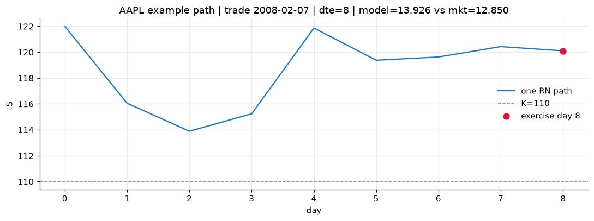

# Optimal stopping — GARCH–Merton — 2008-2009 — AAPL

**Model:** GARCH–Merton  
**Underlying:** AAPL  
**Regime / period:** 2008-2009  
**Lookback:** 6 months (fixed)  
**Rolling modes:** none, monthly, daily  
**Pricing:** LSM American calls on AAPL | n_paths=2000 | seed=42 | contracts=24

## Comparison (same contracts, same lookback)

| Rolling | RMSE | MAE | Bias (model−mkt) | Mean early-ex frac | Cal updates | Cal s | LSM s |
|---------|-----:|----:|-----------------:|-------------------:|------------:|------:|------:|
| `none` | 3.0728 | 2.6049 | 2.2066 | 0.161 | 1 | 0.0 | 0.1 |
| `monthly` | 3.3749 | 2.4869 | 2.1342 | 0.184 | 25 | 1.0 | 0.1 |
| `daily` | 2.9586 | 2.2743 | 1.8845 | 0.175 | 505 | 18.4 | 0.1 |

**Lowest RMSE (this study):** `daily` = 2.9586

## Rolling = `none`

- **RMSE:** 3.0728  
- **MAE:** 2.6049  
- **Bias:** 2.2066  
- **Mean early-exercise fraction:** 0.161  
- **Calibration updates (AAPL):** 1

Contract errors (compact)

| date | K | dte | market | model | error | early_ex |
|------|--:|----:|-------:|------:|------:|---------:|
| 2008-02-07 | 110 | 8 | 12.850 | 12.662 | -0.188 | 0.666 |
| 2009-09-04 | 150 | 14 | 17.175 | 18.342 | 1.167 | 0.229 |
| 2008-11-18 | 80 | 31 | 13.325 | 11.197 | -2.128 | 0.151 |
| 2009-12-22 | 190 | 24 | 11.350 | 15.530 | 4.180 | 0.257 |
| 2009-07-10 | 130 | 42 | 11.175 | 14.703 | 3.528 | 0.242 |
| 2008-02-29 | 125 | 49 | 11.000 | 13.576 | 2.576 | 0.060 |
| 2008-02-29 | 130 | 20 | 5.125 | 6.766 | 1.641 | 0.127 |
| 2009-01-09 | 95 | 7 | 1.920 | 1.465 | -0.455 | 0.118 |
| 2009-07-31 | 165 | 21 | 3.325 | 7.534 | 4.209 | 0.192 |
| 2009-08-21 | 170 | 28 | 4.025 | 8.239 | 4.214 | 0.175 |
| 2009-01-09 | 90 | 42 | 9.275 | 8.879 | -0.396 | 0.148 |
| 2009-08-07 | 165 | 42 | 6.450 | 12.415 | 5.965 | 0.154 |
| 2009-09-04 | 175 | 14 | 1.370 | 3.351 | 1.981 | 0.073 |
| 2008-11-04 | 115 | 17 | 3.075 | 2.136 | -0.939 | 0.050 |
| 2008-08-21 | 190 | 29 | 2.100 | 6.136 | 4.036 | 0.124 |
| 2008-05-20 | 200 | 31 | 3.225 | 6.342 | 3.117 | 0.070 |
| 2009-05-06 | 145 | 44 | 2.595 | 6.535 | 3.940 | 0.085 |
| 2009-07-31 | 175 | 49 | 2.780 | 7.697 | 4.917 | 0.256 |
| 2008-07-02 | 175 | 16 | 5.825 | 7.546 | 1.721 | 0.011 |
| 2008-12-10 | 110 | 9 | 1.115 | 0.441 | -0.674 | 0.008 |
| 2009-10-05 | 175 | 46 | 16.300 | 21.115 | 4.815 | 0.231 |
| 2009-03-24 | 105 | 24 | 6.625 | 7.829 | 1.204 | 0.021 |
| 2008-02-29 | 140 | 20 | 1.695 | 3.184 | 1.489 | 0.067 |
| 2008-08-07 | 165 | 43 | 8.675 | 11.714 | 3.039 | 0.341 |

## Rolling = `monthly`

- **RMSE:** 3.3749  
- **MAE:** 2.4869  
- **Bias:** 2.1342  
- **Mean early-exercise fraction:** 0.184  
- **Calibration updates (AAPL):** 25

Contract errors (compact)

| date | K | dte | market | model | error | early_ex |
|------|--:|----:|-------:|------:|------:|---------:|
| 2008-02-07 | 110 | 8 | 12.850 | 13.314 | 0.464 | 0.292 |
| 2009-09-04 | 150 | 14 | 17.175 | 17.086 | -0.089 | 0.232 |
| 2008-11-18 | 80 | 31 | 13.325 | 19.779 | 6.454 | 0.402 |
| 2009-12-22 | 190 | 24 | 11.350 | 11.990 | 0.640 | 0.273 |
| 2009-07-10 | 130 | 42 | 11.175 | 10.277 | -0.898 | 0.307 |
| 2008-02-29 | 125 | 49 | 11.000 | 18.578 | 7.578 | 0.037 |
| 2008-02-29 | 130 | 20 | 5.125 | 9.226 | 4.101 | 0.166 |
| 2009-01-09 | 95 | 7 | 1.920 | 2.143 | 0.223 | 0.103 |
| 2009-07-31 | 165 | 21 | 3.325 | 3.501 | 0.176 | 0.221 |
| 2009-08-21 | 170 | 28 | 4.025 | 3.631 | -0.394 | 0.243 |
| 2009-01-09 | 90 | 42 | 9.275 | 13.147 | 3.872 | 0.268 |
| 2009-08-07 | 165 | 42 | 6.450 | 5.499 | -0.951 | 0.360 |
| 2009-09-04 | 175 | 14 | 1.370 | 1.417 | 0.047 | 0.092 |
| 2008-11-04 | 115 | 17 | 3.075 | 9.061 | 5.986 | 0.072 |
| 2008-08-21 | 190 | 29 | 2.100 | 4.987 | 2.887 | 0.105 |
| 2008-05-20 | 200 | 31 | 3.225 | 8.726 | 5.501 | 0.146 |
| 2009-05-06 | 145 | 44 | 2.595 | 2.731 | 0.136 | 0.124 |
| 2009-07-31 | 175 | 49 | 2.780 | 2.325 | -0.455 | 0.027 |
| 2008-07-02 | 175 | 16 | 5.825 | 8.724 | 2.899 | 0.151 |
| 2008-12-10 | 110 | 9 | 1.115 | 4.178 | 3.063 | 0.068 |
| 2009-10-05 | 175 | 46 | 16.300 | 14.857 | -1.443 | 0.265 |
| 2009-03-24 | 105 | 24 | 6.625 | 11.386 | 4.761 | 0.152 |
| 2008-02-29 | 140 | 20 | 1.695 | 5.524 | 3.829 | 0.044 |
| 2008-08-07 | 165 | 43 | 8.675 | 11.511 | 2.836 | 0.264 |

## Rolling = `daily`

- **RMSE:** 2.9586  
- **MAE:** 2.2743  
- **Bias:** 1.8845  
- **Mean early-exercise fraction:** 0.175  
- **Calibration updates (AAPL):** 505

Contract errors (compact)

| date | K | dte | market | model | error | early_ex |
|------|--:|----:|-------:|------:|------:|---------:|
| 2008-02-07 | 110 | 8 | 12.850 | 13.926 | 1.076 | 0.271 |
| 2009-09-04 | 150 | 14 | 17.175 | 17.004 | -0.171 | 0.572 |
| 2008-11-18 | 80 | 31 | 13.325 | 17.811 | 4.486 | 0.323 |
| 2009-12-22 | 190 | 24 | 11.350 | 11.828 | 0.478 | 0.281 |
| 2009-07-10 | 130 | 42 | 11.175 | 9.608 | -1.567 | 0.324 |
| 2008-02-29 | 125 | 49 | 11.000 | 18.122 | 7.122 | 0.067 |
| 2008-02-29 | 130 | 20 | 5.125 | 9.114 | 3.989 | 0.169 |
| 2009-01-09 | 95 | 7 | 1.920 | 2.777 | 0.857 | 0.117 |
| 2009-07-31 | 165 | 21 | 3.325 | 3.503 | 0.178 | 0.225 |
| 2009-08-21 | 170 | 28 | 4.025 | 5.493 | 1.468 | 0.180 |
| 2009-01-09 | 90 | 42 | 9.275 | 14.999 | 5.724 | 0.258 |
| 2009-08-07 | 165 | 42 | 6.450 | 5.423 | -1.027 | 0.149 |
| 2009-09-04 | 175 | 14 | 1.370 | 1.367 | -0.003 | 0.041 |
| 2008-11-04 | 115 | 17 | 3.075 | 7.196 | 4.121 | 0.061 |
| 2008-08-21 | 190 | 29 | 2.100 | 4.736 | 2.636 | 0.102 |
| 2008-05-20 | 200 | 31 | 3.225 | 7.566 | 4.341 | 0.074 |
| 2009-05-06 | 145 | 44 | 2.595 | 2.191 | -0.404 | 0.114 |
| 2009-07-31 | 175 | 49 | 2.780 | 2.366 | -0.414 | 0.017 |
| 2008-07-02 | 175 | 16 | 5.825 | 8.725 | 2.900 | 0.141 |
| 2008-12-10 | 110 | 9 | 1.115 | 2.713 | 1.598 | 0.115 |
| 2009-10-05 | 175 | 46 | 16.300 | 15.209 | -1.091 | 0.215 |
| 2009-03-24 | 105 | 24 | 6.625 | 9.094 | 2.469 | 0.069 |
| 2008-02-29 | 140 | 20 | 1.695 | 5.405 | 3.710 | 0.045 |
| 2008-08-07 | 165 | 43 | 8.675 | 11.427 | 2.752 | 0.264 |

