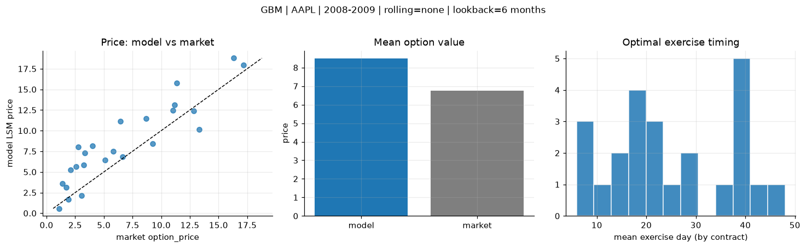
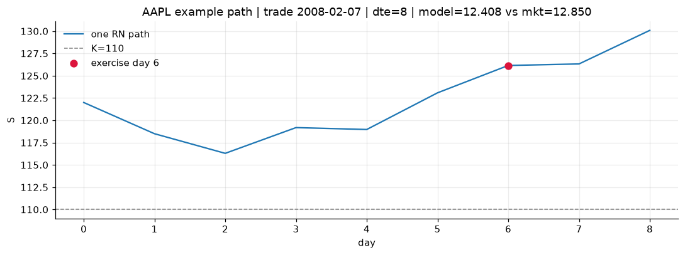
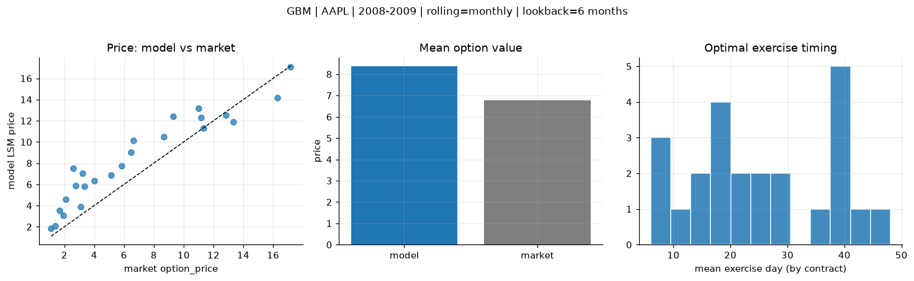
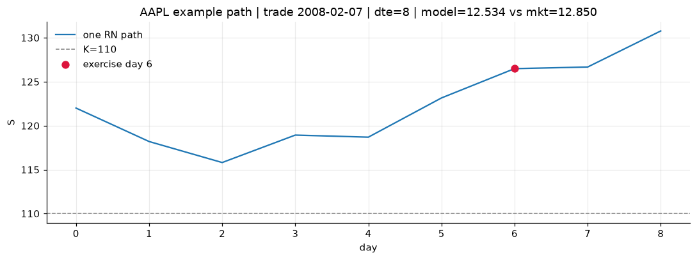
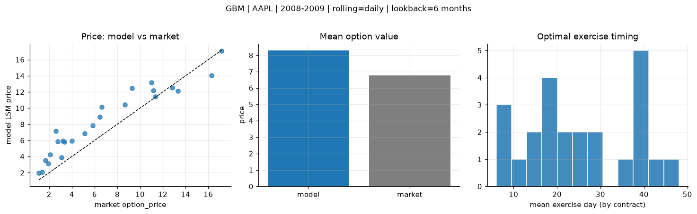

# Optimal stopping — GBM — 2008-2009 — AAPL

**Model:** GBM  
**Underlying:** AAPL  
**Regime / period:** 2008-2009  
**Lookback:** 6 months (fixed)  
**Rolling modes:** none, monthly, daily  
**Pricing:** LSM American calls on AAPL | n_paths=2000 | seed=42 | contracts=24

## Comparison (same contracts, same lookback)

| Rolling | RMSE | MAE | Bias (model−mkt) | Mean early-ex frac | Cal updates | Cal s | LSM s |
|---------|-----:|----:|-----------------:|-------------------:|------------:|------:|------:|
| `none` | 2.6818 | 2.2452 | 1.7229 | 0.246 | 1 | 0.0 | 0.1 |
| `monthly` | 2.2774 | 1.9362 | 1.6032 | 0.250 | 25 | 0.0 | 0.1 |
| `daily` | 2.1442 | 1.8399 | 1.5191 | 0.247 | 505 | 0.1 | 0.1 |

**Lowest RMSE (this study):** `daily` = 2.1442

## Rolling = `none`

- **RMSE:** 2.6818  
- **MAE:** 2.2452  
- **Bias:** 1.7229  
- **Mean early-exercise fraction:** 0.246  
- **Calibration updates (AAPL):** 1

Contract errors (compact)

| date | K | dte | market | model | error | early_ex |
|------|--:|----:|-------:|------:|------:|---------:|
| 2008-02-07 | 110 | 8 | 12.850 | 12.408 | -0.442 | 0.584 |
| 2009-09-04 | 150 | 14 | 17.175 | 17.962 | 0.787 | 0.545 |
| 2008-11-18 | 80 | 31 | 13.325 | 10.130 | -3.195 | 0.462 |
| 2009-12-22 | 190 | 24 | 11.350 | 15.798 | 4.448 | 0.248 |
| 2009-07-10 | 130 | 42 | 11.175 | 13.100 | 1.925 | 0.311 |
| 2008-02-29 | 125 | 49 | 11.000 | 12.461 | 1.461 | 0.365 |
| 2008-02-29 | 130 | 20 | 5.125 | 6.449 | 1.324 | 0.187 |
| 2009-01-09 | 95 | 7 | 1.920 | 1.644 | -0.276 | 0.167 |
| 2009-07-31 | 165 | 21 | 3.325 | 7.268 | 3.943 | 0.263 |
| 2009-08-21 | 170 | 28 | 4.025 | 8.154 | 4.129 | 0.272 |
| 2009-01-09 | 90 | 42 | 9.275 | 8.413 | -0.862 | 0.348 |
| 2009-08-07 | 165 | 42 | 6.450 | 11.147 | 4.697 | 0.295 |
| 2009-09-04 | 175 | 14 | 1.370 | 3.610 | 2.240 | 0.021 |
| 2008-11-04 | 115 | 17 | 3.075 | 2.117 | -0.958 | 0.067 |
| 2008-08-21 | 190 | 29 | 2.100 | 5.262 | 3.162 | 0.115 |
| 2008-05-20 | 200 | 31 | 3.225 | 5.814 | 2.589 | 0.108 |
| 2009-05-06 | 145 | 44 | 2.595 | 5.634 | 3.039 | 0.177 |
| 2009-07-31 | 175 | 49 | 2.780 | 8.038 | 5.258 | 0.043 |
| 2008-07-02 | 175 | 16 | 5.825 | 7.524 | 1.699 | 0.213 |
| 2008-12-10 | 110 | 9 | 1.115 | 0.579 | -0.536 | 0.043 |
| 2009-10-05 | 175 | 46 | 16.300 | 18.782 | 2.482 | 0.332 |
| 2009-03-24 | 105 | 24 | 6.625 | 6.836 | 0.211 | 0.352 |
| 2008-02-29 | 140 | 20 | 1.695 | 3.129 | 1.434 | 0.108 |
| 2008-08-07 | 165 | 43 | 8.675 | 11.464 | 2.789 | 0.287 |

## Rolling = `monthly`

- **RMSE:** 2.2774  
- **MAE:** 1.9362  
- **Bias:** 1.6032  
- **Mean early-exercise fraction:** 0.250  
- **Calibration updates (AAPL):** 25

Contract errors (compact)

| date | K | dte | market | model | error | early_ex |
|------|--:|----:|-------:|------:|------:|---------:|
| 2008-02-07 | 110 | 8 | 12.850 | 12.534 | -0.316 | 0.550 |
| 2009-09-04 | 150 | 14 | 17.175 | 17.105 | -0.070 | 0.579 |
| 2008-11-18 | 80 | 31 | 13.325 | 11.882 | -1.443 | 0.369 |
| 2009-12-22 | 190 | 24 | 11.350 | 11.320 | -0.030 | 0.304 |
| 2009-07-10 | 130 | 42 | 11.175 | 12.303 | 1.128 | 0.332 |
| 2008-02-29 | 125 | 49 | 11.000 | 13.193 | 2.193 | 0.357 |
| 2008-02-29 | 130 | 20 | 5.125 | 6.850 | 1.725 | 0.194 |
| 2009-01-09 | 95 | 7 | 1.920 | 3.094 | 1.174 | 0.203 |
| 2009-07-31 | 165 | 21 | 3.325 | 5.799 | 2.474 | 0.264 |
| 2009-08-21 | 170 | 28 | 4.025 | 6.359 | 2.334 | 0.271 |
| 2009-01-09 | 90 | 42 | 9.275 | 12.422 | 3.147 | 0.310 |
| 2009-08-07 | 165 | 42 | 6.450 | 9.027 | 2.577 | 0.298 |
| 2009-09-04 | 175 | 14 | 1.370 | 2.094 | 0.724 | 0.019 |
| 2008-11-04 | 115 | 17 | 3.075 | 3.908 | 0.833 | 0.095 |
| 2008-08-21 | 190 | 29 | 2.100 | 4.564 | 2.464 | 0.111 |
| 2008-05-20 | 200 | 31 | 3.225 | 7.049 | 3.824 | 0.112 |
| 2009-05-06 | 145 | 44 | 2.595 | 7.536 | 4.941 | 0.197 |
| 2009-07-31 | 175 | 49 | 2.780 | 5.887 | 3.107 | 0.043 |
| 2008-07-02 | 175 | 16 | 5.825 | 7.736 | 1.911 | 0.215 |
| 2008-12-10 | 110 | 9 | 1.115 | 1.864 | 0.749 | 0.071 |
| 2009-10-05 | 175 | 46 | 16.300 | 14.164 | -2.136 | 0.402 |
| 2009-03-24 | 105 | 24 | 6.625 | 10.127 | 3.502 | 0.298 |
| 2008-02-29 | 140 | 20 | 1.695 | 3.533 | 1.838 | 0.107 |
| 2008-08-07 | 165 | 43 | 8.675 | 10.505 | 1.830 | 0.290 |

## Rolling = `daily`

- **RMSE:** 2.1442  
- **MAE:** 1.8399  
- **Bias:** 1.5191  
- **Mean early-exercise fraction:** 0.247  
- **Calibration updates (AAPL):** 505

Contract errors (compact)

| date | K | dte | market | model | error | early_ex |
|------|--:|----:|-------:|------:|------:|---------:|
| 2008-02-07 | 110 | 8 | 12.850 | 12.537 | -0.313 | 0.548 |
| 2009-09-04 | 150 | 14 | 17.175 | 17.077 | -0.098 | 0.576 |
| 2008-11-18 | 80 | 31 | 13.325 | 12.132 | -1.193 | 0.357 |
| 2009-12-22 | 190 | 24 | 11.350 | 11.420 | 0.070 | 0.303 |
| 2009-07-10 | 130 | 42 | 11.175 | 12.209 | 1.034 | 0.319 |
| 2008-02-29 | 125 | 49 | 11.000 | 13.193 | 2.193 | 0.357 |
| 2008-02-29 | 130 | 20 | 5.125 | 6.850 | 1.725 | 0.194 |
| 2009-01-09 | 95 | 7 | 1.920 | 3.110 | 1.190 | 0.202 |
| 2009-07-31 | 165 | 21 | 3.325 | 5.799 | 2.474 | 0.264 |
| 2009-08-21 | 170 | 28 | 4.025 | 5.948 | 1.923 | 0.269 |
| 2009-01-09 | 90 | 42 | 9.275 | 12.455 | 3.180 | 0.308 |
| 2009-08-07 | 165 | 42 | 6.450 | 8.923 | 2.473 | 0.301 |
| 2009-09-04 | 175 | 14 | 1.370 | 2.067 | 0.697 | 0.019 |
| 2008-11-04 | 115 | 17 | 3.075 | 3.903 | 0.828 | 0.096 |
| 2008-08-21 | 190 | 29 | 2.100 | 4.221 | 2.121 | 0.111 |
| 2008-05-20 | 200 | 31 | 3.225 | 5.922 | 2.697 | 0.108 |
| 2009-05-06 | 145 | 44 | 2.595 | 7.182 | 4.587 | 0.188 |
| 2009-07-31 | 175 | 49 | 2.780 | 5.887 | 3.107 | 0.043 |
| 2008-07-02 | 175 | 16 | 5.825 | 7.863 | 2.038 | 0.216 |
| 2008-12-10 | 110 | 9 | 1.115 | 1.945 | 0.830 | 0.069 |
| 2009-10-05 | 175 | 46 | 16.300 | 14.054 | -2.246 | 0.403 |
| 2009-03-24 | 105 | 24 | 6.625 | 10.149 | 3.524 | 0.283 |
| 2008-02-29 | 140 | 20 | 1.695 | 3.533 | 1.838 | 0.107 |
| 2008-08-07 | 165 | 43 | 8.675 | 10.456 | 1.781 | 0.288 |

