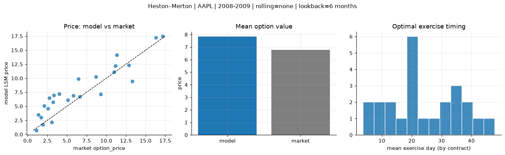
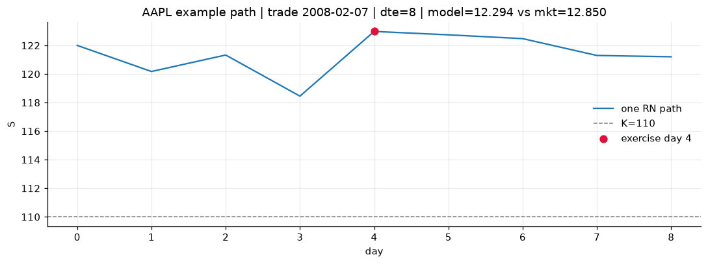
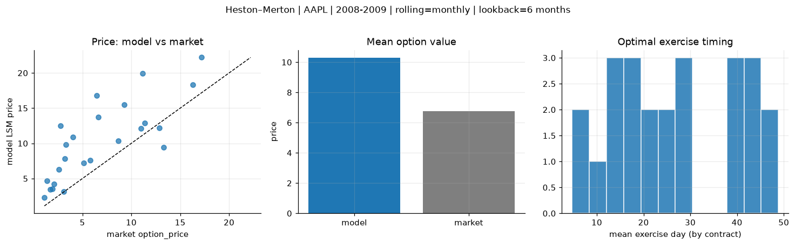
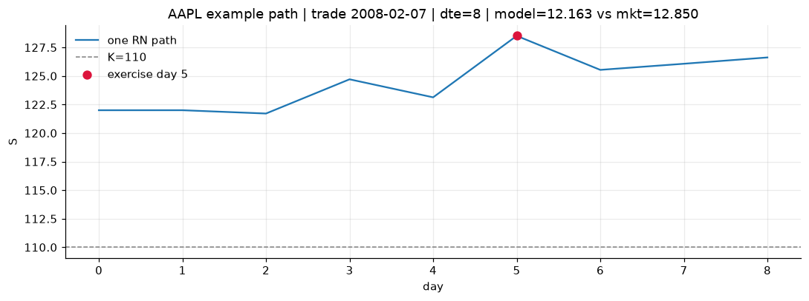
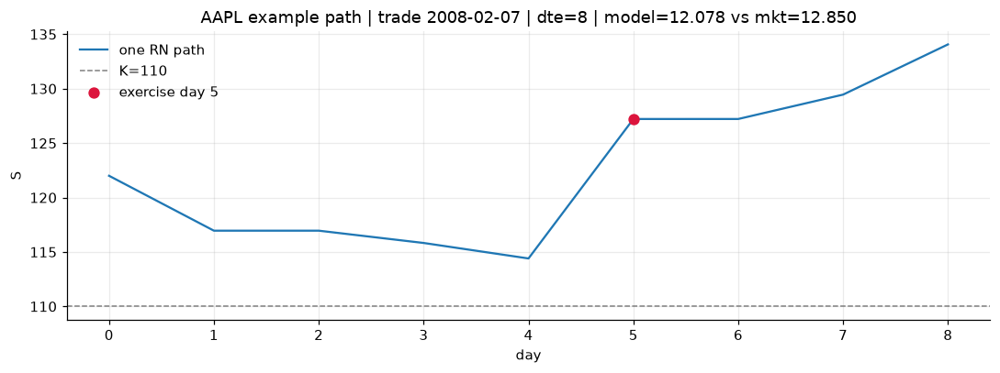

# Optimal stopping — Heston–Merton — 2008-2009 — AAPL

**Model:** Heston–Merton  
**Underlying:** AAPL  
**Regime / period:** 2008-2009  
**Lookback:** 6 months (fixed)  
**Rolling modes:** none, monthly, daily  
**Pricing:** LSM American calls on AAPL | n_paths=2000 | seed=42 | contracts=24

## Comparison (same contracts, same lookback)

| Rolling | RMSE | MAE | Bias (model−mkt) | Mean early-ex frac | Cal updates | Cal s | LSM s |
|---------|-----:|----:|-----------------:|-------------------:|------------:|------:|------:|
| `none` | 2.1383 | 1.7406 | 1.0709 | 0.309 | 1 | 0.0 | 0.1 |
| `monthly` | 4.8871 | 3.9083 | 3.5237 | 0.159 | 25 | 0.0 | 0.1 |
| `daily` | 4.9126 | 3.7769 | 3.4199 | 0.166 | 505 | 0.9 | 0.1 |

**Lowest RMSE (this study):** `none` = 2.1383

## Rolling = `none`

- **RMSE:** 2.1383  
- **MAE:** 1.7406  
- **Bias:** 1.0709  
- **Mean early-exercise fraction:** 0.309  
- **Calibration updates (AAPL):** 1

Contract errors (compact)

| date | K | dte | market | model | error | early_ex |
|------|--:|----:|-------:|------:|------:|---------:|
| 2008-02-07 | 110 | 8 | 12.850 | 12.294 | -0.556 | 0.773 |
| 2009-09-04 | 150 | 14 | 17.175 | 17.463 | 0.288 | 0.625 |
| 2008-11-18 | 80 | 31 | 13.325 | 9.433 | -3.892 | 0.579 |
| 2009-12-22 | 190 | 24 | 11.350 | 14.117 | 2.767 | 0.394 |
| 2009-07-10 | 130 | 42 | 11.175 | 12.196 | 1.021 | 0.404 |
| 2008-02-29 | 125 | 49 | 11.000 | 11.092 | 0.092 | 0.522 |
| 2008-02-29 | 130 | 20 | 5.125 | 6.097 | 0.972 | 0.195 |
| 2009-01-09 | 95 | 7 | 1.920 | 1.746 | -0.174 | 0.130 |
| 2009-07-31 | 165 | 21 | 3.325 | 6.947 | 3.622 | 0.165 |
| 2009-08-21 | 170 | 28 | 4.025 | 7.235 | 3.210 | 0.382 |
| 2009-01-09 | 90 | 42 | 9.275 | 7.142 | -2.133 | 0.402 |
| 2009-08-07 | 165 | 42 | 6.450 | 9.912 | 3.462 | 0.338 |
| 2009-09-04 | 175 | 14 | 1.370 | 3.481 | 2.111 | 0.161 |
| 2008-11-04 | 115 | 17 | 3.075 | 2.182 | -0.893 | 0.129 |
| 2008-08-21 | 190 | 29 | 2.100 | 5.072 | 2.972 | 0.218 |
| 2008-05-20 | 200 | 31 | 3.225 | 5.749 | 2.524 | 0.138 |
| 2009-05-06 | 145 | 44 | 2.595 | 4.621 | 2.026 | 0.124 |
| 2009-07-31 | 175 | 49 | 2.780 | 6.467 | 3.687 | 0.159 |
| 2008-07-02 | 175 | 16 | 5.825 | 6.902 | 1.077 | 0.241 |
| 2008-12-10 | 110 | 9 | 1.115 | 0.727 | -0.388 | 0.033 |
| 2009-10-05 | 175 | 46 | 16.300 | 17.238 | 0.938 | 0.398 |
| 2009-03-24 | 105 | 24 | 6.625 | 6.705 | 0.080 | 0.332 |
| 2008-02-29 | 140 | 20 | 1.695 | 3.001 | 1.306 | 0.158 |
| 2008-08-07 | 165 | 43 | 8.675 | 10.261 | 1.586 | 0.423 |

## Rolling = `monthly`

- **RMSE:** 4.8871  
- **MAE:** 3.9083  
- **Bias:** 3.5237  
- **Mean early-exercise fraction:** 0.159  
- **Calibration updates (AAPL):** 25

Contract errors (compact)

| date | K | dte | market | model | error | early_ex |
|------|--:|----:|-------:|------:|------:|---------:|
| 2008-02-07 | 110 | 8 | 12.850 | 12.163 | -0.687 | 0.735 |
| 2009-09-04 | 150 | 14 | 17.175 | 22.201 | 5.026 | 0.000 |
| 2008-11-18 | 80 | 31 | 13.325 | 9.397 | -3.928 | 0.600 |
| 2009-12-22 | 190 | 24 | 11.350 | 12.867 | 1.517 | 0.130 |
| 2009-07-10 | 130 | 42 | 11.175 | 19.920 | 8.745 | 0.002 |
| 2008-02-29 | 125 | 49 | 11.000 | 12.122 | 1.122 | 0.355 |
| 2008-02-29 | 130 | 20 | 5.125 | 7.211 | 2.086 | 0.238 |
| 2009-01-09 | 95 | 7 | 1.920 | 3.567 | 1.647 | 0.101 |
| 2009-07-31 | 165 | 21 | 3.325 | 9.793 | 6.468 | 0.138 |
| 2009-08-21 | 170 | 28 | 4.025 | 10.882 | 6.857 | 0.000 |
| 2009-01-09 | 90 | 42 | 9.275 | 15.528 | 6.253 | 0.141 |
| 2009-08-07 | 165 | 42 | 6.450 | 16.803 | 10.353 | 0.003 |
| 2009-09-04 | 175 | 14 | 1.370 | 4.665 | 3.295 | 0.011 |
| 2008-11-04 | 115 | 17 | 3.075 | 3.165 | 0.090 | 0.109 |
| 2008-08-21 | 190 | 29 | 2.100 | 4.240 | 2.140 | 0.113 |
| 2008-05-20 | 200 | 31 | 3.225 | 7.842 | 4.617 | 0.136 |
| 2009-05-06 | 145 | 44 | 2.595 | 6.269 | 3.674 | 0.194 |
| 2009-07-31 | 175 | 49 | 2.780 | 12.514 | 9.734 | 0.016 |
| 2008-07-02 | 175 | 16 | 5.825 | 7.622 | 1.797 | 0.204 |
| 2008-12-10 | 110 | 9 | 1.115 | 2.292 | 1.177 | 0.013 |
| 2009-10-05 | 175 | 46 | 16.300 | 18.362 | 2.062 | 0.128 |
| 2009-03-24 | 105 | 24 | 6.625 | 13.695 | 7.070 | 0.043 |
| 2008-02-29 | 140 | 20 | 1.695 | 3.433 | 1.738 | 0.151 |
| 2008-08-07 | 165 | 43 | 8.675 | 10.394 | 1.719 | 0.267 |

## Rolling = `daily`

- **RMSE:** 4.9126  
- **MAE:** 3.7769  
- **Bias:** 3.4199  
- **Mean early-exercise fraction:** 0.166  
- **Calibration updates (AAPL):** 505

Contract errors (compact)

| date | K | dte | market | model | error | early_ex |
|------|--:|----:|-------:|------:|------:|---------:|
| 2008-02-07 | 110 | 8 | 12.850 | 12.078 | -0.772 | 0.745 |
| 2009-09-04 | 150 | 14 | 17.175 | 21.850 | 4.675 | 0.013 |
| 2008-11-18 | 80 | 31 | 13.325 | 9.814 | -3.511 | 0.579 |
| 2009-12-22 | 190 | 24 | 11.350 | 11.549 | 0.199 | 0.406 |
| 2009-07-10 | 130 | 42 | 11.175 | 17.415 | 6.240 | 0.003 |
| 2008-02-29 | 125 | 49 | 11.000 | 12.122 | 1.122 | 0.355 |
| 2008-02-29 | 130 | 20 | 5.125 | 7.211 | 2.086 | 0.238 |
| 2009-01-09 | 95 | 7 | 1.920 | 3.666 | 1.746 | 0.095 |
| 2009-07-31 | 165 | 21 | 3.325 | 9.793 | 6.468 | 0.138 |
| 2009-08-21 | 170 | 28 | 4.025 | 11.807 | 7.782 | 0.001 |
| 2009-01-09 | 90 | 42 | 9.275 | 16.040 | 6.765 | 0.130 |
| 2009-08-07 | 165 | 42 | 6.450 | 16.394 | 9.944 | 0.003 |
| 2009-09-04 | 175 | 14 | 1.370 | 4.401 | 3.031 | 0.080 |
| 2008-11-04 | 115 | 17 | 3.075 | 3.225 | 0.150 | 0.108 |
| 2008-08-21 | 190 | 29 | 2.100 | 4.129 | 2.029 | 0.110 |
| 2008-05-20 | 200 | 31 | 3.225 | 6.558 | 3.333 | 0.086 |
| 2009-05-06 | 145 | 44 | 2.595 | 6.259 | 3.664 | 0.120 |
| 2009-07-31 | 175 | 49 | 2.780 | 12.514 | 9.734 | 0.016 |
| 2008-07-02 | 175 | 16 | 5.825 | 7.740 | 1.915 | 0.203 |
| 2008-12-10 | 110 | 9 | 1.115 | 2.646 | 1.531 | 0.005 |
| 2009-10-05 | 175 | 46 | 16.300 | 16.595 | 0.295 | 0.111 |
| 2009-03-24 | 105 | 24 | 6.625 | 16.885 | 10.260 | 0.013 |
| 2008-02-29 | 140 | 20 | 1.695 | 3.433 | 1.738 | 0.151 |
| 2008-08-07 | 165 | 43 | 8.675 | 10.329 | 1.654 | 0.285 |

