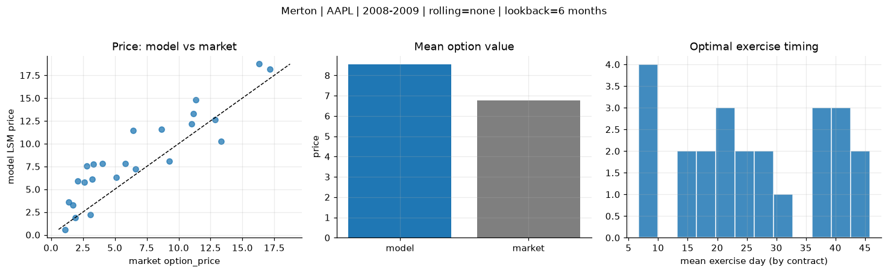
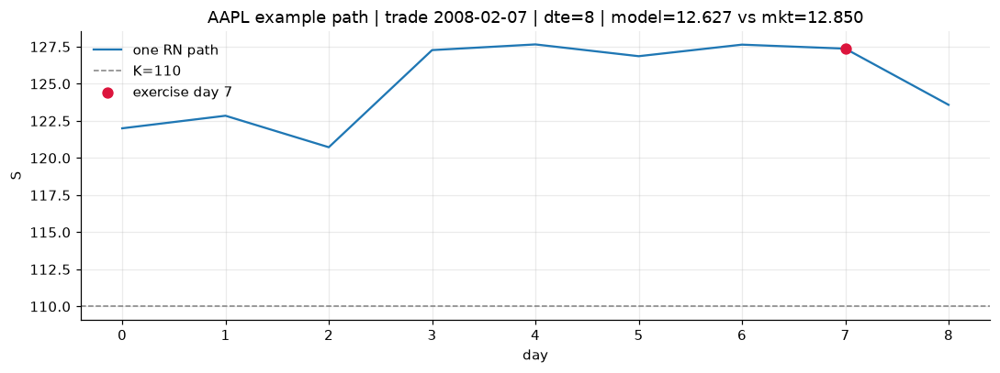
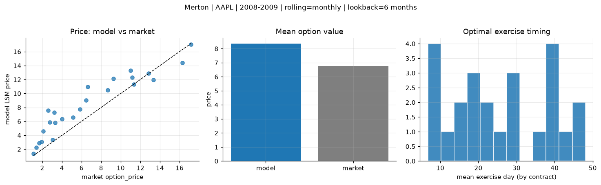
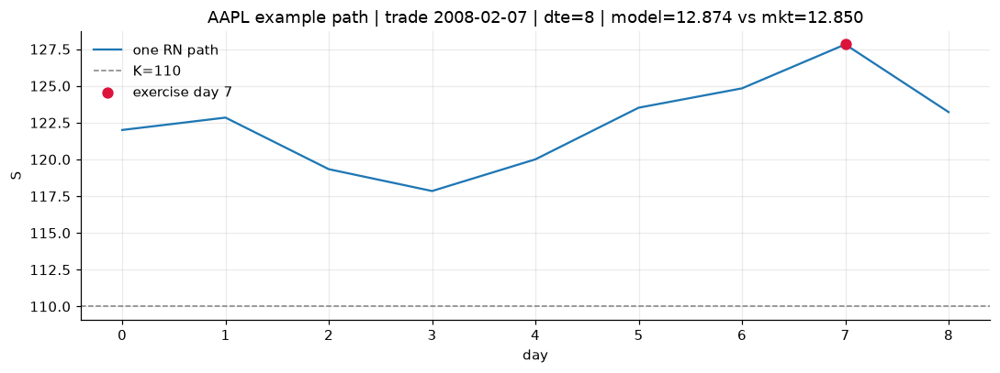
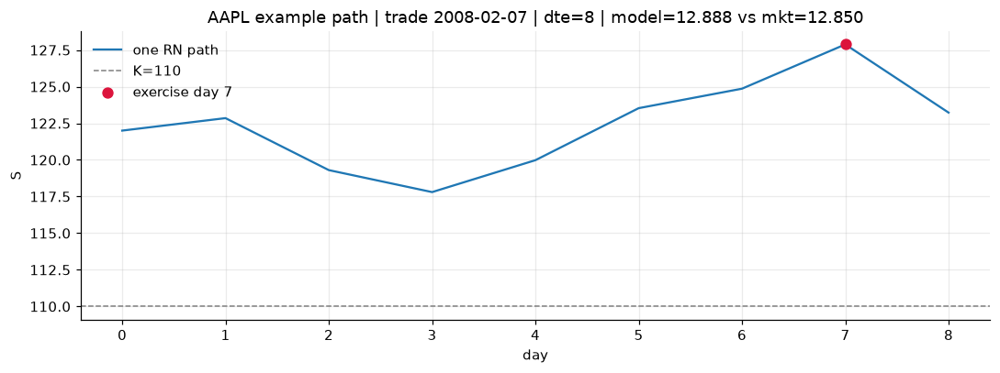

# Optimal stopping — Merton — 2008-2009 — AAPL

**Model:** Merton  
**Underlying:** AAPL  
**Regime / period:** 2008-2009  
**Lookback:** 6 months (fixed)  
**Rolling modes:** none, monthly, daily  
**Pricing:** LSM American calls on AAPL | n_paths=2000 | seed=42 | contracts=24

## Comparison (same contracts, same lookback)

| Rolling | RMSE | MAE | Bias (model−mkt) | Mean early-ex frac | Cal updates | Cal s | LSM s |
|---------|-----:|----:|-----------------:|-------------------:|------------:|------:|------:|
| `none` | 2.6862 | 2.2723 | 1.7733 | 0.233 | 1 | 0.0 | 0.1 |
| `monthly` | 2.2953 | 1.8750 | 1.5917 | 0.228 | 25 | 0.0 | 0.1 |
| `daily` | 2.0929 | 1.7377 | 1.4776 | 0.228 | 505 | 0.1 | 0.1 |

**Lowest RMSE (this study):** `daily` = 2.0929

## Rolling = `none`

- **RMSE:** 2.6862  
- **MAE:** 2.2723  
- **Bias:** 1.7733  
- **Mean early-exercise fraction:** 0.233  
- **Calibration updates (AAPL):** 1

Contract errors (compact)

| date | K | dte | market | model | error | early_ex |
|------|--:|----:|-------:|------:|------:|---------:|
| 2008-02-07 | 110 | 8 | 12.850 | 12.627 | -0.223 | 0.647 |
| 2009-09-04 | 150 | 14 | 17.175 | 18.151 | 0.976 | 0.569 |
| 2008-11-18 | 80 | 31 | 13.325 | 10.248 | -3.077 | 0.440 |
| 2009-12-22 | 190 | 24 | 11.350 | 14.788 | 3.438 | 0.280 |
| 2009-07-10 | 130 | 42 | 11.175 | 13.315 | 2.140 | 0.197 |
| 2008-02-29 | 125 | 49 | 11.000 | 12.161 | 1.161 | 0.357 |
| 2008-02-29 | 130 | 20 | 5.125 | 6.314 | 1.189 | 0.301 |
| 2009-01-09 | 95 | 7 | 1.920 | 1.858 | -0.062 | 0.161 |
| 2009-07-31 | 165 | 21 | 3.325 | 7.719 | 4.394 | 0.215 |
| 2009-08-21 | 170 | 28 | 4.025 | 7.788 | 3.763 | 0.212 |
| 2009-01-09 | 90 | 42 | 9.275 | 8.064 | -1.211 | 0.202 |
| 2009-08-07 | 165 | 42 | 6.450 | 11.458 | 5.008 | 0.230 |
| 2009-09-04 | 175 | 14 | 1.370 | 3.580 | 2.210 | 0.165 |
| 2008-11-04 | 115 | 17 | 3.075 | 2.181 | -0.894 | 0.081 |
| 2008-08-21 | 190 | 29 | 2.100 | 5.930 | 3.830 | 0.110 |
| 2008-05-20 | 200 | 31 | 3.225 | 6.122 | 2.897 | 0.106 |
| 2009-05-06 | 145 | 44 | 2.595 | 5.801 | 3.206 | 0.185 |
| 2009-07-31 | 175 | 49 | 2.780 | 7.584 | 4.804 | 0.192 |
| 2008-07-02 | 175 | 16 | 5.825 | 7.829 | 2.004 | 0.021 |
| 2008-12-10 | 110 | 9 | 1.115 | 0.593 | -0.522 | 0.028 |
| 2009-10-05 | 175 | 46 | 16.300 | 18.734 | 2.434 | 0.426 |
| 2009-03-24 | 105 | 24 | 6.625 | 7.241 | 0.616 | 0.175 |
| 2008-02-29 | 140 | 20 | 1.695 | 3.296 | 1.601 | 0.006 |
| 2008-08-07 | 165 | 43 | 8.675 | 11.550 | 2.875 | 0.284 |

## Rolling = `monthly`

- **RMSE:** 2.2953  
- **MAE:** 1.8750  
- **Bias:** 1.5917  
- **Mean early-exercise fraction:** 0.228  
- **Calibration updates (AAPL):** 25

Contract errors (compact)

| date | K | dte | market | model | error | early_ex |
|------|--:|----:|-------:|------:|------:|---------:|
| 2008-02-07 | 110 | 8 | 12.850 | 12.874 | 0.024 | 0.471 |
| 2009-09-04 | 150 | 14 | 17.175 | 17.055 | -0.120 | 0.653 |
| 2008-11-18 | 80 | 31 | 13.325 | 11.963 | -1.362 | 0.165 |
| 2009-12-22 | 190 | 24 | 11.350 | 11.320 | -0.030 | 0.304 |
| 2009-07-10 | 130 | 42 | 11.175 | 12.303 | 1.128 | 0.332 |
| 2008-02-29 | 125 | 49 | 11.000 | 13.308 | 2.308 | 0.213 |
| 2008-02-29 | 130 | 20 | 5.125 | 6.599 | 1.474 | 0.200 |
| 2009-01-09 | 95 | 7 | 1.920 | 3.074 | 1.154 | 0.143 |
| 2009-07-31 | 165 | 21 | 3.325 | 5.799 | 2.474 | 0.264 |
| 2009-08-21 | 170 | 28 | 4.025 | 6.359 | 2.334 | 0.271 |
| 2009-01-09 | 90 | 42 | 9.275 | 12.106 | 2.831 | 0.297 |
| 2009-08-07 | 165 | 42 | 6.450 | 9.027 | 2.577 | 0.298 |
| 2009-09-04 | 175 | 14 | 1.370 | 2.252 | 0.882 | 0.135 |
| 2008-11-04 | 115 | 17 | 3.075 | 3.375 | 0.300 | 0.057 |
| 2008-08-21 | 190 | 29 | 2.100 | 4.564 | 2.464 | 0.111 |
| 2008-05-20 | 200 | 31 | 3.225 | 7.279 | 4.054 | 0.129 |
| 2009-05-06 | 145 | 44 | 2.595 | 7.555 | 4.960 | 0.194 |
| 2009-07-31 | 175 | 49 | 2.780 | 5.887 | 3.107 | 0.043 |
| 2008-07-02 | 175 | 16 | 5.825 | 7.742 | 1.917 | 0.186 |
| 2008-12-10 | 110 | 9 | 1.115 | 1.392 | 0.277 | 0.005 |
| 2009-10-05 | 175 | 46 | 16.300 | 14.413 | -1.887 | 0.406 |
| 2009-03-24 | 105 | 24 | 6.625 | 10.927 | 4.302 | 0.189 |
| 2008-02-29 | 140 | 20 | 1.695 | 2.899 | 1.204 | 0.127 |
| 2008-08-07 | 165 | 43 | 8.675 | 10.505 | 1.830 | 0.290 |

## Rolling = `daily`

- **RMSE:** 2.0929  
- **MAE:** 1.7377  
- **Bias:** 1.4776  
- **Mean early-exercise fraction:** 0.228  
- **Calibration updates (AAPL):** 505

Contract errors (compact)

| date | K | dte | market | model | error | early_ex |
|------|--:|----:|-------:|------:|------:|---------:|
| 2008-02-07 | 110 | 8 | 12.850 | 12.888 | 0.038 | 0.473 |
| 2009-09-04 | 150 | 14 | 17.175 | 17.203 | 0.028 | 0.653 |
| 2008-11-18 | 80 | 31 | 13.325 | 12.267 | -1.058 | 0.188 |
| 2009-12-22 | 190 | 24 | 11.350 | 11.420 | 0.070 | 0.303 |
| 2009-07-10 | 130 | 42 | 11.175 | 12.209 | 1.034 | 0.319 |
| 2008-02-29 | 125 | 49 | 11.000 | 13.308 | 2.308 | 0.213 |
| 2008-02-29 | 130 | 20 | 5.125 | 6.599 | 1.474 | 0.200 |
| 2009-01-09 | 95 | 7 | 1.920 | 3.088 | 1.168 | 0.143 |
| 2009-07-31 | 165 | 21 | 3.325 | 5.799 | 2.474 | 0.264 |
| 2009-08-21 | 170 | 28 | 4.025 | 5.722 | 1.697 | 0.207 |
| 2009-01-09 | 90 | 42 | 9.275 | 12.129 | 2.854 | 0.297 |
| 2009-08-07 | 165 | 42 | 6.450 | 8.923 | 2.473 | 0.301 |
| 2009-09-04 | 175 | 14 | 1.370 | 2.162 | 0.792 | 0.080 |
| 2008-11-04 | 115 | 17 | 3.075 | 3.377 | 0.302 | 0.057 |
| 2008-08-21 | 190 | 29 | 2.100 | 4.221 | 2.121 | 0.111 |
| 2008-05-20 | 200 | 31 | 3.225 | 5.887 | 2.662 | 0.121 |
| 2009-05-06 | 145 | 44 | 2.595 | 7.092 | 4.497 | 0.149 |
| 2009-07-31 | 175 | 49 | 2.780 | 5.887 | 3.107 | 0.043 |
| 2008-07-02 | 175 | 16 | 5.825 | 7.842 | 2.017 | 0.189 |
| 2008-12-10 | 110 | 9 | 1.115 | 1.679 | 0.564 | 0.083 |
| 2009-10-05 | 175 | 46 | 16.300 | 14.237 | -2.063 | 0.484 |
| 2009-03-24 | 105 | 24 | 6.625 | 10.543 | 3.918 | 0.180 |
| 2008-02-29 | 140 | 20 | 1.695 | 2.899 | 1.204 | 0.127 |
| 2008-08-07 | 165 | 43 | 8.675 | 10.456 | 1.781 | 0.288 |

