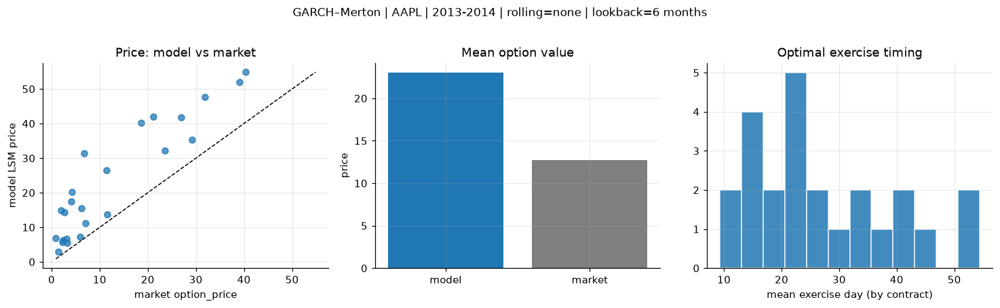
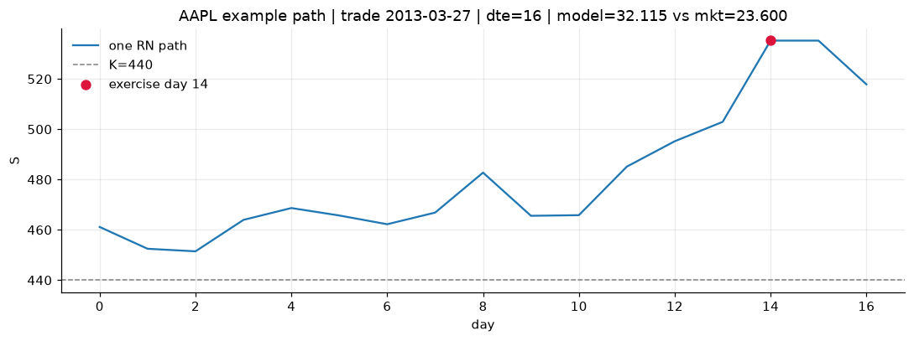
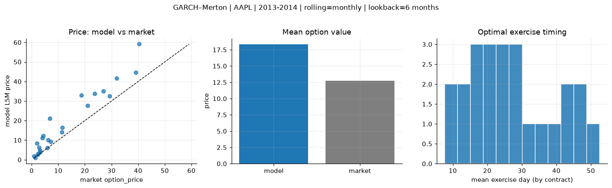
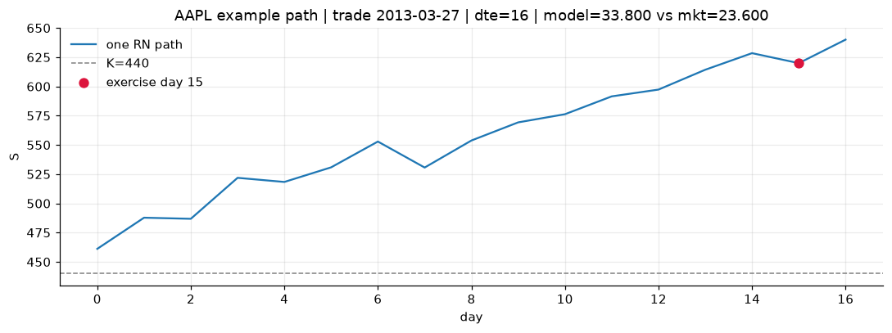
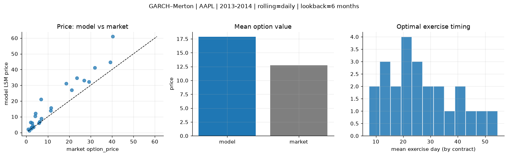
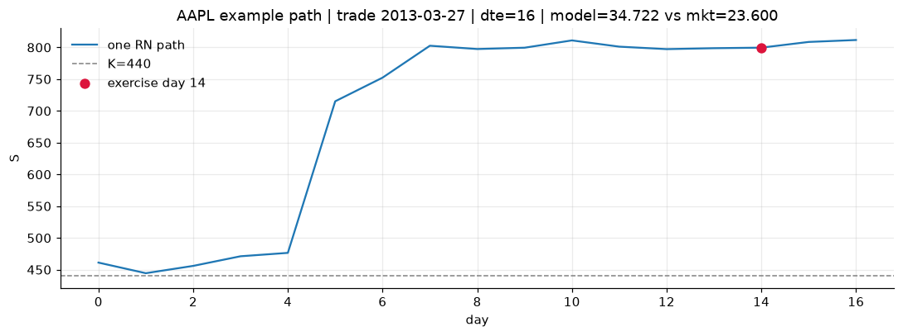

# Optimal stopping — GARCH–Merton — 2013-2014 — AAPL

**Model:** GARCH–Merton  
**Underlying:** AAPL  
**Regime / period:** 2013-2014  
**Lookback:** 6 months (fixed)  
**Rolling modes:** none, monthly, daily  
**Pricing:** LSM American calls on AAPL | n_paths=2000 | seed=42 | contracts=24

## Comparison (same contracts, same lookback)

| Rolling | RMSE | MAE | Bias (model−mkt) | Mean early-ex frac | Cal updates | Cal s | LSM s |
|---------|-----:|----:|-----------------:|-------------------:|------------:|------:|------:|
| `none` | 12.2803 | 10.2589 | 10.2589 | 0.178 | 1 | 0.0 | 0.2 |
| `monthly` | 7.4494 | 5.5961 | 5.5681 | 0.211 | 25 | 1.4 | 0.1 |
| `daily` | 7.2481 | 5.1280 | 5.1141 | 0.212 | 505 | 25.1 | 0.1 |

**Lowest RMSE (this study):** `daily` = 7.2481

## Rolling = `none`

- **RMSE:** 12.2803  
- **MAE:** 10.2589  
- **Bias:** 10.2589  
- **Mean early-exercise fraction:** 0.178  
- **Calibration updates (AAPL):** 1

Contract errors (compact)

| date | K | dte | market | model | error | early_ex |
|------|--:|----:|-------:|------:|------:|---------:|
| 2013-03-27 | 440 | 16 | 23.600 | 32.115 | 8.515 | 0.256 |
| 2014-08-01 | 90 | 14 | 5.875 | 7.167 | 1.292 | 0.251 |
| 2014-02-10 | 497.5 | 25 | 27.000 | 41.885 | 14.885 | 0.147 |
| 2014-02-03 | 470 | 31 | 31.900 | 47.733 | 15.833 | 0.340 |
| 2014-06-19 | 86.43 | 57 | 7.100 | 11.283 | 4.183 | 0.133 |
| 2013-03-20 | 425 | 58 | 40.375 | 54.845 | 14.470 | 0.390 |
| 2013-04-11 | 445 | 15 | 11.500 | 13.706 | 2.206 | 0.094 |
| 2014-03-11 | 540 | 17 | 4.300 | 20.123 | 15.823 | 0.153 |
| 2014-07-11 | 94 | 21 | 3.300 | 5.467 | 2.167 | 0.127 |
| 2014-07-25 | 95 | 28 | 3.040 | 6.722 | 3.682 | 0.271 |
| 2014-04-08 | 517.5 | 45 | 21.100 | 42.076 | 20.976 | 0.271 |
| 2014-08-15 | 99 | 42 | 2.420 | 6.359 | 3.939 | 0.311 |
| 2014-09-08 | 103 | 18 | 1.370 | 2.903 | 1.533 | 0.024 |
| 2014-01-03 | 605 | 14 | 0.875 | 6.807 | 5.932 | 0.013 |
| 2013-12-26 | 610 | 22 | 2.720 | 14.385 | 11.665 | 0.006 |
| 2013-06-28 | 420 | 35 | 6.150 | 15.489 | 9.339 | 0.193 |
| 2014-06-05 | 685 | 43 | 6.800 | 31.432 | 24.632 | 0.209 |
| 2014-08-08 | 98 | 49 | 2.295 | 5.638 | 3.343 | 0.170 |
| 2014-02-03 | 522.5 | 25 | 4.050 | 17.516 | 13.466 | 0.155 |
| 2014-02-18 | 580 | 24 | 1.980 | 14.830 | 12.850 | 0.094 |
| 2014-02-18 | 515 | 10 | 29.250 | 35.281 | 6.031 | 0.138 |
| 2014-01-17 | 575 | 35 | 11.400 | 26.509 | 15.109 | 0.105 |
| 2013-12-04 | 530 | 23 | 39.125 | 51.967 | 12.842 | 0.254 |
| 2014-05-21 | 595 | 30 | 18.675 | 40.177 | 21.502 | 0.163 |

## Rolling = `monthly`

- **RMSE:** 7.4494  
- **MAE:** 5.5961  
- **Bias:** 5.5681  
- **Mean early-exercise fraction:** 0.211  
- **Calibration updates (AAPL):** 25

Contract errors (compact)

| date | K | dte | market | model | error | early_ex |
|------|--:|----:|-------:|------:|------:|---------:|
| 2013-03-27 | 440 | 16 | 23.600 | 33.800 | 10.200 | 0.280 |
| 2014-08-01 | 90 | 14 | 5.875 | 6.096 | 0.221 | 0.516 |
| 2014-02-10 | 497.5 | 25 | 27.000 | 35.043 | 8.043 | 0.293 |
| 2014-02-03 | 470 | 31 | 31.900 | 41.726 | 9.826 | 0.310 |
| 2014-06-19 | 86.43 | 57 | 7.100 | 9.171 | 2.071 | 0.274 |
| 2013-03-20 | 425 | 58 | 40.375 | 59.116 | 18.741 | 0.481 |
| 2013-04-11 | 445 | 15 | 11.500 | 16.385 | 4.885 | 0.118 |
| 2014-03-11 | 540 | 17 | 4.300 | 12.203 | 7.903 | 0.202 |
| 2014-07-11 | 94 | 21 | 3.300 | 3.977 | 0.677 | 0.039 |
| 2014-07-25 | 95 | 28 | 3.040 | 4.832 | 1.792 | 0.281 |
| 2014-04-08 | 517.5 | 45 | 21.100 | 27.688 | 6.588 | 0.280 |
| 2014-08-15 | 99 | 42 | 2.420 | 3.041 | 0.621 | 0.169 |
| 2014-09-08 | 103 | 18 | 1.370 | 1.033 | -0.337 | 0.106 |
| 2014-01-03 | 605 | 14 | 0.875 | 1.900 | 1.025 | 0.039 |
| 2013-12-26 | 610 | 22 | 2.720 | 6.375 | 3.655 | 0.038 |
| 2013-06-28 | 420 | 35 | 6.150 | 10.019 | 3.869 | 0.189 |
| 2014-06-05 | 685 | 43 | 6.800 | 21.171 | 14.371 | 0.022 |
| 2014-08-08 | 98 | 49 | 2.295 | 2.594 | 0.299 | 0.178 |
| 2014-02-03 | 522.5 | 25 | 4.050 | 11.200 | 7.150 | 0.112 |
| 2014-02-18 | 580 | 24 | 1.980 | 8.402 | 6.422 | 0.080 |
| 2014-02-18 | 515 | 10 | 29.250 | 32.617 | 3.367 | 0.491 |
| 2014-01-17 | 575 | 35 | 11.400 | 14.048 | 2.648 | 0.086 |
| 2013-12-04 | 530 | 23 | 39.125 | 44.539 | 5.414 | 0.291 |
| 2014-05-21 | 595 | 30 | 18.675 | 32.856 | 14.181 | 0.196 |

## Rolling = `daily`

- **RMSE:** 7.2481  
- **MAE:** 5.1280  
- **Bias:** 5.1141  
- **Mean early-exercise fraction:** 0.212  
- **Calibration updates (AAPL):** 505

Contract errors (compact)

| date | K | dte | market | model | error | early_ex |
|------|--:|----:|-------:|------:|------:|---------:|
| 2013-03-27 | 440 | 16 | 23.600 | 34.722 | 11.122 | 0.253 |
| 2014-08-01 | 90 | 14 | 5.875 | 6.073 | 0.198 | 0.553 |
| 2014-02-10 | 497.5 | 25 | 27.000 | 33.047 | 6.047 | 0.477 |
| 2014-02-03 | 470 | 31 | 31.900 | 41.173 | 9.273 | 0.089 |
| 2014-06-19 | 86.43 | 57 | 7.100 | 8.955 | 1.855 | 0.261 |
| 2013-03-20 | 425 | 58 | 40.375 | 60.938 | 20.563 | 0.534 |
| 2013-04-11 | 445 | 15 | 11.500 | 15.732 | 4.232 | 0.115 |
| 2014-03-11 | 540 | 17 | 4.300 | 12.053 | 7.753 | 0.191 |
| 2014-07-11 | 94 | 21 | 3.300 | 3.408 | 0.108 | 0.116 |
| 2014-07-25 | 95 | 28 | 3.040 | 4.336 | 1.296 | 0.231 |
| 2014-04-08 | 517.5 | 45 | 21.100 | 27.069 | 5.969 | 0.285 |
| 2014-08-15 | 99 | 42 | 2.420 | 3.137 | 0.717 | 0.223 |
| 2014-09-08 | 103 | 18 | 1.370 | 1.203 | -0.167 | 0.056 |
| 2014-01-03 | 605 | 14 | 0.875 | 2.100 | 1.225 | 0.026 |
| 2013-12-26 | 610 | 22 | 2.720 | 6.120 | 3.400 | 0.074 |
| 2013-06-28 | 420 | 35 | 6.150 | 6.946 | 0.796 | 0.153 |
| 2014-06-05 | 685 | 43 | 6.800 | 20.975 | 14.175 | 0.022 |
| 2014-08-08 | 98 | 49 | 2.295 | 2.441 | 0.146 | 0.153 |
| 2014-02-03 | 522.5 | 25 | 4.050 | 10.296 | 6.246 | 0.131 |
| 2014-02-18 | 580 | 24 | 1.980 | 6.530 | 4.550 | 0.098 |
| 2014-02-18 | 515 | 10 | 29.250 | 32.176 | 2.926 | 0.495 |
| 2014-01-17 | 575 | 35 | 11.400 | 13.842 | 2.442 | 0.054 |
| 2013-12-04 | 530 | 23 | 39.125 | 44.603 | 5.478 | 0.307 |
| 2014-05-21 | 595 | 30 | 18.675 | 31.064 | 12.389 | 0.195 |

