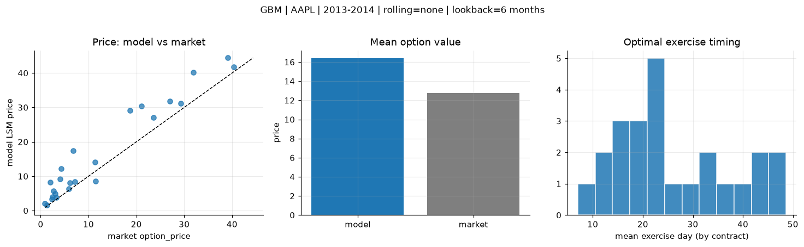
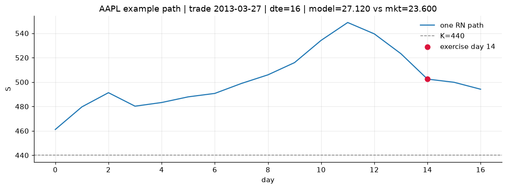
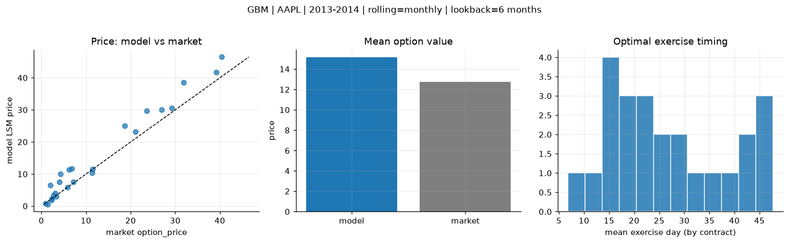
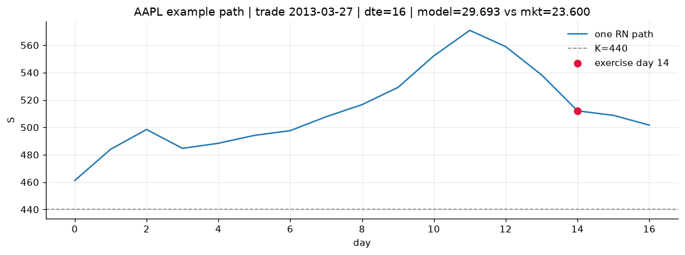
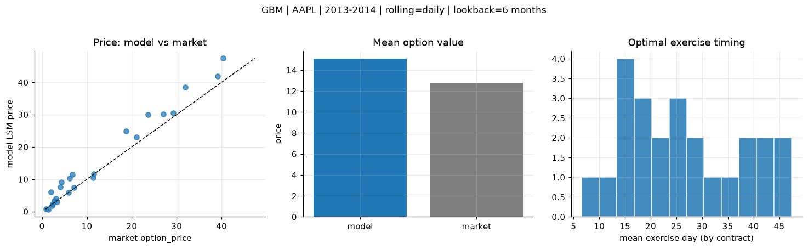
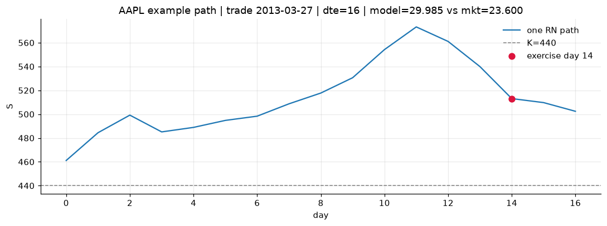

# Optimal stopping — GBM — 2013-2014 — AAPL

**Model:** GBM  
**Underlying:** AAPL  
**Regime / period:** 2013-2014  
**Lookback:** 6 months (fixed)  
**Rolling modes:** none, monthly, daily  
**Pricing:** LSM American calls on AAPL | n_paths=2000 | seed=42 | contracts=24

## Comparison (same contracts, same lookback)

| Rolling | RMSE | MAE | Bias (model−mkt) | Mean early-ex frac | Cal updates | Cal s | LSM s |
|---------|-----:|----:|-----------------:|-------------------:|------------:|------:|------:|
| `none` | 5.0578 | 3.8875 | 3.6376 | 0.271 | 1 | 0.0 | 0.1 |
| `monthly` | 3.5486 | 2.6324 | 2.3981 | 0.272 | 25 | 0.0 | 0.1 |
| `daily` | 3.4746 | 2.5452 | 2.3226 | 0.274 | 505 | 0.1 | 0.1 |

**Lowest RMSE (this study):** `daily` = 3.4746

## Rolling = `none`

- **RMSE:** 5.0578  
- **MAE:** 3.8875  
- **Bias:** 3.6376  
- **Mean early-exercise fraction:** 0.271  
- **Calibration updates (AAPL):** 1

Contract errors (compact)

| date | K | dte | market | model | error | early_ex |
|------|--:|----:|-------:|------:|------:|---------:|
| 2013-03-27 | 440 | 16 | 23.600 | 27.120 | 3.520 | 0.389 |
| 2014-08-01 | 90 | 14 | 5.875 | 6.270 | 0.395 | 0.499 |
| 2014-02-10 | 497.5 | 25 | 27.000 | 31.809 | 4.809 | 0.465 |
| 2014-02-03 | 470 | 31 | 31.900 | 40.221 | 8.321 | 0.595 |
| 2014-06-19 | 86.43 | 57 | 7.100 | 8.369 | 1.269 | 0.417 |
| 2013-03-20 | 425 | 58 | 40.375 | 41.803 | 1.428 | 0.477 |
| 2013-04-11 | 445 | 15 | 11.500 | 8.501 | -2.999 | 0.133 |
| 2014-03-11 | 540 | 17 | 4.300 | 12.154 | 7.854 | 0.199 |
| 2014-07-11 | 94 | 21 | 3.300 | 3.771 | 0.471 | 0.317 |
| 2014-07-25 | 95 | 28 | 3.040 | 4.893 | 1.853 | 0.361 |
| 2014-04-08 | 517.5 | 45 | 21.100 | 30.431 | 9.331 | 0.338 |
| 2014-08-15 | 99 | 42 | 2.420 | 3.920 | 1.500 | 0.277 |
| 2014-09-08 | 103 | 18 | 1.370 | 1.529 | 0.159 | 0.046 |
| 2014-01-03 | 605 | 14 | 0.875 | 2.027 | 1.152 | 0.038 |
| 2013-12-26 | 610 | 22 | 2.720 | 5.684 | 2.964 | 0.086 |
| 2013-06-28 | 420 | 35 | 6.150 | 8.046 | 1.896 | 0.077 |
| 2014-06-05 | 685 | 43 | 6.800 | 17.435 | 10.635 | 0.177 |
| 2014-08-08 | 98 | 49 | 2.295 | 3.379 | 1.084 | 0.054 |
| 2014-02-03 | 522.5 | 25 | 4.050 | 9.127 | 5.077 | 0.214 |
| 2014-02-18 | 580 | 24 | 1.980 | 8.201 | 6.221 | 0.010 |
| 2014-02-18 | 515 | 10 | 29.250 | 31.119 | 1.869 | 0.623 |
| 2014-01-17 | 575 | 35 | 11.400 | 14.104 | 2.704 | 0.166 |
| 2013-12-04 | 530 | 23 | 39.125 | 44.395 | 5.270 | 0.199 |
| 2014-05-21 | 595 | 30 | 18.675 | 29.195 | 10.520 | 0.340 |

## Rolling = `monthly`

- **RMSE:** 3.5486  
- **MAE:** 2.6324  
- **Bias:** 2.3981  
- **Mean early-exercise fraction:** 0.272  
- **Calibration updates (AAPL):** 25

Contract errors (compact)

| date | K | dte | market | model | error | early_ex |
|------|--:|----:|-------:|------:|------:|---------:|
| 2013-03-27 | 440 | 16 | 23.600 | 29.693 | 6.093 | 0.347 |
| 2014-08-01 | 90 | 14 | 5.875 | 5.795 | -0.080 | 0.583 |
| 2014-02-10 | 497.5 | 25 | 27.000 | 30.051 | 3.051 | 0.491 |
| 2014-02-03 | 470 | 31 | 31.900 | 38.557 | 6.657 | 0.563 |
| 2014-06-19 | 86.43 | 57 | 7.100 | 7.488 | 0.388 | 0.486 |
| 2013-03-20 | 425 | 58 | 40.375 | 46.480 | 6.105 | 0.441 |
| 2013-04-11 | 445 | 15 | 11.500 | 11.606 | 0.106 | 0.153 |
| 2014-03-11 | 540 | 17 | 4.300 | 10.032 | 5.732 | 0.192 |
| 2014-07-11 | 94 | 21 | 3.300 | 3.046 | -0.254 | 0.334 |
| 2014-07-25 | 95 | 28 | 3.040 | 4.094 | 1.054 | 0.373 |
| 2014-04-08 | 517.5 | 45 | 21.100 | 23.193 | 2.093 | 0.351 |
| 2014-08-15 | 99 | 42 | 2.420 | 2.375 | -0.045 | 0.257 |
| 2014-09-08 | 103 | 18 | 1.370 | 0.590 | -0.780 | 0.025 |
| 2014-01-03 | 605 | 14 | 0.875 | 0.835 | -0.040 | 0.029 |
| 2013-12-26 | 610 | 22 | 2.720 | 3.344 | 0.624 | 0.064 |
| 2013-06-28 | 420 | 35 | 6.150 | 11.398 | 5.248 | 0.093 |
| 2014-06-05 | 685 | 43 | 6.800 | 11.649 | 4.849 | 0.159 |
| 2014-08-08 | 98 | 49 | 2.295 | 1.805 | -0.490 | 0.056 |
| 2014-02-03 | 522.5 | 25 | 4.050 | 7.544 | 3.494 | 0.192 |
| 2014-02-18 | 580 | 24 | 1.980 | 6.519 | 4.539 | 0.011 |
| 2014-02-18 | 515 | 10 | 29.250 | 30.580 | 1.330 | 0.644 |
| 2014-01-17 | 575 | 35 | 11.400 | 10.278 | -1.122 | 0.153 |
| 2013-12-04 | 530 | 23 | 39.125 | 41.763 | 2.638 | 0.166 |
| 2014-05-21 | 595 | 30 | 18.675 | 25.040 | 6.365 | 0.355 |

## Rolling = `daily`

- **RMSE:** 3.4746  
- **MAE:** 2.5452  
- **Bias:** 2.3226  
- **Mean early-exercise fraction:** 0.274  
- **Calibration updates (AAPL):** 505

Contract errors (compact)

| date | K | dte | market | model | error | early_ex |
|------|--:|----:|-------:|------:|------:|---------:|
| 2013-03-27 | 440 | 16 | 23.600 | 29.985 | 6.385 | 0.352 |
| 2014-08-01 | 90 | 14 | 5.875 | 5.792 | -0.083 | 0.581 |
| 2014-02-10 | 497.5 | 25 | 27.000 | 30.209 | 3.209 | 0.487 |
| 2014-02-03 | 470 | 31 | 31.900 | 38.566 | 6.666 | 0.562 |
| 2014-06-19 | 86.43 | 57 | 7.100 | 7.357 | 0.257 | 0.543 |
| 2013-03-20 | 425 | 58 | 40.375 | 47.417 | 7.042 | 0.435 |
| 2013-04-11 | 445 | 15 | 11.500 | 11.616 | 0.116 | 0.153 |
| 2014-03-11 | 540 | 17 | 4.300 | 9.175 | 4.875 | 0.185 |
| 2014-07-11 | 94 | 21 | 3.300 | 3.011 | -0.289 | 0.339 |
| 2014-07-25 | 95 | 28 | 3.040 | 4.015 | 0.975 | 0.374 |
| 2014-04-08 | 517.5 | 45 | 21.100 | 22.961 | 1.861 | 0.353 |
| 2014-08-15 | 99 | 42 | 2.420 | 2.328 | -0.092 | 0.253 |
| 2014-09-08 | 103 | 18 | 1.370 | 0.679 | -0.691 | 0.030 |
| 2014-01-03 | 605 | 14 | 0.875 | 0.829 | -0.046 | 0.029 |
| 2013-12-26 | 610 | 22 | 2.720 | 3.343 | 0.623 | 0.065 |
| 2013-06-28 | 420 | 35 | 6.150 | 10.242 | 4.092 | 0.082 |
| 2014-06-05 | 685 | 43 | 6.800 | 11.460 | 4.660 | 0.159 |
| 2014-08-08 | 98 | 49 | 2.295 | 1.764 | -0.531 | 0.062 |
| 2014-02-03 | 522.5 | 25 | 4.050 | 7.530 | 3.480 | 0.190 |
| 2014-02-18 | 580 | 24 | 1.980 | 5.966 | 3.986 | 0.011 |
| 2014-02-18 | 515 | 10 | 29.250 | 30.431 | 1.181 | 0.656 |
| 2014-01-17 | 575 | 35 | 11.400 | 10.460 | -0.940 | 0.158 |
| 2013-12-04 | 530 | 23 | 39.125 | 41.915 | 2.790 | 0.173 |
| 2014-05-21 | 595 | 30 | 18.675 | 24.890 | 6.215 | 0.350 |

