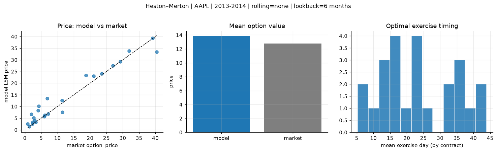
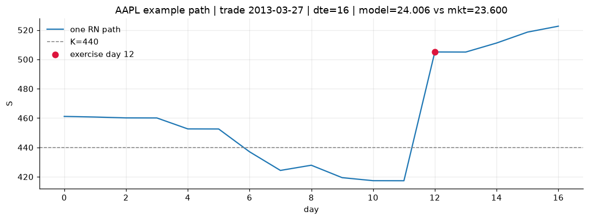
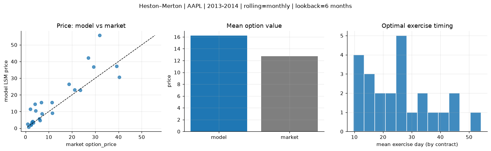
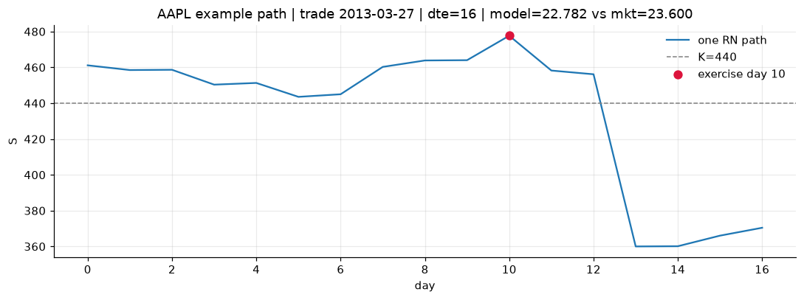
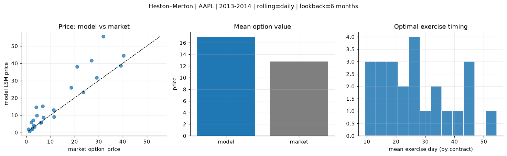
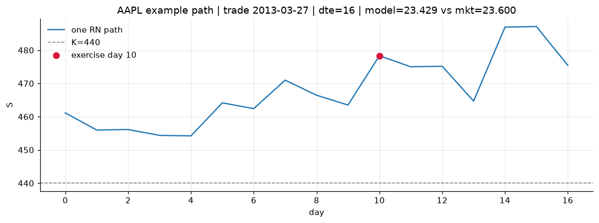

# Optimal stopping — Heston–Merton — 2013-2014 — AAPL

**Model:** Heston–Merton  
**Underlying:** AAPL  
**Regime / period:** 2013-2014  
**Lookback:** 6 months (fixed)  
**Rolling modes:** none, monthly, daily  
**Pricing:** LSM American calls on AAPL | n_paths=2000 | seed=42 | contracts=24

## Comparison (same contracts, same lookback)

| Rolling | RMSE | MAE | Bias (model−mkt) | Mean early-ex frac | Cal updates | Cal s | LSM s |
|---------|-----:|----:|-----------------:|-------------------:|------------:|------:|------:|
| `none` | 3.0546 | 2.0743 | 1.1148 | 0.328 | 1 | 0.0 | 0.1 |
| `monthly` | 7.5249 | 4.9023 | 3.4576 | 0.213 | 25 | 0.0 | 0.1 |
| `daily` | 7.6005 | 4.6273 | 4.2590 | 0.202 | 505 | 1.1 | 0.1 |

**Lowest RMSE (this study):** `none` = 3.0546

## Rolling = `none`

- **RMSE:** 3.0546  
- **MAE:** 2.0743  
- **Bias:** 1.1148  
- **Mean early-exercise fraction:** 0.328  
- **Calibration updates (AAPL):** 1

Contract errors (compact)

| date | K | dte | market | model | error | early_ex |
|------|--:|----:|-------:|------:|------:|---------:|
| 2013-03-27 | 440 | 16 | 23.600 | 24.006 | 0.406 | 0.525 |
| 2014-08-01 | 90 | 14 | 5.875 | 5.755 | -0.120 | 0.659 |
| 2014-02-10 | 497.5 | 25 | 27.000 | 27.469 | 0.469 | 0.593 |
| 2014-02-03 | 470 | 31 | 31.900 | 33.806 | 1.906 | 0.704 |
| 2014-06-19 | 86.43 | 57 | 7.100 | 6.820 | -0.280 | 0.511 |
| 2013-03-20 | 425 | 58 | 40.375 | 33.340 | -7.035 | 0.562 |
| 2013-04-11 | 445 | 15 | 11.500 | 7.534 | -3.966 | 0.125 |
| 2014-03-11 | 540 | 17 | 4.300 | 10.080 | 5.780 | 0.180 |
| 2014-07-11 | 94 | 21 | 3.300 | 3.187 | -0.113 | 0.315 |
| 2014-07-25 | 95 | 28 | 3.040 | 4.022 | 0.982 | 0.424 |
| 2014-04-08 | 517.5 | 45 | 21.100 | 23.023 | 1.923 | 0.316 |
| 2014-08-15 | 99 | 42 | 2.420 | 3.227 | 0.807 | 0.269 |
| 2014-09-08 | 103 | 18 | 1.370 | 1.393 | 0.023 | 0.090 |
| 2014-01-03 | 605 | 14 | 0.875 | 2.495 | 1.620 | 0.046 |
| 2013-12-26 | 610 | 22 | 2.720 | 5.097 | 2.377 | 0.081 |
| 2013-06-28 | 420 | 35 | 6.150 | 6.265 | 0.115 | 0.120 |
| 2014-06-05 | 685 | 43 | 6.800 | 13.480 | 6.680 | 0.116 |
| 2014-08-08 | 98 | 49 | 2.295 | 2.558 | 0.263 | 0.220 |
| 2014-02-03 | 522.5 | 25 | 4.050 | 8.248 | 4.198 | 0.117 |
| 2014-02-18 | 580 | 24 | 1.980 | 6.667 | 4.687 | 0.108 |
| 2014-02-18 | 515 | 10 | 29.250 | 29.305 | 0.055 | 0.662 |
| 2014-01-17 | 575 | 35 | 11.400 | 12.600 | 1.200 | 0.164 |
| 2013-12-04 | 530 | 23 | 39.125 | 39.231 | 0.106 | 0.626 |
| 2014-05-21 | 595 | 30 | 18.675 | 23.349 | 4.674 | 0.330 |

## Rolling = `monthly`

- **RMSE:** 7.5249  
- **MAE:** 4.9023  
- **Bias:** 3.4576  
- **Mean early-exercise fraction:** 0.213  
- **Calibration updates (AAPL):** 25

Contract errors (compact)

| date | K | dte | market | model | error | early_ex |
|------|--:|----:|-------:|------:|------:|---------:|
| 2013-03-27 | 440 | 16 | 23.600 | 22.782 | -0.818 | 0.607 |
| 2014-08-01 | 90 | 14 | 5.875 | 5.713 | -0.162 | 0.136 |
| 2014-02-10 | 497.5 | 25 | 27.000 | 42.185 | 15.185 | 0.253 |
| 2014-02-03 | 470 | 31 | 31.900 | 55.661 | 23.761 | 0.000 |
| 2014-06-19 | 86.43 | 57 | 7.100 | 8.610 | 1.510 | 0.296 |
| 2013-03-20 | 425 | 58 | 40.375 | 30.657 | -9.718 | 0.646 |
| 2013-04-11 | 445 | 15 | 11.500 | 9.067 | -2.433 | 0.226 |
| 2014-03-11 | 540 | 17 | 4.300 | 10.444 | 6.144 | 0.074 |
| 2014-07-11 | 94 | 21 | 3.300 | 3.329 | 0.029 | 0.382 |
| 2014-07-25 | 95 | 28 | 3.040 | 4.069 | 1.029 | 0.210 |
| 2014-04-08 | 517.5 | 45 | 21.100 | 22.949 | 1.849 | 0.306 |
| 2014-08-15 | 99 | 42 | 2.420 | 2.552 | 0.132 | 0.243 |
| 2014-09-08 | 103 | 18 | 1.370 | 0.789 | -0.581 | 0.113 |
| 2014-01-03 | 605 | 14 | 0.875 | 2.581 | 1.706 | 0.015 |
| 2013-12-26 | 610 | 22 | 2.720 | 3.711 | 0.991 | 0.045 |
| 2013-06-28 | 420 | 35 | 6.150 | 4.788 | -1.362 | 0.130 |
| 2014-06-05 | 685 | 43 | 6.800 | 15.406 | 8.606 | 0.074 |
| 2014-08-08 | 98 | 49 | 2.295 | 1.946 | -0.349 | 0.214 |
| 2014-02-03 | 522.5 | 25 | 4.050 | 14.514 | 10.464 | 0.005 |
| 2014-02-18 | 580 | 24 | 1.980 | 11.515 | 9.535 | 0.003 |
| 2014-02-18 | 515 | 10 | 29.250 | 36.759 | 7.509 | 0.000 |
| 2014-01-17 | 575 | 35 | 11.400 | 15.457 | 4.057 | 0.135 |
| 2013-12-04 | 530 | 23 | 39.125 | 37.211 | -1.914 | 0.777 |
| 2014-05-21 | 595 | 30 | 18.675 | 26.487 | 7.812 | 0.210 |

## Rolling = `daily`

- **RMSE:** 7.6005  
- **MAE:** 4.6273  
- **Bias:** 4.2590  
- **Mean early-exercise fraction:** 0.202  
- **Calibration updates (AAPL):** 505

Contract errors (compact)

| date | K | dte | market | model | error | early_ex |
|------|--:|----:|-------:|------:|------:|---------:|
| 2013-03-27 | 440 | 16 | 23.600 | 23.429 | -0.171 | 0.573 |
| 2014-08-01 | 90 | 14 | 5.875 | 5.748 | -0.127 | 0.027 |
| 2014-02-10 | 497.5 | 25 | 27.000 | 41.544 | 14.544 | 0.004 |
| 2014-02-03 | 470 | 31 | 31.900 | 55.456 | 23.556 | 0.096 |
| 2014-06-19 | 86.43 | 57 | 7.100 | 8.602 | 1.502 | 0.279 |
| 2013-03-20 | 425 | 58 | 40.375 | 44.365 | 3.990 | 0.475 |
| 2013-04-11 | 445 | 15 | 11.500 | 9.052 | -2.448 | 0.222 |
| 2014-03-11 | 540 | 17 | 4.300 | 9.846 | 5.546 | 0.008 |
| 2014-07-11 | 94 | 21 | 3.300 | 3.303 | 0.003 | 0.366 |
| 2014-07-25 | 95 | 28 | 3.040 | 4.088 | 1.048 | 0.234 |
| 2014-04-08 | 517.5 | 45 | 21.100 | 38.022 | 16.922 | 0.003 |
| 2014-08-15 | 99 | 42 | 2.420 | 2.382 | -0.038 | 0.390 |
| 2014-09-08 | 103 | 18 | 1.370 | 0.795 | -0.575 | 0.085 |
| 2014-01-03 | 605 | 14 | 0.875 | 1.979 | 1.104 | 0.027 |
| 2013-12-26 | 610 | 22 | 2.720 | 7.002 | 4.282 | 0.049 |
| 2013-06-28 | 420 | 35 | 6.150 | 5.885 | -0.265 | 0.129 |
| 2014-06-05 | 685 | 43 | 6.800 | 15.158 | 8.358 | 0.072 |
| 2014-08-08 | 98 | 49 | 2.295 | 1.952 | -0.343 | 0.276 |
| 2014-02-03 | 522.5 | 25 | 4.050 | 14.577 | 10.527 | 0.006 |
| 2014-02-18 | 580 | 24 | 1.980 | 5.873 | 3.893 | 0.064 |
| 2014-02-18 | 515 | 10 | 29.250 | 31.699 | 2.449 | 0.425 |
| 2014-01-17 | 575 | 35 | 11.400 | 13.047 | 1.647 | 0.179 |
| 2013-12-04 | 530 | 23 | 39.125 | 38.672 | -0.453 | 0.709 |
| 2014-05-21 | 595 | 30 | 18.675 | 25.937 | 7.262 | 0.159 |

