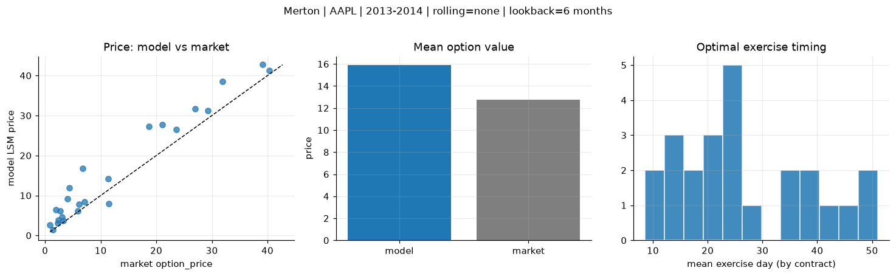
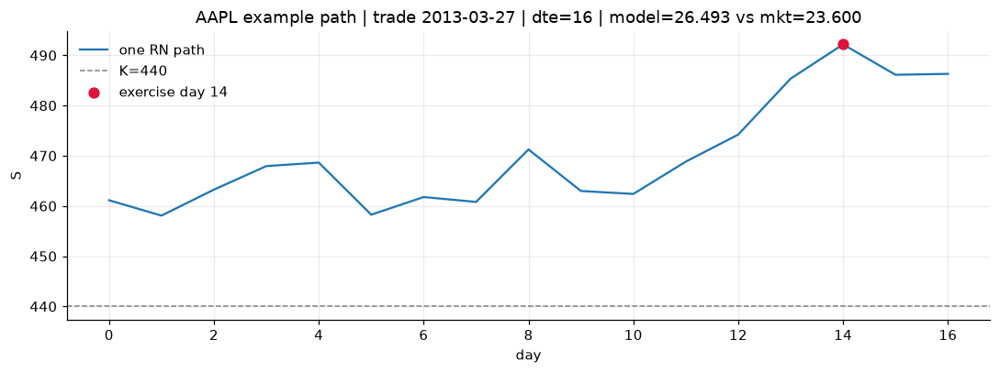
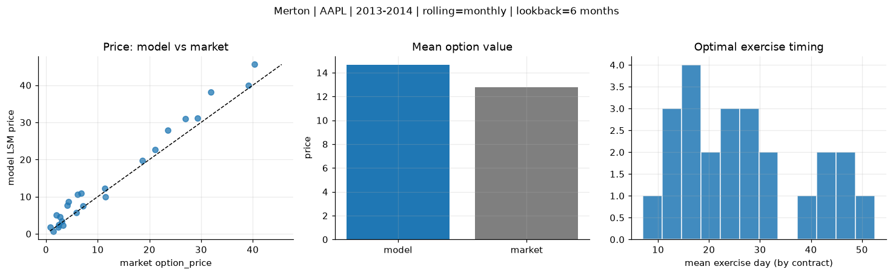
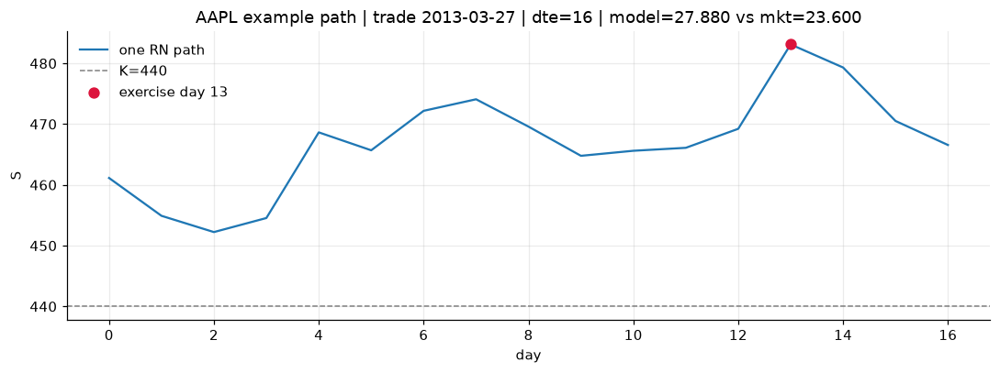
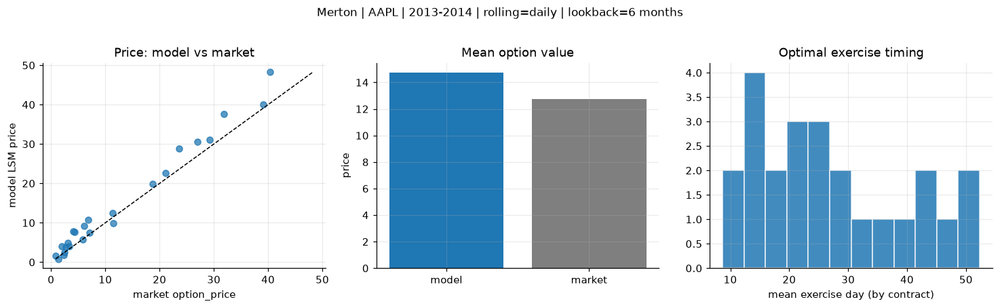
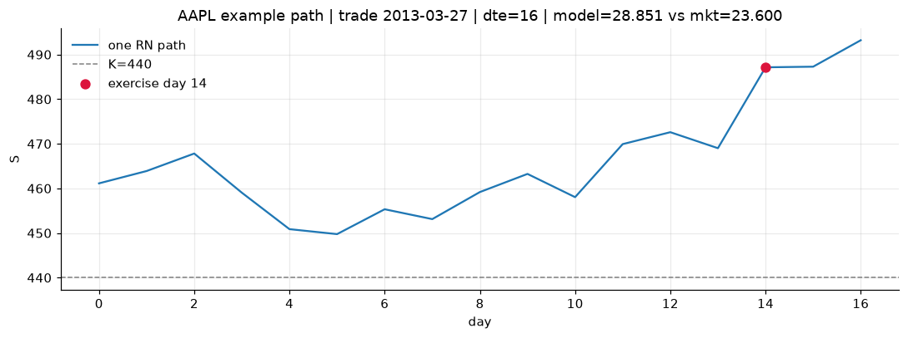

# Optimal stopping — Merton — 2013-2014 — AAPL

**Model:** Merton  
**Underlying:** AAPL  
**Regime / period:** 2013-2014  
**Lookback:** 6 months (fixed)  
**Rolling modes:** none, monthly, daily  
**Pricing:** LSM American calls on AAPL | n_paths=2000 | seed=42 | contracts=24

## Comparison (same contracts, same lookback)

| Rolling | RMSE | MAE | Bias (model−mkt) | Mean early-ex frac | Cal updates | Cal s | LSM s |
|---------|-----:|----:|-----------------:|-------------------:|------------:|------:|------:|
| `none` | 4.3754 | 3.4310 | 3.1359 | 0.213 | 1 | 0.0 | 0.1 |
| `monthly` | 2.8581 | 2.2008 | 1.8925 | 0.232 | 25 | 0.0 | 0.3 |
| `daily` | 2.9473 | 2.1999 | 1.9768 | 0.217 | 505 | 0.1 | 0.1 |

**Lowest RMSE (this study):** `monthly` = 2.8581

## Rolling = `none`

- **RMSE:** 4.3754  
- **MAE:** 3.4310  
- **Bias:** 3.1359  
- **Mean early-exercise fraction:** 0.213  
- **Calibration updates (AAPL):** 1

Contract errors (compact)

| date | K | dte | market | model | error | early_ex |
|------|--:|----:|-------:|------:|------:|---------:|
| 2013-03-27 | 440 | 16 | 23.600 | 26.493 | 2.893 | 0.274 |
| 2014-08-01 | 90 | 14 | 5.875 | 6.180 | 0.305 | 0.343 |
| 2014-02-10 | 497.5 | 25 | 27.000 | 31.729 | 4.729 | 0.127 |
| 2014-02-03 | 470 | 31 | 31.900 | 38.492 | 6.592 | 0.459 |
| 2014-06-19 | 86.43 | 57 | 7.100 | 8.376 | 1.276 | 0.328 |
| 2013-03-20 | 425 | 58 | 40.375 | 41.320 | 0.945 | 0.688 |
| 2013-04-11 | 445 | 15 | 11.500 | 7.958 | -3.542 | 0.097 |
| 2014-03-11 | 540 | 17 | 4.300 | 11.957 | 7.657 | 0.065 |
| 2014-07-11 | 94 | 21 | 3.300 | 3.747 | 0.447 | 0.197 |
| 2014-07-25 | 95 | 28 | 3.040 | 4.656 | 1.616 | 0.294 |
| 2014-04-08 | 517.5 | 45 | 21.100 | 27.788 | 6.688 | 0.287 |
| 2014-08-15 | 99 | 42 | 2.420 | 3.915 | 1.495 | 0.296 |
| 2014-09-08 | 103 | 18 | 1.370 | 1.446 | 0.076 | 0.024 |
| 2014-01-03 | 605 | 14 | 0.875 | 2.610 | 1.735 | 0.019 |
| 2013-12-26 | 610 | 22 | 2.720 | 6.085 | 3.365 | 0.009 |
| 2013-06-28 | 420 | 35 | 6.150 | 7.845 | 1.695 | 0.107 |
| 2014-06-05 | 685 | 43 | 6.800 | 16.789 | 9.989 | 0.185 |
| 2014-08-08 | 98 | 49 | 2.295 | 3.095 | 0.800 | 0.150 |
| 2014-02-03 | 522.5 | 25 | 4.050 | 9.205 | 5.155 | 0.103 |
| 2014-02-18 | 580 | 24 | 1.980 | 6.498 | 4.518 | 0.078 |
| 2014-02-18 | 515 | 10 | 29.250 | 31.183 | 1.933 | 0.266 |
| 2014-01-17 | 575 | 35 | 11.400 | 14.174 | 2.774 | 0.135 |
| 2013-12-04 | 530 | 23 | 39.125 | 42.714 | 3.589 | 0.363 |
| 2014-05-21 | 595 | 30 | 18.675 | 27.206 | 8.531 | 0.218 |

## Rolling = `monthly`

- **RMSE:** 2.8581  
- **MAE:** 2.2008  
- **Bias:** 1.8925  
- **Mean early-exercise fraction:** 0.232  
- **Calibration updates (AAPL):** 25

Contract errors (compact)

| date | K | dte | market | model | error | early_ex |
|------|--:|----:|-------:|------:|------:|---------:|
| 2013-03-27 | 440 | 16 | 23.600 | 27.880 | 4.280 | 0.411 |
| 2014-08-01 | 90 | 14 | 5.875 | 5.759 | -0.116 | 0.627 |
| 2014-02-10 | 497.5 | 25 | 27.000 | 30.948 | 3.948 | 0.348 |
| 2014-02-03 | 470 | 31 | 31.900 | 38.174 | 6.274 | 0.332 |
| 2014-06-19 | 86.43 | 57 | 7.100 | 7.445 | 0.345 | 0.152 |
| 2013-03-20 | 425 | 58 | 40.375 | 45.586 | 5.211 | 0.573 |
| 2013-04-11 | 445 | 15 | 11.500 | 9.951 | -1.549 | 0.044 |
| 2014-03-11 | 540 | 17 | 4.300 | 8.627 | 4.327 | 0.122 |
| 2014-07-11 | 94 | 21 | 3.300 | 2.329 | -0.971 | 0.029 |
| 2014-07-25 | 95 | 28 | 3.040 | 3.391 | 0.351 | 0.146 |
| 2014-04-08 | 517.5 | 45 | 21.100 | 22.702 | 1.602 | 0.309 |
| 2014-08-15 | 99 | 42 | 2.420 | 2.490 | 0.070 | 0.182 |
| 2014-09-08 | 103 | 18 | 1.370 | 0.730 | -0.640 | 0.102 |
| 2014-01-03 | 605 | 14 | 0.875 | 1.856 | 0.981 | 0.059 |
| 2013-12-26 | 610 | 22 | 2.720 | 4.533 | 1.813 | 0.043 |
| 2013-06-28 | 420 | 35 | 6.150 | 10.558 | 4.408 | 0.210 |
| 2014-06-05 | 685 | 43 | 6.800 | 10.992 | 4.192 | 0.030 |
| 2014-08-08 | 98 | 49 | 2.295 | 1.872 | -0.423 | 0.134 |
| 2014-02-03 | 522.5 | 25 | 4.050 | 7.667 | 3.617 | 0.086 |
| 2014-02-18 | 580 | 24 | 1.980 | 5.107 | 3.127 | 0.064 |
| 2014-02-18 | 515 | 10 | 29.250 | 31.138 | 1.888 | 0.598 |
| 2014-01-17 | 575 | 35 | 11.400 | 12.157 | 0.757 | 0.154 |
| 2013-12-04 | 530 | 23 | 39.125 | 39.960 | 0.835 | 0.688 |
| 2014-05-21 | 595 | 30 | 18.675 | 19.770 | 1.095 | 0.122 |

## Rolling = `daily`

- **RMSE:** 2.9473  
- **MAE:** 2.1999  
- **Bias:** 1.9768  
- **Mean early-exercise fraction:** 0.217  
- **Calibration updates (AAPL):** 505

Contract errors (compact)

| date | K | dte | market | model | error | early_ex |
|------|--:|----:|-------:|------:|------:|---------:|
| 2013-03-27 | 440 | 16 | 23.600 | 28.851 | 5.251 | 0.264 |
| 2014-08-01 | 90 | 14 | 5.875 | 5.734 | -0.141 | 0.510 |
| 2014-02-10 | 497.5 | 25 | 27.000 | 30.552 | 3.552 | 0.512 |
| 2014-02-03 | 470 | 31 | 31.900 | 37.696 | 5.796 | 0.303 |
| 2014-06-19 | 86.43 | 57 | 7.100 | 7.422 | 0.322 | 0.155 |
| 2013-03-20 | 425 | 58 | 40.375 | 48.228 | 7.853 | 0.554 |
| 2013-04-11 | 445 | 15 | 11.500 | 9.964 | -1.536 | 0.043 |
| 2014-03-11 | 540 | 17 | 4.300 | 7.631 | 3.331 | 0.150 |
| 2014-07-11 | 94 | 21 | 3.300 | 4.092 | 0.792 | 0.042 |
| 2014-07-25 | 95 | 28 | 3.040 | 4.887 | 1.847 | 0.264 |
| 2014-04-08 | 517.5 | 45 | 21.100 | 22.665 | 1.565 | 0.304 |
| 2014-08-15 | 99 | 42 | 2.420 | 2.418 | -0.002 | 0.179 |
| 2014-09-08 | 103 | 18 | 1.370 | 0.849 | -0.521 | 0.071 |
| 2014-01-03 | 605 | 14 | 0.875 | 1.623 | 0.748 | 0.051 |
| 2013-12-26 | 610 | 22 | 2.720 | 3.892 | 1.172 | 0.057 |
| 2013-06-28 | 420 | 35 | 6.150 | 9.257 | 3.107 | 0.192 |
| 2014-06-05 | 685 | 43 | 6.800 | 10.796 | 3.996 | 0.032 |
| 2014-08-08 | 98 | 49 | 2.295 | 1.819 | -0.476 | 0.170 |
| 2014-02-03 | 522.5 | 25 | 4.050 | 7.755 | 3.705 | 0.124 |
| 2014-02-18 | 580 | 24 | 1.980 | 4.130 | 2.150 | 0.039 |
| 2014-02-18 | 515 | 10 | 29.250 | 31.048 | 1.798 | 0.239 |
| 2014-01-17 | 575 | 35 | 11.400 | 12.425 | 1.025 | 0.154 |
| 2013-12-04 | 530 | 23 | 39.125 | 40.025 | 0.900 | 0.678 |
| 2014-05-21 | 595 | 30 | 18.675 | 19.887 | 1.212 | 0.117 |

