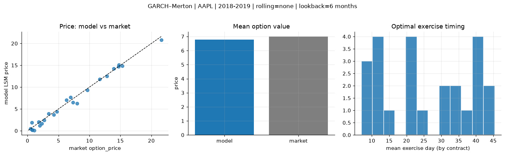
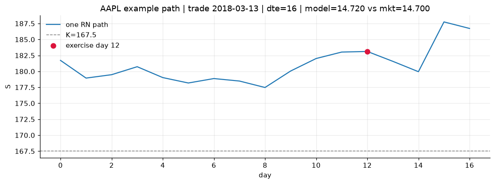
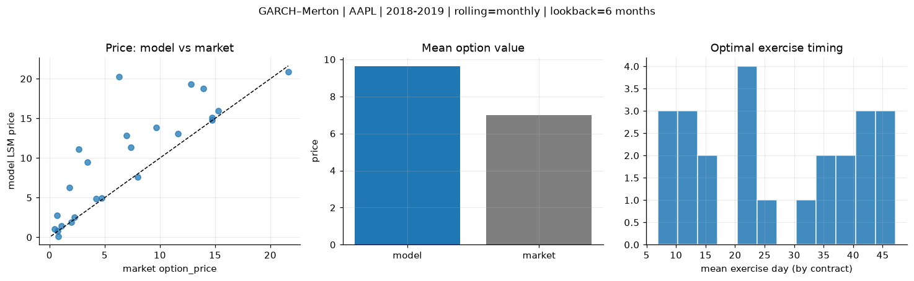
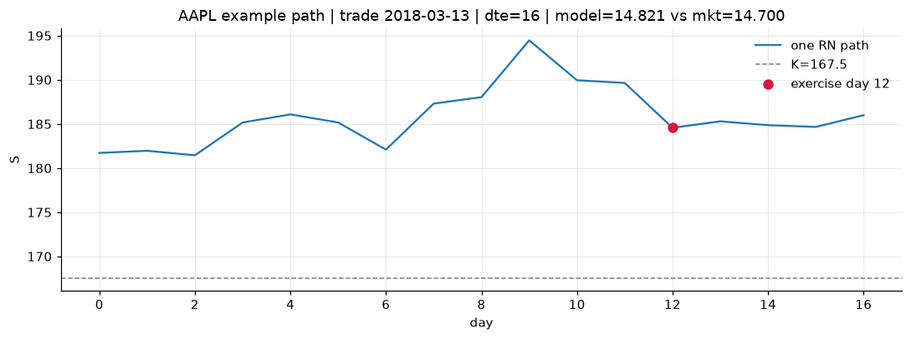
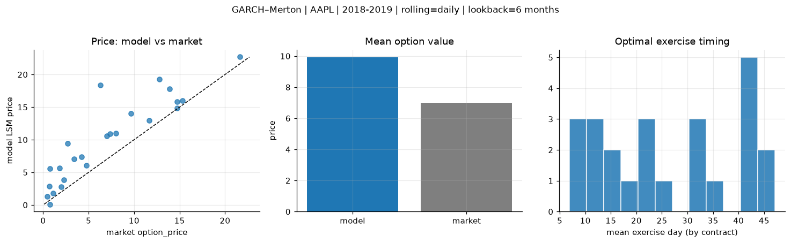
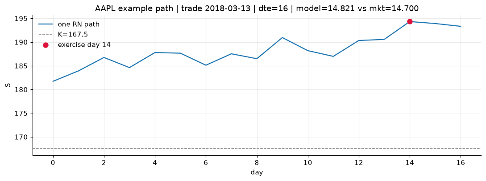

# Optimal stopping — GARCH–Merton — 2018-2019 — AAPL

**Model:** GARCH–Merton  
**Underlying:** AAPL  
**Regime / period:** 2018-2019  
**Lookback:** 6 months (fixed)  
**Rolling modes:** none, monthly, daily  
**Pricing:** LSM American calls on AAPL | n_paths=2000 | seed=42 | contracts=24

## Comparison (same contracts, same lookback)

| Rolling | RMSE | MAE | Bias (model−mkt) | Mean early-ex frac | Cal updates | Cal s | LSM s |
|---------|-----:|----:|-----------------:|-------------------:|------------:|------:|------:|
| `none` | 0.6696 | 0.5564 | -0.2049 | 0.256 | 1 | 0.1 | 0.1 |
| `monthly` | 4.4022 | 2.7817 | 2.6328 | 0.222 | 25 | 0.8 | 0.1 |
| `daily` | 3.9754 | 2.9800 | 2.9246 | 0.210 | 503 | 9.8 | 0.1 |

**Lowest RMSE (this study):** `none` = 0.6696

## Rolling = `none`

- **RMSE:** 0.6696  
- **MAE:** 0.5564  
- **Bias:** -0.2049  
- **Mean early-exercise fraction:** 0.256  
- **Calibration updates (AAPL):** 1

Contract errors (compact)

| date | K | dte | market | model | error | early_ex |
|------|--:|----:|-------:|------:|------:|---------:|
| 2018-03-13 | 167.5 | 16 | 14.700 | 14.720 | 0.020 | 0.725 |
| 2019-08-15 | 182.5 | 15 | 21.625 | 20.817 | -0.808 | 0.703 |
| 2018-12-04 | 175 | 38 | 12.800 | 12.518 | -0.282 | 0.476 |
| 2018-12-04 | 177.5 | 24 | 9.675 | 9.305 | -0.370 | 0.299 |
| 2019-07-18 | 192.5 | 43 | 13.925 | 14.238 | 0.313 | 0.379 |
| 2018-03-13 | 172.5 | 45 | 11.650 | 11.800 | 0.150 | 0.449 |
| 2018-03-27 | 170 | 10 | 4.750 | 4.409 | -0.341 | 0.313 |
| 2019-02-15 | 170 | 14 | 3.425 | 3.891 | 0.466 | 0.065 |
| 2019-07-25 | 207.5 | 36 | 6.975 | 7.673 | 0.698 | 0.233 |
| 2019-08-15 | 200 | 22 | 7.975 | 6.295 | -1.680 | 0.383 |
| 2019-02-08 | 170 | 49 | 6.300 | 7.008 | 0.708 | 0.295 |
| 2019-09-27 | 222.5 | 42 | 7.350 | 6.478 | -0.872 | 0.179 |
| 2019-10-04 | 230 | 7 | 0.465 | 0.481 | 0.016 | 0.004 |
| 2018-12-26 | 157.5 | 9 | 1.095 | 0.118 | -0.977 | 0.006 |
| 2018-10-15 | 232.5 | 39 | 4.250 | 3.701 | -0.549 | 0.198 |
| 2018-06-07 | 202.5 | 22 | 0.695 | 1.913 | 1.218 | 0.050 |
| 2019-06-19 | 212.5 | 44 | 2.670 | 2.412 | -0.258 | 0.124 |
| 2019-09-20 | 237.5 | 42 | 1.790 | 2.046 | 0.256 | 0.075 |
| 2018-10-22 | 235 | 32 | 2.285 | 1.663 | -0.622 | 0.072 |
| 2018-01-29 | 185 | 11 | 0.775 | 0.138 | -0.637 | 0.015 |
| 2018-10-22 | 235 | 25 | 1.975 | 1.213 | -0.762 | 0.043 |
| 2018-11-05 | 222.5 | 11 | 0.730 | 0.214 | -0.516 | 0.019 |
| 2018-02-27 | 165 | 24 | 14.725 | 15.099 | 0.374 | 0.657 |
| 2018-04-25 | 150 | 51 | 15.300 | 14.840 | -0.460 | 0.378 |

## Rolling = `monthly`

- **RMSE:** 4.4022  
- **MAE:** 2.7817  
- **Bias:** 2.6328  
- **Mean early-exercise fraction:** 0.222  
- **Calibration updates (AAPL):** 25

Contract errors (compact)

| date | K | dte | market | model | error | early_ex |
|------|--:|----:|-------:|------:|------:|---------:|
| 2018-03-13 | 167.5 | 16 | 14.700 | 14.821 | 0.121 | 0.663 |
| 2019-08-15 | 182.5 | 15 | 21.625 | 20.889 | -0.736 | 0.712 |
| 2018-12-04 | 175 | 38 | 12.800 | 19.348 | 6.548 | 0.426 |
| 2018-12-04 | 177.5 | 24 | 9.675 | 13.870 | 4.195 | 0.381 |
| 2019-07-18 | 192.5 | 43 | 13.925 | 18.756 | 4.831 | 0.412 |
| 2018-03-13 | 172.5 | 45 | 11.650 | 13.042 | 1.392 | 0.482 |
| 2018-03-27 | 170 | 10 | 4.750 | 4.949 | 0.199 | 0.106 |
| 2019-02-15 | 170 | 14 | 3.425 | 9.504 | 6.079 | 0.033 |
| 2019-07-25 | 207.5 | 36 | 6.975 | 12.800 | 5.825 | 0.199 |
| 2019-08-15 | 200 | 22 | 7.975 | 7.600 | -0.375 | 0.203 |
| 2019-02-08 | 170 | 49 | 6.300 | 20.229 | 13.929 | 0.229 |
| 2019-09-27 | 222.5 | 42 | 7.350 | 11.319 | 3.969 | 0.164 |
| 2019-10-04 | 230 | 7 | 0.465 | 1.034 | 0.569 | 0.015 |
| 2018-12-26 | 157.5 | 9 | 1.095 | 1.429 | 0.334 | 0.019 |
| 2018-10-15 | 232.5 | 39 | 4.250 | 4.835 | 0.585 | 0.208 |
| 2018-06-07 | 202.5 | 22 | 0.695 | 2.756 | 2.061 | 0.071 |
| 2019-06-19 | 212.5 | 44 | 2.670 | 11.145 | 8.475 | 0.009 |
| 2019-09-20 | 237.5 | 42 | 1.790 | 6.268 | 4.478 | 0.150 |
| 2018-10-22 | 235 | 32 | 2.285 | 2.529 | 0.244 | 0.077 |
| 2018-01-29 | 185 | 11 | 0.775 | 0.138 | -0.637 | 0.015 |
| 2018-10-22 | 235 | 25 | 1.975 | 1.936 | -0.039 | 0.070 |
| 2018-11-05 | 222.5 | 11 | 0.730 | 0.831 | 0.101 | 0.031 |
| 2018-02-27 | 165 | 24 | 14.725 | 15.081 | 0.356 | 0.266 |
| 2018-04-25 | 150 | 51 | 15.300 | 15.984 | 0.684 | 0.386 |

## Rolling = `daily`

- **RMSE:** 3.9754  
- **MAE:** 2.9800  
- **Bias:** 2.9246  
- **Mean early-exercise fraction:** 0.210  
- **Calibration updates (AAPL):** 503

Contract errors (compact)

| date | K | dte | market | model | error | early_ex |
|------|--:|----:|-------:|------:|------:|---------:|
| 2018-03-13 | 167.5 | 16 | 14.700 | 14.821 | 0.121 | 0.556 |
| 2019-08-15 | 182.5 | 15 | 21.625 | 22.684 | 1.059 | 0.427 |
| 2018-12-04 | 175 | 38 | 12.800 | 19.243 | 6.443 | 0.424 |
| 2018-12-04 | 177.5 | 24 | 9.675 | 14.017 | 4.342 | 0.358 |
| 2019-07-18 | 192.5 | 43 | 13.925 | 17.760 | 3.835 | 0.208 |
| 2018-03-13 | 172.5 | 45 | 11.650 | 12.994 | 1.344 | 0.371 |
| 2018-03-27 | 170 | 10 | 4.750 | 6.095 | 1.345 | 0.230 |
| 2019-02-15 | 170 | 14 | 3.425 | 7.032 | 3.607 | 0.035 |
| 2019-07-25 | 207.5 | 36 | 6.975 | 10.597 | 3.622 | 0.238 |
| 2019-08-15 | 200 | 22 | 7.975 | 10.995 | 3.020 | 0.257 |
| 2019-02-08 | 170 | 49 | 6.300 | 18.378 | 12.078 | 0.239 |
| 2019-09-27 | 222.5 | 42 | 7.350 | 10.870 | 3.520 | 0.114 |
| 2019-10-04 | 230 | 7 | 0.465 | 1.295 | 0.830 | 0.039 |
| 2018-12-26 | 157.5 | 9 | 1.095 | 1.804 | 0.709 | 0.038 |
| 2018-10-15 | 232.5 | 39 | 4.250 | 7.396 | 3.146 | 0.198 |
| 2018-06-07 | 202.5 | 22 | 0.695 | 2.842 | 2.147 | 0.075 |
| 2019-06-19 | 212.5 | 44 | 2.670 | 9.464 | 6.794 | 0.068 |
| 2019-09-20 | 237.5 | 42 | 1.790 | 5.683 | 3.893 | 0.064 |
| 2018-10-22 | 235 | 32 | 2.285 | 3.849 | 1.564 | 0.090 |
| 2018-01-29 | 185 | 11 | 0.775 | 0.110 | -0.665 | 0.011 |
| 2018-10-22 | 235 | 25 | 1.975 | 2.768 | 0.793 | 0.043 |
| 2018-11-05 | 222.5 | 11 | 0.730 | 5.607 | 4.877 | 0.098 |
| 2018-02-27 | 165 | 24 | 14.725 | 15.793 | 1.068 | 0.512 |
| 2018-04-25 | 150 | 51 | 15.300 | 15.999 | 0.699 | 0.343 |

