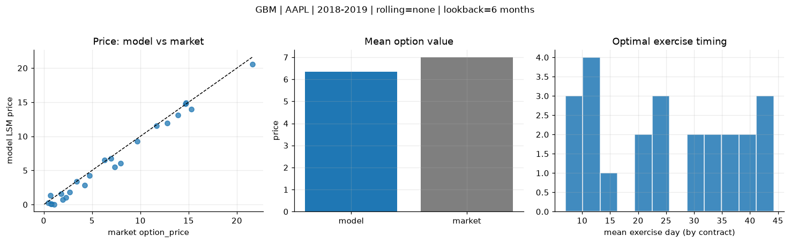
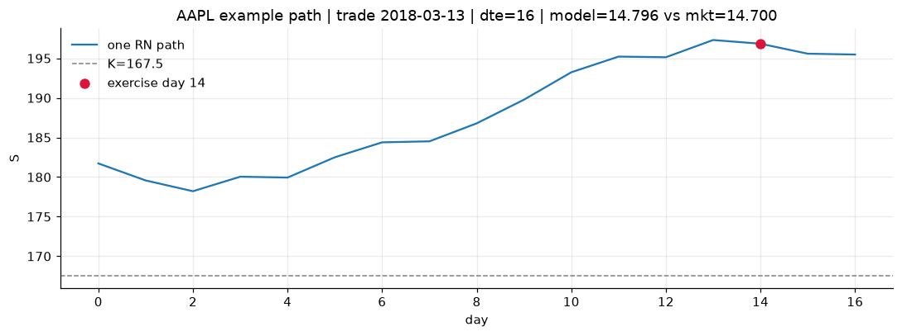
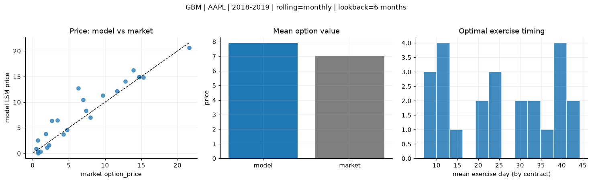
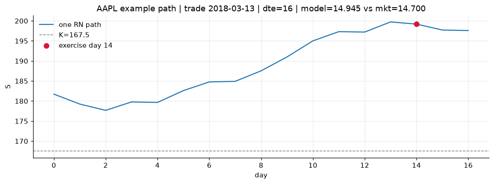
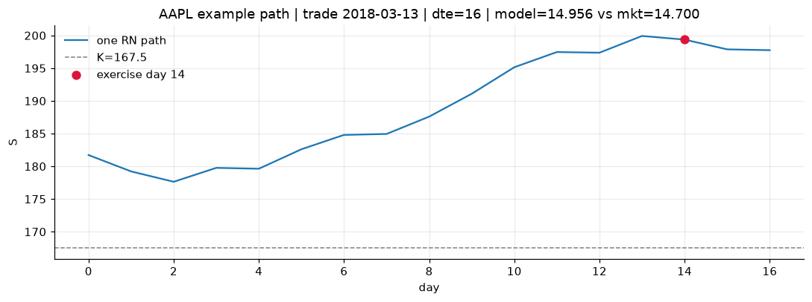

# Optimal stopping — GBM — 2018-2019 — AAPL

**Model:** GBM  
**Underlying:** AAPL  
**Regime / period:** 2018-2019  
**Lookback:** 6 months (fixed)  
**Rolling modes:** none, monthly, daily  
**Pricing:** LSM American calls on AAPL | n_paths=2000 | seed=42 | contracts=24

## Comparison (same contracts, same lookback)

| Rolling | RMSE | MAE | Bias (model−mkt) | Mean early-ex frac | Cal updates | Cal s | LSM s |
|---------|-----:|----:|-----------------:|-------------------:|------------:|------:|------:|
| `none` | 0.9192 | 0.7432 | -0.6415 | 0.239 | 1 | 0.0 | 0.2 |
| `monthly` | 2.0397 | 1.4420 | 0.9101 | 0.233 | 25 | 0.0 | 0.1 |
| `daily` | 1.8064 | 1.2107 | 0.8674 | 0.237 | 503 | 0.1 | 0.1 |

**Lowest RMSE (this study):** `none` = 0.9192

## Rolling = `none`

- **RMSE:** 0.9192  
- **MAE:** 0.7432  
- **Bias:** -0.6415  
- **Mean early-exercise fraction:** 0.239  
- **Calibration updates (AAPL):** 1

Contract errors (compact)

| date | K | dte | market | model | error | early_ex |
|------|--:|----:|-------:|------:|------:|---------:|
| 2018-03-13 | 167.5 | 16 | 14.700 | 14.796 | 0.096 | 0.539 |
| 2019-08-15 | 182.5 | 15 | 21.625 | 20.578 | -1.047 | 0.337 |
| 2018-12-04 | 175 | 38 | 12.800 | 11.910 | -0.890 | 0.424 |
| 2018-12-04 | 177.5 | 24 | 9.675 | 9.263 | -0.412 | 0.301 |
| 2019-07-18 | 192.5 | 43 | 13.925 | 13.115 | -0.810 | 0.505 |
| 2018-03-13 | 172.5 | 45 | 11.650 | 11.541 | -0.109 | 0.559 |
| 2018-03-27 | 170 | 10 | 4.750 | 4.250 | -0.500 | 0.317 |
| 2019-02-15 | 170 | 14 | 3.425 | 3.371 | -0.054 | 0.158 |
| 2019-07-25 | 207.5 | 36 | 6.975 | 6.794 | -0.181 | 0.186 |
| 2019-08-15 | 200 | 22 | 7.975 | 6.068 | -1.907 | 0.287 |
| 2019-02-08 | 170 | 49 | 6.300 | 6.545 | 0.245 | 0.334 |
| 2019-09-27 | 222.5 | 42 | 7.350 | 5.490 | -1.860 | 0.278 |
| 2019-10-04 | 230 | 7 | 0.465 | 0.287 | -0.178 | 0.002 |
| 2018-12-26 | 157.5 | 9 | 1.095 | 0.050 | -1.045 | 0.004 |
| 2018-10-15 | 232.5 | 39 | 4.250 | 2.860 | -1.390 | 0.000 |
| 2018-06-07 | 202.5 | 22 | 0.695 | 1.378 | 0.683 | 0.011 |
| 2019-06-19 | 212.5 | 44 | 2.670 | 1.845 | -0.825 | 0.110 |
| 2019-09-20 | 237.5 | 42 | 1.790 | 1.545 | -0.245 | 0.085 |
| 2018-10-22 | 235 | 32 | 2.285 | 1.069 | -1.216 | 0.060 |
| 2018-01-29 | 185 | 11 | 0.775 | 0.071 | -0.704 | 0.001 |
| 2018-10-22 | 235 | 25 | 1.975 | 0.710 | -1.265 | 0.065 |
| 2018-11-05 | 222.5 | 11 | 0.730 | 0.104 | -0.626 | 0.015 |
| 2018-02-27 | 165 | 24 | 14.725 | 14.921 | 0.196 | 0.578 |
| 2018-04-25 | 150 | 51 | 15.300 | 13.946 | -1.354 | 0.592 |

## Rolling = `monthly`

- **RMSE:** 2.0397  
- **MAE:** 1.4420  
- **Bias:** 0.9101  
- **Mean early-exercise fraction:** 0.233  
- **Calibration updates (AAPL):** 25

Contract errors (compact)

| date | K | dte | market | model | error | early_ex |
|------|--:|----:|-------:|------:|------:|---------:|
| 2018-03-13 | 167.5 | 16 | 14.700 | 14.945 | 0.245 | 0.513 |
| 2019-08-15 | 182.5 | 15 | 21.625 | 20.646 | -0.979 | 0.320 |
| 2018-12-04 | 175 | 38 | 12.800 | 14.038 | 1.238 | 0.450 |
| 2018-12-04 | 177.5 | 24 | 9.675 | 11.283 | 1.608 | 0.275 |
| 2019-07-18 | 192.5 | 43 | 13.925 | 16.272 | 2.347 | 0.396 |
| 2018-03-13 | 172.5 | 45 | 11.650 | 12.187 | 0.537 | 0.549 |
| 2018-03-27 | 170 | 10 | 4.750 | 4.598 | -0.152 | 0.272 |
| 2019-02-15 | 170 | 14 | 3.425 | 6.469 | 3.044 | 0.166 |
| 2019-07-25 | 207.5 | 36 | 6.975 | 10.453 | 3.478 | 0.174 |
| 2019-08-15 | 200 | 22 | 7.975 | 7.036 | -0.939 | 0.276 |
| 2019-02-08 | 170 | 49 | 6.300 | 12.715 | 6.415 | 0.314 |
| 2019-09-27 | 222.5 | 42 | 7.350 | 8.378 | 1.028 | 0.284 |
| 2019-10-04 | 230 | 7 | 0.465 | 0.915 | 0.450 | 0.033 |
| 2018-12-26 | 157.5 | 9 | 1.095 | 0.371 | -0.724 | 0.022 |
| 2018-10-15 | 232.5 | 39 | 4.250 | 3.736 | -0.514 | 0.000 |
| 2018-06-07 | 202.5 | 22 | 0.695 | 2.555 | 1.860 | 0.013 |
| 2019-06-19 | 212.5 | 44 | 2.670 | 6.386 | 3.716 | 0.176 |
| 2019-09-20 | 237.5 | 42 | 1.790 | 3.824 | 2.034 | 0.111 |
| 2018-10-22 | 235 | 32 | 2.285 | 1.609 | -0.676 | 0.074 |
| 2018-01-29 | 185 | 11 | 0.775 | 0.071 | -0.704 | 0.001 |
| 2018-10-22 | 235 | 25 | 1.975 | 1.163 | -0.812 | 0.078 |
| 2018-11-05 | 222.5 | 11 | 0.730 | 0.316 | -0.414 | 0.019 |
| 2018-02-27 | 165 | 24 | 14.725 | 14.952 | 0.227 | 0.573 |
| 2018-04-25 | 150 | 51 | 15.300 | 14.831 | -0.469 | 0.503 |

## Rolling = `daily`

- **RMSE:** 1.8064  
- **MAE:** 1.2107  
- **Bias:** 0.8674  
- **Mean early-exercise fraction:** 0.237  
- **Calibration updates (AAPL):** 503

Contract errors (compact)

| date | K | dte | market | model | error | early_ex |
|------|--:|----:|-------:|------:|------:|---------:|
| 2018-03-13 | 167.5 | 16 | 14.700 | 14.956 | 0.256 | 0.510 |
| 2019-08-15 | 182.5 | 15 | 21.625 | 20.702 | -0.923 | 0.358 |
| 2018-12-04 | 175 | 38 | 12.800 | 14.209 | 1.409 | 0.445 |
| 2018-12-04 | 177.5 | 24 | 9.675 | 11.511 | 1.836 | 0.269 |
| 2019-07-18 | 192.5 | 43 | 13.925 | 14.684 | 0.759 | 0.463 |
| 2018-03-13 | 172.5 | 45 | 11.650 | 12.243 | 0.593 | 0.548 |
| 2018-03-27 | 170 | 10 | 4.750 | 4.834 | 0.084 | 0.241 |
| 2019-02-15 | 170 | 14 | 3.425 | 6.310 | 2.885 | 0.165 |
| 2019-07-25 | 207.5 | 36 | 6.975 | 8.736 | 1.761 | 0.184 |
| 2019-08-15 | 200 | 22 | 7.975 | 7.665 | -0.310 | 0.282 |
| 2019-02-08 | 170 | 49 | 6.300 | 12.459 | 6.159 | 0.314 |
| 2019-09-27 | 222.5 | 42 | 7.350 | 8.242 | 0.892 | 0.287 |
| 2019-10-04 | 230 | 7 | 0.465 | 0.965 | 0.500 | 0.034 |
| 2018-12-26 | 157.5 | 9 | 1.095 | 0.621 | -0.474 | 0.035 |
| 2018-10-15 | 232.5 | 39 | 4.250 | 4.288 | 0.038 | 0.015 |
| 2018-06-07 | 202.5 | 22 | 0.695 | 2.579 | 1.884 | 0.015 |
| 2019-06-19 | 212.5 | 44 | 2.670 | 5.950 | 3.280 | 0.177 |
| 2019-09-20 | 237.5 | 42 | 1.790 | 3.899 | 2.109 | 0.111 |
| 2018-10-22 | 235 | 32 | 2.285 | 1.766 | -0.519 | 0.077 |
| 2018-01-29 | 185 | 11 | 0.775 | 0.082 | -0.693 | 0.002 |
| 2018-10-22 | 235 | 25 | 1.975 | 1.282 | -0.693 | 0.083 |
| 2018-11-05 | 222.5 | 11 | 0.730 | 0.390 | -0.340 | 0.025 |
| 2018-02-27 | 165 | 24 | 14.725 | 15.216 | 0.491 | 0.555 |
| 2018-04-25 | 150 | 51 | 15.300 | 15.132 | -0.168 | 0.483 |

