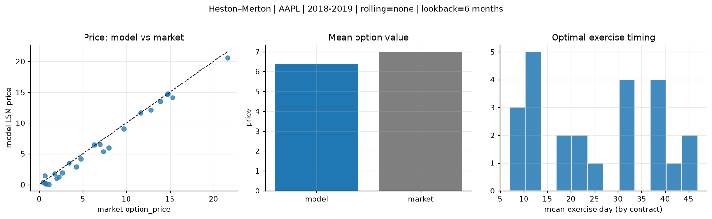
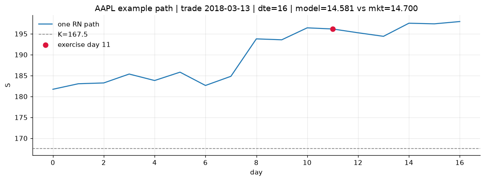
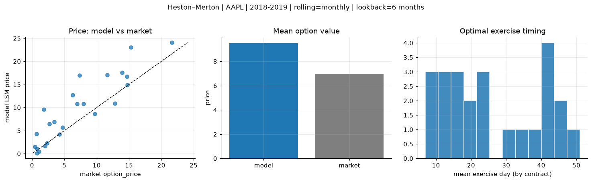
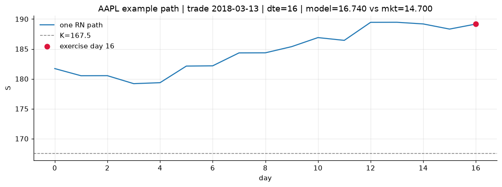
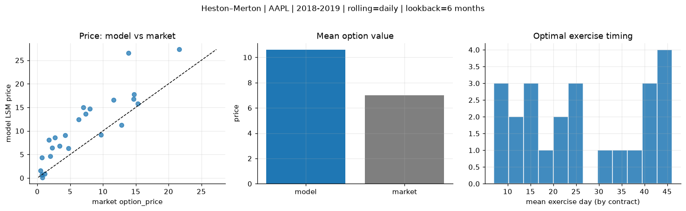
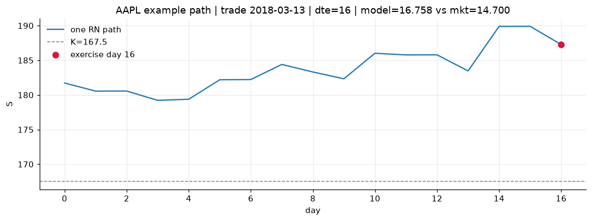

# Optimal stopping — Heston–Merton — 2018-2019 — AAPL

**Model:** Heston–Merton  
**Underlying:** AAPL  
**Regime / period:** 2018-2019  
**Lookback:** 6 months (fixed)  
**Rolling modes:** none, monthly, daily  
**Pricing:** LSM American calls on AAPL | n_paths=2000 | seed=42 | contracts=24

## Comparison (same contracts, same lookback)

| Rolling | RMSE | MAE | Bias (model−mkt) | Mean early-ex frac | Cal updates | Cal s | LSM s |
|---------|-----:|----:|-----------------:|-------------------:|------------:|------:|------:|
| `none` | 0.8859 | 0.6920 | -0.5963 | 0.284 | 1 | 0.0 | 0.1 |
| `monthly` | 3.9565 | 2.8959 | 2.5233 | 0.157 | 25 | 0.0 | 0.1 |
| `daily` | 4.8659 | 3.8441 | 3.6048 | 0.125 | 503 | 1.0 | 0.2 |

**Lowest RMSE (this study):** `none` = 0.8859

## Rolling = `none`

- **RMSE:** 0.8859  
- **MAE:** 0.6920  
- **Bias:** -0.5963  
- **Mean early-exercise fraction:** 0.284  
- **Calibration updates (AAPL):** 1

Contract errors (compact)

| date | K | dte | market | model | error | early_ex |
|------|--:|----:|-------:|------:|------:|---------:|
| 2018-03-13 | 167.5 | 16 | 14.700 | 14.581 | -0.119 | 0.868 |
| 2019-08-15 | 182.5 | 15 | 21.625 | 20.536 | -1.089 | 0.786 |
| 2018-12-04 | 175 | 38 | 12.800 | 12.147 | -0.653 | 0.054 |
| 2018-12-04 | 177.5 | 24 | 9.675 | 9.064 | -0.611 | 0.618 |
| 2019-07-18 | 192.5 | 43 | 13.925 | 13.530 | -0.395 | 0.463 |
| 2018-03-13 | 172.5 | 45 | 11.650 | 11.659 | 0.009 | 0.480 |
| 2018-03-27 | 170 | 10 | 4.750 | 4.195 | -0.555 | 0.220 |
| 2019-02-15 | 170 | 14 | 3.425 | 3.512 | 0.087 | 0.229 |
| 2019-07-25 | 207.5 | 36 | 6.975 | 6.556 | -0.419 | 0.441 |
| 2019-08-15 | 200 | 22 | 7.975 | 5.998 | -1.977 | 0.175 |
| 2019-02-08 | 170 | 49 | 6.300 | 6.488 | 0.188 | 0.206 |
| 2019-09-27 | 222.5 | 42 | 7.350 | 5.379 | -1.971 | 0.422 |
| 2019-10-04 | 230 | 7 | 0.465 | 0.383 | -0.082 | 0.013 |
| 2018-12-26 | 157.5 | 9 | 1.095 | 0.089 | -1.006 | 0.006 |
| 2018-10-15 | 232.5 | 39 | 4.250 | 2.848 | -1.402 | 0.248 |
| 2018-06-07 | 202.5 | 22 | 0.695 | 1.493 | 0.798 | 0.080 |
| 2019-06-19 | 212.5 | 44 | 2.670 | 1.946 | -0.724 | 0.101 |
| 2019-09-20 | 237.5 | 42 | 1.790 | 1.746 | -0.044 | 0.092 |
| 2018-10-22 | 235 | 32 | 2.285 | 1.221 | -1.064 | 0.056 |
| 2018-01-29 | 185 | 11 | 0.775 | 0.156 | -0.619 | 0.024 |
| 2018-10-22 | 235 | 25 | 1.975 | 0.963 | -1.012 | 0.054 |
| 2018-11-05 | 222.5 | 11 | 0.730 | 0.184 | -0.546 | 0.010 |
| 2018-02-27 | 165 | 24 | 14.725 | 14.792 | 0.067 | 0.573 |
| 2018-04-25 | 150 | 51 | 15.300 | 14.129 | -1.171 | 0.588 |

## Rolling = `monthly`

- **RMSE:** 3.9565  
- **MAE:** 2.8959  
- **Bias:** 2.5233  
- **Mean early-exercise fraction:** 0.157  
- **Calibration updates (AAPL):** 25

Contract errors (compact)

| date | K | dte | market | model | error | early_ex |
|------|--:|----:|-------:|------:|------:|---------:|
| 2018-03-13 | 167.5 | 16 | 14.700 | 16.740 | 2.040 | 0.006 |
| 2019-08-15 | 182.5 | 15 | 21.625 | 24.049 | 2.424 | 0.000 |
| 2018-12-04 | 175 | 38 | 12.800 | 10.902 | -1.898 | 0.661 |
| 2018-12-04 | 177.5 | 24 | 9.675 | 8.671 | -1.004 | 0.598 |
| 2019-07-18 | 192.5 | 43 | 13.925 | 17.544 | 3.619 | 0.319 |
| 2018-03-13 | 172.5 | 45 | 11.650 | 17.019 | 5.369 | 0.024 |
| 2018-03-27 | 170 | 10 | 4.750 | 5.707 | 0.957 | 0.130 |
| 2019-02-15 | 170 | 14 | 3.425 | 6.929 | 3.504 | 0.099 |
| 2019-07-25 | 207.5 | 36 | 6.975 | 10.833 | 3.858 | 0.344 |
| 2019-08-15 | 200 | 22 | 7.975 | 10.788 | 2.813 | 0.001 |
| 2019-02-08 | 170 | 49 | 6.300 | 12.709 | 6.409 | 0.301 |
| 2019-09-27 | 222.5 | 42 | 7.350 | 16.995 | 9.645 | 0.000 |
| 2019-10-04 | 230 | 7 | 0.465 | 1.539 | 1.074 | 0.005 |
| 2018-12-26 | 157.5 | 9 | 1.095 | 0.453 | -0.642 | 0.021 |
| 2018-10-15 | 232.5 | 39 | 4.250 | 4.227 | -0.023 | 0.159 |
| 2018-06-07 | 202.5 | 22 | 0.695 | 4.257 | 3.562 | 0.009 |
| 2019-06-19 | 212.5 | 44 | 2.670 | 6.470 | 3.800 | 0.259 |
| 2019-09-20 | 237.5 | 42 | 1.790 | 9.541 | 7.751 | 0.001 |
| 2018-10-22 | 235 | 32 | 2.285 | 2.262 | -0.023 | 0.083 |
| 2018-01-29 | 185 | 11 | 0.775 | 0.156 | -0.619 | 0.024 |
| 2018-10-22 | 235 | 25 | 1.975 | 1.712 | -0.263 | 0.140 |
| 2018-11-05 | 222.5 | 11 | 0.730 | 1.086 | 0.356 | 0.034 |
| 2018-02-27 | 165 | 24 | 14.725 | 14.850 | 0.125 | 0.561 |
| 2018-04-25 | 150 | 51 | 15.300 | 23.024 | 7.724 | 0.000 |

## Rolling = `daily`

- **RMSE:** 4.8659  
- **MAE:** 3.8441  
- **Bias:** 3.6048  
- **Mean early-exercise fraction:** 0.125  
- **Calibration updates (AAPL):** 503

Contract errors (compact)

| date | K | dte | market | model | error | early_ex |
|------|--:|----:|-------:|------:|------:|---------:|
| 2018-03-13 | 167.5 | 16 | 14.700 | 16.758 | 2.058 | 0.005 |
| 2019-08-15 | 182.5 | 15 | 21.625 | 27.290 | 5.665 | 0.004 |
| 2018-12-04 | 175 | 38 | 12.800 | 11.254 | -1.546 | 0.521 |
| 2018-12-04 | 177.5 | 24 | 9.675 | 9.203 | -0.472 | 0.464 |
| 2019-07-18 | 192.5 | 43 | 13.925 | 26.515 | 12.590 | 0.006 |
| 2018-03-13 | 172.5 | 45 | 11.650 | 16.598 | 4.948 | 0.268 |
| 2018-03-27 | 170 | 10 | 4.750 | 6.313 | 1.563 | 0.062 |
| 2019-02-15 | 170 | 14 | 3.425 | 6.798 | 3.373 | 0.105 |
| 2019-07-25 | 207.5 | 36 | 6.975 | 15.002 | 8.027 | 0.002 |
| 2019-08-15 | 200 | 22 | 7.975 | 14.672 | 6.697 | 0.000 |
| 2019-02-08 | 170 | 49 | 6.300 | 12.475 | 6.175 | 0.299 |
| 2019-09-27 | 222.5 | 42 | 7.350 | 13.595 | 6.245 | 0.119 |
| 2019-10-04 | 230 | 7 | 0.465 | 1.588 | 1.123 | 0.004 |
| 2018-12-26 | 157.5 | 9 | 1.095 | 0.885 | -0.210 | 0.023 |
| 2018-10-15 | 232.5 | 39 | 4.250 | 9.058 | 4.808 | 0.002 |
| 2018-06-07 | 202.5 | 22 | 0.695 | 4.311 | 3.616 | 0.008 |
| 2019-06-19 | 212.5 | 44 | 2.670 | 8.586 | 5.916 | 0.121 |
| 2019-09-20 | 237.5 | 42 | 1.790 | 8.096 | 6.306 | 0.001 |
| 2018-10-22 | 235 | 32 | 2.285 | 6.433 | 4.148 | 0.011 |
| 2018-01-29 | 185 | 11 | 0.775 | 0.142 | -0.633 | 0.015 |
| 2018-10-22 | 235 | 25 | 1.975 | 4.634 | 2.659 | 0.002 |
| 2018-11-05 | 222.5 | 11 | 0.730 | 0.719 | -0.011 | 0.035 |
| 2018-02-27 | 165 | 24 | 14.725 | 17.717 | 2.992 | 0.189 |
| 2018-04-25 | 150 | 51 | 15.300 | 15.781 | 0.481 | 0.729 |

