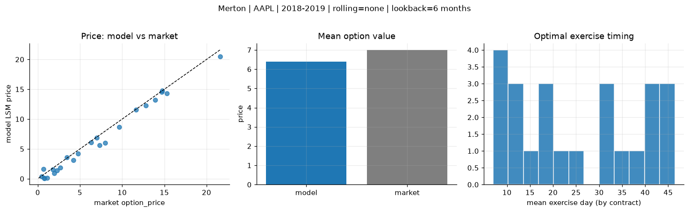
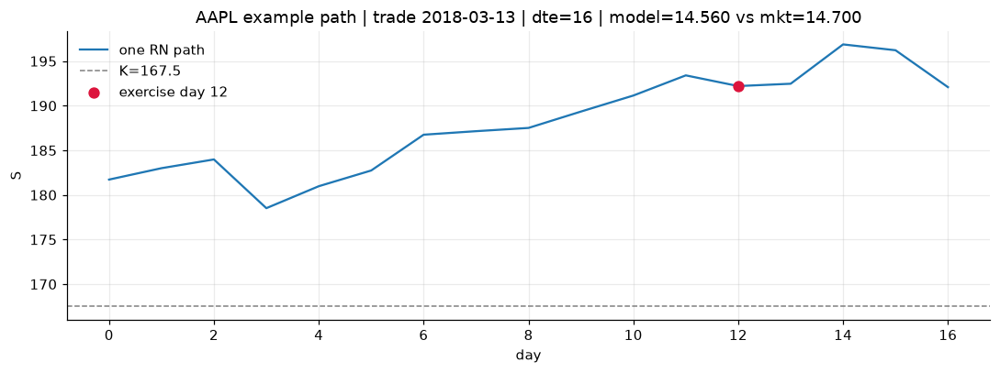
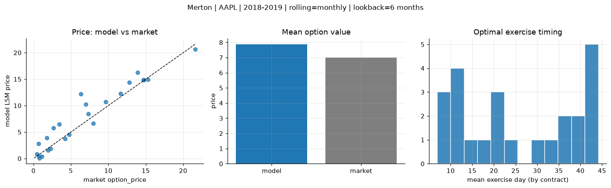
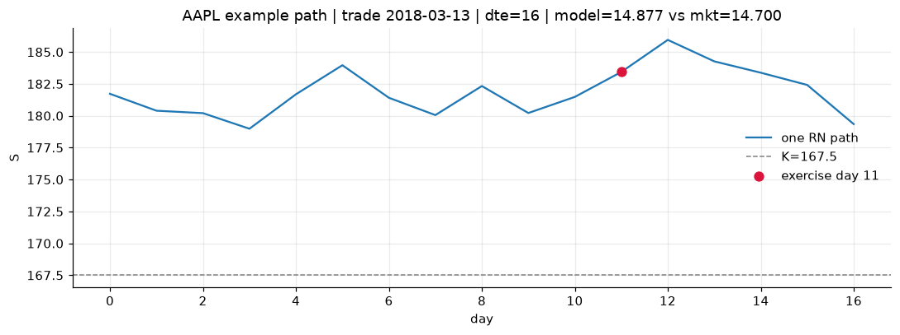
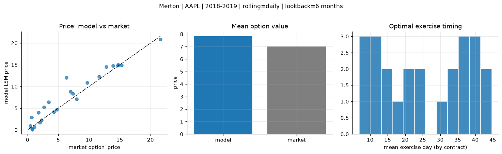
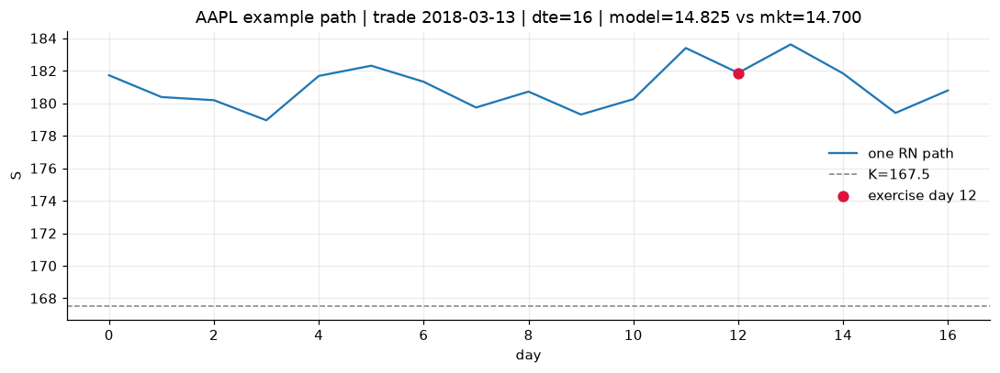

# Optimal stopping — Merton — 2018-2019 — AAPL

**Model:** Merton  
**Underlying:** AAPL  
**Regime / period:** 2018-2019  
**Lookback:** 6 months (fixed)  
**Rolling modes:** none, monthly, daily  
**Pricing:** LSM American calls on AAPL | n_paths=2000 | seed=42 | contracts=24

## Comparison (same contracts, same lookback)

| Rolling | RMSE | MAE | Bias (model−mkt) | Mean early-ex frac | Cal updates | Cal s | LSM s |
|---------|-----:|----:|-----------------:|-------------------:|------------:|------:|------:|
| `none` | 0.8663 | 0.6983 | -0.6017 | 0.249 | 1 | 0.0 | 0.1 |
| `monthly` | 1.9220 | 1.3646 | 0.8748 | 0.246 | 25 | 0.0 | 0.1 |
| `daily` | 1.7155 | 1.1588 | 0.8179 | 0.245 | 503 | 0.1 | 0.1 |

**Lowest RMSE (this study):** `none` = 0.8663

## Rolling = `none`

- **RMSE:** 0.8663  
- **MAE:** 0.6983  
- **Bias:** -0.6017  
- **Mean early-exercise fraction:** 0.249  
- **Calibration updates (AAPL):** 1

Contract errors (compact)

| date | K | dte | market | model | error | early_ex |
|------|--:|----:|-------:|------:|------:|---------:|
| 2018-03-13 | 167.5 | 16 | 14.700 | 14.560 | -0.140 | 0.666 |
| 2019-08-15 | 182.5 | 15 | 21.625 | 20.489 | -1.136 | 0.855 |
| 2018-12-04 | 175 | 38 | 12.800 | 12.237 | -0.563 | 0.322 |
| 2018-12-04 | 177.5 | 24 | 9.675 | 8.692 | -0.983 | 0.481 |
| 2019-07-18 | 192.5 | 43 | 13.925 | 13.233 | -0.692 | 0.558 |
| 2018-03-13 | 172.5 | 45 | 11.650 | 11.567 | -0.083 | 0.048 |
| 2018-03-27 | 170 | 10 | 4.750 | 4.171 | -0.579 | 0.332 |
| 2019-02-15 | 170 | 14 | 3.425 | 3.574 | 0.149 | 0.126 |
| 2019-07-25 | 207.5 | 36 | 6.975 | 6.879 | -0.096 | 0.366 |
| 2019-08-15 | 200 | 22 | 7.975 | 5.989 | -1.986 | 0.244 |
| 2019-02-08 | 170 | 49 | 6.300 | 6.072 | -0.228 | 0.325 |
| 2019-09-27 | 222.5 | 42 | 7.350 | 5.630 | -1.720 | 0.140 |
| 2019-10-04 | 230 | 7 | 0.465 | 0.414 | -0.051 | 0.004 |
| 2018-12-26 | 157.5 | 9 | 1.095 | 0.111 | -0.984 | 0.007 |
| 2018-10-15 | 232.5 | 39 | 4.250 | 3.105 | -1.145 | 0.041 |
| 2018-06-07 | 202.5 | 22 | 0.695 | 1.656 | 0.961 | 0.126 |
| 2019-06-19 | 212.5 | 44 | 2.670 | 1.878 | -0.792 | 0.075 |
| 2019-09-20 | 237.5 | 42 | 1.790 | 1.582 | -0.208 | 0.096 |
| 2018-10-22 | 235 | 32 | 2.285 | 1.413 | -0.872 | 0.062 |
| 2018-01-29 | 185 | 11 | 0.775 | 0.098 | -0.677 | 0.013 |
| 2018-10-22 | 235 | 25 | 1.975 | 0.904 | -1.071 | 0.053 |
| 2018-11-05 | 222.5 | 11 | 0.730 | 0.155 | -0.575 | 0.018 |
| 2018-02-27 | 165 | 24 | 14.725 | 14.774 | 0.049 | 0.409 |
| 2018-04-25 | 150 | 51 | 15.300 | 14.282 | -1.018 | 0.609 |

## Rolling = `monthly`

- **RMSE:** 1.9220  
- **MAE:** 1.3646  
- **Bias:** 0.8748  
- **Mean early-exercise fraction:** 0.246  
- **Calibration updates (AAPL):** 25

Contract errors (compact)

| date | K | dte | market | model | error | early_ex |
|------|--:|----:|-------:|------:|------:|---------:|
| 2018-03-13 | 167.5 | 16 | 14.700 | 14.877 | 0.177 | 0.739 |
| 2019-08-15 | 182.5 | 15 | 21.625 | 20.664 | -0.961 | 0.778 |
| 2018-12-04 | 175 | 38 | 12.800 | 14.346 | 1.546 | 0.316 |
| 2018-12-04 | 177.5 | 24 | 9.675 | 10.726 | 1.051 | 0.211 |
| 2019-07-18 | 192.5 | 43 | 13.925 | 16.268 | 2.343 | 0.441 |
| 2018-03-13 | 172.5 | 45 | 11.650 | 12.254 | 0.604 | 0.281 |
| 2018-03-27 | 170 | 10 | 4.750 | 4.544 | -0.206 | 0.335 |
| 2019-02-15 | 170 | 14 | 3.425 | 6.515 | 3.090 | 0.202 |
| 2019-07-25 | 207.5 | 36 | 6.975 | 10.226 | 3.251 | 0.142 |
| 2019-08-15 | 200 | 22 | 7.975 | 6.616 | -1.359 | 0.220 |
| 2019-02-08 | 170 | 49 | 6.300 | 12.183 | 5.883 | 0.314 |
| 2019-09-27 | 222.5 | 42 | 7.350 | 8.421 | 1.071 | 0.224 |
| 2019-10-04 | 230 | 7 | 0.465 | 0.870 | 0.405 | 0.054 |
| 2018-12-26 | 157.5 | 9 | 1.095 | 0.377 | -0.718 | 0.015 |
| 2018-10-15 | 232.5 | 39 | 4.250 | 3.719 | -0.531 | 0.142 |
| 2018-06-07 | 202.5 | 22 | 0.695 | 2.838 | 2.143 | 0.140 |
| 2019-06-19 | 212.5 | 44 | 2.670 | 5.757 | 3.087 | 0.190 |
| 2019-09-20 | 237.5 | 42 | 1.790 | 3.917 | 2.127 | 0.129 |
| 2018-10-22 | 235 | 32 | 2.285 | 1.859 | -0.426 | 0.156 |
| 2018-01-29 | 185 | 11 | 0.775 | 0.098 | -0.677 | 0.013 |
| 2018-10-22 | 235 | 25 | 1.975 | 1.588 | -0.387 | 0.056 |
| 2018-11-05 | 222.5 | 11 | 0.730 | 0.458 | -0.272 | 0.029 |
| 2018-02-27 | 165 | 24 | 14.725 | 14.820 | 0.095 | 0.396 |
| 2018-04-25 | 150 | 51 | 15.300 | 14.960 | -0.340 | 0.393 |

## Rolling = `daily`

- **RMSE:** 1.7155  
- **MAE:** 1.1588  
- **Bias:** 0.8179  
- **Mean early-exercise fraction:** 0.245  
- **Calibration updates (AAPL):** 503

Contract errors (compact)

| date | K | dte | market | model | error | early_ex |
|------|--:|----:|-------:|------:|------:|---------:|
| 2018-03-13 | 167.5 | 16 | 14.700 | 14.825 | 0.125 | 0.615 |
| 2019-08-15 | 182.5 | 15 | 21.625 | 20.874 | -0.751 | 0.335 |
| 2018-12-04 | 175 | 38 | 12.800 | 14.518 | 1.718 | 0.230 |
| 2018-12-04 | 177.5 | 24 | 9.675 | 10.873 | 1.198 | 0.017 |
| 2019-07-18 | 192.5 | 43 | 13.925 | 14.744 | 0.819 | 0.483 |
| 2018-03-13 | 172.5 | 45 | 11.650 | 12.278 | 0.628 | 0.734 |
| 2018-03-27 | 170 | 10 | 4.750 | 4.678 | -0.072 | 0.270 |
| 2019-02-15 | 170 | 14 | 3.425 | 6.401 | 2.976 | 0.199 |
| 2019-07-25 | 207.5 | 36 | 6.975 | 8.858 | 1.883 | 0.179 |
| 2019-08-15 | 200 | 22 | 7.975 | 7.120 | -0.855 | 0.345 |
| 2019-02-08 | 170 | 49 | 6.300 | 12.042 | 5.742 | 0.311 |
| 2019-09-27 | 222.5 | 42 | 7.350 | 8.339 | 0.989 | 0.218 |
| 2019-10-04 | 230 | 7 | 0.465 | 0.919 | 0.454 | 0.060 |
| 2018-12-26 | 157.5 | 9 | 1.095 | 0.704 | -0.391 | 0.021 |
| 2018-10-15 | 232.5 | 39 | 4.250 | 4.121 | -0.129 | 0.085 |
| 2018-06-07 | 202.5 | 22 | 0.695 | 2.859 | 2.164 | 0.140 |
| 2019-06-19 | 212.5 | 44 | 2.670 | 5.233 | 2.563 | 0.126 |
| 2019-09-20 | 237.5 | 42 | 1.790 | 4.006 | 2.216 | 0.131 |
| 2018-10-22 | 235 | 32 | 2.285 | 2.214 | -0.071 | 0.096 |
| 2018-01-29 | 185 | 11 | 0.775 | 0.090 | -0.685 | 0.011 |
| 2018-10-22 | 235 | 25 | 1.975 | 1.664 | -0.311 | 0.082 |
| 2018-11-05 | 222.5 | 11 | 0.730 | 0.308 | -0.422 | 0.021 |
| 2018-02-27 | 165 | 24 | 14.725 | 14.971 | 0.246 | 0.630 |
| 2018-04-25 | 150 | 51 | 15.300 | 14.896 | -0.404 | 0.547 |

