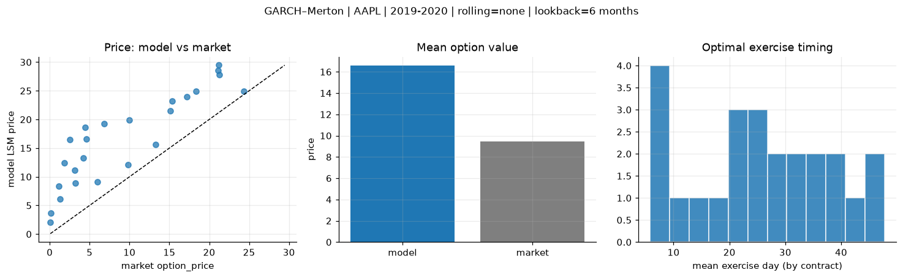
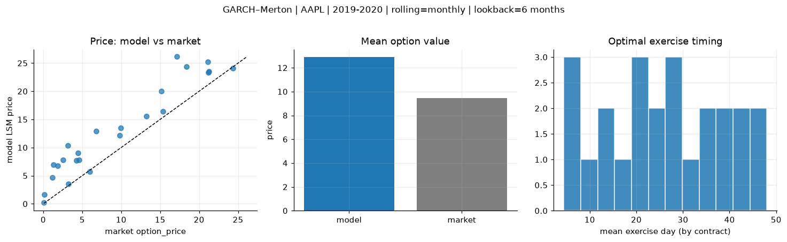
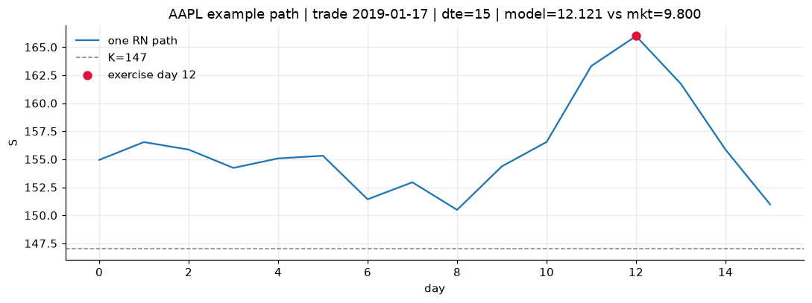
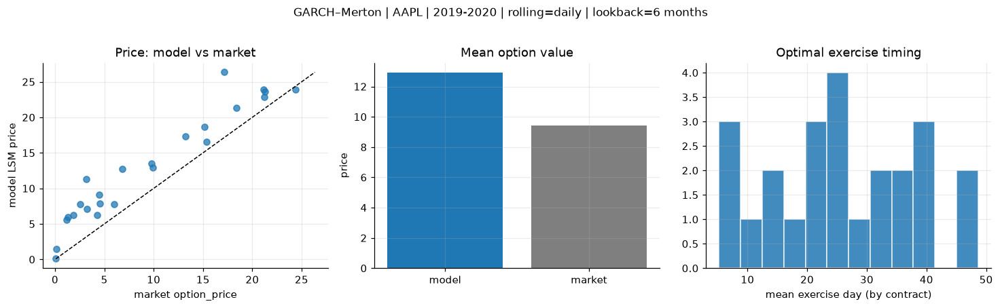
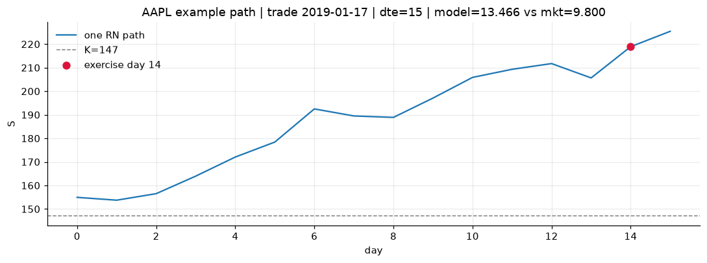

# Optimal stopping — GARCH–Merton — 2019-2020 — AAPL

**Model:** GARCH–Merton  
**Underlying:** AAPL  
**Regime / period:** 2019-2020  
**Lookback:** 6 months (fixed)  
**Rolling modes:** none, monthly, daily  
**Pricing:** LSM American calls on AAPL | n_paths=2000 | seed=42 | contracts=24

## Comparison (same contracts, same lookback)

| Rolling | RMSE | MAE | Bias (model−mkt) | Mean early-ex frac | Cal updates | Cal s | LSM s |
|---------|-----:|----:|-----------------:|-------------------:|------------:|------:|------:|
| `none` | 8.0466 | 7.1471 | 7.1471 | 0.208 | 1 | 0.0 | 0.1 |
| `monthly` | 4.1918 | 3.5054 | 3.4553 | 0.229 | 25 | 0.8 | 0.1 |
| `daily` | 4.1158 | 3.5165 | 3.4759 | 0.221 | 505 | 12.5 | 0.2 |

**Lowest RMSE (this study):** `daily` = 4.1158

## Rolling = `none`

- **RMSE:** 8.0466  
- **MAE:** 7.1471  
- **Bias:** 7.1471  
- **Mean early-exercise fraction:** 0.208  
- **Calibration updates (AAPL):** 1

Contract errors (compact)

| date | K | dte | market | model | error | early_ex |
|------|--:|----:|-------:|------:|------:|---------:|
| 2019-01-17 | 147 | 15 | 9.800 | 12.121 | 2.321 | 0.433 |
| 2019-10-25 | 220 | 7 | 24.375 | 24.897 | 0.522 | 0.389 |
| 2019-06-26 | 180 | 37 | 18.375 | 24.897 | 6.522 | 0.263 |
| 2019-06-26 | 182.5 | 30 | 15.125 | 21.484 | 6.359 | 0.351 |
| 2019-10-11 | 212.5 | 42 | 21.200 | 29.467 | 8.267 | 0.450 |
| 2019-02-01 | 150 | 42 | 17.175 | 23.927 | 6.752 | 0.303 |
| 2019-02-08 | 175 | 14 | 1.305 | 6.099 | 4.794 | 0.135 |
| 2019-08-08 | 195 | 8 | 5.975 | 9.093 | 3.118 | 0.104 |
| 2019-10-18 | 230 | 28 | 9.950 | 19.915 | 9.965 | 0.241 |
| 2019-10-25 | 250 | 28 | 4.250 | 13.332 | 9.082 | 0.200 |
| 2019-09-06 | 215 | 49 | 6.800 | 19.311 | 12.511 | 0.146 |
| 2019-11-01 | 255 | 42 | 4.475 | 18.575 | 14.100 | 0.210 |
| 2019-11-15 | 282.5 | 7 | 0.080 | 2.098 | 2.018 | 0.050 |
| 2019-07-03 | 212.5 | 9 | 0.140 | 3.714 | 3.574 | 0.066 |
| 2019-06-05 | 187.5 | 37 | 3.175 | 11.185 | 8.010 | 0.178 |
| 2019-03-25 | 207.5 | 32 | 1.145 | 8.313 | 7.168 | 0.017 |
| 2019-09-27 | 240 | 49 | 1.865 | 12.461 | 10.596 | 0.151 |
| 2019-11-01 | 260 | 42 | 2.545 | 16.485 | 13.940 | 0.184 |
| 2019-08-08 | 205 | 22 | 3.225 | 8.927 | 5.702 | 0.085 |
| 2019-01-03 | 147 | 22 | 13.250 | 15.595 | 2.345 | 0.477 |
| 2019-11-01 | 227.5 | 21 | 21.250 | 27.838 | 6.588 | 0.000 |
| 2019-12-16 | 277.5 | 25 | 4.575 | 16.622 | 12.047 | 0.105 |
| 2019-10-18 | 215 | 28 | 21.150 | 28.559 | 7.409 | 0.205 |
| 2019-12-16 | 262.5 | 25 | 15.350 | 23.170 | 7.820 | 0.249 |

## Rolling = `monthly`

- **RMSE:** 4.1918  
- **MAE:** 3.5054  
- **Bias:** 3.4553  
- **Mean early-exercise fraction:** 0.229  
- **Calibration updates (AAPL):** 25

Contract errors (compact)

| date | K | dte | market | model | error | early_ex |
|------|--:|----:|-------:|------:|------:|---------:|
| 2019-01-17 | 147 | 15 | 9.800 | 12.121 | 2.321 | 0.433 |
| 2019-10-25 | 220 | 7 | 24.375 | 24.051 | -0.324 | 0.791 |
| 2019-06-26 | 180 | 37 | 18.375 | 24.379 | 6.004 | 0.465 |
| 2019-06-26 | 182.5 | 30 | 15.125 | 20.006 | 4.881 | 0.394 |
| 2019-10-11 | 212.5 | 42 | 21.200 | 23.367 | 2.167 | 0.356 |
| 2019-02-01 | 150 | 42 | 17.175 | 26.133 | 8.958 | 0.060 |
| 2019-02-08 | 175 | 14 | 1.305 | 6.971 | 5.666 | 0.191 |
| 2019-08-08 | 195 | 8 | 5.975 | 5.698 | -0.277 | 0.256 |
| 2019-10-18 | 230 | 28 | 9.950 | 13.470 | 3.520 | 0.344 |
| 2019-10-25 | 250 | 28 | 4.250 | 7.696 | 3.446 | 0.145 |
| 2019-09-06 | 215 | 49 | 6.800 | 12.925 | 6.125 | 0.224 |
| 2019-11-01 | 255 | 42 | 4.475 | 9.077 | 4.602 | 0.225 |
| 2019-11-15 | 282.5 | 7 | 0.080 | 0.244 | 0.164 | 0.018 |
| 2019-07-03 | 212.5 | 9 | 0.140 | 1.673 | 1.533 | 0.013 |
| 2019-06-05 | 187.5 | 37 | 3.175 | 10.350 | 7.175 | 0.096 |
| 2019-03-25 | 207.5 | 32 | 1.145 | 4.647 | 3.502 | 0.081 |
| 2019-09-27 | 240 | 49 | 1.865 | 6.737 | 4.872 | 0.088 |
| 2019-11-01 | 260 | 42 | 2.545 | 7.774 | 5.229 | 0.217 |
| 2019-08-08 | 205 | 22 | 3.225 | 3.573 | 0.348 | 0.057 |
| 2019-01-03 | 147 | 22 | 13.250 | 15.595 | 2.345 | 0.477 |
| 2019-11-01 | 227.5 | 21 | 21.250 | 23.557 | 2.307 | 0.117 |
| 2019-12-16 | 277.5 | 25 | 4.575 | 7.768 | 3.193 | 0.013 |
| 2019-10-18 | 215 | 28 | 21.150 | 25.242 | 4.092 | 0.061 |
| 2019-12-16 | 262.5 | 25 | 15.350 | 16.425 | 1.075 | 0.371 |

## Rolling = `daily`

- **RMSE:** 4.1158  
- **MAE:** 3.5165  
- **Bias:** 3.4759  
- **Mean early-exercise fraction:** 0.221  
- **Calibration updates (AAPL):** 505

Contract errors (compact)

| date | K | dte | market | model | error | early_ex |
|------|--:|----:|-------:|------:|------:|---------:|
| 2019-01-17 | 147 | 15 | 9.800 | 13.466 | 3.666 | 0.267 |
| 2019-10-25 | 220 | 7 | 24.375 | 23.888 | -0.487 | 0.611 |
| 2019-06-26 | 180 | 37 | 18.375 | 21.300 | 2.925 | 0.514 |
| 2019-06-26 | 182.5 | 30 | 15.125 | 18.675 | 3.550 | 0.257 |
| 2019-10-11 | 212.5 | 42 | 21.200 | 22.828 | 1.628 | 0.566 |
| 2019-02-01 | 150 | 42 | 17.175 | 26.348 | 9.173 | 0.049 |
| 2019-02-08 | 175 | 14 | 1.305 | 5.962 | 4.657 | 0.178 |
| 2019-08-08 | 195 | 8 | 5.975 | 7.732 | 1.757 | 0.139 |
| 2019-10-18 | 230 | 28 | 9.950 | 12.912 | 2.962 | 0.259 |
| 2019-10-25 | 250 | 28 | 4.250 | 6.215 | 1.965 | 0.191 |
| 2019-09-06 | 215 | 49 | 6.800 | 12.721 | 5.921 | 0.038 |
| 2019-11-01 | 255 | 42 | 4.475 | 9.082 | 4.607 | 0.252 |
| 2019-11-15 | 282.5 | 7 | 0.080 | 0.124 | 0.044 | 0.009 |
| 2019-07-03 | 212.5 | 9 | 0.140 | 1.475 | 1.335 | 0.004 |
| 2019-06-05 | 187.5 | 37 | 3.175 | 11.312 | 8.137 | 0.126 |
| 2019-03-25 | 207.5 | 32 | 1.145 | 5.530 | 4.385 | 0.070 |
| 2019-09-27 | 240 | 49 | 1.865 | 6.262 | 4.397 | 0.119 |
| 2019-11-01 | 260 | 42 | 2.545 | 7.813 | 5.268 | 0.221 |
| 2019-08-08 | 205 | 22 | 3.225 | 7.064 | 3.839 | 0.036 |
| 2019-01-03 | 147 | 22 | 13.250 | 17.330 | 4.080 | 0.419 |
| 2019-11-01 | 227.5 | 21 | 21.250 | 23.664 | 2.414 | 0.131 |
| 2019-12-16 | 277.5 | 25 | 4.575 | 7.870 | 3.295 | 0.013 |
| 2019-10-18 | 215 | 28 | 21.150 | 23.884 | 2.734 | 0.487 |
| 2019-12-16 | 262.5 | 25 | 15.350 | 16.519 | 1.169 | 0.353 |

