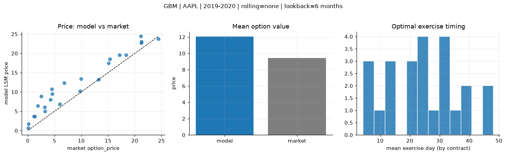
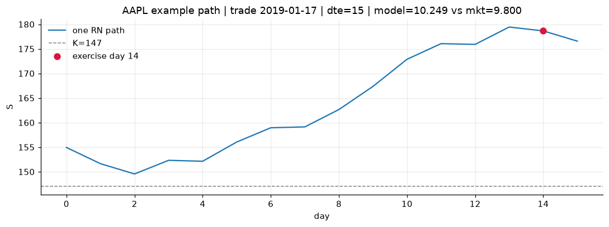
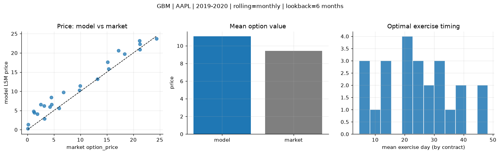
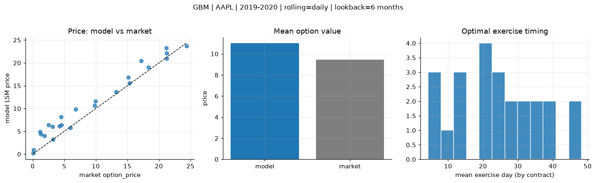
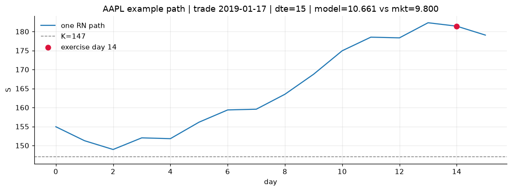

# Optimal stopping — GBM — 2019-2020 — AAPL

**Model:** GBM  
**Underlying:** AAPL  
**Regime / period:** 2019-2020  
**Lookback:** 6 months (fixed)  
**Rolling modes:** none, monthly, daily  
**Pricing:** LSM American calls on AAPL | n_paths=2000 | seed=42 | contracts=24

## Comparison (same contracts, same lookback)

| Rolling | RMSE | MAE | Bias (model−mkt) | Mean early-ex frac | Cal updates | Cal s | LSM s |
|---------|-----:|----:|-----------------:|-------------------:|------------:|------:|------:|
| `none` | 3.2126 | 2.6738 | 2.6192 | 0.295 | 1 | 0.0 | 0.1 |
| `monthly` | 2.1914 | 1.7784 | 1.6347 | 0.301 | 25 | 0.0 | 0.1 |
| `daily` | 2.0972 | 1.6606 | 1.5730 | 0.297 | 505 | 0.1 | 0.1 |

**Lowest RMSE (this study):** `daily` = 2.0972

## Rolling = `none`

- **RMSE:** 3.2126  
- **MAE:** 2.6738  
- **Bias:** 2.6192  
- **Mean early-exercise fraction:** 0.295  
- **Calibration updates (AAPL):** 1

Contract errors (compact)

| date | K | dte | market | model | error | early_ex |
|------|--:|----:|-------:|------:|------:|---------:|
| 2019-01-17 | 147 | 15 | 9.800 | 10.249 | 0.449 | 0.382 |
| 2019-10-25 | 220 | 7 | 24.375 | 23.758 | -0.617 | 0.709 |
| 2019-06-26 | 180 | 37 | 18.375 | 19.568 | 1.193 | 0.211 |
| 2019-06-26 | 182.5 | 30 | 15.125 | 17.489 | 2.364 | 0.406 |
| 2019-10-11 | 212.5 | 42 | 21.200 | 22.655 | 1.455 | 0.477 |
| 2019-02-01 | 150 | 42 | 17.175 | 19.599 | 2.424 | 0.623 |
| 2019-02-08 | 175 | 14 | 1.305 | 3.640 | 2.335 | 0.194 |
| 2019-08-08 | 195 | 8 | 5.975 | 6.867 | 0.892 | 0.373 |
| 2019-10-18 | 230 | 28 | 9.950 | 13.419 | 3.469 | 0.304 |
| 2019-10-25 | 250 | 28 | 4.250 | 8.028 | 3.778 | 0.261 |
| 2019-09-06 | 215 | 49 | 6.800 | 12.341 | 5.541 | 0.297 |
| 2019-11-01 | 255 | 42 | 4.475 | 10.758 | 6.283 | 0.242 |
| 2019-11-15 | 282.5 | 7 | 0.080 | 0.630 | 0.550 | 0.002 |
| 2019-07-03 | 212.5 | 9 | 0.140 | 1.720 | 1.580 | 0.081 |
| 2019-06-05 | 187.5 | 37 | 3.175 | 6.079 | 2.904 | 0.155 |
| 2019-03-25 | 207.5 | 32 | 1.145 | 3.666 | 2.521 | 0.001 |
| 2019-09-27 | 240 | 49 | 1.865 | 6.381 | 4.516 | 0.067 |
| 2019-11-01 | 260 | 42 | 2.545 | 8.886 | 6.341 | 0.172 |
| 2019-08-08 | 205 | 22 | 3.225 | 5.002 | 1.777 | 0.169 |
| 2019-01-03 | 147 | 22 | 13.250 | 13.212 | -0.038 | 0.405 |
| 2019-11-01 | 227.5 | 21 | 21.250 | 23.049 | 1.799 | 0.543 |
| 2019-12-16 | 277.5 | 25 | 4.575 | 9.481 | 4.906 | 0.256 |
| 2019-10-18 | 215 | 28 | 21.150 | 24.409 | 3.259 | 0.488 |
| 2019-12-16 | 262.5 | 25 | 15.350 | 18.532 | 3.182 | 0.256 |

## Rolling = `monthly`

- **RMSE:** 2.1914  
- **MAE:** 1.7784  
- **Bias:** 1.6347  
- **Mean early-exercise fraction:** 0.301  
- **Calibration updates (AAPL):** 25

Contract errors (compact)

| date | K | dte | market | model | error | early_ex |
|------|--:|----:|-------:|------:|------:|---------:|
| 2019-01-17 | 147 | 15 | 9.800 | 10.249 | 0.449 | 0.382 |
| 2019-10-25 | 220 | 7 | 24.375 | 23.711 | -0.664 | 0.552 |
| 2019-06-26 | 180 | 37 | 18.375 | 19.708 | 1.333 | 0.197 |
| 2019-06-26 | 182.5 | 30 | 15.125 | 17.632 | 2.507 | 0.405 |
| 2019-10-11 | 212.5 | 42 | 21.200 | 20.907 | -0.293 | 0.548 |
| 2019-02-01 | 150 | 42 | 17.175 | 20.648 | 3.473 | 0.601 |
| 2019-02-08 | 175 | 14 | 1.305 | 4.456 | 3.151 | 0.192 |
| 2019-08-08 | 195 | 8 | 5.975 | 5.607 | -0.368 | 0.447 |
| 2019-10-18 | 230 | 28 | 9.950 | 11.463 | 1.513 | 0.304 |
| 2019-10-25 | 250 | 28 | 4.250 | 5.958 | 1.708 | 0.252 |
| 2019-09-06 | 215 | 49 | 6.800 | 9.767 | 2.967 | 0.295 |
| 2019-11-01 | 255 | 42 | 4.475 | 8.387 | 3.912 | 0.227 |
| 2019-11-15 | 282.5 | 7 | 0.080 | 0.291 | 0.211 | 0.004 |
| 2019-07-03 | 212.5 | 9 | 0.140 | 1.343 | 1.203 | 0.071 |
| 2019-06-05 | 187.5 | 37 | 3.175 | 6.194 | 3.019 | 0.160 |
| 2019-03-25 | 207.5 | 32 | 1.145 | 4.807 | 3.662 | 0.016 |
| 2019-09-27 | 240 | 49 | 1.865 | 4.117 | 2.252 | 0.059 |
| 2019-11-01 | 260 | 42 | 2.545 | 6.587 | 4.042 | 0.161 |
| 2019-08-08 | 205 | 22 | 3.225 | 2.865 | -0.360 | 0.154 |
| 2019-01-03 | 147 | 22 | 13.250 | 13.212 | -0.038 | 0.405 |
| 2019-11-01 | 227.5 | 21 | 21.250 | 22.312 | 1.062 | 0.575 |
| 2019-12-16 | 277.5 | 25 | 4.575 | 6.604 | 2.029 | 0.244 |
| 2019-10-18 | 215 | 28 | 21.150 | 23.153 | 2.003 | 0.518 |
| 2019-12-16 | 262.5 | 25 | 15.350 | 15.813 | 0.463 | 0.451 |

## Rolling = `daily`

- **RMSE:** 2.0972  
- **MAE:** 1.6606  
- **Bias:** 1.5730  
- **Mean early-exercise fraction:** 0.297  
- **Calibration updates (AAPL):** 505

Contract errors (compact)

| date | K | dte | market | model | error | early_ex |
|------|--:|----:|-------:|------:|------:|---------:|
| 2019-01-17 | 147 | 15 | 9.800 | 10.661 | 0.861 | 0.383 |
| 2019-10-25 | 220 | 7 | 24.375 | 23.738 | -0.637 | 0.575 |
| 2019-06-26 | 180 | 37 | 18.375 | 18.988 | 0.613 | 0.095 |
| 2019-06-26 | 182.5 | 30 | 15.125 | 16.817 | 1.692 | 0.421 |
| 2019-10-11 | 212.5 | 42 | 21.200 | 20.999 | -0.201 | 0.547 |
| 2019-02-01 | 150 | 42 | 17.175 | 20.402 | 3.227 | 0.588 |
| 2019-02-08 | 175 | 14 | 1.305 | 4.359 | 3.054 | 0.197 |
| 2019-08-08 | 195 | 8 | 5.975 | 5.793 | -0.182 | 0.439 |
| 2019-10-18 | 230 | 28 | 9.950 | 11.621 | 1.671 | 0.311 |
| 2019-10-25 | 250 | 28 | 4.250 | 6.148 | 1.898 | 0.250 |
| 2019-09-06 | 215 | 49 | 6.800 | 9.869 | 3.069 | 0.293 |
| 2019-11-01 | 255 | 42 | 4.475 | 8.174 | 3.699 | 0.228 |
| 2019-11-15 | 282.5 | 7 | 0.080 | 0.174 | 0.094 | 0.003 |
| 2019-07-03 | 212.5 | 9 | 0.140 | 0.888 | 0.748 | 0.056 |
| 2019-06-05 | 187.5 | 37 | 3.175 | 6.079 | 2.904 | 0.155 |
| 2019-03-25 | 207.5 | 32 | 1.145 | 4.939 | 3.794 | 0.013 |
| 2019-09-27 | 240 | 49 | 1.865 | 3.999 | 2.134 | 0.060 |
| 2019-11-01 | 260 | 42 | 2.545 | 6.427 | 3.882 | 0.165 |
| 2019-08-08 | 205 | 22 | 3.225 | 3.194 | -0.031 | 0.157 |
| 2019-01-03 | 147 | 22 | 13.250 | 13.630 | 0.380 | 0.391 |
| 2019-11-01 | 227.5 | 21 | 21.250 | 22.148 | 0.898 | 0.609 |
| 2019-12-16 | 277.5 | 25 | 4.575 | 6.443 | 1.868 | 0.244 |
| 2019-10-18 | 215 | 28 | 21.150 | 23.234 | 2.084 | 0.510 |
| 2019-12-16 | 262.5 | 25 | 15.350 | 15.580 | 0.230 | 0.440 |

