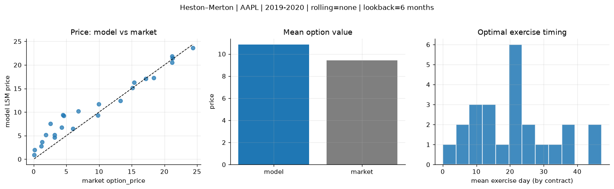
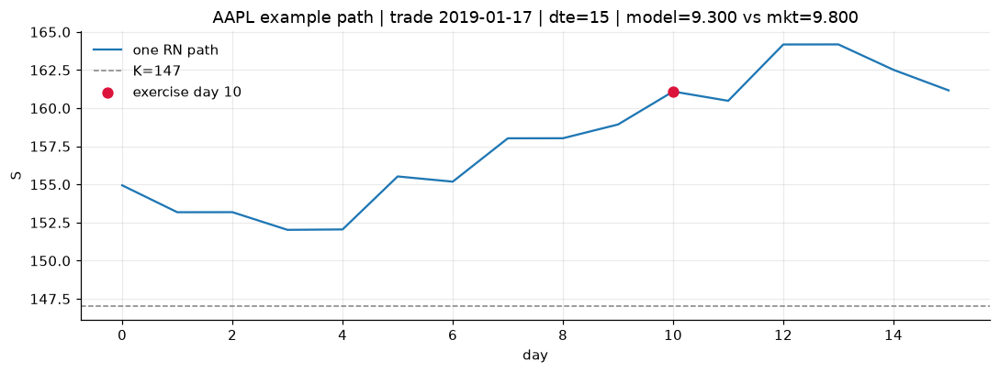
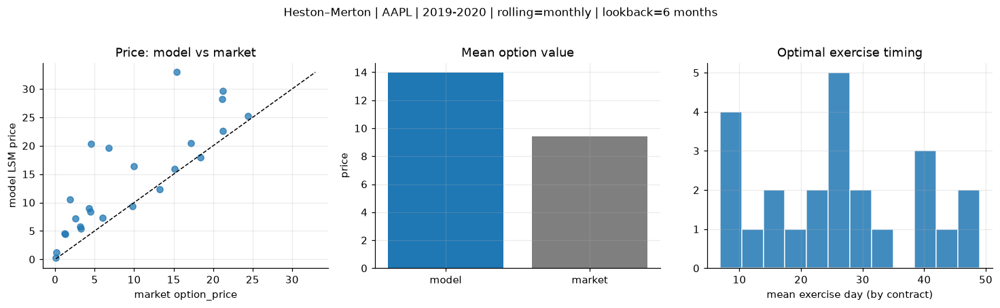
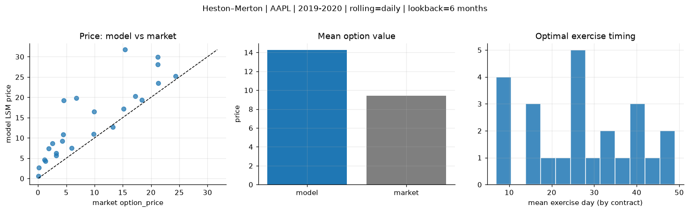
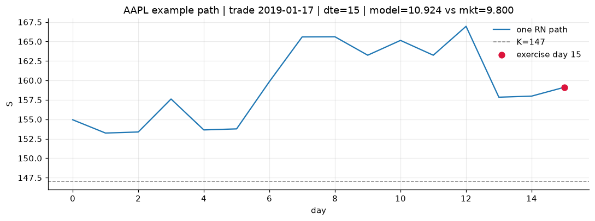

# Optimal stopping — Heston–Merton — 2019-2020 — AAPL

**Model:** Heston–Merton  
**Underlying:** AAPL  
**Regime / period:** 2019-2020  
**Lookback:** 6 months (fixed)  
**Rolling modes:** none, monthly, daily  
**Pricing:** LSM American calls on AAPL | n_paths=2000 | seed=42 | contracts=24

## Comparison (same contracts, same lookback)

| Rolling | RMSE | MAE | Bias (model−mkt) | Mean early-ex frac | Cal updates | Cal s | LSM s |
|---------|-----:|----:|-----------------:|-------------------:|------------:|------:|------:|
| `none` | 2.2791 | 1.7419 | 1.4092 | 0.386 | 1 | 0.0 | 0.1 |
| `monthly` | 6.6880 | 4.6746 | 4.5283 | 0.180 | 25 | 0.0 | 0.1 |
| `daily` | 6.5196 | 4.8688 | 4.8212 | 0.110 | 505 | 0.9 | 0.2 |

**Lowest RMSE (this study):** `none` = 2.2791

## Rolling = `none`

- **RMSE:** 2.2791  
- **MAE:** 1.7419  
- **Bias:** 1.4092  
- **Mean early-exercise fraction:** 0.386  
- **Calibration updates (AAPL):** 1

Contract errors (compact)

| date | K | dte | market | model | error | early_ex |
|------|--:|----:|-------:|------:|------:|---------:|
| 2019-01-17 | 147 | 15 | 9.800 | 9.300 | -0.500 | 0.524 |
| 2019-10-25 | 220 | 7 | 24.375 | 23.580 | -0.795 | 1.000 |
| 2019-06-26 | 180 | 37 | 18.375 | 17.294 | -1.081 | 0.617 |
| 2019-06-26 | 182.5 | 30 | 15.125 | 15.170 | 0.045 | 0.564 |
| 2019-10-11 | 212.5 | 42 | 21.200 | 20.538 | -0.662 | 0.606 |
| 2019-02-01 | 150 | 42 | 17.175 | 17.090 | -0.085 | 0.778 |
| 2019-02-08 | 175 | 14 | 1.305 | 3.620 | 2.315 | 0.152 |
| 2019-08-08 | 195 | 8 | 5.975 | 6.511 | 0.536 | 0.245 |
| 2019-10-18 | 230 | 28 | 9.950 | 11.692 | 1.742 | 0.363 |
| 2019-10-25 | 250 | 28 | 4.250 | 6.781 | 2.531 | 0.232 |
| 2019-09-06 | 215 | 49 | 6.800 | 10.209 | 3.409 | 0.282 |
| 2019-11-01 | 255 | 42 | 4.475 | 9.362 | 4.887 | 0.249 |
| 2019-11-15 | 282.5 | 7 | 0.080 | 0.931 | 0.851 | 0.013 |
| 2019-07-03 | 212.5 | 9 | 0.140 | 1.965 | 1.825 | 0.033 |
| 2019-06-05 | 187.5 | 37 | 3.175 | 5.186 | 2.011 | 0.156 |
| 2019-03-25 | 207.5 | 32 | 1.145 | 2.768 | 1.623 | 0.113 |
| 2019-09-27 | 240 | 49 | 1.865 | 5.152 | 3.287 | 0.152 |
| 2019-11-01 | 260 | 42 | 2.545 | 7.512 | 4.967 | 0.277 |
| 2019-08-08 | 205 | 22 | 3.225 | 4.634 | 1.409 | 0.173 |
| 2019-01-03 | 147 | 22 | 13.250 | 12.381 | -0.869 | 0.541 |
| 2019-11-01 | 227.5 | 21 | 21.250 | 21.408 | 0.158 | 0.770 |
| 2019-12-16 | 277.5 | 25 | 4.575 | 9.188 | 4.613 | 0.298 |
| 2019-10-18 | 215 | 28 | 21.150 | 21.837 | 0.687 | 0.658 |
| 2019-12-16 | 262.5 | 25 | 15.350 | 16.268 | 0.918 | 0.477 |

## Rolling = `monthly`

- **RMSE:** 6.6880  
- **MAE:** 4.6746  
- **Bias:** 4.5283  
- **Mean early-exercise fraction:** 0.180  
- **Calibration updates (AAPL):** 25

Contract errors (compact)

| date | K | dte | market | model | error | early_ex |
|------|--:|----:|-------:|------:|------:|---------:|
| 2019-01-17 | 147 | 15 | 9.800 | 9.300 | -0.500 | 0.524 |
| 2019-10-25 | 220 | 7 | 24.375 | 25.244 | 0.869 | 0.086 |
| 2019-06-26 | 180 | 37 | 18.375 | 17.989 | -0.386 | 0.587 |
| 2019-06-26 | 182.5 | 30 | 15.125 | 15.977 | 0.852 | 0.656 |
| 2019-10-11 | 212.5 | 42 | 21.200 | 29.675 | 8.475 | 0.000 |
| 2019-02-01 | 150 | 42 | 17.175 | 20.490 | 3.315 | 0.316 |
| 2019-02-08 | 175 | 14 | 1.305 | 4.441 | 3.136 | 0.004 |
| 2019-08-08 | 195 | 8 | 5.975 | 7.329 | 1.354 | 0.035 |
| 2019-10-18 | 230 | 28 | 9.950 | 16.404 | 6.454 | 0.000 |
| 2019-10-25 | 250 | 28 | 4.250 | 8.946 | 4.696 | 0.265 |
| 2019-09-06 | 215 | 49 | 6.800 | 19.605 | 12.805 | 0.002 |
| 2019-11-01 | 255 | 42 | 4.475 | 8.334 | 3.859 | 0.210 |
| 2019-11-15 | 282.5 | 7 | 0.080 | 0.225 | 0.145 | 0.015 |
| 2019-07-03 | 212.5 | 9 | 0.140 | 1.181 | 1.041 | 0.050 |
| 2019-06-05 | 187.5 | 37 | 3.175 | 5.808 | 2.633 | 0.180 |
| 2019-03-25 | 207.5 | 32 | 1.145 | 4.551 | 3.406 | 0.109 |
| 2019-09-27 | 240 | 49 | 1.865 | 10.581 | 8.716 | 0.015 |
| 2019-11-01 | 260 | 42 | 2.545 | 7.201 | 4.656 | 0.214 |
| 2019-08-08 | 205 | 22 | 3.225 | 5.433 | 2.208 | 0.004 |
| 2019-01-03 | 147 | 22 | 13.250 | 12.381 | -0.869 | 0.541 |
| 2019-11-01 | 227.5 | 21 | 21.250 | 22.586 | 1.336 | 0.487 |
| 2019-12-16 | 277.5 | 25 | 4.575 | 20.390 | 15.815 | 0.000 |
| 2019-10-18 | 215 | 28 | 21.150 | 28.210 | 7.060 | 0.017 |
| 2019-12-16 | 262.5 | 25 | 15.350 | 32.955 | 17.605 | 0.001 |

## Rolling = `daily`

- **RMSE:** 6.5196  
- **MAE:** 4.8688  
- **Bias:** 4.8212  
- **Mean early-exercise fraction:** 0.110  
- **Calibration updates (AAPL):** 505

Contract errors (compact)

| date | K | dte | market | model | error | early_ex |
|------|--:|----:|-------:|------:|------:|---------:|
| 2019-01-17 | 147 | 15 | 9.800 | 10.924 | 1.124 | 0.003 |
| 2019-10-25 | 220 | 7 | 24.375 | 25.235 | 0.860 | 0.028 |
| 2019-06-26 | 180 | 37 | 18.375 | 19.405 | 1.030 | 0.405 |
| 2019-06-26 | 182.5 | 30 | 15.125 | 17.181 | 2.056 | 0.431 |
| 2019-10-11 | 212.5 | 42 | 21.200 | 29.913 | 8.713 | 0.000 |
| 2019-02-01 | 150 | 42 | 17.175 | 20.328 | 3.153 | 0.323 |
| 2019-02-08 | 175 | 14 | 1.305 | 4.315 | 3.010 | 0.004 |
| 2019-08-08 | 195 | 8 | 5.975 | 7.488 | 1.513 | 0.019 |
| 2019-10-18 | 230 | 28 | 9.950 | 16.454 | 6.504 | 0.000 |
| 2019-10-25 | 250 | 28 | 4.250 | 9.216 | 4.966 | 0.140 |
| 2019-09-06 | 215 | 49 | 6.800 | 19.808 | 13.008 | 0.002 |
| 2019-11-01 | 255 | 42 | 4.475 | 10.838 | 6.363 | 0.143 |
| 2019-11-15 | 282.5 | 7 | 0.080 | 0.650 | 0.570 | 0.013 |
| 2019-07-03 | 212.5 | 9 | 0.140 | 2.664 | 2.524 | 0.000 |
| 2019-06-05 | 187.5 | 37 | 3.175 | 6.194 | 3.019 | 0.144 |
| 2019-03-25 | 207.5 | 32 | 1.145 | 4.644 | 3.499 | 0.078 |
| 2019-09-27 | 240 | 49 | 1.865 | 7.394 | 5.529 | 0.103 |
| 2019-11-01 | 260 | 42 | 2.545 | 8.667 | 6.122 | 0.186 |
| 2019-08-08 | 205 | 22 | 3.225 | 5.666 | 2.441 | 0.015 |
| 2019-01-03 | 147 | 22 | 13.250 | 12.679 | -0.571 | 0.453 |
| 2019-11-01 | 227.5 | 21 | 21.250 | 23.544 | 2.294 | 0.141 |
| 2019-12-16 | 277.5 | 25 | 4.575 | 19.237 | 14.662 | 0.000 |
| 2019-10-18 | 215 | 28 | 21.150 | 28.096 | 6.946 | 0.017 |
| 2019-12-16 | 262.5 | 25 | 15.350 | 31.723 | 16.373 | 0.001 |

