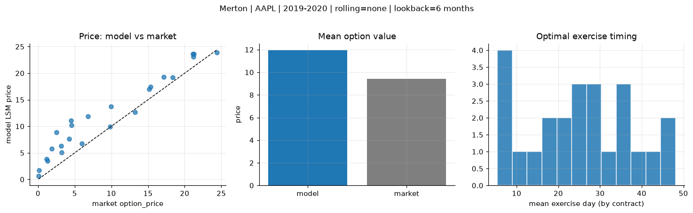
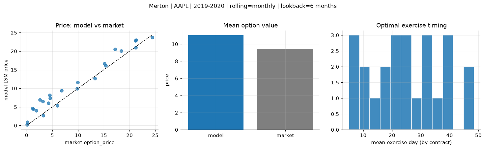
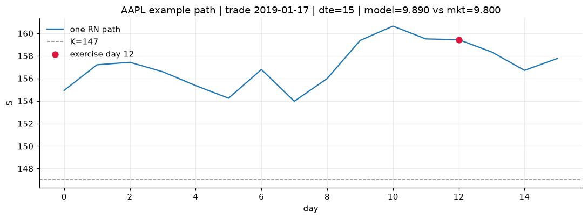
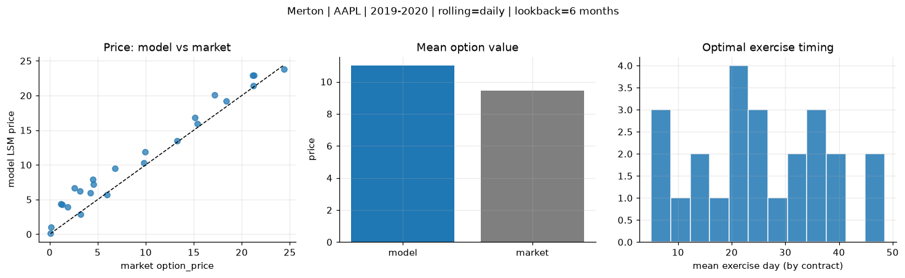
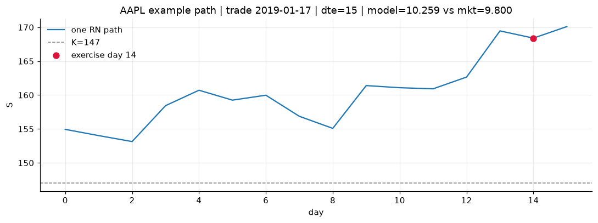

# Optimal stopping — Merton — 2019-2020 — AAPL

**Model:** Merton  
**Underlying:** AAPL  
**Regime / period:** 2019-2020  
**Lookback:** 6 months (fixed)  
**Rolling modes:** none, monthly, daily  
**Pricing:** LSM American calls on AAPL | n_paths=2000 | seed=42 | contracts=24

## Comparison (same contracts, same lookback)

| Rolling | RMSE | MAE | Bias (model−mkt) | Mean early-ex frac | Cal updates | Cal s | LSM s |
|---------|-----:|----:|-----------------:|-------------------:|------------:|------:|------:|
| `none` | 3.1599 | 2.5943 | 2.5082 | 0.268 | 1 | 0.0 | 0.1 |
| `monthly` | 2.2049 | 1.8114 | 1.5987 | 0.274 | 25 | 0.0 | 0.1 |
| `daily` | 2.0578 | 1.6737 | 1.5688 | 0.265 | 505 | 0.1 | 0.1 |

**Lowest RMSE (this study):** `daily` = 2.0578

## Rolling = `none`

- **RMSE:** 3.1599  
- **MAE:** 2.5943  
- **Bias:** 2.5082  
- **Mean early-exercise fraction:** 0.268  
- **Calibration updates (AAPL):** 1

Contract errors (compact)

| date | K | dte | market | model | error | early_ex |
|------|--:|----:|-------:|------:|------:|---------:|
| 2019-01-17 | 147 | 15 | 9.800 | 9.890 | 0.090 | 0.491 |
| 2019-10-25 | 220 | 7 | 24.375 | 23.899 | -0.476 | 0.580 |
| 2019-06-26 | 180 | 37 | 18.375 | 19.187 | 0.812 | 0.468 |
| 2019-06-26 | 182.5 | 30 | 15.125 | 17.021 | 1.896 | 0.398 |
| 2019-10-11 | 212.5 | 42 | 21.200 | 23.083 | 1.883 | 0.545 |
| 2019-02-01 | 150 | 42 | 17.175 | 19.315 | 2.140 | 0.348 |
| 2019-02-08 | 175 | 14 | 1.305 | 3.478 | 2.173 | 0.119 |
| 2019-08-08 | 195 | 8 | 5.975 | 6.724 | 0.749 | 0.182 |
| 2019-10-18 | 230 | 28 | 9.950 | 13.749 | 3.799 | 0.217 |
| 2019-10-25 | 250 | 28 | 4.250 | 7.629 | 3.379 | 0.203 |
| 2019-09-06 | 215 | 49 | 6.800 | 11.859 | 5.059 | 0.245 |
| 2019-11-01 | 255 | 42 | 4.475 | 11.117 | 6.642 | 0.234 |
| 2019-11-15 | 282.5 | 7 | 0.080 | 0.673 | 0.593 | 0.018 |
| 2019-07-03 | 212.5 | 9 | 0.140 | 1.693 | 1.553 | 0.037 |
| 2019-06-05 | 187.5 | 37 | 3.175 | 6.268 | 3.093 | 0.144 |
| 2019-03-25 | 207.5 | 32 | 1.145 | 3.846 | 2.701 | 0.038 |
| 2019-09-27 | 240 | 49 | 1.865 | 5.813 | 3.948 | 0.117 |
| 2019-11-01 | 260 | 42 | 2.545 | 8.838 | 6.293 | 0.147 |
| 2019-08-08 | 205 | 22 | 3.225 | 5.068 | 1.843 | 0.098 |
| 2019-01-03 | 147 | 22 | 13.250 | 12.693 | -0.557 | 0.515 |
| 2019-11-01 | 227.5 | 21 | 21.250 | 23.646 | 2.396 | 0.361 |
| 2019-12-16 | 277.5 | 25 | 4.575 | 10.170 | 5.595 | 0.168 |
| 2019-10-18 | 215 | 28 | 21.150 | 23.634 | 2.484 | 0.376 |
| 2019-12-16 | 262.5 | 25 | 15.350 | 17.460 | 2.110 | 0.377 |

## Rolling = `monthly`

- **RMSE:** 2.2049  
- **MAE:** 1.8114  
- **Bias:** 1.5987  
- **Mean early-exercise fraction:** 0.274  
- **Calibration updates (AAPL):** 25

Contract errors (compact)

| date | K | dte | market | model | error | early_ex |
|------|--:|----:|-------:|------:|------:|---------:|
| 2019-01-17 | 147 | 15 | 9.800 | 9.890 | 0.090 | 0.491 |
| 2019-10-25 | 220 | 7 | 24.375 | 23.737 | -0.638 | 0.647 |
| 2019-06-26 | 180 | 37 | 18.375 | 20.095 | 1.720 | 0.279 |
| 2019-06-26 | 182.5 | 30 | 15.125 | 16.614 | 1.489 | 0.354 |
| 2019-10-11 | 212.5 | 42 | 21.200 | 21.007 | -0.193 | 0.615 |
| 2019-02-01 | 150 | 42 | 17.175 | 20.513 | 3.338 | 0.433 |
| 2019-02-08 | 175 | 14 | 1.305 | 4.421 | 3.116 | 0.207 |
| 2019-08-08 | 195 | 8 | 5.975 | 5.346 | -0.629 | 0.290 |
| 2019-10-18 | 230 | 28 | 9.950 | 11.646 | 1.696 | 0.271 |
| 2019-10-25 | 250 | 28 | 4.250 | 6.044 | 1.794 | 0.183 |
| 2019-09-06 | 215 | 49 | 6.800 | 9.407 | 2.607 | 0.253 |
| 2019-11-01 | 255 | 42 | 4.475 | 8.196 | 3.721 | 0.265 |
| 2019-11-15 | 282.5 | 7 | 0.080 | 0.226 | 0.146 | 0.019 |
| 2019-07-03 | 212.5 | 9 | 0.140 | 0.913 | 0.773 | 0.015 |
| 2019-06-05 | 187.5 | 37 | 3.175 | 6.532 | 3.357 | 0.096 |
| 2019-03-25 | 207.5 | 32 | 1.145 | 4.648 | 3.503 | 0.113 |
| 2019-09-27 | 240 | 49 | 1.865 | 4.036 | 2.171 | 0.093 |
| 2019-11-01 | 260 | 42 | 2.545 | 6.920 | 4.375 | 0.224 |
| 2019-08-08 | 205 | 22 | 3.225 | 2.689 | -0.536 | 0.022 |
| 2019-01-03 | 147 | 22 | 13.250 | 12.693 | -0.557 | 0.515 |
| 2019-11-01 | 227.5 | 21 | 21.250 | 23.007 | 1.757 | 0.197 |
| 2019-12-16 | 277.5 | 25 | 4.575 | 7.381 | 2.806 | 0.017 |
| 2019-10-18 | 215 | 28 | 21.150 | 22.863 | 1.713 | 0.575 |
| 2019-12-16 | 262.5 | 25 | 15.350 | 16.099 | 0.749 | 0.406 |

## Rolling = `daily`

- **RMSE:** 2.0578  
- **MAE:** 1.6737  
- **Bias:** 1.5688  
- **Mean early-exercise fraction:** 0.265  
- **Calibration updates (AAPL):** 505

Contract errors (compact)

| date | K | dte | market | model | error | early_ex |
|------|--:|----:|-------:|------:|------:|---------:|
| 2019-01-17 | 147 | 15 | 9.800 | 10.259 | 0.459 | 0.365 |
| 2019-10-25 | 220 | 7 | 24.375 | 23.773 | -0.602 | 0.677 |
| 2019-06-26 | 180 | 37 | 18.375 | 19.190 | 0.815 | 0.534 |
| 2019-06-26 | 182.5 | 30 | 15.125 | 16.782 | 1.657 | 0.280 |
| 2019-10-11 | 212.5 | 42 | 21.200 | 21.376 | 0.176 | 0.597 |
| 2019-02-01 | 150 | 42 | 17.175 | 20.109 | 2.934 | 0.465 |
| 2019-02-08 | 175 | 14 | 1.305 | 4.299 | 2.994 | 0.205 |
| 2019-08-08 | 195 | 8 | 5.975 | 5.676 | -0.299 | 0.129 |
| 2019-10-18 | 230 | 28 | 9.950 | 11.847 | 1.897 | 0.268 |
| 2019-10-25 | 250 | 28 | 4.250 | 5.915 | 1.665 | 0.214 |
| 2019-09-06 | 215 | 49 | 6.800 | 9.500 | 2.700 | 0.256 |
| 2019-11-01 | 255 | 42 | 4.475 | 7.880 | 3.405 | 0.269 |
| 2019-11-15 | 282.5 | 7 | 0.080 | 0.129 | 0.049 | 0.011 |
| 2019-07-03 | 212.5 | 9 | 0.140 | 0.982 | 0.842 | 0.002 |
| 2019-06-05 | 187.5 | 37 | 3.175 | 6.206 | 3.031 | 0.096 |
| 2019-03-25 | 207.5 | 32 | 1.145 | 4.330 | 3.185 | 0.138 |
| 2019-09-27 | 240 | 49 | 1.865 | 3.899 | 2.034 | 0.091 |
| 2019-11-01 | 260 | 42 | 2.545 | 6.663 | 4.118 | 0.227 |
| 2019-08-08 | 205 | 22 | 3.225 | 2.868 | -0.357 | 0.032 |
| 2019-01-03 | 147 | 22 | 13.250 | 13.479 | 0.229 | 0.315 |
| 2019-11-01 | 227.5 | 21 | 21.250 | 22.947 | 1.697 | 0.198 |
| 2019-12-16 | 277.5 | 25 | 4.575 | 7.200 | 2.625 | 0.016 |
| 2019-10-18 | 215 | 28 | 21.150 | 22.952 | 1.802 | 0.580 |
| 2019-12-16 | 262.5 | 25 | 15.350 | 15.945 | 0.595 | 0.403 |

