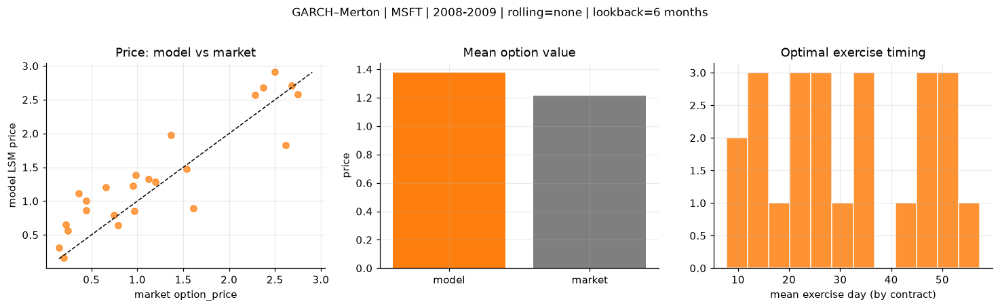
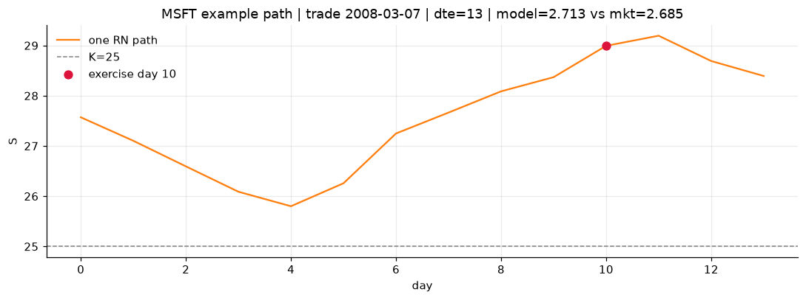
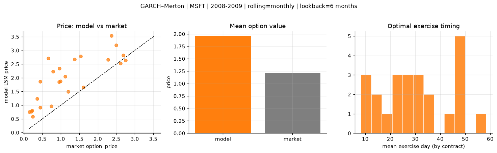
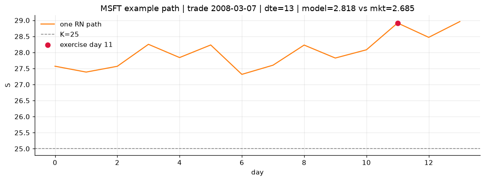
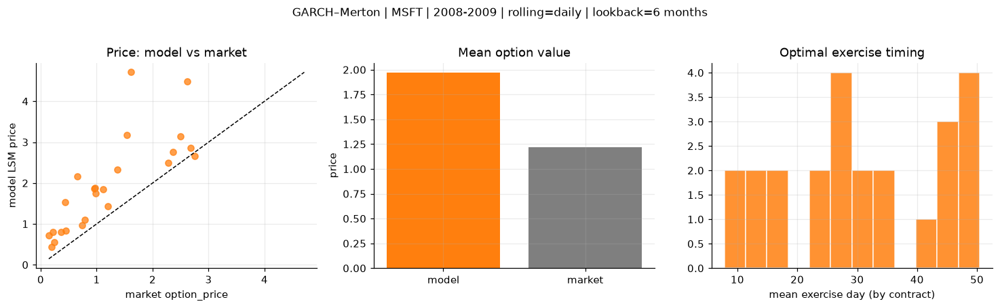
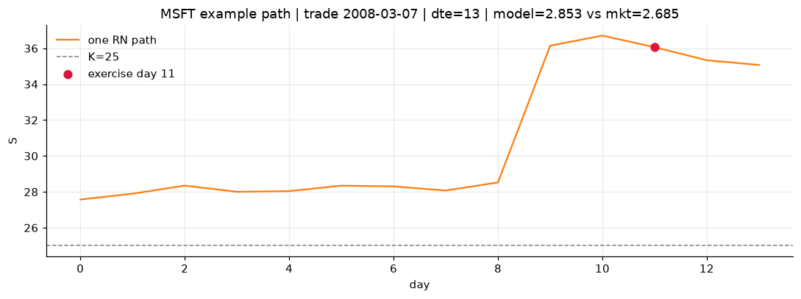

# Optimal stopping — GARCH–Merton — 2008-2009 — MSFT

**Model:** GARCH–Merton  
**Underlying:** MSFT  
**Regime / period:** 2008-2009  
**Lookback:** 6 months (fixed)  
**Rolling modes:** none, monthly, daily  
**Pricing:** LSM American calls on MSFT | n_paths=2000 | seed=42 | contracts=24

## Comparison (same contracts, same lookback)

| Rolling | RMSE | MAE | Bias (model−mkt) | Mean early-ex frac | Cal updates | Cal s | LSM s |
|---------|-----:|----:|-----------------:|-------------------:|------------:|------:|------:|
| `none` | 0.4026 | 0.3296 | 0.1598 | 0.257 | 1 | 0.0 | 0.1 |
| `monthly` | 0.9186 | 0.7568 | 0.7402 | 0.206 | 25 | 1.0 | 0.1 |
| `daily` | 1.0189 | 0.7611 | 0.7541 | 0.208 | 505 | 18.1 | 0.1 |

**Lowest RMSE (this study):** `none` = 0.4026

## Rolling = `none`

- **RMSE:** 0.4026  
- **MAE:** 0.3296  
- **Bias:** 0.1598  
- **Mean early-exercise fraction:** 0.257  
- **Calibration updates (MSFT):** 1

Contract errors (compact)

| date | K | dte | market | model | error | early_ex |
|------|--:|----:|-------:|------:|------:|---------:|
| 2008-03-07 | 25 | 13 | 2.685 | 2.713 | 0.028 | 0.849 |
| 2009-08-12 | 22 | 9 | 1.200 | 1.286 | 0.086 | 0.443 |
| 2008-10-24 | 21 | 28 | 2.615 | 1.825 | -0.790 | 0.353 |
| 2009-12-18 | 27.5 | 28 | 2.280 | 2.570 | 0.290 | 0.413 |
| 2009-06-30 | 22 | 52 | 2.370 | 2.682 | 0.312 | 0.358 |
| 2008-02-29 | 26 | 49 | 2.495 | 2.907 | 0.412 | 0.294 |
| 2008-03-07 | 27.5 | 13 | 0.745 | 0.792 | 0.047 | 0.216 |
| 2008-12-30 | 19 | 17 | 0.790 | 0.644 | -0.146 | 0.231 |
| 2009-07-29 | 23 | 23 | 0.955 | 1.226 | 0.271 | 0.337 |
| 2009-08-19 | 23 | 30 | 1.120 | 1.330 | 0.210 | 0.315 |
| 2009-02-20 | 17.5 | 56 | 1.540 | 1.475 | -0.065 | 0.383 |
| 2009-08-26 | 24 | 51 | 1.370 | 1.976 | 0.606 | 0.102 |
| 2009-08-05 | 25 | 16 | 0.145 | 0.315 | 0.170 | 0.062 |
| 2008-10-02 | 29 | 15 | 0.200 | 0.159 | -0.041 | 0.040 |
| 2008-09-11 | 29 | 36 | 0.240 | 0.566 | 0.326 | 0.048 |
| 2008-05-27 | 29 | 24 | 0.445 | 0.863 | 0.418 | 0.117 |
| 2009-05-18 | 21 | 60 | 0.660 | 1.204 | 0.544 | 0.207 |
| 2009-08-26 | 26 | 51 | 0.440 | 1.009 | 0.569 | 0.272 |
| 2009-10-15 | 28 | 36 | 0.220 | 0.653 | 0.433 | 0.029 |
| 2008-10-17 | 25 | 35 | 1.610 | 0.896 | -0.714 | 0.121 |
| 2009-09-02 | 24 | 44 | 0.985 | 1.387 | 0.402 | 0.190 |
| 2009-10-29 | 30 | 50 | 0.360 | 1.110 | 0.750 | 0.214 |
| 2009-04-13 | 20 | 32 | 0.965 | 0.857 | -0.108 | 0.134 |
| 2008-07-16 | 24 | 30 | 2.750 | 2.577 | -0.173 | 0.431 |

## Rolling = `monthly`

- **RMSE:** 0.9186  
- **MAE:** 0.7568  
- **Bias:** 0.7402  
- **Mean early-exercise fraction:** 0.206  
- **Calibration updates (MSFT):** 25

Contract errors (compact)

| date | K | dte | market | model | error | early_ex |
|------|--:|----:|-------:|------:|------:|---------:|
| 2008-03-07 | 25 | 13 | 2.685 | 2.818 | 0.133 | 0.542 |
| 2009-08-12 | 22 | 9 | 1.200 | 1.499 | 0.299 | 0.170 |
| 2008-10-24 | 21 | 28 | 2.615 | 2.529 | -0.086 | 0.200 |
| 2009-12-18 | 27.5 | 28 | 2.280 | 2.657 | 0.377 | 0.178 |
| 2009-06-30 | 22 | 52 | 2.370 | 3.531 | 1.161 | 0.275 |
| 2008-02-29 | 26 | 49 | 2.495 | 3.197 | 0.702 | 0.165 |
| 2008-03-07 | 27.5 | 13 | 0.745 | 0.969 | 0.224 | 0.195 |
| 2008-12-30 | 19 | 17 | 0.790 | 2.234 | 1.444 | 0.231 |
| 2009-07-29 | 23 | 23 | 0.955 | 1.855 | 0.900 | 0.089 |
| 2009-08-19 | 23 | 30 | 1.120 | 2.042 | 0.922 | 0.161 |
| 2009-02-20 | 17.5 | 56 | 1.540 | 2.788 | 1.248 | 0.765 |
| 2009-08-26 | 24 | 51 | 1.370 | 2.676 | 1.306 | 0.194 |
| 2009-08-05 | 25 | 16 | 0.145 | 0.756 | 0.611 | 0.038 |
| 2008-10-02 | 29 | 15 | 0.200 | 0.771 | 0.571 | 0.146 |
| 2008-09-11 | 29 | 36 | 0.240 | 0.583 | 0.343 | 0.089 |
| 2008-05-27 | 29 | 24 | 0.445 | 0.910 | 0.465 | 0.097 |
| 2009-05-18 | 21 | 60 | 0.660 | 2.711 | 2.051 | 0.148 |
| 2009-08-26 | 26 | 51 | 0.440 | 1.861 | 1.421 | 0.129 |
| 2009-10-15 | 28 | 36 | 0.220 | 0.810 | 0.590 | 0.056 |
| 2008-10-17 | 25 | 35 | 1.610 | 1.656 | 0.046 | 0.247 |
| 2009-09-02 | 24 | 44 | 0.985 | 1.874 | 0.889 | 0.084 |
| 2009-10-29 | 30 | 50 | 0.360 | 1.239 | 0.879 | 0.164 |
| 2009-04-13 | 20 | 32 | 0.965 | 2.348 | 1.383 | 0.159 |
| 2008-07-16 | 24 | 30 | 2.750 | 2.636 | -0.114 | 0.430 |

## Rolling = `daily`

- **RMSE:** 1.0189  
- **MAE:** 0.7611  
- **Bias:** 0.7541  
- **Mean early-exercise fraction:** 0.208  
- **Calibration updates (MSFT):** 505

Contract errors (compact)

| date | K | dte | market | model | error | early_ex |
|------|--:|----:|-------:|------:|------:|---------:|
| 2008-03-07 | 25 | 13 | 2.685 | 2.853 | 0.168 | 0.900 |
| 2009-08-12 | 22 | 9 | 1.200 | 1.438 | 0.238 | 0.314 |
| 2008-10-24 | 21 | 28 | 2.615 | 4.486 | 1.871 | 0.223 |
| 2009-12-18 | 27.5 | 28 | 2.280 | 2.488 | 0.208 | 0.007 |
| 2009-06-30 | 22 | 52 | 2.370 | 2.756 | 0.386 | 0.239 |
| 2008-02-29 | 26 | 49 | 2.495 | 3.137 | 0.642 | 0.168 |
| 2008-03-07 | 27.5 | 13 | 0.745 | 0.964 | 0.219 | 0.281 |
| 2008-12-30 | 19 | 17 | 0.790 | 1.097 | 0.307 | 0.026 |
| 2009-07-29 | 23 | 23 | 0.955 | 1.861 | 0.906 | 0.055 |
| 2009-08-19 | 23 | 30 | 1.120 | 1.846 | 0.726 | 0.167 |
| 2009-02-20 | 17.5 | 56 | 1.540 | 3.174 | 1.634 | 0.432 |
| 2009-08-26 | 24 | 51 | 1.370 | 2.332 | 0.962 | 0.223 |
| 2009-08-05 | 25 | 16 | 0.145 | 0.721 | 0.576 | 0.114 |
| 2008-10-02 | 29 | 15 | 0.200 | 0.437 | 0.237 | 0.091 |
| 2008-09-11 | 29 | 36 | 0.240 | 0.561 | 0.321 | 0.117 |
| 2008-05-27 | 29 | 24 | 0.445 | 0.843 | 0.398 | 0.004 |
| 2009-05-18 | 21 | 60 | 0.660 | 2.155 | 1.495 | 0.338 |
| 2009-08-26 | 26 | 51 | 0.440 | 1.525 | 1.085 | 0.121 |
| 2009-10-15 | 28 | 36 | 0.220 | 0.805 | 0.585 | 0.084 |
| 2008-10-17 | 25 | 35 | 1.610 | 4.711 | 3.101 | 0.598 |
| 2009-09-02 | 24 | 44 | 0.985 | 1.754 | 0.769 | 0.222 |
| 2009-10-29 | 30 | 50 | 0.360 | 0.799 | 0.439 | 0.183 |
| 2009-04-13 | 20 | 32 | 0.965 | 1.876 | 0.911 | 0.029 |
| 2008-07-16 | 24 | 30 | 2.750 | 2.666 | -0.084 | 0.048 |

