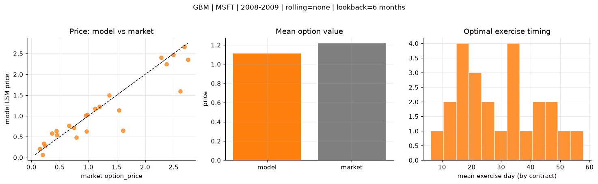
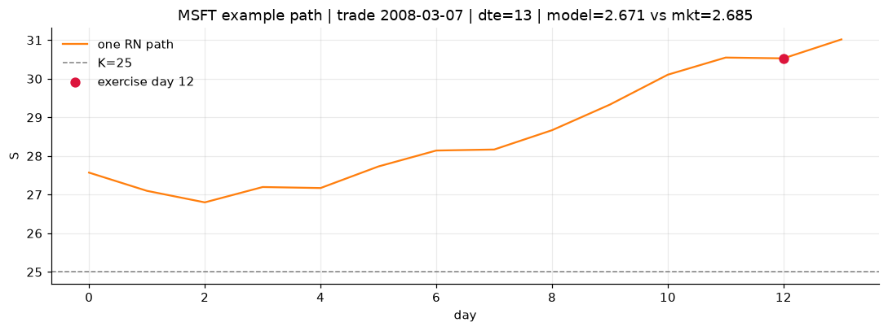
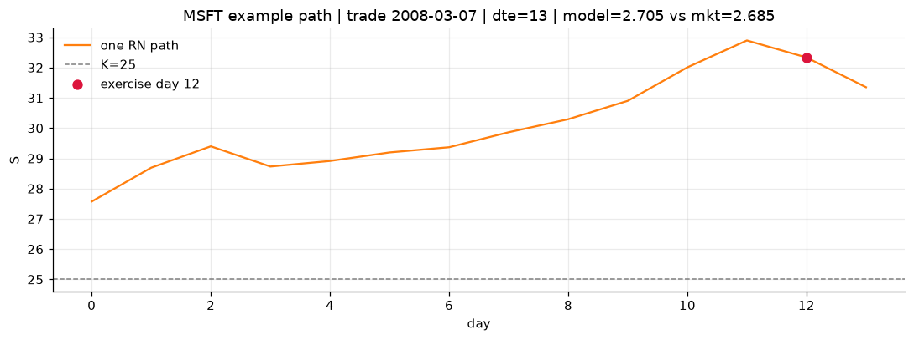
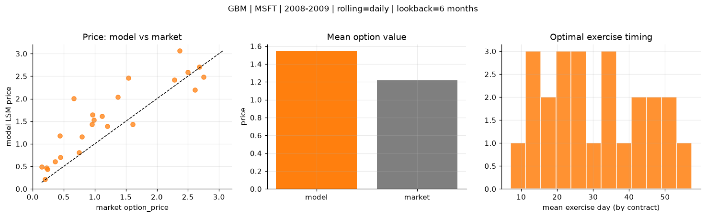
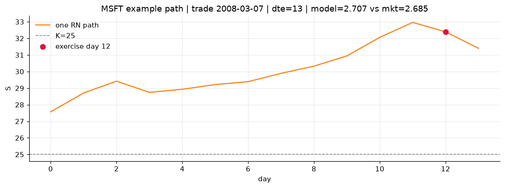

# Optimal stopping — GBM — 2008-2009 — MSFT

**Model:** GBM  
**Underlying:** MSFT  
**Regime / period:** 2008-2009  
**Lookback:** 6 months (fixed)  
**Rolling modes:** none, monthly, daily  
**Pricing:** LSM American calls on MSFT | n_paths=2000 | seed=42 | contracts=24

## Comparison (same contracts, same lookback)

| Rolling | RMSE | MAE | Bias (model−mkt) | Mean early-ex frac | Cal updates | Cal s | LSM s |
|---------|-----:|----:|-----------------:|-------------------:|------------:|------:|------:|
| `none` | 0.3358 | 0.2090 | -0.1033 | 0.307 | 1 | 0.0 | 0.1 |
| `monthly` | 0.5822 | 0.4708 | 0.3315 | 0.283 | 25 | 0.0 | 0.1 |
| `daily` | 0.5076 | 0.3999 | 0.3276 | 0.283 | 505 | 0.1 | 0.1 |

**Lowest RMSE (this study):** `none` = 0.3358

## Rolling = `none`

- **RMSE:** 0.3358  
- **MAE:** 0.2090  
- **Bias:** -0.1033  
- **Mean early-exercise fraction:** 0.307  
- **Calibration updates (MSFT):** 1

Contract errors (compact)

| date | K | dte | market | model | error | early_ex |
|------|--:|----:|-------:|------:|------:|---------:|
| 2008-03-07 | 25 | 13 | 2.685 | 2.671 | -0.014 | 0.331 |
| 2009-08-12 | 22 | 9 | 1.200 | 1.220 | 0.020 | 0.540 |
| 2008-10-24 | 21 | 28 | 2.615 | 1.594 | -1.021 | 0.587 |
| 2009-12-18 | 27.5 | 28 | 2.280 | 2.407 | 0.127 | 0.600 |
| 2009-06-30 | 22 | 52 | 2.370 | 2.248 | -0.122 | 0.615 |
| 2008-02-29 | 26 | 49 | 2.495 | 2.475 | -0.020 | 0.478 |
| 2008-03-07 | 27.5 | 13 | 0.745 | 0.714 | -0.031 | 0.262 |
| 2008-12-30 | 19 | 17 | 0.790 | 0.486 | -0.304 | 0.244 |
| 2009-07-29 | 23 | 23 | 0.955 | 1.008 | 0.053 | 0.366 |
| 2009-08-19 | 23 | 30 | 1.120 | 1.176 | 0.056 | 0.453 |
| 2009-02-20 | 17.5 | 56 | 1.540 | 1.136 | -0.404 | 0.335 |
| 2009-08-26 | 24 | 51 | 1.370 | 1.496 | 0.126 | 0.416 |
| 2009-08-05 | 25 | 16 | 0.145 | 0.206 | 0.061 | 0.086 |
| 2008-10-02 | 29 | 15 | 0.200 | 0.069 | -0.131 | 0.030 |
| 2008-09-11 | 29 | 36 | 0.240 | 0.278 | 0.038 | 0.083 |
| 2008-05-27 | 29 | 24 | 0.445 | 0.544 | 0.099 | 0.169 |
| 2009-05-18 | 21 | 60 | 0.660 | 0.767 | 0.107 | 0.148 |
| 2009-08-26 | 26 | 51 | 0.440 | 0.643 | 0.203 | 0.240 |
| 2009-10-15 | 28 | 36 | 0.220 | 0.336 | 0.116 | 0.019 |
| 2008-10-17 | 25 | 35 | 1.610 | 0.645 | -0.965 | 0.195 |
| 2009-09-02 | 24 | 44 | 0.985 | 1.027 | 0.042 | 0.276 |
| 2009-10-29 | 30 | 50 | 0.360 | 0.581 | 0.221 | 0.108 |
| 2009-04-13 | 20 | 32 | 0.965 | 0.625 | -0.340 | 0.169 |
| 2008-07-16 | 24 | 30 | 2.750 | 2.355 | -0.395 | 0.611 |

## Rolling = `monthly`

- **RMSE:** 0.5822  
- **MAE:** 0.4708  
- **Bias:** 0.3315  
- **Mean early-exercise fraction:** 0.283  
- **Calibration updates (MSFT):** 25

Contract errors (compact)

| date | K | dte | market | model | error | early_ex |
|------|--:|----:|-------:|------:|------:|---------:|
| 2008-03-07 | 25 | 13 | 2.685 | 2.705 | 0.020 | 0.317 |
| 2009-08-12 | 22 | 9 | 1.200 | 1.407 | 0.207 | 0.417 |
| 2008-10-24 | 21 | 28 | 2.615 | 1.827 | -0.788 | 0.506 |
| 2009-12-18 | 27.5 | 28 | 2.280 | 2.419 | 0.139 | 0.539 |
| 2009-06-30 | 22 | 52 | 2.370 | 3.061 | 0.691 | 0.449 |
| 2008-02-29 | 26 | 49 | 2.495 | 2.586 | 0.091 | 0.474 |
| 2008-03-07 | 27.5 | 13 | 0.745 | 0.800 | 0.055 | 0.262 |
| 2008-12-30 | 19 | 17 | 0.790 | 1.108 | 0.318 | 0.239 |
| 2009-07-29 | 23 | 23 | 0.955 | 1.554 | 0.599 | 0.333 |
| 2009-08-19 | 23 | 30 | 1.120 | 1.658 | 0.538 | 0.406 |
| 2009-02-20 | 17.5 | 56 | 1.540 | 2.442 | 0.902 | 0.300 |
| 2009-08-26 | 24 | 51 | 1.370 | 2.126 | 0.756 | 0.366 |
| 2009-08-05 | 25 | 16 | 0.145 | 0.508 | 0.363 | 0.123 |
| 2008-10-02 | 29 | 15 | 0.200 | 0.216 | 0.016 | 0.040 |
| 2008-09-11 | 29 | 36 | 0.240 | 0.444 | 0.204 | 0.121 |
| 2008-05-27 | 29 | 24 | 0.445 | 0.719 | 0.274 | 0.173 |
| 2009-05-18 | 21 | 60 | 0.660 | 2.121 | 1.461 | 0.157 |
| 2009-08-26 | 26 | 51 | 0.440 | 1.274 | 0.834 | 0.258 |
| 2009-10-15 | 28 | 36 | 0.220 | 0.518 | 0.298 | 0.024 |
| 2008-10-17 | 25 | 35 | 1.610 | 1.009 | -0.601 | 0.207 |
| 2009-09-02 | 24 | 44 | 0.985 | 1.526 | 0.541 | 0.275 |
| 2009-10-29 | 30 | 50 | 0.360 | 0.854 | 0.494 | 0.105 |
| 2009-04-13 | 20 | 32 | 0.965 | 1.792 | 0.827 | 0.156 |
| 2008-07-16 | 24 | 30 | 2.750 | 2.468 | -0.282 | 0.540 |

## Rolling = `daily`

- **RMSE:** 0.5076  
- **MAE:** 0.3999  
- **Bias:** 0.3276  
- **Mean early-exercise fraction:** 0.283  
- **Calibration updates (MSFT):** 505

Contract errors (compact)

| date | K | dte | market | model | error | early_ex |
|------|--:|----:|-------:|------:|------:|---------:|
| 2008-03-07 | 25 | 13 | 2.685 | 2.707 | 0.022 | 0.331 |
| 2009-08-12 | 22 | 9 | 1.200 | 1.389 | 0.189 | 0.423 |
| 2008-10-24 | 21 | 28 | 2.615 | 2.192 | -0.423 | 0.457 |
| 2009-12-18 | 27.5 | 28 | 2.280 | 2.415 | 0.135 | 0.539 |
| 2009-06-30 | 22 | 52 | 2.370 | 3.061 | 0.691 | 0.449 |
| 2008-02-29 | 26 | 49 | 2.495 | 2.586 | 0.091 | 0.474 |
| 2008-03-07 | 27.5 | 13 | 0.745 | 0.810 | 0.065 | 0.262 |
| 2008-12-30 | 19 | 17 | 0.790 | 1.159 | 0.369 | 0.247 |
| 2009-07-29 | 23 | 23 | 0.955 | 1.436 | 0.481 | 0.339 |
| 2009-08-19 | 23 | 30 | 1.120 | 1.609 | 0.489 | 0.402 |
| 2009-02-20 | 17.5 | 56 | 1.540 | 2.466 | 0.926 | 0.304 |
| 2009-08-26 | 24 | 51 | 1.370 | 2.033 | 0.663 | 0.387 |
| 2009-08-05 | 25 | 16 | 0.145 | 0.495 | 0.350 | 0.123 |
| 2008-10-02 | 29 | 15 | 0.200 | 0.211 | 0.011 | 0.039 |
| 2008-09-11 | 29 | 36 | 0.240 | 0.441 | 0.201 | 0.116 |
| 2008-05-27 | 29 | 24 | 0.445 | 0.701 | 0.256 | 0.172 |
| 2009-05-18 | 21 | 60 | 0.660 | 2.006 | 1.346 | 0.151 |
| 2009-08-26 | 26 | 51 | 0.440 | 1.175 | 0.735 | 0.247 |
| 2009-10-15 | 28 | 36 | 0.220 | 0.466 | 0.246 | 0.026 |
| 2008-10-17 | 25 | 35 | 1.610 | 1.430 | -0.180 | 0.214 |
| 2009-09-02 | 24 | 44 | 0.985 | 1.524 | 0.539 | 0.274 |
| 2009-10-29 | 30 | 50 | 0.360 | 0.604 | 0.244 | 0.108 |
| 2009-04-13 | 20 | 32 | 0.965 | 1.646 | 0.681 | 0.167 |
| 2008-07-16 | 24 | 30 | 2.750 | 2.485 | -0.265 | 0.535 |

