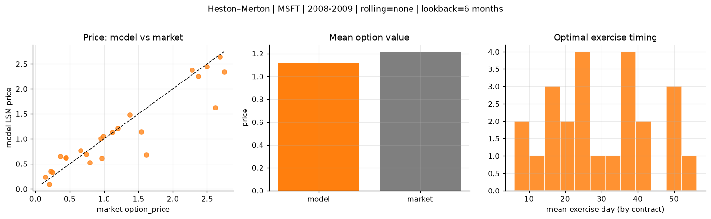
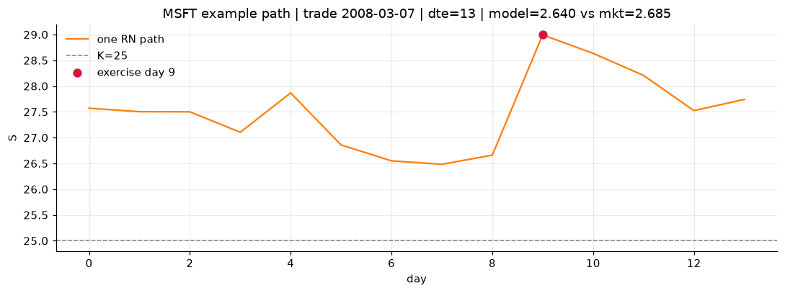
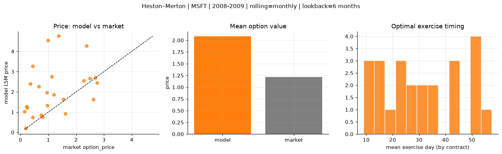
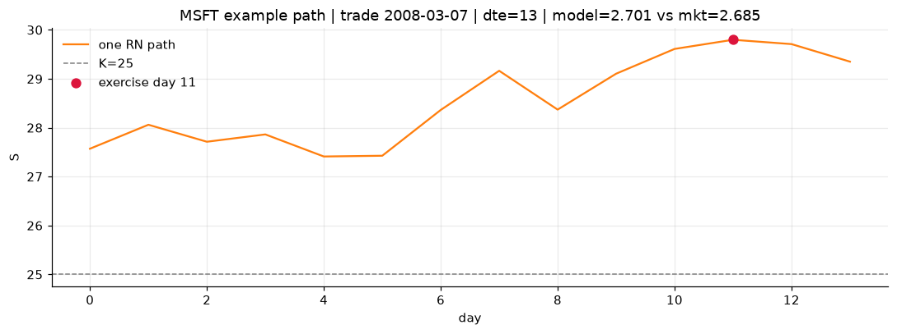
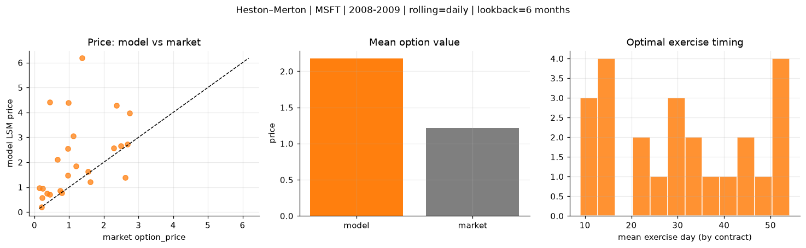
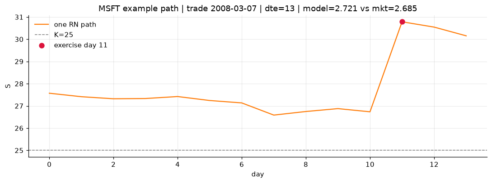

# Optimal stopping — Heston–Merton — 2008-2009 — MSFT

**Model:** Heston–Merton  
**Underlying:** MSFT  
**Regime / period:** 2008-2009  
**Lookback:** 6 months (fixed)  
**Rolling modes:** none, monthly, daily  
**Pricing:** LSM American calls on MSFT | n_paths=2000 | seed=42 | contracts=24

## Comparison (same contracts, same lookback)

| Rolling | RMSE | MAE | Bias (model−mkt) | Mean early-ex frac | Cal updates | Cal s | LSM s |
|---------|-----:|----:|-----------------:|-------------------:|------------:|------:|------:|
| `none` | 0.3301 | 0.2146 | -0.0945 | 0.309 | 1 | 0.0 | 0.1 |
| `monthly` | 1.4610 | 1.0351 | 0.8679 | 0.192 | 25 | 0.0 | 0.2 |
| `daily` | 1.6848 | 1.0986 | 0.9606 | 0.171 | 505 | 0.8 | 0.1 |

**Lowest RMSE (this study):** `none` = 0.3301

## Rolling = `none`

- **RMSE:** 0.3301  
- **MAE:** 0.2146  
- **Bias:** -0.0945  
- **Mean early-exercise fraction:** 0.309  
- **Calibration updates (MSFT):** 1

Contract errors (compact)

| date | K | dte | market | model | error | early_ex |
|------|--:|----:|-------:|------:|------:|---------:|
| 2008-03-07 | 25 | 13 | 2.685 | 2.640 | -0.045 | 0.617 |
| 2009-08-12 | 22 | 9 | 1.200 | 1.208 | 0.008 | 0.638 |
| 2008-10-24 | 21 | 28 | 2.615 | 1.630 | -0.985 | 0.310 |
| 2009-12-18 | 27.5 | 28 | 2.280 | 2.383 | 0.103 | 0.624 |
| 2009-06-30 | 22 | 52 | 2.370 | 2.252 | -0.118 | 0.647 |
| 2008-02-29 | 26 | 49 | 2.495 | 2.449 | -0.046 | 0.481 |
| 2008-03-07 | 27.5 | 13 | 0.745 | 0.687 | -0.058 | 0.231 |
| 2008-12-30 | 19 | 17 | 0.790 | 0.528 | -0.262 | 0.335 |
| 2009-07-29 | 23 | 23 | 0.955 | 1.009 | 0.054 | 0.334 |
| 2009-08-19 | 23 | 30 | 1.120 | 1.136 | 0.016 | 0.456 |
| 2009-02-20 | 17.5 | 56 | 1.540 | 1.139 | -0.401 | 0.244 |
| 2009-08-26 | 24 | 51 | 1.370 | 1.484 | 0.114 | 0.385 |
| 2009-08-05 | 25 | 16 | 0.145 | 0.234 | 0.089 | 0.112 |
| 2008-10-02 | 29 | 15 | 0.200 | 0.096 | -0.104 | 0.042 |
| 2008-09-11 | 29 | 36 | 0.240 | 0.336 | 0.096 | 0.004 |
| 2008-05-27 | 29 | 24 | 0.445 | 0.622 | 0.177 | 0.130 |
| 2009-05-18 | 21 | 60 | 0.660 | 0.770 | 0.110 | 0.236 |
| 2009-08-26 | 26 | 51 | 0.440 | 0.624 | 0.184 | 0.132 |
| 2009-10-15 | 28 | 36 | 0.220 | 0.356 | 0.136 | 0.048 |
| 2008-10-17 | 25 | 35 | 1.610 | 0.679 | -0.931 | 0.154 |
| 2009-09-02 | 24 | 44 | 0.985 | 1.053 | 0.068 | 0.286 |
| 2009-10-29 | 30 | 50 | 0.360 | 0.647 | 0.287 | 0.178 |
| 2009-04-13 | 20 | 32 | 0.965 | 0.614 | -0.351 | 0.221 |
| 2008-07-16 | 24 | 30 | 2.750 | 2.342 | -0.408 | 0.582 |

## Rolling = `monthly`

- **RMSE:** 1.4610  
- **MAE:** 1.0351  
- **Bias:** 0.8679  
- **Mean early-exercise fraction:** 0.192  
- **Calibration updates (MSFT):** 25

Contract errors (compact)

| date | K | dte | market | model | error | early_ex |
|------|--:|----:|-------:|------:|------:|---------:|
| 2008-03-07 | 25 | 13 | 2.685 | 2.701 | 0.016 | 0.276 |
| 2009-08-12 | 22 | 9 | 1.200 | 1.863 | 0.663 | 0.000 |
| 2008-10-24 | 21 | 28 | 2.615 | 1.623 | -0.992 | 0.588 |
| 2009-12-18 | 27.5 | 28 | 2.280 | 2.555 | 0.275 | 0.509 |
| 2009-06-30 | 22 | 52 | 2.370 | 4.281 | 1.911 | 0.098 |
| 2008-02-29 | 26 | 49 | 2.495 | 2.664 | 0.169 | 0.324 |
| 2008-03-07 | 27.5 | 13 | 0.745 | 0.855 | 0.110 | 0.248 |
| 2008-12-30 | 19 | 17 | 0.790 | 0.761 | -0.029 | 0.311 |
| 2009-07-29 | 23 | 23 | 0.955 | 1.967 | 1.012 | 0.248 |
| 2009-08-19 | 23 | 30 | 1.120 | 2.752 | 1.632 | 0.063 |
| 2009-02-20 | 17.5 | 56 | 1.540 | 1.631 | 0.091 | 0.369 |
| 2009-08-26 | 24 | 51 | 1.370 | 4.753 | 3.383 | 0.006 |
| 2009-08-05 | 25 | 16 | 0.145 | 1.018 | 0.873 | 0.093 |
| 2008-10-02 | 29 | 15 | 0.200 | 0.202 | 0.002 | 0.072 |
| 2008-09-11 | 29 | 36 | 0.240 | 1.209 | 0.969 | 0.006 |
| 2008-05-27 | 29 | 24 | 0.445 | 0.742 | 0.297 | 0.194 |
| 2009-05-18 | 21 | 60 | 0.660 | 2.273 | 1.613 | 0.158 |
| 2009-08-26 | 26 | 51 | 0.440 | 3.263 | 2.823 | 0.003 |
| 2009-10-15 | 28 | 36 | 0.220 | 1.269 | 1.049 | 0.041 |
| 2008-10-17 | 25 | 35 | 1.610 | 0.929 | -0.681 | 0.237 |
| 2009-09-02 | 24 | 44 | 0.985 | 4.536 | 3.551 | 0.000 |
| 2009-10-29 | 30 | 50 | 0.360 | 2.394 | 2.034 | 0.032 |
| 2009-04-13 | 20 | 32 | 0.965 | 1.330 | 0.365 | 0.274 |
| 2008-07-16 | 24 | 30 | 2.750 | 2.446 | -0.304 | 0.452 |

## Rolling = `daily`

- **RMSE:** 1.6848  
- **MAE:** 1.0986  
- **Bias:** 0.9606  
- **Mean early-exercise fraction:** 0.171  
- **Calibration updates (MSFT):** 505

Contract errors (compact)

| date | K | dte | market | model | error | early_ex |
|------|--:|----:|-------:|------:|------:|---------:|
| 2008-03-07 | 25 | 13 | 2.685 | 2.721 | 0.036 | 0.262 |
| 2009-08-12 | 22 | 9 | 1.200 | 1.852 | 0.652 | 0.000 |
| 2008-10-24 | 21 | 28 | 2.615 | 1.393 | -1.222 | 0.632 |
| 2009-12-18 | 27.5 | 28 | 2.280 | 2.574 | 0.294 | 0.506 |
| 2009-06-30 | 22 | 52 | 2.370 | 4.281 | 1.911 | 0.098 |
| 2008-02-29 | 26 | 49 | 2.495 | 2.664 | 0.169 | 0.324 |
| 2008-03-07 | 27.5 | 13 | 0.745 | 0.864 | 0.119 | 0.248 |
| 2008-12-30 | 19 | 17 | 0.790 | 0.764 | -0.026 | 0.310 |
| 2009-07-29 | 23 | 23 | 0.955 | 2.551 | 1.596 | 0.013 |
| 2009-08-19 | 23 | 30 | 1.120 | 3.056 | 1.936 | 0.001 |
| 2009-02-20 | 17.5 | 56 | 1.540 | 1.617 | 0.077 | 0.382 |
| 2009-08-26 | 24 | 51 | 1.370 | 6.179 | 4.809 | 0.000 |
| 2009-08-05 | 25 | 16 | 0.145 | 0.979 | 0.834 | 0.015 |
| 2008-10-02 | 29 | 15 | 0.200 | 0.193 | -0.007 | 0.076 |
| 2008-09-11 | 29 | 36 | 0.240 | 0.954 | 0.714 | 0.077 |
| 2008-05-27 | 29 | 24 | 0.445 | 0.704 | 0.259 | 0.104 |
| 2009-05-18 | 21 | 60 | 0.660 | 2.101 | 1.441 | 0.396 |
| 2009-08-26 | 26 | 51 | 0.440 | 4.415 | 3.975 | 0.000 |
| 2009-10-15 | 28 | 36 | 0.220 | 0.582 | 0.362 | 0.066 |
| 2008-10-17 | 25 | 35 | 1.610 | 1.209 | -0.401 | 0.208 |
| 2009-09-02 | 24 | 44 | 0.985 | 4.400 | 3.415 | 0.003 |
| 2009-10-29 | 30 | 50 | 0.360 | 0.746 | 0.386 | 0.119 |
| 2009-04-13 | 20 | 32 | 0.965 | 1.468 | 0.503 | 0.268 |
| 2008-07-16 | 24 | 30 | 2.750 | 3.972 | 1.222 | 0.000 |

