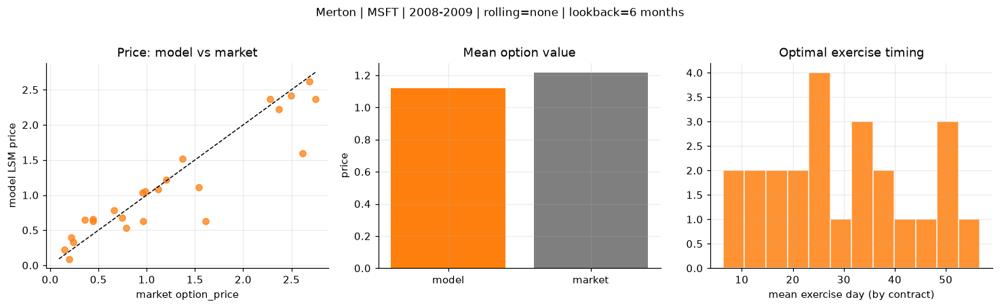
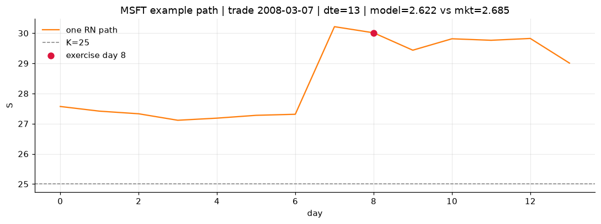
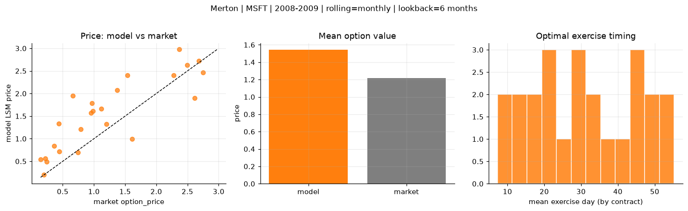
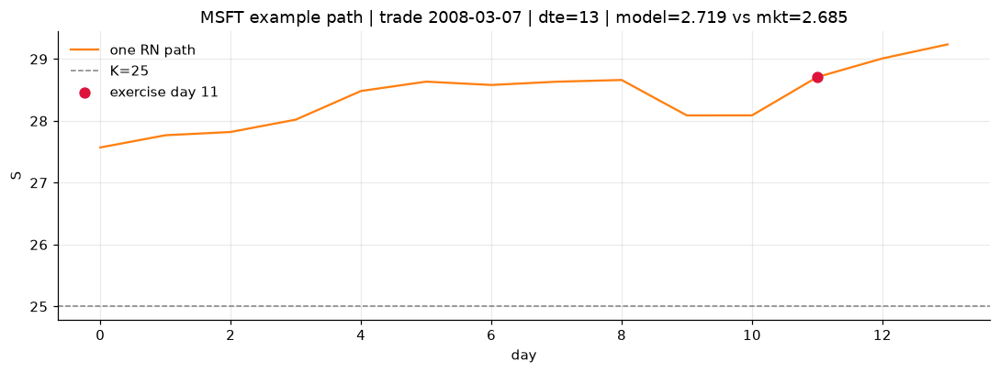
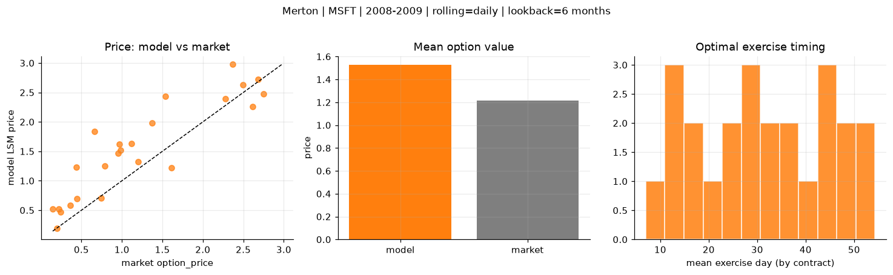
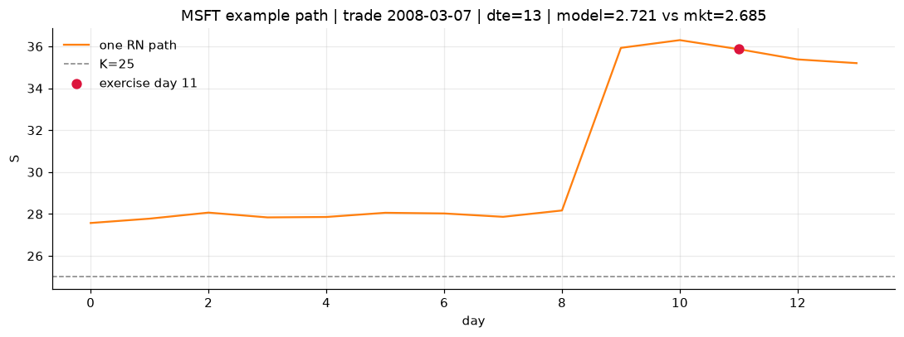

# Optimal stopping — Merton — 2008-2009 — MSFT

**Model:** Merton  
**Underlying:** MSFT  
**Regime / period:** 2008-2009  
**Lookback:** 6 months (fixed)  
**Rolling modes:** none, monthly, daily  
**Pricing:** LSM American calls on MSFT | n_paths=2000 | seed=42 | contracts=24

## Comparison (same contracts, same lookback)

| Rolling | RMSE | MAE | Bias (model−mkt) | Mean early-ex frac | Cal updates | Cal s | LSM s |
|---------|-----:|----:|-----------------:|-------------------:|------------:|------:|------:|
| `none` | 0.3426 | 0.2275 | -0.0974 | 0.307 | 1 | 0.0 | 0.1 |
| `monthly` | 0.5647 | 0.4665 | 0.3270 | 0.196 | 25 | 0.0 | 0.1 |
| `daily` | 0.4913 | 0.4000 | 0.3111 | 0.196 | 505 | 0.1 | 0.1 |

**Lowest RMSE (this study):** `none` = 0.3426

## Rolling = `none`

- **RMSE:** 0.3426  
- **MAE:** 0.2275  
- **Bias:** -0.0974  
- **Mean early-exercise fraction:** 0.307  
- **Calibration updates (MSFT):** 1

Contract errors (compact)

| date | K | dte | market | model | error | early_ex |
|------|--:|----:|-------:|------:|------:|---------:|
| 2008-03-07 | 25 | 13 | 2.685 | 2.622 | -0.063 | 0.958 |
| 2009-08-12 | 22 | 9 | 1.200 | 1.219 | 0.019 | 0.609 |
| 2008-10-24 | 21 | 28 | 2.615 | 1.596 | -1.019 | 0.464 |
| 2009-12-18 | 27.5 | 28 | 2.280 | 2.366 | 0.086 | 0.395 |
| 2009-06-30 | 22 | 52 | 2.370 | 2.222 | -0.148 | 0.765 |
| 2008-02-29 | 26 | 49 | 2.495 | 2.418 | -0.077 | 0.474 |
| 2008-03-07 | 27.5 | 13 | 0.745 | 0.678 | -0.067 | 0.293 |
| 2008-12-30 | 19 | 17 | 0.790 | 0.534 | -0.256 | 0.245 |
| 2009-07-29 | 23 | 23 | 0.955 | 1.039 | 0.084 | 0.323 |
| 2009-08-19 | 23 | 30 | 1.120 | 1.082 | -0.038 | 0.368 |
| 2009-02-20 | 17.5 | 56 | 1.540 | 1.116 | -0.424 | 0.382 |
| 2009-08-26 | 24 | 51 | 1.370 | 1.515 | 0.145 | 0.297 |
| 2009-08-05 | 25 | 16 | 0.145 | 0.222 | 0.077 | 0.054 |
| 2008-10-02 | 29 | 15 | 0.200 | 0.091 | -0.109 | 0.044 |
| 2008-09-11 | 29 | 36 | 0.240 | 0.331 | 0.091 | 0.066 |
| 2008-05-27 | 29 | 24 | 0.445 | 0.633 | 0.188 | 0.147 |
| 2009-05-18 | 21 | 60 | 0.660 | 0.784 | 0.124 | 0.192 |
| 2009-08-26 | 26 | 51 | 0.440 | 0.657 | 0.217 | 0.123 |
| 2009-10-15 | 28 | 36 | 0.220 | 0.395 | 0.175 | 0.056 |
| 2008-10-17 | 25 | 35 | 1.610 | 0.630 | -0.980 | 0.180 |
| 2009-09-02 | 24 | 44 | 0.985 | 1.056 | 0.071 | 0.228 |
| 2009-10-29 | 30 | 50 | 0.360 | 0.645 | 0.285 | 0.137 |
| 2009-04-13 | 20 | 32 | 0.965 | 0.631 | -0.334 | 0.163 |
| 2008-07-16 | 24 | 30 | 2.750 | 2.365 | -0.385 | 0.407 |

## Rolling = `monthly`

- **RMSE:** 0.5647  
- **MAE:** 0.4665  
- **Bias:** 0.3270  
- **Mean early-exercise fraction:** 0.196  
- **Calibration updates (MSFT):** 25

Contract errors (compact)

| date | K | dte | market | model | error | early_ex |
|------|--:|----:|-------:|------:|------:|---------:|
| 2008-03-07 | 25 | 13 | 2.685 | 2.719 | 0.034 | 0.618 |
| 2009-08-12 | 22 | 9 | 1.200 | 1.325 | 0.125 | 0.353 |
| 2008-10-24 | 21 | 28 | 2.615 | 1.898 | -0.717 | 0.267 |
| 2009-12-18 | 27.5 | 28 | 2.280 | 2.399 | 0.119 | 0.011 |
| 2009-06-30 | 22 | 52 | 2.370 | 2.975 | 0.605 | 0.324 |
| 2008-02-29 | 26 | 49 | 2.495 | 2.627 | 0.132 | 0.133 |
| 2008-03-07 | 27.5 | 13 | 0.745 | 0.694 | -0.051 | 0.081 |
| 2008-12-30 | 19 | 17 | 0.790 | 1.206 | 0.416 | 0.196 |
| 2009-07-29 | 23 | 23 | 0.955 | 1.570 | 0.615 | 0.136 |
| 2009-08-19 | 23 | 30 | 1.120 | 1.667 | 0.547 | 0.180 |
| 2009-02-20 | 17.5 | 56 | 1.540 | 2.398 | 0.858 | 0.189 |
| 2009-08-26 | 24 | 51 | 1.370 | 2.078 | 0.708 | 0.269 |
| 2009-08-05 | 25 | 16 | 0.145 | 0.539 | 0.394 | 0.061 |
| 2008-10-02 | 29 | 15 | 0.200 | 0.198 | -0.002 | 0.078 |
| 2008-09-11 | 29 | 36 | 0.240 | 0.488 | 0.248 | 0.086 |
| 2008-05-27 | 29 | 24 | 0.445 | 0.715 | 0.270 | 0.105 |
| 2009-05-18 | 21 | 60 | 0.660 | 1.955 | 1.295 | 0.202 |
| 2009-08-26 | 26 | 51 | 0.440 | 1.332 | 0.892 | 0.146 |
| 2009-10-15 | 28 | 36 | 0.220 | 0.565 | 0.345 | 0.082 |
| 2008-10-17 | 25 | 35 | 1.610 | 0.989 | -0.621 | 0.247 |
| 2009-09-02 | 24 | 44 | 0.985 | 1.607 | 0.622 | 0.129 |
| 2009-10-29 | 30 | 50 | 0.360 | 0.837 | 0.477 | 0.142 |
| 2009-04-13 | 20 | 32 | 0.965 | 1.786 | 0.821 | 0.121 |
| 2008-07-16 | 24 | 30 | 2.750 | 2.466 | -0.284 | 0.545 |

## Rolling = `daily`

- **RMSE:** 0.4913  
- **MAE:** 0.4000  
- **Bias:** 0.3111  
- **Mean early-exercise fraction:** 0.196  
- **Calibration updates (MSFT):** 505

Contract errors (compact)

| date | K | dte | market | model | error | early_ex |
|------|--:|----:|-------:|------:|------:|---------:|
| 2008-03-07 | 25 | 13 | 2.685 | 2.721 | 0.036 | 0.837 |
| 2009-08-12 | 22 | 9 | 1.200 | 1.320 | 0.120 | 0.422 |
| 2008-10-24 | 21 | 28 | 2.615 | 2.260 | -0.355 | 0.355 |
| 2009-12-18 | 27.5 | 28 | 2.280 | 2.397 | 0.117 | 0.011 |
| 2009-06-30 | 22 | 52 | 2.370 | 2.975 | 0.605 | 0.324 |
| 2008-02-29 | 26 | 49 | 2.495 | 2.627 | 0.132 | 0.133 |
| 2008-03-07 | 27.5 | 13 | 0.745 | 0.703 | -0.042 | 0.264 |
| 2008-12-30 | 19 | 17 | 0.790 | 1.253 | 0.463 | 0.204 |
| 2009-07-29 | 23 | 23 | 0.955 | 1.472 | 0.517 | 0.121 |
| 2009-08-19 | 23 | 30 | 1.120 | 1.631 | 0.511 | 0.189 |
| 2009-02-20 | 17.5 | 56 | 1.540 | 2.432 | 0.892 | 0.194 |
| 2009-08-26 | 24 | 51 | 1.370 | 1.984 | 0.614 | 0.262 |
| 2009-08-05 | 25 | 16 | 0.145 | 0.521 | 0.376 | 0.091 |
| 2008-10-02 | 29 | 15 | 0.200 | 0.197 | -0.003 | 0.062 |
| 2008-09-11 | 29 | 36 | 0.240 | 0.466 | 0.226 | 0.089 |
| 2008-05-27 | 29 | 24 | 0.445 | 0.696 | 0.251 | 0.017 |
| 2009-05-18 | 21 | 60 | 0.660 | 1.834 | 1.174 | 0.246 |
| 2009-08-26 | 26 | 51 | 0.440 | 1.227 | 0.787 | 0.141 |
| 2009-10-15 | 28 | 36 | 0.220 | 0.516 | 0.296 | 0.079 |
| 2008-10-17 | 25 | 35 | 1.610 | 1.219 | -0.391 | 0.210 |
| 2009-09-02 | 24 | 44 | 0.985 | 1.521 | 0.536 | 0.173 |
| 2009-10-29 | 30 | 50 | 0.360 | 0.585 | 0.225 | 0.114 |
| 2009-04-13 | 20 | 32 | 0.965 | 1.620 | 0.655 | 0.050 |
| 2008-07-16 | 24 | 30 | 2.750 | 2.475 | -0.275 | 0.120 |

