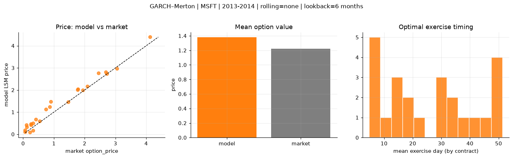
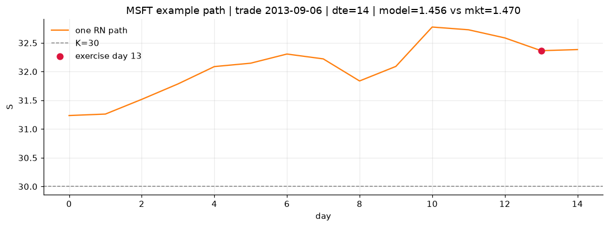
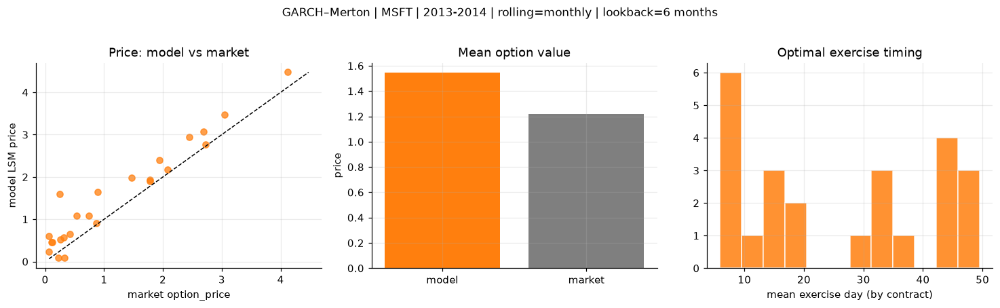
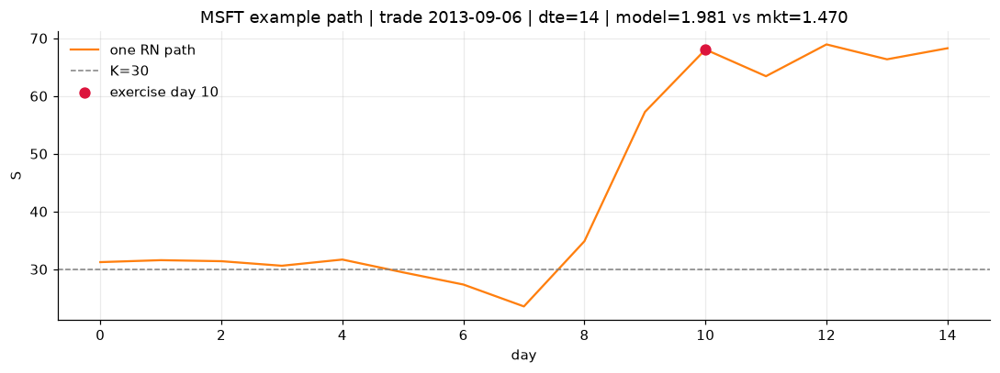
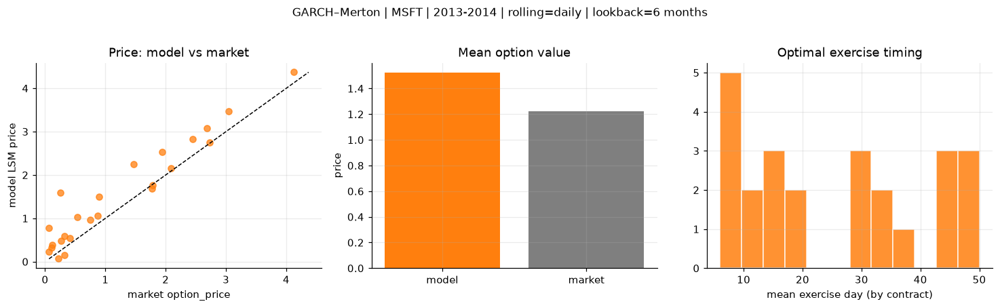
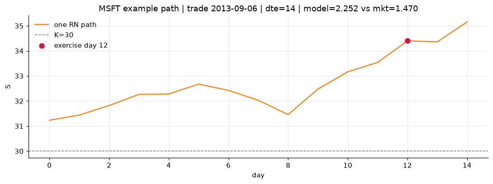

# Optimal stopping — GARCH–Merton — 2013-2014 — MSFT

**Model:** GARCH–Merton  
**Underlying:** MSFT  
**Regime / period:** 2013-2014  
**Lookback:** 6 months (fixed)  
**Rolling modes:** none, monthly, daily  
**Pricing:** LSM American calls on MSFT | n_paths=2000 | seed=42 | contracts=24

## Comparison (same contracts, same lookback)

| Rolling | RMSE | MAE | Bias (model−mkt) | Mean early-ex frac | Cal updates | Cal s | LSM s |
|---------|-----:|----:|-----------------:|-------------------:|------------:|------:|------:|
| `none` | 0.2338 | 0.1917 | 0.1596 | 0.234 | 1 | 0.1 | 0.1 |
| `monthly` | 0.4485 | 0.3563 | 0.3255 | 0.231 | 25 | 1.1 | 0.1 |
| `daily` | 0.4488 | 0.3391 | 0.3034 | 0.227 | 505 | 16.0 | 0.1 |

**Lowest RMSE (this study):** `none` = 0.2338

## Rolling = `none`

- **RMSE:** 0.2338  
- **MAE:** 0.1917  
- **Bias:** 0.1596  
- **Mean early-exercise fraction:** 0.234  
- **Calibration updates (MSFT):** 1

Contract errors (compact)

| date | K | dte | market | model | error | early_ex |
|------|--:|----:|-------:|------:|------:|---------:|
| 2013-09-06 | 30 | 14 | 1.470 | 1.456 | -0.014 | 0.246 |
| 2014-09-25 | 45 | 8 | 2.085 | 2.173 | 0.088 | 0.498 |
| 2014-03-21 | 39 | 35 | 1.940 | 1.989 | 0.049 | 0.350 |
| 2014-03-21 | 38 | 35 | 2.690 | 2.809 | 0.119 | 0.541 |
| 2014-07-23 | 41 | 58 | 4.125 | 4.395 | 0.270 | 0.200 |
| 2013-04-02 | 27 | 45 | 1.775 | 2.006 | 0.231 | 0.569 |
| 2013-09-27 | 32.5 | 7 | 0.540 | 0.599 | 0.059 | 0.051 |
| 2014-06-17 | 42 | 10 | 0.260 | 0.417 | 0.157 | 0.135 |
| 2014-09-18 | 46.5 | 22 | 0.745 | 1.124 | 0.379 | 0.305 |
| 2014-09-25 | 46 | 36 | 1.780 | 2.037 | 0.257 | 0.450 |
| 2014-05-12 | 39.5 | 46 | 0.895 | 1.475 | 0.580 | 0.324 |
| 2014-10-02 | 47 | 50 | 0.870 | 1.246 | 0.376 | 0.172 |
| 2014-10-16 | 45.5 | 15 | 0.325 | 0.165 | -0.160 | 0.058 |
| 2014-04-04 | 42.5 | 7 | 0.065 | 0.105 | 0.040 | 0.048 |
| 2014-02-21 | 40 | 21 | 0.065 | 0.187 | 0.122 | 0.070 |
| 2013-11-15 | 40 | 35 | 0.250 | 0.463 | 0.213 | 0.037 |
| 2014-06-10 | 45 | 45 | 0.120 | 0.330 | 0.210 | 0.069 |
| 2014-08-27 | 49 | 51 | 0.110 | 0.419 | 0.309 | 0.064 |
| 2014-07-09 | 44 | 37 | 0.320 | 0.494 | 0.174 | 0.070 |
| 2013-12-09 | 35.5 | 18 | 3.050 | 2.975 | -0.075 | 0.193 |
| 2013-01-25 | 28.5 | 7 | 0.220 | 0.084 | -0.136 | 0.037 |
| 2014-06-24 | 40 | 52 | 2.445 | 2.762 | 0.317 | 0.340 |
| 2013-07-11 | 32 | 8 | 2.725 | 2.738 | 0.013 | 0.699 |
| 2014-09-18 | 47 | 15 | 0.415 | 0.666 | 0.251 | 0.101 |

## Rolling = `monthly`

- **RMSE:** 0.4485  
- **MAE:** 0.3563  
- **Bias:** 0.3255  
- **Mean early-exercise fraction:** 0.231  
- **Calibration updates (MSFT):** 25

Contract errors (compact)

| date | K | dte | market | model | error | early_ex |
|------|--:|----:|-------:|------:|------:|---------:|
| 2013-09-06 | 30 | 14 | 1.470 | 1.981 | 0.511 | 0.591 |
| 2014-09-25 | 45 | 8 | 2.085 | 2.167 | 0.082 | 0.539 |
| 2014-03-21 | 39 | 35 | 1.940 | 2.406 | 0.466 | 0.326 |
| 2014-03-21 | 38 | 35 | 2.690 | 3.065 | 0.375 | 0.374 |
| 2014-07-23 | 41 | 58 | 4.125 | 4.475 | 0.350 | 0.391 |
| 2013-04-02 | 27 | 45 | 1.775 | 1.903 | 0.128 | 0.405 |
| 2013-09-27 | 32.5 | 7 | 0.540 | 1.081 | 0.541 | 0.029 |
| 2014-06-17 | 42 | 10 | 0.260 | 0.516 | 0.256 | 0.075 |
| 2014-09-18 | 46.5 | 22 | 0.745 | 1.082 | 0.337 | 0.227 |
| 2014-09-25 | 46 | 36 | 1.780 | 1.941 | 0.161 | 0.505 |
| 2014-05-12 | 39.5 | 46 | 0.895 | 1.650 | 0.755 | 0.381 |
| 2014-10-02 | 47 | 50 | 0.870 | 0.902 | 0.032 | 0.267 |
| 2014-10-16 | 45.5 | 15 | 0.325 | 0.091 | -0.234 | 0.043 |
| 2014-04-04 | 42.5 | 7 | 0.065 | 0.227 | 0.162 | 0.061 |
| 2014-02-21 | 40 | 21 | 0.065 | 0.602 | 0.537 | 0.077 |
| 2013-11-15 | 40 | 35 | 0.250 | 1.602 | 1.352 | 0.128 |
| 2014-06-10 | 45 | 45 | 0.120 | 0.464 | 0.344 | 0.076 |
| 2014-08-27 | 49 | 51 | 0.110 | 0.466 | 0.356 | 0.082 |
| 2014-07-09 | 44 | 37 | 0.320 | 0.563 | 0.243 | 0.099 |
| 2013-12-09 | 35.5 | 18 | 3.050 | 3.467 | 0.417 | 0.232 |
| 2013-01-25 | 28.5 | 7 | 0.220 | 0.084 | -0.136 | 0.037 |
| 2014-06-24 | 40 | 52 | 2.445 | 2.937 | 0.492 | 0.396 |
| 2013-07-11 | 32 | 8 | 2.725 | 2.773 | 0.048 | 0.000 |
| 2014-09-18 | 47 | 15 | 0.415 | 0.652 | 0.237 | 0.201 |

## Rolling = `daily`

- **RMSE:** 0.4488  
- **MAE:** 0.3391  
- **Bias:** 0.3034  
- **Mean early-exercise fraction:** 0.227  
- **Calibration updates (MSFT):** 505

Contract errors (compact)

| date | K | dte | market | model | error | early_ex |
|------|--:|----:|-------:|------:|------:|---------:|
| 2013-09-06 | 30 | 14 | 1.470 | 2.252 | 0.782 | 0.329 |
| 2014-09-25 | 45 | 8 | 2.085 | 2.149 | 0.064 | 0.403 |
| 2014-03-21 | 39 | 35 | 1.940 | 2.537 | 0.597 | 0.337 |
| 2014-03-21 | 38 | 35 | 2.690 | 3.074 | 0.384 | 0.452 |
| 2014-07-23 | 41 | 58 | 4.125 | 4.371 | 0.246 | 0.349 |
| 2013-04-02 | 27 | 45 | 1.775 | 1.680 | -0.095 | 0.518 |
| 2013-09-27 | 32.5 | 7 | 0.540 | 1.021 | 0.481 | 0.035 |
| 2014-06-17 | 42 | 10 | 0.260 | 0.483 | 0.223 | 0.070 |
| 2014-09-18 | 46.5 | 22 | 0.745 | 0.969 | 0.224 | 0.282 |
| 2014-09-25 | 46 | 36 | 1.780 | 1.766 | -0.014 | 0.635 |
| 2014-05-12 | 39.5 | 46 | 0.895 | 1.500 | 0.605 | 0.177 |
| 2014-10-02 | 47 | 50 | 0.870 | 1.057 | 0.187 | 0.255 |
| 2014-10-16 | 45.5 | 15 | 0.325 | 0.152 | -0.173 | 0.050 |
| 2014-04-04 | 42.5 | 7 | 0.065 | 0.231 | 0.166 | 0.064 |
| 2014-02-21 | 40 | 21 | 0.065 | 0.778 | 0.713 | 0.079 |
| 2013-11-15 | 40 | 35 | 0.250 | 1.592 | 1.342 | 0.128 |
| 2014-06-10 | 45 | 45 | 0.120 | 0.387 | 0.267 | 0.074 |
| 2014-08-27 | 49 | 51 | 0.110 | 0.325 | 0.215 | 0.099 |
| 2014-07-09 | 44 | 37 | 0.320 | 0.583 | 0.263 | 0.162 |
| 2013-12-09 | 35.5 | 18 | 3.050 | 3.472 | 0.422 | 0.242 |
| 2013-01-25 | 28.5 | 7 | 0.220 | 0.073 | -0.147 | 0.035 |
| 2014-06-24 | 40 | 52 | 2.445 | 2.824 | 0.379 | 0.420 |
| 2013-07-11 | 32 | 8 | 2.725 | 2.749 | 0.024 | 0.073 |
| 2014-09-18 | 47 | 15 | 0.415 | 0.540 | 0.125 | 0.180 |

