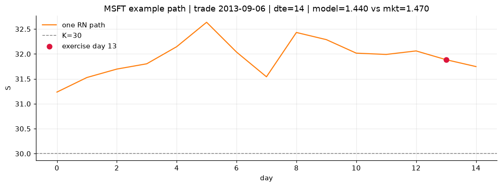
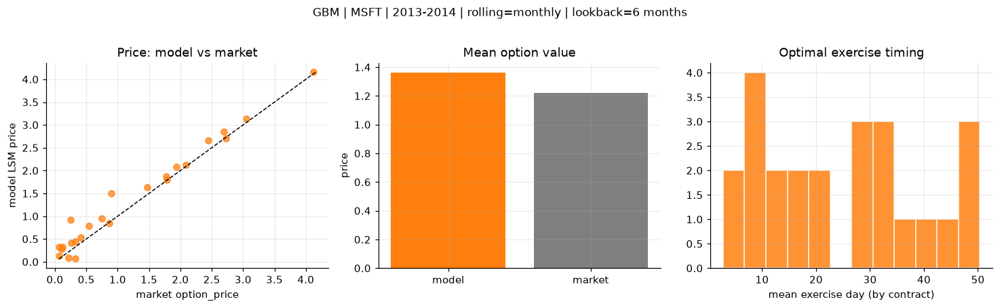
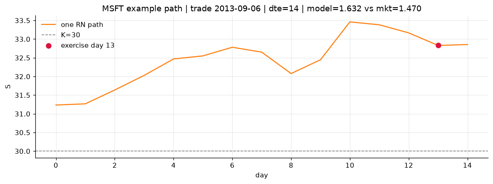
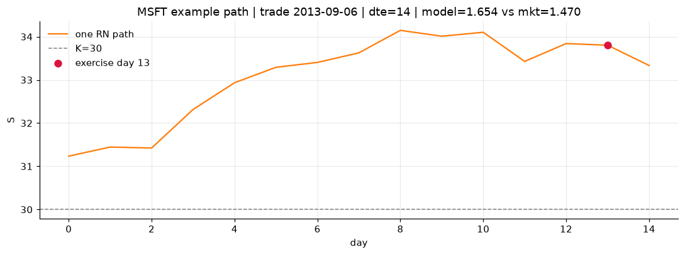

# Optimal stopping — GBM — 2013-2014 — MSFT

**Model:** GBM  
**Underlying:** MSFT  
**Regime / period:** 2013-2014  
**Lookback:** 6 months (fixed)  
**Rolling modes:** none, monthly, daily  
**Pricing:** LSM American calls on MSFT | n_paths=2000 | seed=42 | contracts=24

## Comparison (same contracts, same lookback)

| Rolling | RMSE | MAE | Bias (model−mkt) | Mean early-ex frac | Cal updates | Cal s | LSM s |
|---------|-----:|----:|-----------------:|-------------------:|------------:|------:|------:|
| `none` | 0.2040 | 0.1647 | 0.1250 | 0.307 | 1 | 0.0 | 0.1 |
| `monthly` | 0.2378 | 0.1772 | 0.1415 | 0.282 | 25 | 0.0 | 0.1 |
| `daily` | 0.2282 | 0.1660 | 0.1224 | 0.287 | 505 | 0.1 | 0.2 |

**Lowest RMSE (this study):** `none` = 0.2040

## Rolling = `none`

- **RMSE:** 0.2040  
- **MAE:** 0.1647  
- **Bias:** 0.1250  
- **Mean early-exercise fraction:** 0.307  
- **Calibration updates (MSFT):** 1

Contract errors (compact)

| date | K | dte | market | model | error | early_ex |
|------|--:|----:|-------:|------:|------:|---------:|
| 2013-09-06 | 30 | 14 | 1.470 | 1.440 | -0.030 | 0.274 |
| 2014-09-25 | 45 | 8 | 2.085 | 2.163 | 0.078 | 0.562 |
| 2014-03-21 | 39 | 35 | 1.940 | 1.943 | 0.003 | 0.399 |
| 2014-03-21 | 38 | 35 | 2.690 | 2.752 | 0.062 | 0.561 |
| 2014-07-23 | 41 | 58 | 4.125 | 4.194 | 0.069 | 0.635 |
| 2013-04-02 | 27 | 45 | 1.775 | 1.944 | 0.169 | 0.598 |
| 2013-09-27 | 32.5 | 7 | 0.540 | 0.595 | 0.055 | 0.116 |
| 2014-06-17 | 42 | 10 | 0.260 | 0.416 | 0.156 | 0.144 |
| 2014-09-18 | 46.5 | 22 | 0.745 | 1.106 | 0.361 | 0.306 |
| 2014-09-25 | 46 | 36 | 1.780 | 1.990 | 0.210 | 0.456 |
| 2014-05-12 | 39.5 | 46 | 0.895 | 1.421 | 0.526 | 0.329 |
| 2014-10-02 | 47 | 50 | 0.870 | 1.201 | 0.331 | 0.181 |
| 2014-10-16 | 45.5 | 15 | 0.325 | 0.163 | -0.162 | 0.059 |
| 2014-04-04 | 42.5 | 7 | 0.065 | 0.106 | 0.041 | 0.049 |
| 2014-02-21 | 40 | 21 | 0.065 | 0.187 | 0.122 | 0.065 |
| 2013-11-15 | 40 | 35 | 0.250 | 0.449 | 0.199 | 0.060 |
| 2014-06-10 | 45 | 45 | 0.120 | 0.318 | 0.198 | 0.068 |
| 2014-08-27 | 49 | 51 | 0.110 | 0.398 | 0.288 | 0.070 |
| 2014-07-09 | 44 | 37 | 0.320 | 0.473 | 0.153 | 0.074 |
| 2013-12-09 | 35.5 | 18 | 3.050 | 2.927 | -0.123 | 0.770 |
| 2013-01-25 | 28.5 | 7 | 0.220 | 0.084 | -0.136 | 0.037 |
| 2014-06-24 | 40 | 52 | 2.445 | 2.656 | 0.211 | 0.441 |
| 2013-07-11 | 32 | 8 | 2.725 | 2.700 | -0.025 | 1.000 |
| 2014-09-18 | 47 | 15 | 0.415 | 0.660 | 0.245 | 0.107 |

## Rolling = `monthly`

- **RMSE:** 0.2378  
- **MAE:** 0.1772  
- **Bias:** 0.1415  
- **Mean early-exercise fraction:** 0.282  
- **Calibration updates (MSFT):** 25

Contract errors (compact)

| date | K | dte | market | model | error | early_ex |
|------|--:|----:|-------:|------:|------:|---------:|
| 2013-09-06 | 30 | 14 | 1.470 | 1.632 | 0.162 | 0.291 |
| 2014-09-25 | 45 | 8 | 2.085 | 2.125 | 0.040 | 0.610 |
| 2014-03-21 | 39 | 35 | 1.940 | 2.077 | 0.137 | 0.351 |
| 2014-03-21 | 38 | 35 | 2.690 | 2.859 | 0.169 | 0.536 |
| 2014-07-23 | 41 | 58 | 4.125 | 4.155 | 0.030 | 0.641 |
| 2013-04-02 | 27 | 45 | 1.775 | 1.877 | 0.102 | 0.625 |
| 2013-09-27 | 32.5 | 7 | 0.540 | 0.790 | 0.250 | 0.061 |
| 2014-06-17 | 42 | 10 | 0.260 | 0.421 | 0.161 | 0.145 |
| 2014-09-18 | 46.5 | 22 | 0.745 | 0.945 | 0.200 | 0.310 |
| 2014-09-25 | 46 | 36 | 1.780 | 1.796 | 0.016 | 0.469 |
| 2014-05-12 | 39.5 | 46 | 0.895 | 1.507 | 0.612 | 0.327 |
| 2014-10-02 | 47 | 50 | 0.870 | 0.846 | -0.024 | 0.164 |
| 2014-10-16 | 45.5 | 15 | 0.325 | 0.070 | -0.255 | 0.035 |
| 2014-04-04 | 42.5 | 7 | 0.065 | 0.139 | 0.074 | 0.066 |
| 2014-02-21 | 40 | 21 | 0.065 | 0.327 | 0.262 | 0.095 |
| 2013-11-15 | 40 | 35 | 0.250 | 0.918 | 0.668 | 0.133 |
| 2014-06-10 | 45 | 45 | 0.120 | 0.329 | 0.209 | 0.070 |
| 2014-08-27 | 49 | 51 | 0.110 | 0.289 | 0.179 | 0.076 |
| 2014-07-09 | 44 | 37 | 0.320 | 0.451 | 0.131 | 0.073 |
| 2013-12-09 | 35.5 | 18 | 3.050 | 3.139 | 0.089 | 0.122 |
| 2013-01-25 | 28.5 | 7 | 0.220 | 0.084 | -0.136 | 0.037 |
| 2014-06-24 | 40 | 52 | 2.445 | 2.666 | 0.221 | 0.442 |
| 2013-07-11 | 32 | 8 | 2.725 | 2.711 | -0.014 | 0.975 |
| 2014-09-18 | 47 | 15 | 0.415 | 0.529 | 0.114 | 0.113 |

## Rolling = `daily`

- **RMSE:** 0.2282  
- **MAE:** 0.1660  
- **Bias:** 0.1224  
- **Mean early-exercise fraction:** 0.287  
- **Calibration updates (MSFT):** 505

Contract errors (compact)

| date | K | dte | market | model | error | early_ex |
|------|--:|----:|-------:|------:|------:|---------:|
| 2013-09-06 | 30 | 14 | 1.470 | 1.654 | 0.184 | 0.299 |
| 2014-09-25 | 45 | 8 | 2.085 | 2.109 | 0.024 | 0.614 |
| 2014-03-21 | 39 | 35 | 1.940 | 2.022 | 0.082 | 0.383 |
| 2014-03-21 | 38 | 35 | 2.690 | 2.825 | 0.135 | 0.542 |
| 2014-07-23 | 41 | 58 | 4.125 | 4.090 | -0.035 | 0.662 |
| 2013-04-02 | 27 | 45 | 1.775 | 1.866 | 0.091 | 0.634 |
| 2013-09-27 | 32.5 | 7 | 0.540 | 0.825 | 0.285 | 0.061 |
| 2014-06-17 | 42 | 10 | 0.260 | 0.405 | 0.145 | 0.145 |
| 2014-09-18 | 46.5 | 22 | 0.745 | 0.885 | 0.140 | 0.309 |
| 2014-09-25 | 46 | 36 | 1.780 | 1.742 | -0.038 | 0.475 |
| 2014-05-12 | 39.5 | 46 | 0.895 | 1.442 | 0.547 | 0.326 |
| 2014-10-02 | 47 | 50 | 0.870 | 0.836 | -0.034 | 0.165 |
| 2014-10-16 | 45.5 | 15 | 0.325 | 0.081 | -0.244 | 0.038 |
| 2014-04-04 | 42.5 | 7 | 0.065 | 0.147 | 0.082 | 0.069 |
| 2014-02-21 | 40 | 21 | 0.065 | 0.334 | 0.269 | 0.096 |
| 2013-11-15 | 40 | 35 | 0.250 | 0.944 | 0.694 | 0.141 |
| 2014-06-10 | 45 | 45 | 0.120 | 0.313 | 0.193 | 0.068 |
| 2014-08-27 | 49 | 51 | 0.110 | 0.250 | 0.140 | 0.080 |
| 2014-07-09 | 44 | 37 | 0.320 | 0.433 | 0.113 | 0.072 |
| 2013-12-09 | 35.5 | 18 | 3.050 | 3.138 | 0.088 | 0.124 |
| 2013-01-25 | 28.5 | 7 | 0.220 | 0.070 | -0.150 | 0.036 |
| 2014-06-24 | 40 | 52 | 2.445 | 2.620 | 0.175 | 0.454 |
| 2013-07-11 | 32 | 8 | 2.725 | 2.702 | -0.023 | 0.980 |
| 2014-09-18 | 47 | 15 | 0.415 | 0.488 | 0.073 | 0.116 |

