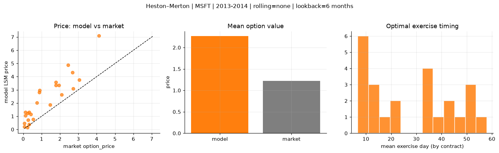
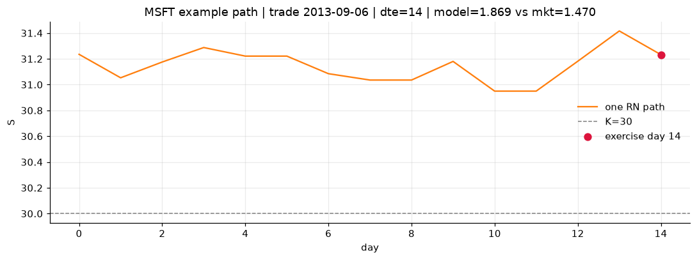
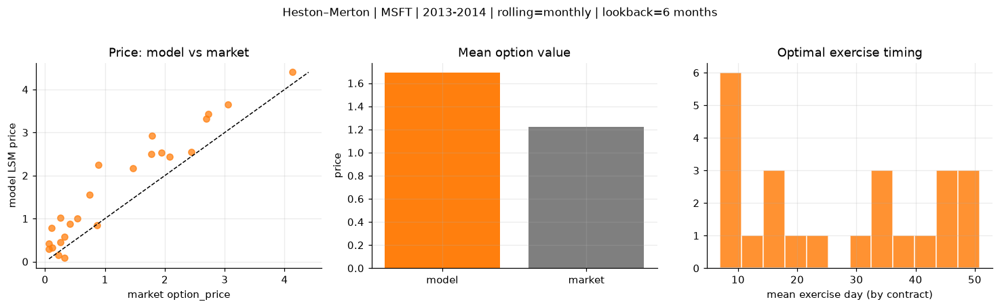
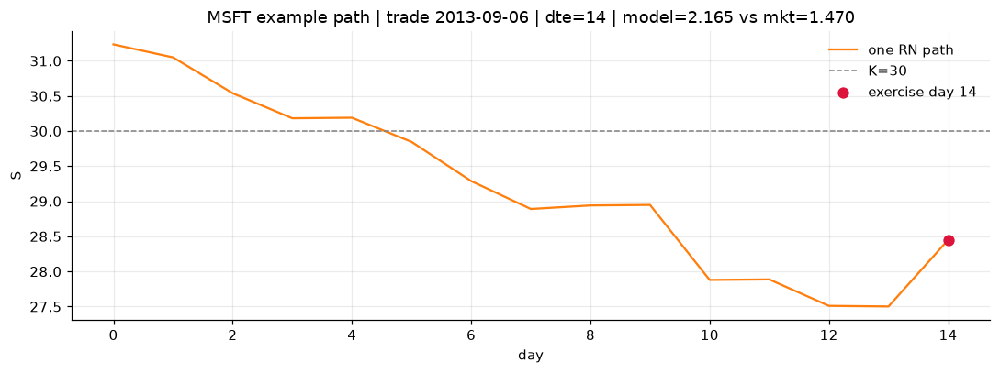
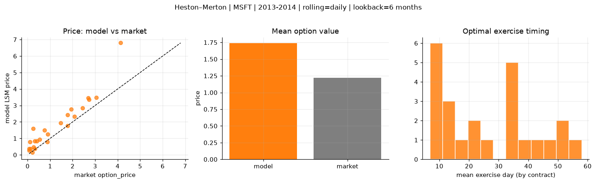
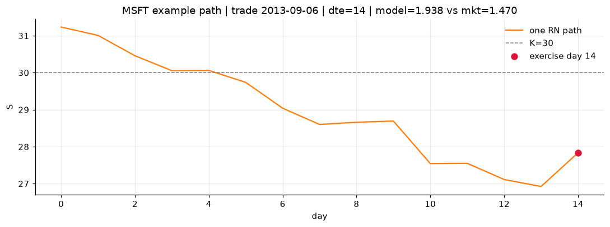

# Optimal stopping — Heston–Merton — 2013-2014 — MSFT

**Model:** Heston–Merton  
**Underlying:** MSFT  
**Regime / period:** 2013-2014  
**Lookback:** 6 months (fixed)  
**Rolling modes:** none, monthly, daily  
**Pricing:** LSM American calls on MSFT | n_paths=2000 | seed=42 | contracts=24

## Comparison (same contracts, same lookback)

| Rolling | RMSE | MAE | Bias (model−mkt) | Mean early-ex frac | Cal updates | Cal s | LSM s |
|---------|-----:|----:|-----------------:|-------------------:|------------:|------:|------:|
| `none` | 1.3031 | 1.0510 | 1.0457 | 0.016 | 1 | 0.0 | 0.1 |
| `monthly` | 0.5959 | 0.4974 | 0.4704 | 0.138 | 25 | 0.0 | 0.2 |
| `daily` | 0.7551 | 0.5297 | 0.5185 | 0.120 | 505 | 1.9 | 0.3 |

**Lowest RMSE (this study):** `monthly` = 0.5959

## Rolling = `none`

- **RMSE:** 1.3031  
- **MAE:** 1.0510  
- **Bias:** 1.0457  
- **Mean early-exercise fraction:** 0.016  
- **Calibration updates (MSFT):** 1

Contract errors (compact)

| date | K | dte | market | model | error | early_ex |
|------|--:|----:|-------:|------:|------:|---------:|
| 2013-09-06 | 30 | 14 | 1.470 | 1.869 | 0.399 | 0.011 |
| 2014-09-25 | 45 | 8 | 2.085 | 2.619 | 0.534 | 0.006 |
| 2014-03-21 | 39 | 35 | 1.940 | 3.346 | 1.406 | 0.000 |
| 2014-03-21 | 38 | 35 | 2.690 | 4.310 | 1.620 | 0.000 |
| 2014-07-23 | 41 | 58 | 4.125 | 7.085 | 2.960 | 0.001 |
| 2013-04-02 | 27 | 45 | 1.775 | 3.340 | 1.565 | 0.000 |
| 2013-09-27 | 32.5 | 7 | 0.540 | 0.772 | 0.232 | 0.102 |
| 2014-06-17 | 42 | 10 | 0.260 | 0.719 | 0.459 | 0.141 |
| 2014-09-18 | 46.5 | 22 | 0.745 | 2.012 | 1.267 | 0.006 |
| 2014-09-25 | 46 | 36 | 1.780 | 3.570 | 1.790 | 0.000 |
| 2014-05-12 | 39.5 | 46 | 0.895 | 2.957 | 2.062 | 0.000 |
| 2014-10-02 | 47 | 50 | 0.870 | 2.815 | 1.945 | 0.004 |
| 2014-10-16 | 45.5 | 15 | 0.325 | 0.396 | 0.071 | 0.018 |
| 2014-04-04 | 42.5 | 7 | 0.065 | 0.217 | 0.152 | 0.000 |
| 2014-02-21 | 40 | 21 | 0.065 | 0.469 | 0.404 | 0.001 |
| 2013-11-15 | 40 | 35 | 0.250 | 1.216 | 0.966 | 0.002 |
| 2014-06-10 | 45 | 45 | 0.120 | 1.058 | 0.938 | 0.002 |
| 2014-08-27 | 49 | 51 | 0.110 | 1.298 | 1.188 | 0.003 |
| 2014-07-09 | 44 | 37 | 0.320 | 1.294 | 0.974 | 0.004 |
| 2013-12-09 | 35.5 | 18 | 3.050 | 3.759 | 0.709 | 0.000 |
| 2013-01-25 | 28.5 | 7 | 0.220 | 0.156 | -0.064 | 0.006 |
| 2014-06-24 | 40 | 52 | 2.445 | 4.864 | 2.419 | 0.000 |
| 2013-07-11 | 32 | 8 | 2.725 | 3.101 | 0.376 | 0.000 |
| 2014-09-18 | 47 | 15 | 0.415 | 1.139 | 0.724 | 0.077 |

## Rolling = `monthly`

- **RMSE:** 0.5959  
- **MAE:** 0.4974  
- **Bias:** 0.4704  
- **Mean early-exercise fraction:** 0.138  
- **Calibration updates (MSFT):** 25

Contract errors (compact)

| date | K | dte | market | model | error | early_ex |
|------|--:|----:|-------:|------:|------:|---------:|
| 2013-09-06 | 30 | 14 | 1.470 | 2.165 | 0.695 | 0.003 |
| 2014-09-25 | 45 | 8 | 2.085 | 2.433 | 0.348 | 0.001 |
| 2014-03-21 | 39 | 35 | 1.940 | 2.538 | 0.598 | 0.213 |
| 2014-03-21 | 38 | 35 | 2.690 | 3.318 | 0.628 | 0.225 |
| 2014-07-23 | 41 | 58 | 4.125 | 4.401 | 0.276 | 0.449 |
| 2013-04-02 | 27 | 45 | 1.775 | 2.506 | 0.731 | 0.004 |
| 2013-09-27 | 32.5 | 7 | 0.540 | 1.001 | 0.461 | 0.023 |
| 2014-06-17 | 42 | 10 | 0.260 | 0.449 | 0.189 | 0.139 |
| 2014-09-18 | 46.5 | 22 | 0.745 | 1.551 | 0.806 | 0.228 |
| 2014-09-25 | 46 | 36 | 1.780 | 2.931 | 1.151 | 0.001 |
| 2014-05-12 | 39.5 | 46 | 0.895 | 2.256 | 1.361 | 0.449 |
| 2014-10-02 | 47 | 50 | 0.870 | 0.853 | -0.017 | 0.223 |
| 2014-10-16 | 45.5 | 15 | 0.325 | 0.083 | -0.242 | 0.035 |
| 2014-04-04 | 42.5 | 7 | 0.065 | 0.293 | 0.228 | 0.011 |
| 2014-02-21 | 40 | 21 | 0.065 | 0.424 | 0.359 | 0.217 |
| 2013-11-15 | 40 | 35 | 0.250 | 1.022 | 0.772 | 0.135 |
| 2014-06-10 | 45 | 45 | 0.120 | 0.331 | 0.211 | 0.098 |
| 2014-08-27 | 49 | 51 | 0.110 | 0.780 | 0.670 | 0.104 |
| 2014-07-09 | 44 | 37 | 0.320 | 0.579 | 0.259 | 0.118 |
| 2013-12-09 | 35.5 | 18 | 3.050 | 3.646 | 0.596 | 0.097 |
| 2013-01-25 | 28.5 | 7 | 0.220 | 0.156 | -0.064 | 0.006 |
| 2014-06-24 | 40 | 52 | 2.445 | 2.546 | 0.101 | 0.497 |
| 2013-07-11 | 32 | 8 | 2.725 | 3.427 | 0.702 | 0.000 |
| 2014-09-18 | 47 | 15 | 0.415 | 0.885 | 0.470 | 0.035 |

## Rolling = `daily`

- **RMSE:** 0.7551  
- **MAE:** 0.5297  
- **Bias:** 0.5185  
- **Mean early-exercise fraction:** 0.120  
- **Calibration updates (MSFT):** 505

Contract errors (compact)

| date | K | dte | market | model | error | early_ex |
|------|--:|----:|-------:|------:|------:|---------:|
| 2013-09-06 | 30 | 14 | 1.470 | 1.938 | 0.468 | 0.073 |
| 2014-09-25 | 45 | 8 | 2.085 | 2.318 | 0.233 | 0.073 |
| 2014-03-21 | 39 | 35 | 1.940 | 2.768 | 0.828 | 0.013 |
| 2014-03-21 | 38 | 35 | 2.690 | 3.466 | 0.776 | 0.000 |
| 2014-07-23 | 41 | 58 | 4.125 | 6.797 | 2.672 | 0.003 |
| 2013-04-02 | 27 | 45 | 1.775 | 1.777 | 0.002 | 0.678 |
| 2013-09-27 | 32.5 | 7 | 0.540 | 0.938 | 0.398 | 0.047 |
| 2014-06-17 | 42 | 10 | 0.260 | 0.474 | 0.214 | 0.122 |
| 2014-09-18 | 46.5 | 22 | 0.745 | 1.489 | 0.744 | 0.002 |
| 2014-09-25 | 46 | 36 | 1.780 | 2.420 | 0.640 | 0.261 |
| 2014-05-12 | 39.5 | 46 | 0.895 | 1.248 | 0.353 | 0.341 |
| 2014-10-02 | 47 | 50 | 0.870 | 0.793 | -0.077 | 0.180 |
| 2014-10-16 | 45.5 | 15 | 0.325 | 0.373 | 0.048 | 0.003 |
| 2014-04-04 | 42.5 | 7 | 0.065 | 0.284 | 0.219 | 0.011 |
| 2014-02-21 | 40 | 21 | 0.065 | 0.366 | 0.301 | 0.122 |
| 2013-11-15 | 40 | 35 | 0.250 | 1.603 | 1.353 | 0.012 |
| 2014-06-10 | 45 | 45 | 0.120 | 0.384 | 0.264 | 0.092 |
| 2014-08-27 | 49 | 51 | 0.110 | 0.789 | 0.679 | 0.073 |
| 2014-07-09 | 44 | 37 | 0.320 | 0.844 | 0.524 | 0.082 |
| 2013-12-09 | 35.5 | 18 | 3.050 | 3.474 | 0.424 | 0.168 |
| 2013-01-25 | 28.5 | 7 | 0.220 | 0.163 | -0.057 | 0.005 |
| 2014-06-24 | 40 | 52 | 2.445 | 2.840 | 0.395 | 0.385 |
| 2013-07-11 | 32 | 8 | 2.725 | 3.356 | 0.631 | 0.001 |
| 2014-09-18 | 47 | 15 | 0.415 | 0.826 | 0.411 | 0.144 |

