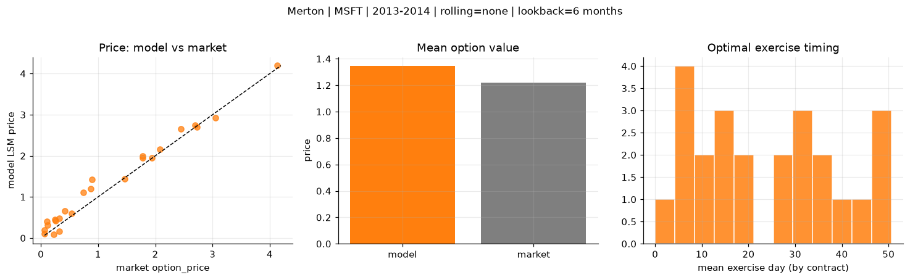
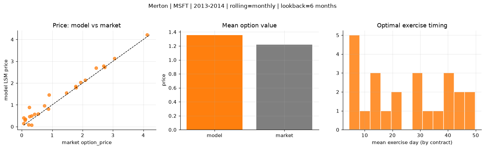
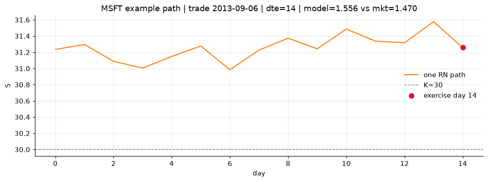
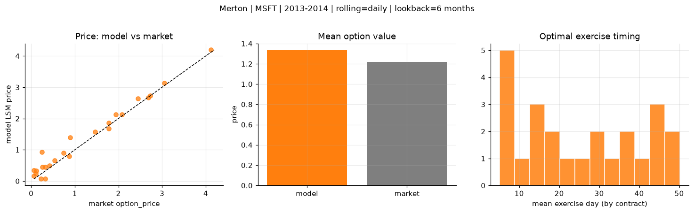
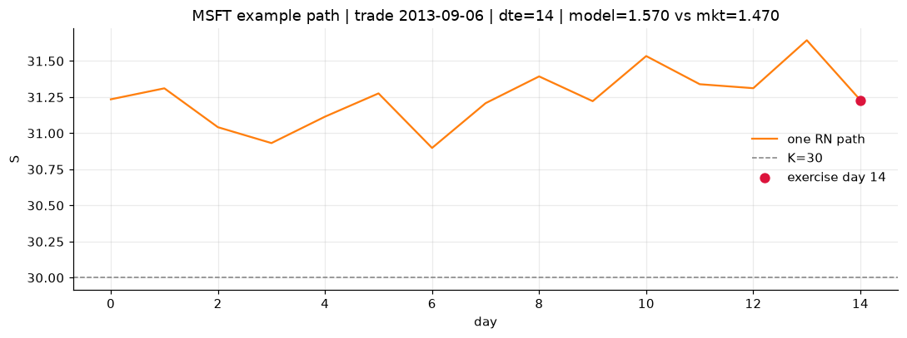

# Optimal stopping — Merton — 2013-2014 — MSFT

**Model:** Merton  
**Underlying:** MSFT  
**Regime / period:** 2013-2014  
**Lookback:** 6 months (fixed)  
**Rolling modes:** none, monthly, daily  
**Pricing:** LSM American calls on MSFT | n_paths=2000 | seed=42 | contracts=24

## Comparison (same contracts, same lookback)

| Rolling | RMSE | MAE | Bias (model−mkt) | Mean early-ex frac | Cal updates | Cal s | LSM s |
|---------|-----:|----:|-----------------:|-------------------:|------------:|------:|------:|
| `none` | 0.2040 | 0.1647 | 0.1250 | 0.307 | 1 | 0.0 | 0.1 |
| `monthly` | 0.2305 | 0.1719 | 0.1344 | 0.232 | 25 | 0.0 | 0.1 |
| `daily` | 0.2191 | 0.1629 | 0.1134 | 0.230 | 505 | 0.1 | 0.1 |

**Lowest RMSE (this study):** `none` = 0.2040

## Rolling = `none`

- **RMSE:** 0.2040  
- **MAE:** 0.1647  
- **Bias:** 0.1250  
- **Mean early-exercise fraction:** 0.307  
- **Calibration updates (MSFT):** 1

Contract errors (compact)

| date | K | dte | market | model | error | early_ex |
|------|--:|----:|-------:|------:|------:|---------:|
| 2013-09-06 | 30 | 14 | 1.470 | 1.440 | -0.030 | 0.274 |
| 2014-09-25 | 45 | 8 | 2.085 | 2.163 | 0.078 | 0.562 |
| 2014-03-21 | 39 | 35 | 1.940 | 1.943 | 0.003 | 0.399 |
| 2014-03-21 | 38 | 35 | 2.690 | 2.752 | 0.062 | 0.561 |
| 2014-07-23 | 41 | 58 | 4.125 | 4.194 | 0.069 | 0.635 |
| 2013-04-02 | 27 | 45 | 1.775 | 1.944 | 0.169 | 0.598 |
| 2013-09-27 | 32.5 | 7 | 0.540 | 0.595 | 0.055 | 0.116 |
| 2014-06-17 | 42 | 10 | 0.260 | 0.416 | 0.156 | 0.144 |
| 2014-09-18 | 46.5 | 22 | 0.745 | 1.106 | 0.361 | 0.306 |
| 2014-09-25 | 46 | 36 | 1.780 | 1.990 | 0.210 | 0.456 |
| 2014-05-12 | 39.5 | 46 | 0.895 | 1.421 | 0.526 | 0.329 |
| 2014-10-02 | 47 | 50 | 0.870 | 1.201 | 0.331 | 0.181 |
| 2014-10-16 | 45.5 | 15 | 0.325 | 0.163 | -0.162 | 0.059 |
| 2014-04-04 | 42.5 | 7 | 0.065 | 0.106 | 0.041 | 0.049 |
| 2014-02-21 | 40 | 21 | 0.065 | 0.187 | 0.122 | 0.065 |
| 2013-11-15 | 40 | 35 | 0.250 | 0.449 | 0.199 | 0.060 |
| 2014-06-10 | 45 | 45 | 0.120 | 0.318 | 0.198 | 0.068 |
| 2014-08-27 | 49 | 51 | 0.110 | 0.398 | 0.288 | 0.070 |
| 2014-07-09 | 44 | 37 | 0.320 | 0.473 | 0.153 | 0.074 |
| 2013-12-09 | 35.5 | 18 | 3.050 | 2.927 | -0.123 | 0.770 |
| 2013-01-25 | 28.5 | 7 | 0.220 | 0.084 | -0.136 | 0.037 |
| 2014-06-24 | 40 | 52 | 2.445 | 2.656 | 0.211 | 0.441 |
| 2013-07-11 | 32 | 8 | 2.725 | 2.700 | -0.025 | 1.000 |
| 2014-09-18 | 47 | 15 | 0.415 | 0.660 | 0.245 | 0.107 |

## Rolling = `monthly`

- **RMSE:** 0.2305  
- **MAE:** 0.1719  
- **Bias:** 0.1344  
- **Mean early-exercise fraction:** 0.232  
- **Calibration updates (MSFT):** 25

Contract errors (compact)

| date | K | dte | market | model | error | early_ex |
|------|--:|----:|-------:|------:|------:|---------:|
| 2013-09-06 | 30 | 14 | 1.470 | 1.556 | 0.086 | 0.083 |
| 2014-09-25 | 45 | 8 | 2.085 | 2.133 | 0.048 | 0.680 |
| 2014-03-21 | 39 | 35 | 1.940 | 2.038 | 0.098 | 0.360 |
| 2014-03-21 | 38 | 35 | 2.690 | 2.781 | 0.091 | 0.391 |
| 2014-07-23 | 41 | 58 | 4.125 | 4.210 | 0.085 | 0.567 |
| 2013-04-02 | 27 | 45 | 1.775 | 1.858 | 0.083 | 0.419 |
| 2013-09-27 | 32.5 | 7 | 0.540 | 0.582 | 0.042 | 0.014 |
| 2014-06-17 | 42 | 10 | 0.260 | 0.463 | 0.203 | 0.087 |
| 2014-09-18 | 46.5 | 22 | 0.745 | 0.955 | 0.210 | 0.235 |
| 2014-09-25 | 46 | 36 | 1.780 | 1.798 | 0.018 | 0.516 |
| 2014-05-12 | 39.5 | 46 | 0.895 | 1.466 | 0.571 | 0.249 |
| 2014-10-02 | 47 | 50 | 0.870 | 0.808 | -0.062 | 0.267 |
| 2014-10-16 | 45.5 | 15 | 0.325 | 0.078 | -0.247 | 0.037 |
| 2014-04-04 | 42.5 | 7 | 0.065 | 0.153 | 0.088 | 0.053 |
| 2014-02-21 | 40 | 21 | 0.065 | 0.400 | 0.335 | 0.096 |
| 2013-11-15 | 40 | 35 | 0.250 | 0.887 | 0.637 | 0.102 |
| 2014-06-10 | 45 | 45 | 0.120 | 0.344 | 0.224 | 0.064 |
| 2014-08-27 | 49 | 51 | 0.110 | 0.299 | 0.189 | 0.065 |
| 2014-07-09 | 44 | 37 | 0.320 | 0.496 | 0.176 | 0.110 |
| 2013-12-09 | 35.5 | 18 | 3.050 | 3.138 | 0.088 | 0.166 |
| 2013-01-25 | 28.5 | 7 | 0.220 | 0.084 | -0.136 | 0.037 |
| 2014-06-24 | 40 | 52 | 2.445 | 2.696 | 0.251 | 0.488 |
| 2013-07-11 | 32 | 8 | 2.725 | 2.720 | -0.005 | 0.281 |
| 2014-09-18 | 47 | 15 | 0.415 | 0.569 | 0.154 | 0.200 |

## Rolling = `daily`

- **RMSE:** 0.2191  
- **MAE:** 0.1629  
- **Bias:** 0.1134  
- **Mean early-exercise fraction:** 0.230  
- **Calibration updates (MSFT):** 505

Contract errors (compact)

| date | K | dte | market | model | error | early_ex |
|------|--:|----:|-------:|------:|------:|---------:|
| 2013-09-06 | 30 | 14 | 1.470 | 1.570 | 0.100 | 0.148 |
| 2014-09-25 | 45 | 8 | 2.085 | 2.123 | 0.038 | 0.549 |
| 2014-03-21 | 39 | 35 | 1.940 | 2.129 | 0.189 | 0.403 |
| 2014-03-21 | 38 | 35 | 2.690 | 2.671 | -0.019 | 0.617 |
| 2014-07-23 | 41 | 58 | 4.125 | 4.194 | 0.069 | 0.475 |
| 2013-04-02 | 27 | 45 | 1.775 | 1.858 | 0.083 | 0.362 |
| 2013-09-27 | 32.5 | 7 | 0.540 | 0.655 | 0.115 | 0.016 |
| 2014-06-17 | 42 | 10 | 0.260 | 0.450 | 0.190 | 0.079 |
| 2014-09-18 | 46.5 | 22 | 0.745 | 0.899 | 0.154 | 0.284 |
| 2014-09-25 | 46 | 36 | 1.780 | 1.676 | -0.104 | 0.634 |
| 2014-05-12 | 39.5 | 46 | 0.895 | 1.396 | 0.501 | 0.198 |
| 2014-10-02 | 47 | 50 | 0.870 | 0.797 | -0.073 | 0.194 |
| 2014-10-16 | 45.5 | 15 | 0.325 | 0.079 | -0.246 | 0.034 |
| 2014-04-04 | 42.5 | 7 | 0.065 | 0.159 | 0.094 | 0.056 |
| 2014-02-21 | 40 | 21 | 0.065 | 0.350 | 0.285 | 0.108 |
| 2013-11-15 | 40 | 35 | 0.250 | 0.921 | 0.671 | 0.108 |
| 2014-06-10 | 45 | 45 | 0.120 | 0.325 | 0.205 | 0.061 |
| 2014-08-27 | 49 | 51 | 0.110 | 0.238 | 0.128 | 0.087 |
| 2014-07-09 | 44 | 37 | 0.320 | 0.450 | 0.130 | 0.067 |
| 2013-12-09 | 35.5 | 18 | 3.050 | 3.138 | 0.088 | 0.165 |
| 2013-01-25 | 28.5 | 7 | 0.220 | 0.070 | -0.150 | 0.036 |
| 2014-06-24 | 40 | 52 | 2.445 | 2.642 | 0.197 | 0.484 |
| 2013-07-11 | 32 | 8 | 2.725 | 2.724 | -0.001 | 0.177 |
| 2014-09-18 | 47 | 15 | 0.415 | 0.495 | 0.080 | 0.184 |

