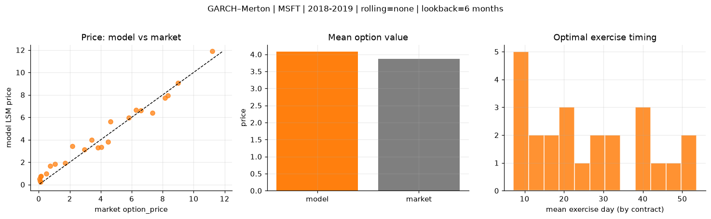
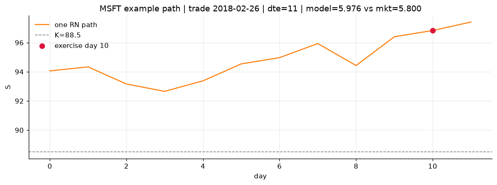
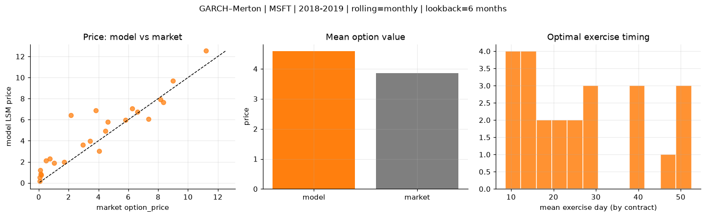
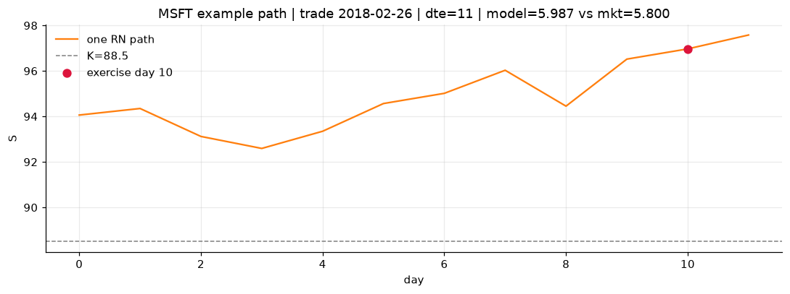
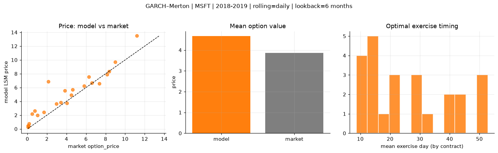
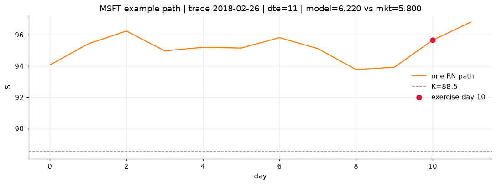

# Optimal stopping — GARCH–Merton — 2018-2019 — MSFT

**Model:** GARCH–Merton  
**Underlying:** MSFT  
**Regime / period:** 2018-2019  
**Lookback:** 6 months (fixed)  
**Rolling modes:** none, monthly, daily  
**Pricing:** LSM American calls on MSFT | n_paths=2000 | seed=42 | contracts=24

## Comparison (same contracts, same lookback)

| Rolling | RMSE | MAE | Bias (model−mkt) | Mean early-ex frac | Cal updates | Cal s | LSM s |
|---------|-----:|----:|-----------------:|-------------------:|------------:|------:|------:|
| `none` | 0.6083 | 0.5206 | 0.2160 | 0.274 | 1 | 0.0 | 0.1 |
| `monthly` | 1.3586 | 0.9917 | 0.7258 | 0.227 | 25 | 0.9 | 0.1 |
| `daily` | 1.3519 | 0.9245 | 0.8098 | 0.223 | 503 | 9.2 | 0.1 |

**Lowest RMSE (this study):** `none` = 0.6083

## Rolling = `none`

- **RMSE:** 0.6083  
- **MAE:** 0.5206  
- **Bias:** 0.2160  
- **Mean early-exercise fraction:** 0.274  
- **Calibration updates (MSFT):** 1

Contract errors (compact)

| date | K | dte | market | model | error | early_ex |
|------|--:|----:|-------:|------:|------:|---------:|
| 2018-02-26 | 88.5 | 11 | 5.800 | 5.976 | 0.176 | 0.897 |
| 2019-07-24 | 133 | 9 | 6.600 | 6.630 | 0.030 | 0.538 |
| 2018-10-19 | 102 | 35 | 8.350 | 7.954 | -0.396 | 0.679 |
| 2018-10-19 | 103 | 21 | 7.350 | 6.394 | -0.956 | 0.385 |
| 2019-05-13 | 117 | 46 | 11.200 | 11.878 | 0.678 | 0.505 |
| 2018-03-05 | 85 | 46 | 9.000 | 9.066 | 0.066 | 0.037 |
| 2018-02-26 | 93.5 | 11 | 1.705 | 1.928 | 0.223 | 0.211 |
| 2018-12-17 | 103 | 11 | 4.475 | 3.824 | -0.651 | 0.115 |
| 2019-06-25 | 134 | 31 | 6.275 | 6.663 | 0.388 | 0.370 |
| 2019-07-10 | 137 | 30 | 3.425 | 3.992 | 0.567 | 0.240 |
| 2018-11-26 | 105 | 53 | 3.825 | 3.293 | -0.532 | 0.249 |
| 2019-07-02 | 135 | 45 | 4.625 | 5.617 | 0.992 | 0.321 |
| 2019-08-14 | 150 | 16 | 0.080 | 0.352 | 0.272 | 0.032 |
| 2018-11-16 | 118 | 14 | 0.110 | 0.226 | 0.116 | 0.016 |
| 2018-09-28 | 122 | 21 | 0.115 | 0.733 | 0.618 | 0.074 |
| 2018-05-01 | 98.5 | 24 | 0.480 | 0.971 | 0.491 | 0.092 |
| 2019-03-22 | 125 | 56 | 2.155 | 3.444 | 1.289 | 0.313 |
| 2019-06-25 | 150 | 52 | 0.745 | 1.649 | 0.904 | 0.059 |
| 2018-07-05 | 91.5 | 15 | 8.150 | 7.721 | -0.429 | 0.669 |
| 2018-01-04 | 89 | 15 | 0.155 | 0.762 | 0.607 | 0.015 |
| 2018-06-06 | 104 | 23 | 1.040 | 1.842 | 0.802 | 0.183 |
| 2018-10-12 | 107 | 42 | 4.050 | 3.357 | -0.693 | 0.209 |
| 2018-01-04 | 90.5 | 15 | 0.050 | 0.511 | 0.461 | 0.043 |
| 2018-03-05 | 92.5 | 32 | 2.955 | 3.115 | 0.160 | 0.323 |

## Rolling = `monthly`

- **RMSE:** 1.3586  
- **MAE:** 0.9917  
- **Bias:** 0.7258  
- **Mean early-exercise fraction:** 0.227  
- **Calibration updates (MSFT):** 25

Contract errors (compact)

| date | K | dte | market | model | error | early_ex |
|------|--:|----:|-------:|------:|------:|---------:|
| 2018-02-26 | 88.5 | 11 | 5.800 | 5.987 | 0.187 | 0.873 |
| 2019-07-24 | 133 | 9 | 6.600 | 6.762 | 0.162 | 0.378 |
| 2018-10-19 | 102 | 35 | 8.350 | 7.668 | -0.682 | 0.507 |
| 2018-10-19 | 103 | 21 | 7.350 | 6.078 | -1.272 | 0.425 |
| 2019-05-13 | 117 | 46 | 11.200 | 12.528 | 1.328 | 0.500 |
| 2018-03-05 | 85 | 46 | 9.000 | 9.676 | 0.676 | 0.010 |
| 2018-02-26 | 93.5 | 11 | 1.705 | 1.982 | 0.277 | 0.215 |
| 2018-12-17 | 103 | 11 | 4.475 | 4.929 | 0.454 | 0.173 |
| 2019-06-25 | 134 | 31 | 6.275 | 7.079 | 0.804 | 0.382 |
| 2019-07-10 | 137 | 30 | 3.425 | 3.968 | 0.543 | 0.262 |
| 2018-11-26 | 105 | 53 | 3.825 | 6.879 | 3.054 | 0.238 |
| 2019-07-02 | 135 | 45 | 4.625 | 5.813 | 1.188 | 0.410 |
| 2019-08-14 | 150 | 16 | 0.080 | 0.176 | 0.096 | 0.006 |
| 2018-11-16 | 118 | 14 | 0.110 | 1.190 | 1.080 | 0.047 |
| 2018-09-28 | 122 | 21 | 0.115 | 0.831 | 0.716 | 0.035 |
| 2018-05-01 | 98.5 | 24 | 0.480 | 2.102 | 1.622 | 0.059 |
| 2019-03-22 | 125 | 56 | 2.155 | 6.445 | 4.290 | 0.247 |
| 2019-06-25 | 150 | 52 | 0.745 | 2.297 | 1.552 | 0.103 |
| 2018-07-05 | 91.5 | 15 | 8.150 | 7.942 | -0.208 | 0.029 |
| 2018-01-04 | 89 | 15 | 0.155 | 0.762 | 0.607 | 0.015 |
| 2018-06-06 | 104 | 23 | 1.040 | 1.878 | 0.838 | 0.092 |
| 2018-10-12 | 107 | 42 | 4.050 | 3.022 | -1.028 | 0.093 |
| 2018-01-04 | 90.5 | 15 | 0.050 | 0.511 | 0.461 | 0.043 |
| 2018-03-05 | 92.5 | 32 | 2.955 | 3.630 | 0.675 | 0.292 |

## Rolling = `daily`

- **RMSE:** 1.3519  
- **MAE:** 0.9245  
- **Bias:** 0.8098  
- **Mean early-exercise fraction:** 0.223  
- **Calibration updates (MSFT):** 503

Contract errors (compact)

| date | K | dte | market | model | error | early_ex |
|------|--:|----:|-------:|------:|------:|---------:|
| 2018-02-26 | 88.5 | 11 | 5.800 | 6.220 | 0.420 | 0.522 |
| 2019-07-24 | 133 | 9 | 6.600 | 6.678 | 0.078 | 0.326 |
| 2018-10-19 | 102 | 35 | 8.350 | 8.332 | -0.018 | 0.432 |
| 2018-10-19 | 103 | 21 | 7.350 | 6.560 | -0.790 | 0.535 |
| 2019-05-13 | 117 | 46 | 11.200 | 13.484 | 2.284 | 0.312 |
| 2018-03-05 | 85 | 46 | 9.000 | 9.685 | 0.685 | 0.149 |
| 2018-02-26 | 93.5 | 11 | 1.705 | 2.430 | 0.725 | 0.262 |
| 2018-12-17 | 103 | 11 | 4.475 | 4.920 | 0.445 | 0.241 |
| 2019-06-25 | 134 | 31 | 6.275 | 7.573 | 1.298 | 0.315 |
| 2019-07-10 | 137 | 30 | 3.425 | 3.844 | 0.419 | 0.203 |
| 2018-11-26 | 105 | 53 | 3.825 | 5.528 | 1.703 | 0.257 |
| 2019-07-02 | 135 | 45 | 4.625 | 5.688 | 1.063 | 0.402 |
| 2019-08-14 | 150 | 16 | 0.080 | 0.289 | 0.209 | 0.015 |
| 2018-11-16 | 118 | 14 | 0.110 | 0.459 | 0.349 | 0.035 |
| 2018-09-28 | 122 | 21 | 0.115 | 0.319 | 0.204 | 0.043 |
| 2018-05-01 | 98.5 | 24 | 0.480 | 2.166 | 1.686 | 0.191 |
| 2019-03-22 | 125 | 56 | 2.155 | 6.854 | 4.699 | 0.234 |
| 2019-06-25 | 150 | 52 | 0.745 | 2.628 | 1.883 | 0.111 |
| 2018-07-05 | 91.5 | 15 | 8.150 | 7.914 | -0.236 | 0.124 |
| 2018-01-04 | 89 | 15 | 0.155 | 0.737 | 0.582 | 0.054 |
| 2018-06-06 | 104 | 23 | 1.040 | 1.992 | 0.952 | 0.075 |
| 2018-10-12 | 107 | 42 | 4.050 | 3.717 | -0.333 | 0.246 |
| 2018-01-04 | 90.5 | 15 | 0.050 | 0.491 | 0.441 | 0.040 |
| 2018-03-05 | 92.5 | 32 | 2.955 | 3.642 | 0.687 | 0.223 |

