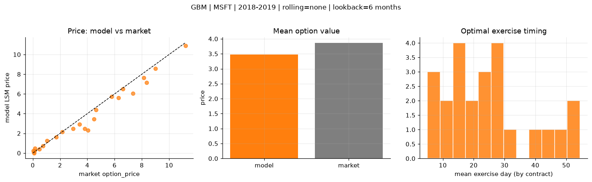
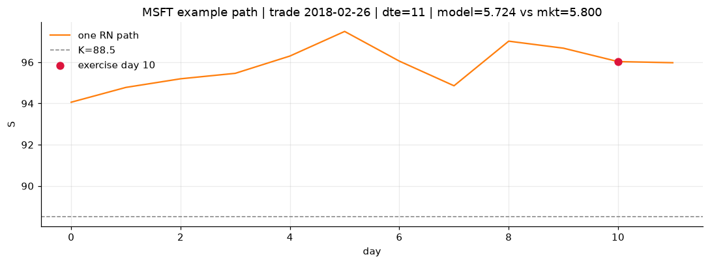
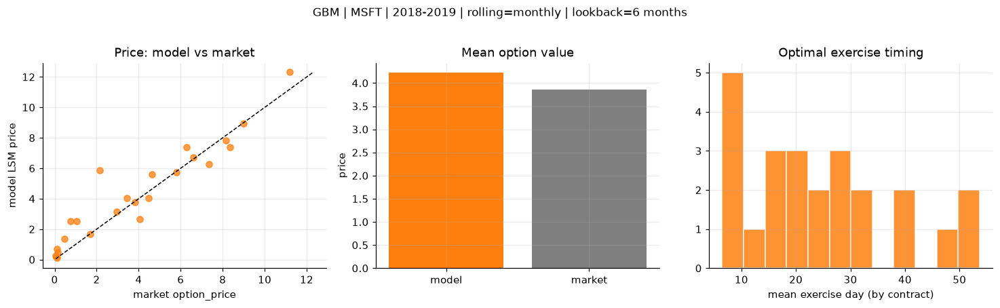
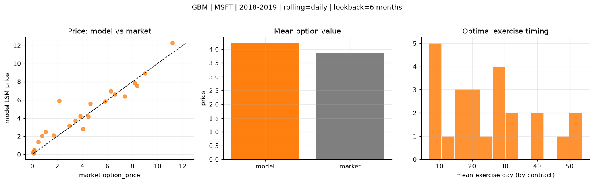
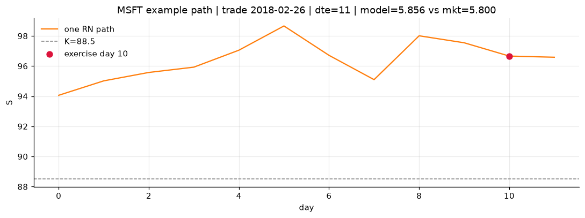

# Optimal stopping — GBM — 2018-2019 — MSFT

**Model:** GBM  
**Underlying:** MSFT  
**Regime / period:** 2018-2019  
**Lookback:** 6 months (fixed)  
**Rolling modes:** none, monthly, daily  
**Pricing:** LSM American calls on MSFT | n_paths=2000 | seed=42 | contracts=24

## Comparison (same contracts, same lookback)

| Rolling | RMSE | MAE | Bias (model−mkt) | Mean early-ex frac | Cal updates | Cal s | LSM s |
|---------|-----:|----:|-----------------:|-------------------:|------------:|------:|------:|
| `none` | 0.6724 | 0.4624 | -0.3920 | 0.298 | 1 | 0.0 | 0.2 |
| `monthly` | 1.0894 | 0.7308 | 0.3609 | 0.277 | 25 | 0.0 | 0.1 |
| `daily` | 1.0192 | 0.6682 | 0.3543 | 0.275 | 503 | 0.2 | 0.3 |

**Lowest RMSE (this study):** `none` = 0.6724

## Rolling = `none`

- **RMSE:** 0.6724  
- **MAE:** 0.4624  
- **Bias:** -0.3920  
- **Mean early-exercise fraction:** 0.298  
- **Calibration updates (MSFT):** 1

Contract errors (compact)

| date | K | dte | market | model | error | early_ex |
|------|--:|----:|-------:|------:|------:|---------:|
| 2018-02-26 | 88.5 | 11 | 5.800 | 5.724 | -0.076 | 0.531 |
| 2019-07-24 | 133 | 9 | 6.600 | 6.483 | -0.117 | 0.577 |
| 2018-10-19 | 102 | 35 | 8.350 | 7.155 | -1.195 | 0.478 |
| 2018-10-19 | 103 | 21 | 7.350 | 6.071 | -1.279 | 0.001 |
| 2019-05-13 | 117 | 46 | 11.200 | 10.876 | -0.324 | 0.630 |
| 2018-03-05 | 85 | 46 | 9.000 | 8.593 | -0.407 | 0.704 |
| 2018-02-26 | 93.5 | 11 | 1.705 | 1.635 | -0.070 | 0.243 |
| 2018-12-17 | 103 | 11 | 4.475 | 3.455 | -1.020 | 0.522 |
| 2019-06-25 | 134 | 31 | 6.275 | 5.588 | -0.687 | 0.548 |
| 2019-07-10 | 137 | 30 | 3.425 | 2.920 | -0.505 | 0.322 |
| 2018-11-26 | 105 | 53 | 3.825 | 2.456 | -1.369 | 0.215 |
| 2019-07-02 | 135 | 45 | 4.625 | 4.372 | -0.253 | 0.263 |
| 2019-08-14 | 150 | 16 | 0.080 | 0.072 | -0.008 | 0.011 |
| 2018-11-16 | 118 | 14 | 0.110 | 0.011 | -0.099 | 0.003 |
| 2018-09-28 | 122 | 21 | 0.115 | 0.233 | 0.118 | 0.030 |
| 2018-05-01 | 98.5 | 24 | 0.480 | 0.416 | -0.064 | 0.087 |
| 2019-03-22 | 125 | 56 | 2.155 | 2.168 | 0.013 | 0.170 |
| 2019-06-25 | 150 | 52 | 0.745 | 0.725 | -0.020 | 0.098 |
| 2018-07-05 | 91.5 | 15 | 8.150 | 7.629 | -0.521 | 0.985 |
| 2018-01-04 | 89 | 15 | 0.155 | 0.467 | 0.312 | 0.036 |
| 2018-06-06 | 104 | 23 | 1.040 | 1.258 | 0.218 | 0.168 |
| 2018-10-12 | 107 | 42 | 4.050 | 2.297 | -1.753 | 0.203 |
| 2018-01-04 | 90.5 | 15 | 0.050 | 0.233 | 0.183 | 0.006 |
| 2018-03-05 | 92.5 | 32 | 2.955 | 2.470 | -0.485 | 0.311 |

## Rolling = `monthly`

- **RMSE:** 1.0894  
- **MAE:** 0.7308  
- **Bias:** 0.3609  
- **Mean early-exercise fraction:** 0.277  
- **Calibration updates (MSFT):** 25

Contract errors (compact)

| date | K | dte | market | model | error | early_ex |
|------|--:|----:|-------:|------:|------:|---------:|
| 2018-02-26 | 88.5 | 11 | 5.800 | 5.733 | -0.067 | 0.535 |
| 2019-07-24 | 133 | 9 | 6.600 | 6.717 | 0.117 | 0.513 |
| 2018-10-19 | 102 | 35 | 8.350 | 7.377 | -0.973 | 0.434 |
| 2018-10-19 | 103 | 21 | 7.350 | 6.247 | -1.103 | 0.002 |
| 2019-05-13 | 117 | 46 | 11.200 | 12.310 | 1.110 | 0.535 |
| 2018-03-05 | 85 | 46 | 9.000 | 8.955 | -0.045 | 0.623 |
| 2018-02-26 | 93.5 | 11 | 1.705 | 1.668 | -0.037 | 0.256 |
| 2018-12-17 | 103 | 11 | 4.475 | 4.053 | -0.422 | 0.388 |
| 2019-06-25 | 134 | 31 | 6.275 | 7.383 | 1.108 | 0.463 |
| 2019-07-10 | 137 | 30 | 3.425 | 4.026 | 0.601 | 0.327 |
| 2018-11-26 | 105 | 53 | 3.825 | 3.755 | -0.070 | 0.246 |
| 2019-07-02 | 135 | 45 | 4.625 | 5.600 | 0.975 | 0.292 |
| 2019-08-14 | 150 | 16 | 0.080 | 0.152 | 0.072 | 0.006 |
| 2018-11-16 | 118 | 14 | 0.110 | 0.098 | -0.012 | 0.015 |
| 2018-09-28 | 122 | 21 | 0.115 | 0.717 | 0.602 | 0.070 |
| 2018-05-01 | 98.5 | 24 | 0.480 | 1.366 | 0.886 | 0.128 |
| 2019-03-22 | 125 | 56 | 2.155 | 5.855 | 3.700 | 0.197 |
| 2019-06-25 | 150 | 52 | 0.745 | 2.513 | 1.768 | 0.157 |
| 2018-07-05 | 91.5 | 15 | 8.150 | 7.819 | -0.331 | 0.703 |
| 2018-01-04 | 89 | 15 | 0.155 | 0.467 | 0.312 | 0.036 |
| 2018-06-06 | 104 | 23 | 1.040 | 2.524 | 1.484 | 0.199 |
| 2018-10-12 | 107 | 42 | 4.050 | 2.670 | -1.380 | 0.210 |
| 2018-01-04 | 90.5 | 15 | 0.050 | 0.233 | 0.183 | 0.006 |
| 2018-03-05 | 92.5 | 32 | 2.955 | 3.140 | 0.185 | 0.319 |

## Rolling = `daily`

- **RMSE:** 1.0192  
- **MAE:** 0.6682  
- **Bias:** 0.3543  
- **Mean early-exercise fraction:** 0.275  
- **Calibration updates (MSFT):** 503

Contract errors (compact)

| date | K | dte | market | model | error | early_ex |
|------|--:|----:|-------:|------:|------:|---------:|
| 2018-02-26 | 88.5 | 11 | 5.800 | 5.856 | 0.056 | 0.499 |
| 2019-07-24 | 133 | 9 | 6.600 | 6.615 | 0.015 | 0.501 |
| 2018-10-19 | 102 | 35 | 8.350 | 7.551 | -0.799 | 0.411 |
| 2018-10-19 | 103 | 21 | 7.350 | 6.368 | -0.982 | 0.035 |
| 2019-05-13 | 117 | 46 | 11.200 | 12.275 | 1.075 | 0.541 |
| 2018-03-05 | 85 | 46 | 9.000 | 8.896 | -0.104 | 0.628 |
| 2018-02-26 | 93.5 | 11 | 1.705 | 2.059 | 0.354 | 0.238 |
| 2018-12-17 | 103 | 11 | 4.475 | 4.168 | -0.307 | 0.390 |
| 2019-06-25 | 134 | 31 | 6.275 | 6.957 | 0.682 | 0.463 |
| 2019-07-10 | 137 | 30 | 3.425 | 3.706 | 0.281 | 0.327 |
| 2018-11-26 | 105 | 53 | 3.825 | 4.225 | 0.400 | 0.245 |
| 2019-07-02 | 135 | 45 | 4.625 | 5.599 | 0.974 | 0.292 |
| 2019-08-14 | 150 | 16 | 0.080 | 0.218 | 0.138 | 0.016 |
| 2018-11-16 | 118 | 14 | 0.110 | 0.120 | 0.010 | 0.024 |
| 2018-09-28 | 122 | 21 | 0.115 | 0.381 | 0.266 | 0.051 |
| 2018-05-01 | 98.5 | 24 | 0.480 | 1.379 | 0.899 | 0.129 |
| 2019-03-22 | 125 | 56 | 2.155 | 5.874 | 3.719 | 0.197 |
| 2019-06-25 | 150 | 52 | 0.745 | 2.042 | 1.297 | 0.139 |
| 2018-07-05 | 91.5 | 15 | 8.150 | 7.831 | -0.319 | 0.682 |
| 2018-01-04 | 89 | 15 | 0.155 | 0.457 | 0.302 | 0.036 |
| 2018-06-06 | 104 | 23 | 1.040 | 2.464 | 1.424 | 0.201 |
| 2018-10-12 | 107 | 42 | 4.050 | 2.793 | -1.257 | 0.226 |
| 2018-01-04 | 90.5 | 15 | 0.050 | 0.227 | 0.177 | 0.006 |
| 2018-03-05 | 92.5 | 32 | 2.955 | 3.155 | 0.200 | 0.318 |

