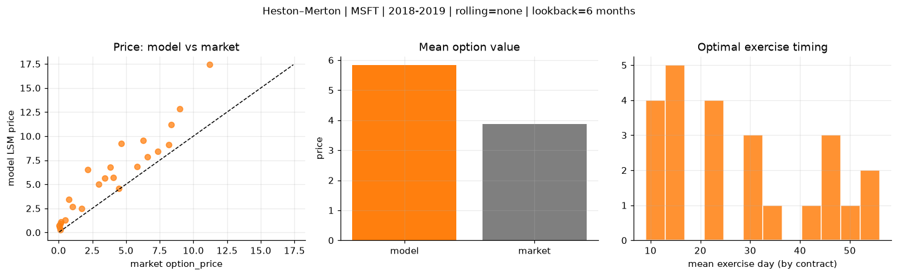
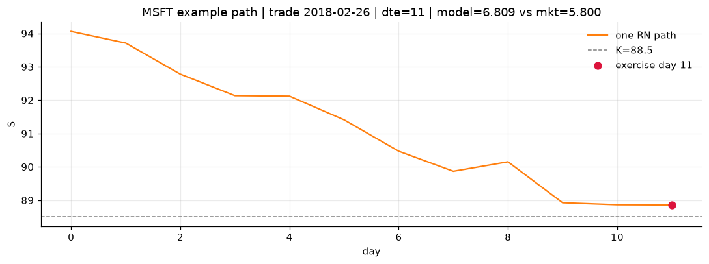
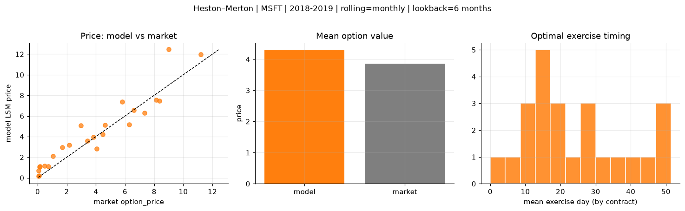
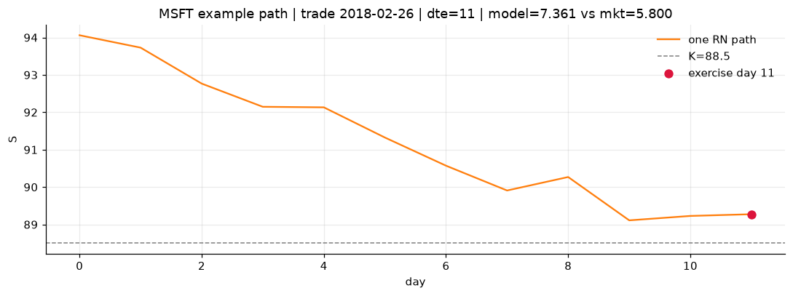
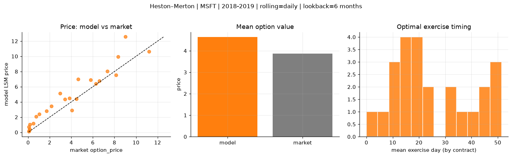
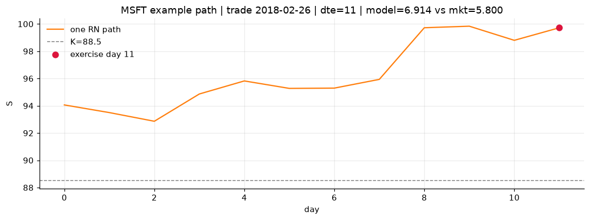

# Optimal stopping — Heston–Merton — 2018-2019 — MSFT

**Model:** Heston–Merton  
**Underlying:** MSFT  
**Regime / period:** 2018-2019  
**Lookback:** 6 months (fixed)  
**Rolling modes:** none, monthly, daily  
**Pricing:** LSM American calls on MSFT | n_paths=2000 | seed=42 | contracts=24

## Comparison (same contracts, same lookback)

| Rolling | RMSE | MAE | Bias (model−mkt) | Mean early-ex frac | Cal updates | Cal s | LSM s |
|---------|-----:|----:|-----------------:|-------------------:|------------:|------:|------:|
| `none` | 2.5064 | 1.9703 | 1.9703 | 0.013 | 1 | 0.0 | 0.1 |
| `monthly` | 1.1402 | 0.8694 | 0.4415 | 0.255 | 25 | 0.0 | 0.1 |
| `daily` | 1.2707 | 0.9792 | 0.7787 | 0.170 | 503 | 0.8 | 0.1 |

**Lowest RMSE (this study):** `monthly` = 1.1402

## Rolling = `none`

- **RMSE:** 2.5064  
- **MAE:** 1.9703  
- **Bias:** 1.9703  
- **Mean early-exercise fraction:** 0.013  
- **Calibration updates (MSFT):** 1

Contract errors (compact)

| date | K | dte | market | model | error | early_ex |
|------|--:|----:|-------:|------:|------:|---------:|
| 2018-02-26 | 88.5 | 11 | 5.800 | 6.809 | 1.009 | 0.007 |
| 2019-07-24 | 133 | 9 | 6.600 | 7.872 | 1.272 | 0.002 |
| 2018-10-19 | 102 | 35 | 8.350 | 11.201 | 2.851 | 0.002 |
| 2018-10-19 | 103 | 21 | 7.350 | 8.430 | 1.080 | 0.009 |
| 2019-05-13 | 117 | 46 | 11.200 | 17.412 | 6.212 | 0.003 |
| 2018-03-05 | 85 | 46 | 9.000 | 12.835 | 3.835 | 0.004 |
| 2018-02-26 | 93.5 | 11 | 1.705 | 2.480 | 0.775 | 0.004 |
| 2018-12-17 | 103 | 11 | 4.475 | 4.594 | 0.119 | 0.031 |
| 2019-06-25 | 134 | 31 | 6.275 | 9.525 | 3.250 | 0.002 |
| 2019-07-10 | 137 | 30 | 3.425 | 5.636 | 2.211 | 0.041 |
| 2018-11-26 | 105 | 53 | 3.825 | 6.801 | 2.976 | 0.002 |
| 2019-07-02 | 135 | 45 | 4.625 | 9.242 | 4.617 | 0.005 |
| 2019-08-14 | 150 | 16 | 0.080 | 0.510 | 0.430 | 0.013 |
| 2018-11-16 | 118 | 14 | 0.110 | 0.245 | 0.135 | 0.016 |
| 2018-09-28 | 122 | 21 | 0.115 | 0.911 | 0.796 | 0.026 |
| 2018-05-01 | 98.5 | 24 | 0.480 | 1.308 | 0.828 | 0.009 |
| 2019-03-22 | 125 | 56 | 2.155 | 6.500 | 4.345 | 0.006 |
| 2019-06-25 | 150 | 52 | 0.745 | 3.401 | 2.656 | 0.093 |
| 2018-07-05 | 91.5 | 15 | 8.150 | 9.104 | 0.954 | 0.001 |
| 2018-01-04 | 89 | 15 | 0.155 | 1.108 | 0.953 | 0.025 |
| 2018-06-06 | 104 | 23 | 1.040 | 2.700 | 1.660 | 0.002 |
| 2018-10-12 | 107 | 42 | 4.050 | 5.697 | 1.647 | 0.004 |
| 2018-01-04 | 90.5 | 15 | 0.050 | 0.688 | 0.638 | 0.000 |
| 2018-03-05 | 92.5 | 32 | 2.955 | 4.995 | 2.040 | 0.001 |

## Rolling = `monthly`

- **RMSE:** 1.1402  
- **MAE:** 0.8694  
- **Bias:** 0.4415  
- **Mean early-exercise fraction:** 0.255  
- **Calibration updates (MSFT):** 25

Contract errors (compact)

| date | K | dte | market | model | error | early_ex |
|------|--:|----:|-------:|------:|------:|---------:|
| 2018-02-26 | 88.5 | 11 | 5.800 | 7.361 | 1.561 | 0.005 |
| 2019-07-24 | 133 | 9 | 6.600 | 6.572 | -0.028 | 0.676 |
| 2018-10-19 | 102 | 35 | 8.350 | 7.483 | -0.867 | 0.612 |
| 2018-10-19 | 103 | 21 | 7.350 | 6.296 | -1.054 | 0.608 |
| 2019-05-13 | 117 | 46 | 11.200 | 11.960 | 0.760 | 0.572 |
| 2018-03-05 | 85 | 46 | 9.000 | 12.451 | 3.451 | 0.081 |
| 2018-02-26 | 93.5 | 11 | 1.705 | 2.952 | 1.247 | 0.001 |
| 2018-12-17 | 103 | 11 | 4.475 | 4.204 | -0.271 | 0.381 |
| 2019-06-25 | 134 | 31 | 6.275 | 5.184 | -1.091 | 0.503 |
| 2019-07-10 | 137 | 30 | 3.425 | 3.574 | 0.149 | 0.289 |
| 2018-11-26 | 105 | 53 | 3.825 | 3.969 | 0.144 | 0.076 |
| 2019-07-02 | 135 | 45 | 4.625 | 5.134 | 0.509 | 0.317 |
| 2019-08-14 | 150 | 16 | 0.080 | 0.144 | 0.064 | 0.015 |
| 2018-11-16 | 118 | 14 | 0.110 | 0.201 | 0.091 | 0.009 |
| 2018-09-28 | 122 | 21 | 0.115 | 1.047 | 0.932 | 0.101 |
| 2018-05-01 | 98.5 | 24 | 0.480 | 1.153 | 0.673 | 0.078 |
| 2019-03-22 | 125 | 56 | 2.155 | 3.175 | 1.020 | 0.273 |
| 2019-06-25 | 150 | 52 | 0.745 | 1.110 | 0.365 | 0.085 |
| 2018-07-05 | 91.5 | 15 | 8.150 | 7.550 | -0.600 | 1.000 |
| 2018-01-04 | 89 | 15 | 0.155 | 1.108 | 0.953 | 0.025 |
| 2018-06-06 | 104 | 23 | 1.040 | 2.089 | 1.049 | 0.203 |
| 2018-10-12 | 107 | 42 | 4.050 | 2.826 | -1.224 | 0.211 |
| 2018-01-04 | 90.5 | 15 | 0.050 | 0.688 | 0.638 | 0.000 |
| 2018-03-05 | 92.5 | 32 | 2.955 | 5.080 | 2.125 | 0.003 |

## Rolling = `daily`

- **RMSE:** 1.2707  
- **MAE:** 0.9792  
- **Bias:** 0.7787  
- **Mean early-exercise fraction:** 0.170  
- **Calibration updates (MSFT):** 503

Contract errors (compact)

| date | K | dte | market | model | error | early_ex |
|------|--:|----:|-------:|------:|------:|---------:|
| 2018-02-26 | 88.5 | 11 | 5.800 | 6.914 | 1.114 | 0.000 |
| 2019-07-24 | 133 | 9 | 6.600 | 6.770 | 0.170 | 0.080 |
| 2018-10-19 | 102 | 35 | 8.350 | 9.942 | 1.592 | 0.000 |
| 2018-10-19 | 103 | 21 | 7.350 | 8.021 | 0.671 | 0.000 |
| 2019-05-13 | 117 | 46 | 11.200 | 10.645 | -0.555 | 0.745 |
| 2018-03-05 | 85 | 46 | 9.000 | 12.563 | 3.563 | 0.079 |
| 2018-02-26 | 93.5 | 11 | 1.705 | 2.818 | 1.113 | 0.007 |
| 2018-12-17 | 103 | 11 | 4.475 | 4.379 | -0.096 | 0.256 |
| 2019-06-25 | 134 | 31 | 6.275 | 6.421 | 0.146 | 0.307 |
| 2019-07-10 | 137 | 30 | 3.425 | 4.331 | 0.906 | 0.005 |
| 2018-11-26 | 105 | 53 | 3.825 | 4.473 | 0.648 | 0.427 |
| 2019-07-02 | 135 | 45 | 4.625 | 7.004 | 2.379 | 0.180 |
| 2019-08-14 | 150 | 16 | 0.080 | 0.112 | 0.032 | 0.018 |
| 2018-11-16 | 118 | 14 | 0.110 | 0.229 | 0.119 | 0.009 |
| 2018-09-28 | 122 | 21 | 0.115 | 0.428 | 0.313 | 0.032 |
| 2018-05-01 | 98.5 | 24 | 0.480 | 1.175 | 0.695 | 0.125 |
| 2019-03-22 | 125 | 56 | 2.155 | 3.462 | 1.307 | 0.293 |
| 2019-06-25 | 150 | 52 | 0.745 | 2.055 | 1.310 | 0.103 |
| 2018-07-05 | 91.5 | 15 | 8.150 | 7.550 | -0.600 | 1.000 |
| 2018-01-04 | 89 | 15 | 0.155 | 1.038 | 0.883 | 0.029 |
| 2018-06-06 | 104 | 23 | 1.040 | 2.385 | 1.345 | 0.172 |
| 2018-10-12 | 107 | 42 | 4.050 | 2.895 | -1.155 | 0.222 |
| 2018-01-04 | 90.5 | 15 | 0.050 | 0.694 | 0.644 | 0.003 |
| 2018-03-05 | 92.5 | 32 | 2.955 | 5.102 | 2.147 | 0.000 |

