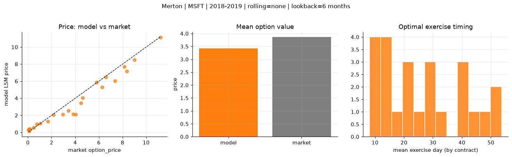
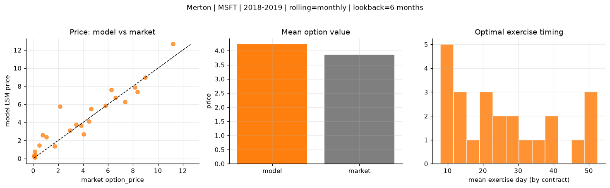
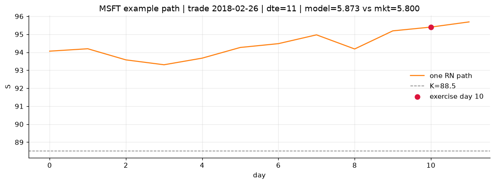
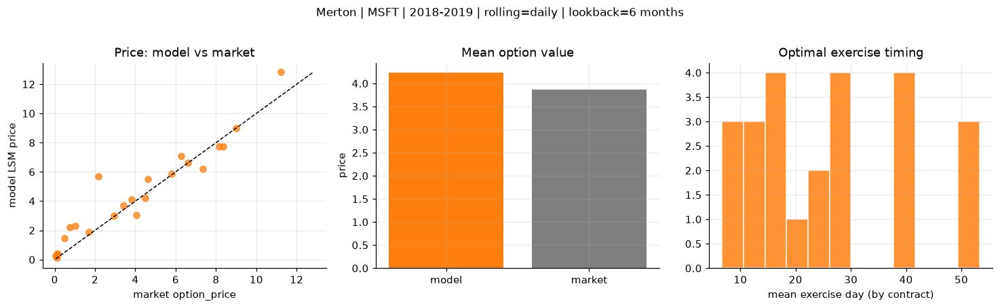
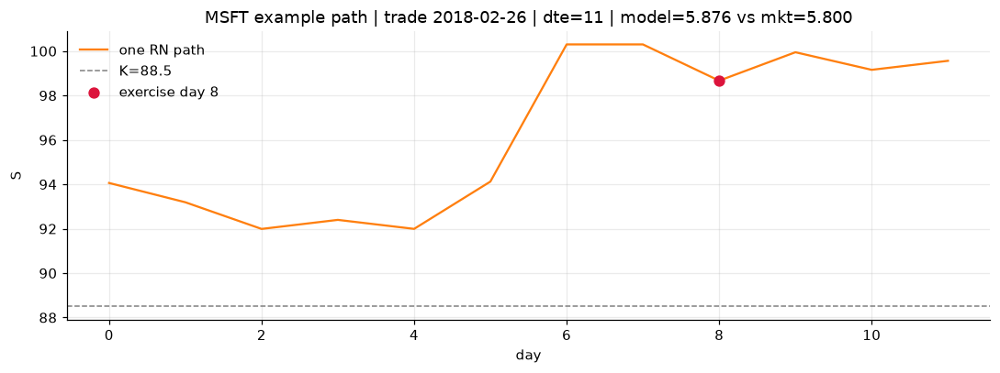

# Optimal stopping — Merton — 2018-2019 — MSFT

**Model:** Merton  
**Underlying:** MSFT  
**Regime / period:** 2018-2019  
**Lookback:** 6 months (fixed)  
**Rolling modes:** none, monthly, daily  
**Pricing:** LSM American calls on MSFT | n_paths=2000 | seed=42 | contracts=24

## Comparison (same contracts, same lookback)

| Rolling | RMSE | MAE | Bias (model−mkt) | Mean early-ex frac | Cal updates | Cal s | LSM s |
|---------|-----:|----:|-----------------:|-------------------:|------------:|------:|------:|
| `none` | 0.7817 | 0.5655 | -0.4468 | 0.244 | 1 | 0.0 | 0.1 |
| `monthly` | 1.0932 | 0.7454 | 0.3607 | 0.241 | 25 | 0.0 | 0.1 |
| `daily` | 1.0099 | 0.6574 | 0.3690 | 0.272 | 503 | 0.1 | 0.1 |

**Lowest RMSE (this study):** `none` = 0.7817

## Rolling = `none`

- **RMSE:** 0.7817  
- **MAE:** 0.5655  
- **Bias:** -0.4468  
- **Mean early-exercise fraction:** 0.244  
- **Calibration updates (MSFT):** 1

Contract errors (compact)

| date | K | dte | market | model | error | early_ex |
|------|--:|----:|-------:|------:|------:|---------:|
| 2018-02-26 | 88.5 | 11 | 5.800 | 5.875 | 0.075 | 0.805 |
| 2019-07-24 | 133 | 9 | 6.600 | 6.465 | -0.135 | 0.601 |
| 2018-10-19 | 102 | 35 | 8.350 | 7.180 | -1.170 | 0.799 |
| 2018-10-19 | 103 | 21 | 7.350 | 6.015 | -1.335 | 0.118 |
| 2019-05-13 | 117 | 46 | 11.200 | 11.143 | -0.057 | 0.552 |
| 2018-03-05 | 85 | 46 | 9.000 | 8.493 | -0.507 | 0.058 |
| 2018-02-26 | 93.5 | 11 | 1.705 | 1.291 | -0.414 | 0.138 |
| 2018-12-17 | 103 | 11 | 4.475 | 3.417 | -1.058 | 0.061 |
| 2019-06-25 | 134 | 31 | 6.275 | 5.286 | -0.989 | 0.401 |
| 2019-07-10 | 137 | 30 | 3.425 | 2.540 | -0.885 | 0.213 |
| 2018-11-26 | 105 | 53 | 3.825 | 2.153 | -1.672 | 0.200 |
| 2019-07-02 | 135 | 45 | 4.625 | 4.047 | -0.578 | 0.205 |
| 2019-08-14 | 150 | 16 | 0.080 | 0.247 | 0.167 | 0.029 |
| 2018-11-16 | 118 | 14 | 0.110 | 0.163 | 0.053 | 0.024 |
| 2018-09-28 | 122 | 21 | 0.115 | 0.408 | 0.293 | 0.021 |
| 2018-05-01 | 98.5 | 24 | 0.480 | 0.573 | 0.093 | 0.065 |
| 2019-03-22 | 125 | 56 | 2.155 | 2.073 | -0.082 | 0.237 |
| 2019-06-25 | 150 | 52 | 0.745 | 0.949 | 0.204 | 0.043 |
| 2018-07-05 | 91.5 | 15 | 8.150 | 7.678 | -0.472 | 0.584 |
| 2018-01-04 | 89 | 15 | 0.155 | 0.414 | 0.259 | 0.024 |
| 2018-06-06 | 104 | 23 | 1.040 | 1.051 | 0.011 | 0.114 |
| 2018-10-12 | 107 | 42 | 4.050 | 2.099 | -1.951 | 0.196 |
| 2018-01-04 | 90.5 | 15 | 0.050 | 0.317 | 0.267 | 0.053 |
| 2018-03-05 | 92.5 | 32 | 2.955 | 2.114 | -0.841 | 0.305 |

## Rolling = `monthly`

- **RMSE:** 1.0932  
- **MAE:** 0.7454  
- **Bias:** 0.3607  
- **Mean early-exercise fraction:** 0.241  
- **Calibration updates (MSFT):** 25

Contract errors (compact)

| date | K | dte | market | model | error | early_ex |
|------|--:|----:|-------:|------:|------:|---------:|
| 2018-02-26 | 88.5 | 11 | 5.800 | 5.873 | 0.073 | 0.817 |
| 2019-07-24 | 133 | 9 | 6.600 | 6.730 | 0.130 | 0.499 |
| 2018-10-19 | 102 | 35 | 8.350 | 7.377 | -0.973 | 0.434 |
| 2018-10-19 | 103 | 21 | 7.350 | 6.247 | -1.103 | 0.002 |
| 2019-05-13 | 117 | 46 | 11.200 | 12.663 | 1.463 | 0.571 |
| 2018-03-05 | 85 | 46 | 9.000 | 8.985 | -0.015 | 0.053 |
| 2018-02-26 | 93.5 | 11 | 1.705 | 1.370 | -0.335 | 0.158 |
| 2018-12-17 | 103 | 11 | 4.475 | 4.106 | -0.369 | 0.131 |
| 2019-06-25 | 134 | 31 | 6.275 | 7.575 | 1.300 | 0.331 |
| 2019-07-10 | 137 | 30 | 3.425 | 3.728 | 0.303 | 0.279 |
| 2018-11-26 | 105 | 53 | 3.825 | 3.654 | -0.171 | 0.179 |
| 2019-07-02 | 135 | 45 | 4.625 | 5.475 | 0.850 | 0.427 |
| 2019-08-14 | 150 | 16 | 0.080 | 0.152 | 0.072 | 0.006 |
| 2018-11-16 | 118 | 14 | 0.110 | 0.122 | 0.012 | 0.026 |
| 2018-09-28 | 122 | 21 | 0.115 | 0.754 | 0.639 | 0.049 |
| 2018-05-01 | 98.5 | 24 | 0.480 | 1.444 | 0.964 | 0.030 |
| 2019-03-22 | 125 | 56 | 2.155 | 5.745 | 3.590 | 0.288 |
| 2019-06-25 | 150 | 52 | 0.745 | 2.596 | 1.851 | 0.132 |
| 2018-07-05 | 91.5 | 15 | 8.150 | 7.880 | -0.270 | 0.797 |
| 2018-01-04 | 89 | 15 | 0.155 | 0.414 | 0.259 | 0.024 |
| 2018-06-06 | 104 | 23 | 1.040 | 2.372 | 1.332 | 0.108 |
| 2018-10-12 | 107 | 42 | 4.050 | 2.670 | -1.380 | 0.210 |
| 2018-01-04 | 90.5 | 15 | 0.050 | 0.317 | 0.267 | 0.053 |
| 2018-03-05 | 92.5 | 32 | 2.955 | 3.124 | 0.169 | 0.172 |

## Rolling = `daily`

- **RMSE:** 1.0099  
- **MAE:** 0.6574  
- **Bias:** 0.3690  
- **Mean early-exercise fraction:** 0.272  
- **Calibration updates (MSFT):** 503

Contract errors (compact)

| date | K | dte | market | model | error | early_ex |
|------|--:|----:|-------:|------:|------:|---------:|
| 2018-02-26 | 88.5 | 11 | 5.800 | 5.876 | 0.076 | 0.753 |
| 2019-07-24 | 133 | 9 | 6.600 | 6.615 | 0.015 | 0.501 |
| 2018-10-19 | 102 | 35 | 8.350 | 7.736 | -0.614 | 0.534 |
| 2018-10-19 | 103 | 21 | 7.350 | 6.222 | -1.128 | 0.530 |
| 2019-05-13 | 117 | 46 | 11.200 | 12.821 | 1.621 | 0.505 |
| 2018-03-05 | 85 | 46 | 9.000 | 8.967 | -0.033 | 0.309 |
| 2018-02-26 | 93.5 | 11 | 1.705 | 1.866 | 0.161 | 0.035 |
| 2018-12-17 | 103 | 11 | 4.475 | 4.228 | -0.247 | 0.150 |
| 2019-06-25 | 134 | 31 | 6.275 | 7.105 | 0.830 | 0.416 |
| 2019-07-10 | 137 | 30 | 3.425 | 3.706 | 0.281 | 0.327 |
| 2018-11-26 | 105 | 53 | 3.825 | 4.095 | 0.270 | 0.182 |
| 2019-07-02 | 135 | 45 | 4.625 | 5.487 | 0.862 | 0.426 |
| 2019-08-14 | 150 | 16 | 0.080 | 0.218 | 0.138 | 0.016 |
| 2018-11-16 | 118 | 14 | 0.110 | 0.139 | 0.029 | 0.019 |
| 2018-09-28 | 122 | 21 | 0.115 | 0.381 | 0.266 | 0.051 |
| 2018-05-01 | 98.5 | 24 | 0.480 | 1.490 | 1.010 | 0.102 |
| 2019-03-22 | 125 | 56 | 2.155 | 5.676 | 3.521 | 0.202 |
| 2019-06-25 | 150 | 52 | 0.745 | 2.192 | 1.447 | 0.078 |
| 2018-07-05 | 91.5 | 15 | 8.150 | 7.726 | -0.424 | 0.749 |
| 2018-01-04 | 89 | 15 | 0.155 | 0.385 | 0.230 | 0.059 |
| 2018-06-06 | 104 | 23 | 1.040 | 2.311 | 1.271 | 0.104 |
| 2018-10-12 | 107 | 42 | 4.050 | 3.036 | -1.014 | 0.201 |
| 2018-01-04 | 90.5 | 15 | 0.050 | 0.273 | 0.223 | 0.051 |
| 2018-03-05 | 92.5 | 32 | 2.955 | 3.023 | 0.068 | 0.231 |

