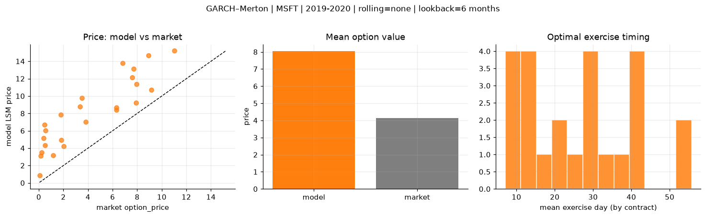
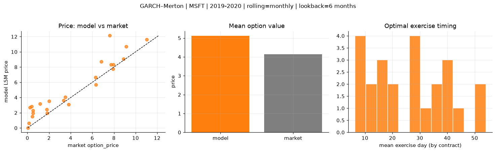
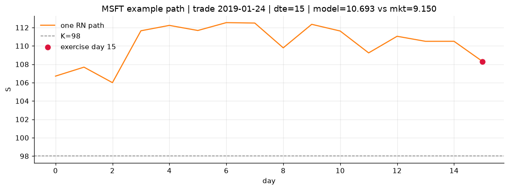
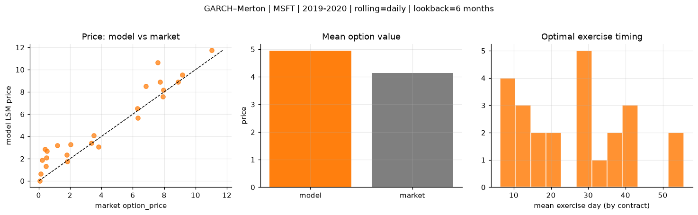
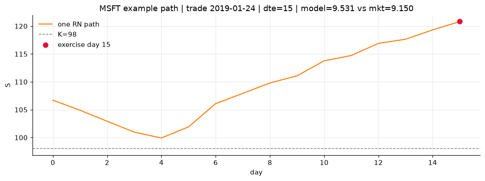

# Optimal stopping — GARCH–Merton — 2019-2020 — MSFT

**Model:** GARCH–Merton  
**Underlying:** MSFT  
**Regime / period:** 2019-2020  
**Lookback:** 6 months (fixed)  
**Rolling modes:** none, monthly, daily  
**Pricing:** LSM American calls on MSFT | n_paths=2000 | seed=42 | contracts=24

## Comparison (same contracts, same lookback)

| Rolling | RMSE | MAE | Bias (model−mkt) | Mean early-ex frac | Cal updates | Cal s | LSM s |
|---------|-----:|----:|-----------------:|-------------------:|------------:|------:|------:|
| `none` | 4.2725 | 3.8936 | 3.8936 | 0.183 | 1 | 0.0 | 0.1 |
| `monthly` | 1.5011 | 1.1000 | 0.9698 | 0.234 | 25 | 0.9 | 0.1 |
| `daily` | 1.2630 | 0.9537 | 0.7982 | 0.254 | 505 | 12.5 | 0.3 |

**Lowest RMSE (this study):** `daily` = 1.2630

## Rolling = `none`

- **RMSE:** 4.2725  
- **MAE:** 3.8936  
- **Bias:** 3.8936  
- **Mean early-exercise fraction:** 0.183  
- **Calibration updates (MSFT):** 1

Contract errors (compact)

| date | K | dte | market | model | error | early_ex |
|------|--:|----:|-------:|------:|------:|---------:|
| 2019-01-24 | 98 | 15 | 9.150 | 10.693 | 1.543 | 0.145 |
| 2019-10-10 | 134 | 15 | 6.325 | 8.699 | 2.374 | 0.108 |
| 2019-06-25 | 132 | 31 | 7.725 | 13.146 | 5.421 | 0.185 |
| 2019-06-25 | 128 | 31 | 11.025 | 15.197 | 4.172 | 0.200 |
| 2019-09-12 | 130 | 43 | 8.900 | 14.678 | 5.778 | 0.295 |
| 2019-01-16 | 100 | 58 | 7.600 | 12.130 | 4.530 | 0.603 |
| 2019-02-07 | 105 | 8 | 2.020 | 4.235 | 2.215 | 0.160 |
| 2019-07-17 | 140 | 16 | 1.820 | 4.909 | 3.089 | 0.213 |
| 2019-09-26 | 141 | 29 | 3.350 | 8.793 | 5.443 | 0.284 |
| 2019-10-03 | 137 | 29 | 3.800 | 7.040 | 3.240 | 0.209 |
| 2019-06-18 | 130 | 59 | 6.825 | 13.814 | 6.989 | 0.263 |
| 2019-10-10 | 141 | 43 | 3.500 | 9.801 | 6.301 | 0.182 |
| 2019-10-03 | 147 | 8 | 0.060 | 0.851 | 0.791 | 0.027 |
| 2019-06-18 | 142 | 17 | 0.140 | 3.115 | 2.975 | 0.071 |
| 2019-05-20 | 138 | 38 | 0.530 | 6.047 | 5.517 | 0.021 |
| 2019-03-08 | 115 | 21 | 0.500 | 4.337 | 3.837 | 0.134 |
| 2019-07-17 | 150 | 44 | 0.455 | 6.718 | 6.263 | 0.128 |
| 2019-09-19 | 146 | 43 | 1.795 | 7.871 | 6.076 | 0.183 |
| 2019-01-02 | 111 | 30 | 1.180 | 3.178 | 1.998 | 0.153 |
| 2019-11-07 | 138 | 8 | 6.300 | 8.397 | 2.097 | 0.277 |
| 2019-04-22 | 116 | 10 | 7.925 | 9.223 | 1.298 | 0.220 |
| 2019-02-14 | 113 | 22 | 0.230 | 3.512 | 3.282 | 0.025 |
| 2019-03-01 | 120 | 35 | 0.400 | 5.176 | 4.776 | 0.037 |
| 2019-12-20 | 148 | 14 | 7.950 | 11.391 | 3.441 | 0.264 |

## Rolling = `monthly`

- **RMSE:** 1.5011  
- **MAE:** 1.1000  
- **Bias:** 0.9698  
- **Mean early-exercise fraction:** 0.234  
- **Calibration updates (MSFT):** 25

Contract errors (compact)

| date | K | dte | market | model | error | early_ex |
|------|--:|----:|-------:|------:|------:|---------:|
| 2019-01-24 | 98 | 15 | 9.150 | 10.693 | 1.543 | 0.145 |
| 2019-10-10 | 134 | 15 | 6.325 | 5.669 | -0.656 | 0.302 |
| 2019-06-25 | 132 | 31 | 7.725 | 8.305 | 0.580 | 0.040 |
| 2019-06-25 | 128 | 31 | 11.025 | 11.631 | 0.606 | 0.686 |
| 2019-09-12 | 130 | 43 | 8.900 | 9.081 | 0.181 | 0.360 |
| 2019-01-16 | 100 | 58 | 7.600 | 12.130 | 4.530 | 0.603 |
| 2019-02-07 | 105 | 8 | 2.020 | 3.530 | 1.510 | 0.155 |
| 2019-07-17 | 140 | 16 | 1.820 | 1.939 | 0.119 | 0.136 |
| 2019-09-26 | 141 | 29 | 3.350 | 3.612 | 0.262 | 0.207 |
| 2019-10-03 | 137 | 29 | 3.800 | 3.096 | -0.704 | 0.225 |
| 2019-06-18 | 130 | 59 | 6.825 | 8.703 | 1.878 | 0.359 |
| 2019-10-10 | 141 | 43 | 3.500 | 4.054 | 0.554 | 0.100 |
| 2019-10-03 | 147 | 8 | 0.060 | 0.033 | -0.027 | 0.010 |
| 2019-06-18 | 142 | 17 | 0.140 | 0.648 | 0.508 | 0.008 |
| 2019-05-20 | 138 | 38 | 0.530 | 1.967 | 1.437 | 0.077 |
| 2019-03-08 | 115 | 21 | 0.500 | 2.308 | 1.808 | 0.048 |
| 2019-07-17 | 150 | 44 | 0.455 | 1.511 | 1.056 | 0.102 |
| 2019-09-19 | 146 | 43 | 1.795 | 2.453 | 0.658 | 0.088 |
| 2019-01-02 | 111 | 30 | 1.180 | 3.178 | 1.998 | 0.153 |
| 2019-11-07 | 138 | 8 | 6.300 | 6.666 | 0.366 | 0.541 |
| 2019-04-22 | 116 | 10 | 7.925 | 7.750 | -0.175 | 0.600 |
| 2019-02-14 | 113 | 22 | 0.230 | 2.699 | 2.469 | 0.023 |
| 2019-03-01 | 120 | 35 | 0.400 | 2.806 | 2.406 | 0.019 |
| 2019-12-20 | 148 | 14 | 7.950 | 8.322 | 0.372 | 0.616 |

## Rolling = `daily`

- **RMSE:** 1.2630  
- **MAE:** 0.9537  
- **Bias:** 0.7982  
- **Mean early-exercise fraction:** 0.254  
- **Calibration updates (MSFT):** 505

Contract errors (compact)

| date | K | dte | market | model | error | early_ex |
|------|--:|----:|-------:|------:|------:|---------:|
| 2019-01-24 | 98 | 15 | 9.150 | 9.531 | 0.381 | 0.330 |
| 2019-10-10 | 134 | 15 | 6.325 | 5.661 | -0.664 | 0.323 |
| 2019-06-25 | 132 | 31 | 7.725 | 8.896 | 1.171 | 0.250 |
| 2019-06-25 | 128 | 31 | 11.025 | 11.728 | 0.703 | 0.395 |
| 2019-09-12 | 130 | 43 | 8.900 | 8.880 | -0.020 | 0.369 |
| 2019-01-16 | 100 | 58 | 7.600 | 10.642 | 3.042 | 0.529 |
| 2019-02-07 | 105 | 8 | 2.020 | 3.274 | 1.254 | 0.162 |
| 2019-07-17 | 140 | 16 | 1.820 | 1.754 | -0.066 | 0.118 |
| 2019-09-26 | 141 | 29 | 3.350 | 3.401 | 0.051 | 0.213 |
| 2019-10-03 | 137 | 29 | 3.800 | 3.078 | -0.722 | 0.234 |
| 2019-06-18 | 130 | 59 | 6.825 | 8.508 | 1.683 | 0.314 |
| 2019-10-10 | 141 | 43 | 3.500 | 4.081 | 0.581 | 0.096 |
| 2019-10-03 | 147 | 8 | 0.060 | 0.025 | -0.035 | 0.008 |
| 2019-06-18 | 142 | 17 | 0.140 | 0.625 | 0.485 | 0.010 |
| 2019-05-20 | 138 | 38 | 0.530 | 2.704 | 2.174 | 0.121 |
| 2019-03-08 | 115 | 21 | 0.500 | 2.075 | 1.575 | 0.076 |
| 2019-07-17 | 150 | 44 | 0.455 | 1.315 | 0.860 | 0.102 |
| 2019-09-19 | 146 | 43 | 1.795 | 2.329 | 0.534 | 0.096 |
| 2019-01-02 | 111 | 30 | 1.180 | 3.178 | 1.998 | 0.153 |
| 2019-11-07 | 138 | 8 | 6.300 | 6.529 | 0.229 | 0.572 |
| 2019-04-22 | 116 | 10 | 7.925 | 7.566 | -0.359 | 0.625 |
| 2019-02-14 | 113 | 22 | 0.230 | 1.862 | 1.632 | 0.022 |
| 2019-03-01 | 120 | 35 | 0.400 | 2.839 | 2.439 | 0.156 |
| 2019-12-20 | 148 | 14 | 7.950 | 8.181 | 0.231 | 0.814 |

