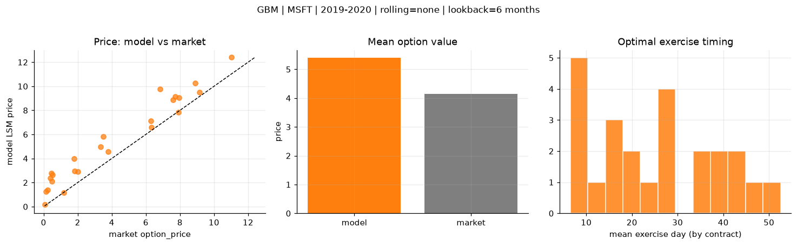
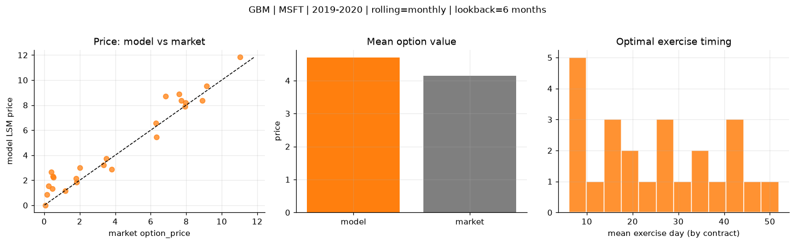
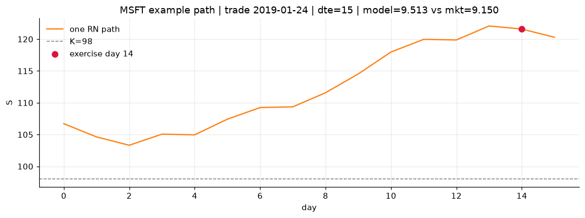
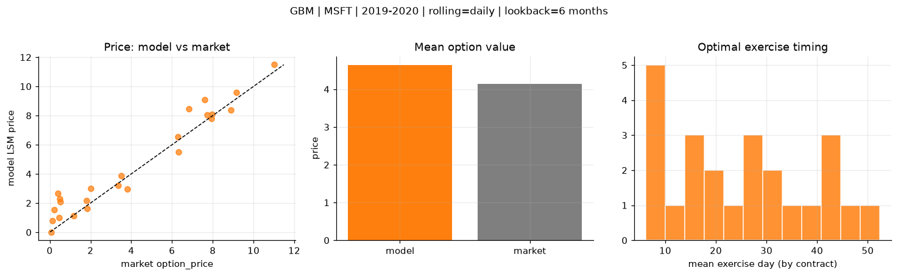
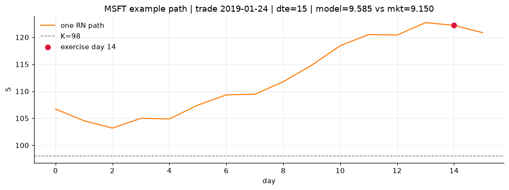

# Optimal stopping — GBM — 2019-2020 — MSFT

**Model:** GBM  
**Underlying:** MSFT  
**Regime / period:** 2019-2020  
**Lookback:** 6 months (fixed)  
**Rolling modes:** none, monthly, daily  
**Pricing:** LSM American calls on MSFT | n_paths=2000 | seed=42 | contracts=24

## Comparison (same contracts, same lookback)

| Rolling | RMSE | MAE | Bias (model−mkt) | Mean early-ex frac | Cal updates | Cal s | LSM s |
|---------|-----:|----:|-----------------:|-------------------:|------------:|------:|------:|
| `none` | 1.4759 | 1.2637 | 1.2527 | 0.261 | 1 | 0.0 | 0.1 |
| `monthly` | 0.9960 | 0.7604 | 0.5521 | 0.272 | 25 | 0.0 | 0.1 |
| `daily` | 0.9498 | 0.7194 | 0.4940 | 0.275 | 505 | 0.1 | 0.1 |

**Lowest RMSE (this study):** `daily` = 0.9498

## Rolling = `none`

- **RMSE:** 1.4759  
- **MAE:** 1.2637  
- **Bias:** 1.2527  
- **Mean early-exercise fraction:** 0.261  
- **Calibration updates (MSFT):** 1

Contract errors (compact)

| date | K | dte | market | model | error | early_ex |
|------|--:|----:|-------:|------:|------:|---------:|
| 2019-01-24 | 98 | 15 | 9.150 | 9.513 | 0.363 | 0.439 |
| 2019-10-10 | 134 | 15 | 6.325 | 6.596 | 0.271 | 0.322 |
| 2019-06-25 | 132 | 31 | 7.725 | 9.128 | 1.403 | 0.320 |
| 2019-06-25 | 128 | 31 | 11.025 | 12.394 | 1.369 | 0.549 |
| 2019-09-12 | 130 | 43 | 8.900 | 10.252 | 1.352 | 0.382 |
| 2019-01-16 | 100 | 58 | 7.600 | 8.888 | 1.288 | 0.419 |
| 2019-02-07 | 105 | 8 | 2.020 | 2.893 | 0.873 | 0.295 |
| 2019-07-17 | 140 | 16 | 1.820 | 2.975 | 1.155 | 0.075 |
| 2019-09-26 | 141 | 29 | 3.350 | 4.960 | 1.610 | 0.239 |
| 2019-10-03 | 137 | 29 | 3.800 | 4.566 | 0.766 | 0.256 |
| 2019-06-18 | 130 | 59 | 6.825 | 9.773 | 2.948 | 0.366 |
| 2019-10-10 | 141 | 43 | 3.500 | 5.804 | 2.304 | 0.166 |
| 2019-10-03 | 147 | 8 | 0.060 | 0.174 | 0.114 | 0.009 |
| 2019-06-18 | 142 | 17 | 0.140 | 1.268 | 1.128 | 0.032 |
| 2019-05-20 | 138 | 38 | 0.530 | 2.628 | 2.098 | 0.064 |
| 2019-03-08 | 115 | 21 | 0.500 | 2.086 | 1.586 | 0.064 |
| 2019-07-17 | 150 | 44 | 0.455 | 2.766 | 2.311 | 0.129 |
| 2019-09-19 | 146 | 43 | 1.795 | 3.989 | 2.194 | 0.120 |
| 2019-01-02 | 111 | 30 | 1.180 | 1.143 | -0.037 | 0.103 |
| 2019-11-07 | 138 | 8 | 6.300 | 7.128 | 0.828 | 0.487 |
| 2019-04-22 | 116 | 10 | 7.925 | 7.830 | -0.095 | 0.627 |
| 2019-02-14 | 113 | 22 | 0.230 | 1.397 | 1.167 | 0.144 |
| 2019-03-01 | 120 | 35 | 0.400 | 2.349 | 1.949 | 0.086 |
| 2019-12-20 | 148 | 14 | 7.950 | 9.070 | 1.120 | 0.566 |

## Rolling = `monthly`

- **RMSE:** 0.9960  
- **MAE:** 0.7604  
- **Bias:** 0.5521  
- **Mean early-exercise fraction:** 0.272  
- **Calibration updates (MSFT):** 25

Contract errors (compact)

| date | K | dte | market | model | error | early_ex |
|------|--:|----:|-------:|------:|------:|---------:|
| 2019-01-24 | 98 | 15 | 9.150 | 9.513 | 0.363 | 0.439 |
| 2019-10-10 | 134 | 15 | 6.325 | 5.464 | -0.861 | 0.367 |
| 2019-06-25 | 132 | 31 | 7.725 | 8.387 | 0.662 | 0.355 |
| 2019-06-25 | 128 | 31 | 11.025 | 11.826 | 0.801 | 0.565 |
| 2019-09-12 | 130 | 43 | 8.900 | 8.388 | -0.512 | 0.458 |
| 2019-01-16 | 100 | 58 | 7.600 | 8.888 | 1.288 | 0.419 |
| 2019-02-07 | 105 | 8 | 2.020 | 2.998 | 0.978 | 0.299 |
| 2019-07-17 | 140 | 16 | 1.820 | 1.856 | 0.036 | 0.101 |
| 2019-09-26 | 141 | 29 | 3.350 | 3.235 | -0.115 | 0.234 |
| 2019-10-03 | 137 | 29 | 3.800 | 2.886 | -0.914 | 0.236 |
| 2019-06-18 | 130 | 59 | 6.825 | 8.719 | 1.894 | 0.385 |
| 2019-10-10 | 141 | 43 | 3.500 | 3.718 | 0.218 | 0.112 |
| 2019-10-03 | 147 | 8 | 0.060 | 0.017 | -0.043 | 0.007 |
| 2019-06-18 | 142 | 17 | 0.140 | 0.875 | 0.735 | 0.026 |
| 2019-05-20 | 138 | 38 | 0.530 | 2.235 | 1.705 | 0.032 |
| 2019-03-08 | 115 | 21 | 0.500 | 2.323 | 1.823 | 0.065 |
| 2019-07-17 | 150 | 44 | 0.455 | 1.321 | 0.866 | 0.095 |
| 2019-09-19 | 146 | 43 | 1.795 | 2.124 | 0.329 | 0.103 |
| 2019-01-02 | 111 | 30 | 1.180 | 1.143 | -0.037 | 0.103 |
| 2019-11-07 | 138 | 8 | 6.300 | 6.551 | 0.251 | 0.591 |
| 2019-04-22 | 116 | 10 | 7.925 | 7.908 | -0.017 | 0.618 |
| 2019-02-14 | 113 | 22 | 0.230 | 1.538 | 1.308 | 0.147 |
| 2019-03-01 | 120 | 35 | 0.400 | 2.641 | 2.241 | 0.094 |
| 2019-12-20 | 148 | 14 | 7.950 | 8.202 | 0.252 | 0.691 |

## Rolling = `daily`

- **RMSE:** 0.9498  
- **MAE:** 0.7194  
- **Bias:** 0.4940  
- **Mean early-exercise fraction:** 0.275  
- **Calibration updates (MSFT):** 505

Contract errors (compact)

| date | K | dte | market | model | error | early_ex |
|------|--:|----:|-------:|------:|------:|---------:|
| 2019-01-24 | 98 | 15 | 9.150 | 9.585 | 0.435 | 0.430 |
| 2019-10-10 | 134 | 15 | 6.325 | 5.523 | -0.802 | 0.368 |
| 2019-06-25 | 132 | 31 | 7.725 | 8.047 | 0.322 | 0.367 |
| 2019-06-25 | 128 | 31 | 11.025 | 11.486 | 0.461 | 0.587 |
| 2019-09-12 | 130 | 43 | 8.900 | 8.384 | -0.516 | 0.462 |
| 2019-01-16 | 100 | 58 | 7.600 | 9.077 | 1.477 | 0.420 |
| 2019-02-07 | 105 | 8 | 2.020 | 3.015 | 0.995 | 0.300 |
| 2019-07-17 | 140 | 16 | 1.820 | 1.606 | -0.214 | 0.102 |
| 2019-09-26 | 141 | 29 | 3.350 | 3.226 | -0.124 | 0.233 |
| 2019-10-03 | 137 | 29 | 3.800 | 2.950 | -0.850 | 0.240 |
| 2019-06-18 | 130 | 59 | 6.825 | 8.443 | 1.618 | 0.379 |
| 2019-10-10 | 141 | 43 | 3.500 | 3.858 | 0.358 | 0.114 |
| 2019-10-03 | 147 | 8 | 0.060 | 0.019 | -0.041 | 0.007 |
| 2019-06-18 | 142 | 17 | 0.140 | 0.779 | 0.639 | 0.026 |
| 2019-05-20 | 138 | 38 | 0.530 | 2.080 | 1.550 | 0.024 |
| 2019-03-08 | 115 | 21 | 0.500 | 2.313 | 1.813 | 0.065 |
| 2019-07-17 | 150 | 44 | 0.455 | 1.003 | 0.548 | 0.083 |
| 2019-09-19 | 146 | 43 | 1.795 | 2.176 | 0.381 | 0.102 |
| 2019-01-02 | 111 | 30 | 1.180 | 1.143 | -0.037 | 0.103 |
| 2019-11-07 | 138 | 8 | 6.300 | 6.526 | 0.226 | 0.597 |
| 2019-04-22 | 116 | 10 | 7.925 | 7.804 | -0.121 | 0.633 |
| 2019-02-14 | 113 | 22 | 0.230 | 1.560 | 1.330 | 0.147 |
| 2019-03-01 | 120 | 35 | 0.400 | 2.665 | 2.265 | 0.098 |
| 2019-12-20 | 148 | 14 | 7.950 | 8.092 | 0.142 | 0.725 |

