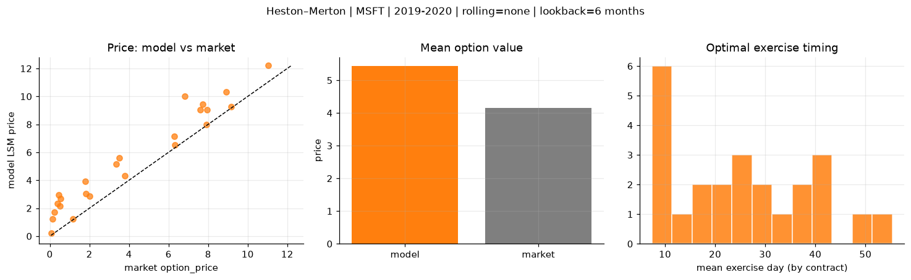
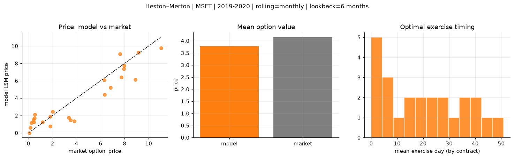
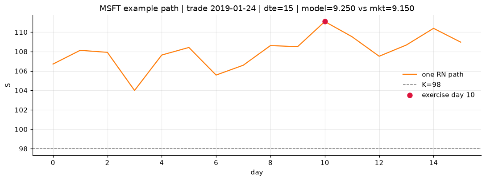
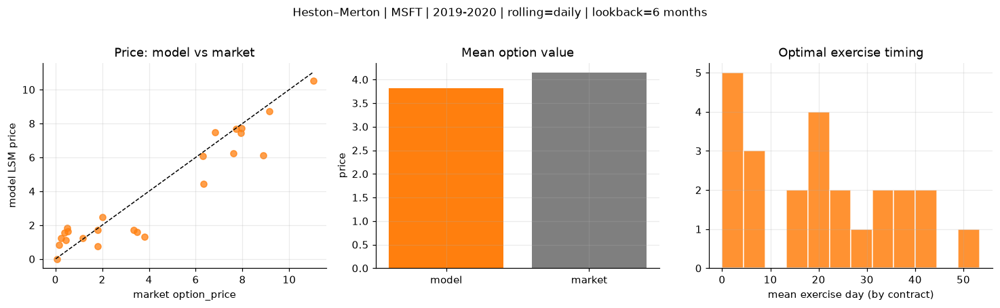
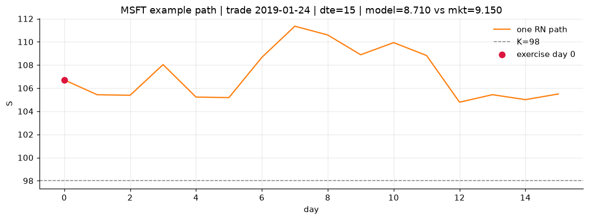

# Optimal stopping — Heston–Merton — 2019-2020 — MSFT

**Model:** Heston–Merton  
**Underlying:** MSFT  
**Regime / period:** 2019-2020  
**Lookback:** 6 months (fixed)  
**Rolling modes:** none, monthly, daily  
**Pricing:** LSM American calls on MSFT | n_paths=2000 | seed=42 | contracts=24

## Comparison (same contracts, same lookback)

| Rolling | RMSE | MAE | Bias (model−mkt) | Mean early-ex frac | Cal updates | Cal s | LSM s |
|---------|-----:|----:|-----------------:|-------------------:|------------:|------:|------:|
| `none` | 1.5278 | 1.2883 | 1.2883 | 0.249 | 1 | 0.0 | 0.1 |
| `monthly` | 1.3027 | 1.0520 | -0.3737 | 0.413 | 25 | 0.0 | 0.1 |
| `daily` | 1.1950 | 0.9280 | -0.3363 | 0.400 | 505 | 0.9 | 0.1 |

**Lowest RMSE (this study):** `daily` = 1.1950

## Rolling = `none`

- **RMSE:** 1.5278  
- **MAE:** 1.2883  
- **Bias:** 1.2883  
- **Mean early-exercise fraction:** 0.249  
- **Calibration updates (MSFT):** 1

Contract errors (compact)

| date | K | dte | market | model | error | early_ex |
|------|--:|----:|-------:|------:|------:|---------:|
| 2019-01-24 | 98 | 15 | 9.150 | 9.250 | 0.100 | 0.628 |
| 2019-10-10 | 134 | 15 | 6.325 | 6.544 | 0.219 | 0.473 |
| 2019-06-25 | 132 | 31 | 7.725 | 9.461 | 1.736 | 0.411 |
| 2019-06-25 | 128 | 31 | 11.025 | 12.202 | 1.177 | 0.496 |
| 2019-09-12 | 130 | 43 | 8.900 | 10.339 | 1.439 | 0.446 |
| 2019-01-16 | 100 | 58 | 7.600 | 9.063 | 1.463 | 0.442 |
| 2019-02-07 | 105 | 8 | 2.020 | 2.848 | 0.828 | 0.272 |
| 2019-07-17 | 140 | 16 | 1.820 | 3.044 | 1.224 | 0.077 |
| 2019-09-26 | 141 | 29 | 3.350 | 5.141 | 1.791 | 0.235 |
| 2019-10-03 | 137 | 29 | 3.800 | 4.341 | 0.541 | 0.233 |
| 2019-06-18 | 130 | 59 | 6.825 | 10.000 | 3.175 | 0.245 |
| 2019-10-10 | 141 | 43 | 3.500 | 5.585 | 2.085 | 0.164 |
| 2019-10-03 | 147 | 8 | 0.060 | 0.227 | 0.167 | 0.019 |
| 2019-06-18 | 142 | 17 | 0.140 | 1.227 | 1.087 | 0.126 |
| 2019-05-20 | 138 | 38 | 0.530 | 2.700 | 2.170 | 0.128 |
| 2019-03-08 | 115 | 21 | 0.500 | 2.146 | 1.646 | 0.155 |
| 2019-07-17 | 150 | 44 | 0.455 | 2.954 | 2.499 | 0.128 |
| 2019-09-19 | 146 | 43 | 1.795 | 3.929 | 2.134 | 0.150 |
| 2019-01-02 | 111 | 30 | 1.180 | 1.232 | 0.052 | 0.130 |
| 2019-11-07 | 138 | 8 | 6.300 | 7.157 | 0.857 | 0.000 |
| 2019-04-22 | 116 | 10 | 7.925 | 7.966 | 0.041 | 0.285 |
| 2019-02-14 | 113 | 22 | 0.230 | 1.698 | 1.468 | 0.117 |
| 2019-03-01 | 120 | 35 | 0.400 | 2.333 | 1.933 | 0.111 |
| 2019-12-20 | 148 | 14 | 7.950 | 9.041 | 1.091 | 0.501 |

## Rolling = `monthly`

- **RMSE:** 1.3027  
- **MAE:** 1.0520  
- **Bias:** -0.3737  
- **Mean early-exercise fraction:** 0.413  
- **Calibration updates (MSFT):** 25

Contract errors (compact)

| date | K | dte | market | model | error | early_ex |
|------|--:|----:|-------:|------:|------:|---------:|
| 2019-01-24 | 98 | 15 | 9.150 | 9.250 | 0.100 | 0.628 |
| 2019-10-10 | 134 | 15 | 6.325 | 4.414 | -1.911 | 0.677 |
| 2019-06-25 | 132 | 31 | 7.725 | 6.398 | -1.327 | 0.638 |
| 2019-06-25 | 128 | 31 | 11.025 | 9.780 | -1.245 | 1.000 |
| 2019-09-12 | 130 | 43 | 8.900 | 6.120 | -2.780 | 1.000 |
| 2019-01-16 | 100 | 58 | 7.600 | 9.063 | 1.463 | 0.442 |
| 2019-02-07 | 105 | 8 | 2.020 | 2.438 | 0.418 | 0.357 |
| 2019-07-17 | 140 | 16 | 1.820 | 1.881 | 0.061 | 0.153 |
| 2019-09-26 | 141 | 29 | 3.350 | 1.763 | -1.587 | 0.258 |
| 2019-10-03 | 137 | 29 | 3.800 | 1.335 | -2.465 | 0.218 |
| 2019-06-18 | 130 | 59 | 6.825 | 5.182 | -1.643 | 0.429 |
| 2019-10-10 | 141 | 43 | 3.500 | 1.485 | -2.015 | 0.210 |
| 2019-10-03 | 147 | 8 | 0.060 | 0.010 | -0.050 | 0.002 |
| 2019-06-18 | 142 | 17 | 0.140 | 0.582 | 0.442 | 0.068 |
| 2019-05-20 | 138 | 38 | 0.530 | 2.096 | 1.566 | 0.109 |
| 2019-03-08 | 115 | 21 | 0.500 | 1.709 | 1.209 | 0.147 |
| 2019-07-17 | 150 | 44 | 0.455 | 1.249 | 0.794 | 0.090 |
| 2019-09-19 | 146 | 43 | 1.795 | 0.747 | -1.048 | 0.106 |
| 2019-01-02 | 111 | 30 | 1.180 | 1.232 | 0.052 | 0.130 |
| 2019-11-07 | 138 | 8 | 6.300 | 6.060 | -0.240 | 1.000 |
| 2019-04-22 | 116 | 10 | 7.925 | 7.370 | -0.555 | 1.000 |
| 2019-02-14 | 113 | 22 | 0.230 | 1.161 | 0.931 | 0.096 |
| 2019-03-01 | 120 | 35 | 0.400 | 1.505 | 1.105 | 0.154 |
| 2019-12-20 | 148 | 14 | 7.950 | 7.710 | -0.240 | 1.000 |

## Rolling = `daily`

- **RMSE:** 1.1950  
- **MAE:** 0.9280  
- **Bias:** -0.3363  
- **Mean early-exercise fraction:** 0.400  
- **Calibration updates (MSFT):** 505

Contract errors (compact)

| date | K | dte | market | model | error | early_ex |
|------|--:|----:|-------:|------:|------:|---------:|
| 2019-01-24 | 98 | 15 | 9.150 | 8.710 | -0.440 | 1.000 |
| 2019-10-10 | 134 | 15 | 6.325 | 4.455 | -1.870 | 0.665 |
| 2019-06-25 | 132 | 31 | 7.725 | 7.665 | -0.060 | 0.589 |
| 2019-06-25 | 128 | 31 | 11.025 | 10.533 | -0.492 | 0.615 |
| 2019-09-12 | 130 | 43 | 8.900 | 6.120 | -2.780 | 1.000 |
| 2019-01-16 | 100 | 58 | 7.600 | 6.254 | -1.346 | 0.561 |
| 2019-02-07 | 105 | 8 | 2.020 | 2.466 | 0.446 | 0.347 |
| 2019-07-17 | 140 | 16 | 1.820 | 1.731 | -0.089 | 0.163 |
| 2019-09-26 | 141 | 29 | 3.350 | 1.710 | -1.640 | 0.253 |
| 2019-10-03 | 137 | 29 | 3.800 | 1.327 | -2.473 | 0.217 |
| 2019-06-18 | 130 | 59 | 6.825 | 7.475 | 0.650 | 0.300 |
| 2019-10-10 | 141 | 43 | 3.500 | 1.586 | -1.914 | 0.217 |
| 2019-10-03 | 147 | 8 | 0.060 | 0.011 | -0.049 | 0.003 |
| 2019-06-18 | 142 | 17 | 0.140 | 0.843 | 0.703 | 0.068 |
| 2019-05-20 | 138 | 38 | 0.530 | 1.625 | 1.095 | 0.173 |
| 2019-03-08 | 115 | 21 | 0.500 | 1.825 | 1.325 | 0.153 |
| 2019-07-17 | 150 | 44 | 0.455 | 1.119 | 0.664 | 0.087 |
| 2019-09-19 | 146 | 43 | 1.795 | 0.761 | -1.034 | 0.102 |
| 2019-01-02 | 111 | 30 | 1.180 | 1.232 | 0.052 | 0.130 |
| 2019-11-07 | 138 | 8 | 6.300 | 6.060 | -0.240 | 1.000 |
| 2019-04-22 | 116 | 10 | 7.925 | 7.421 | -0.504 | 0.758 |
| 2019-02-14 | 113 | 22 | 0.230 | 1.226 | 0.996 | 0.099 |
| 2019-03-01 | 120 | 35 | 0.400 | 1.570 | 1.170 | 0.101 |
| 2019-12-20 | 148 | 14 | 7.950 | 7.710 | -0.240 | 1.000 |

