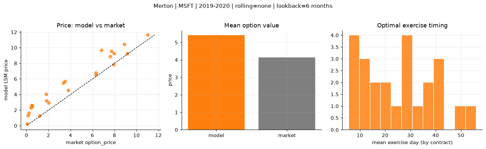
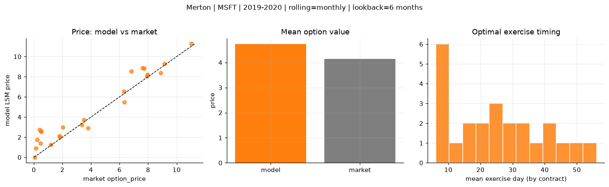
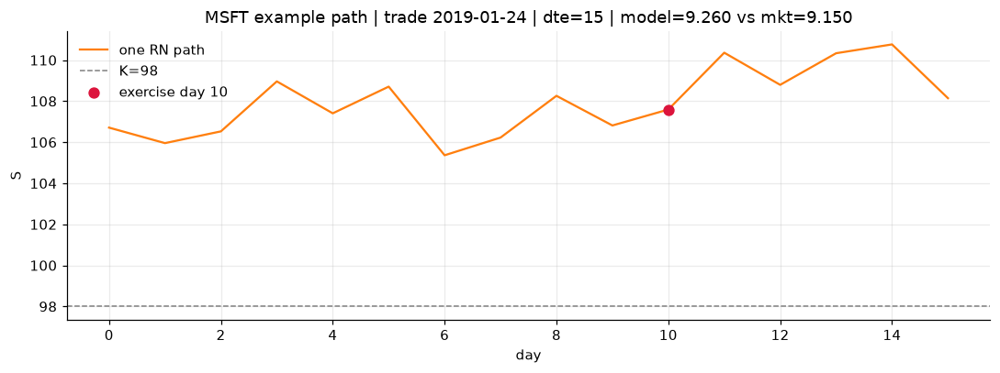
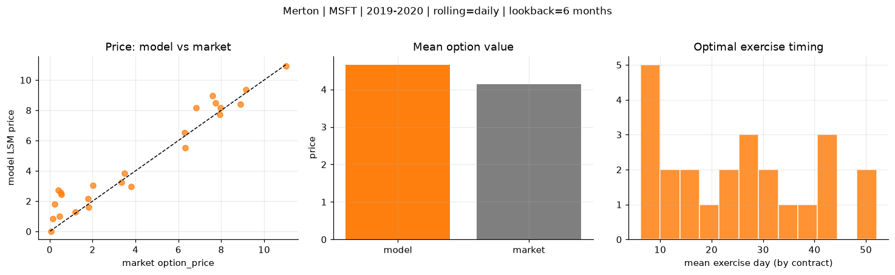
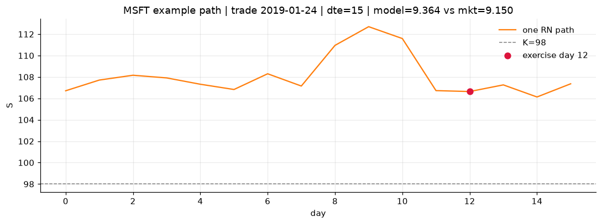

# Optimal stopping — Merton — 2019-2020 — MSFT

**Model:** Merton  
**Underlying:** MSFT  
**Regime / period:** 2019-2020  
**Lookback:** 6 months (fixed)  
**Rolling modes:** none, monthly, daily  
**Pricing:** LSM American calls on MSFT | n_paths=2000 | seed=42 | contracts=24

## Comparison (same contracts, same lookback)

| Rolling | RMSE | MAE | Bias (model−mkt) | Mean early-ex frac | Cal updates | Cal s | LSM s |
|---------|-----:|----:|-----------------:|-------------------:|------------:|------:|------:|
| `none` | 1.5104 | 1.2809 | 1.2723 | 0.248 | 1 | 0.0 | 0.1 |
| `monthly` | 1.0564 | 0.7926 | 0.5889 | 0.271 | 25 | 0.0 | 0.1 |
| `daily` | 0.9964 | 0.7450 | 0.5084 | 0.270 | 505 | 0.1 | 0.1 |

**Lowest RMSE (this study):** `daily` = 0.9964

## Rolling = `none`

- **RMSE:** 1.5104  
- **MAE:** 1.2809  
- **Bias:** 1.2723  
- **Mean early-exercise fraction:** 0.248  
- **Calibration updates (MSFT):** 1

Contract errors (compact)

| date | K | dte | market | model | error | early_ex |
|------|--:|----:|-------:|------:|------:|---------:|
| 2019-01-24 | 98 | 15 | 9.150 | 9.260 | 0.110 | 0.648 |
| 2019-10-10 | 134 | 15 | 6.325 | 6.510 | 0.185 | 0.287 |
| 2019-06-25 | 132 | 31 | 7.725 | 9.550 | 1.825 | 0.150 |
| 2019-06-25 | 128 | 31 | 11.025 | 11.635 | 0.610 | 0.571 |
| 2019-09-12 | 130 | 43 | 8.900 | 10.442 | 1.542 | 0.443 |
| 2019-01-16 | 100 | 58 | 7.600 | 8.874 | 1.274 | 0.572 |
| 2019-02-07 | 105 | 8 | 2.020 | 2.944 | 0.924 | 0.130 |
| 2019-07-17 | 140 | 16 | 1.820 | 3.194 | 1.374 | 0.158 |
| 2019-09-26 | 141 | 29 | 3.350 | 5.455 | 2.105 | 0.233 |
| 2019-10-03 | 137 | 29 | 3.800 | 4.529 | 0.729 | 0.184 |
| 2019-06-18 | 130 | 59 | 6.825 | 9.681 | 2.856 | 0.325 |
| 2019-10-10 | 141 | 43 | 3.500 | 5.687 | 2.187 | 0.203 |
| 2019-10-03 | 147 | 8 | 0.060 | 0.270 | 0.210 | 0.004 |
| 2019-06-18 | 142 | 17 | 0.140 | 1.304 | 1.164 | 0.108 |
| 2019-05-20 | 138 | 38 | 0.530 | 2.549 | 2.019 | 0.117 |
| 2019-03-08 | 115 | 21 | 0.500 | 2.420 | 1.920 | 0.007 |
| 2019-07-17 | 150 | 44 | 0.455 | 2.587 | 2.132 | 0.124 |
| 2019-09-19 | 146 | 43 | 1.795 | 4.037 | 2.242 | 0.165 |
| 2019-01-02 | 111 | 30 | 1.180 | 1.277 | 0.097 | 0.073 |
| 2019-11-07 | 138 | 8 | 6.300 | 6.792 | 0.492 | 0.502 |
| 2019-04-22 | 116 | 10 | 7.925 | 7.821 | -0.104 | 0.427 |
| 2019-02-14 | 113 | 22 | 0.230 | 1.658 | 1.428 | 0.036 |
| 2019-03-01 | 120 | 35 | 0.400 | 2.295 | 1.895 | 0.131 |
| 2019-12-20 | 148 | 14 | 7.950 | 9.268 | 1.318 | 0.355 |

## Rolling = `monthly`

- **RMSE:** 1.0564  
- **MAE:** 0.7926  
- **Bias:** 0.5889  
- **Mean early-exercise fraction:** 0.271  
- **Calibration updates (MSFT):** 25

Contract errors (compact)

| date | K | dte | market | model | error | early_ex |
|------|--:|----:|-------:|------:|------:|---------:|
| 2019-01-24 | 98 | 15 | 9.150 | 9.260 | 0.110 | 0.648 |
| 2019-10-10 | 134 | 15 | 6.325 | 5.464 | -0.861 | 0.367 |
| 2019-06-25 | 132 | 31 | 7.725 | 8.849 | 1.124 | 0.397 |
| 2019-06-25 | 128 | 31 | 11.025 | 11.265 | 0.240 | 0.477 |
| 2019-09-12 | 130 | 43 | 8.900 | 8.388 | -0.512 | 0.458 |
| 2019-01-16 | 100 | 58 | 7.600 | 8.874 | 1.274 | 0.572 |
| 2019-02-07 | 105 | 8 | 2.020 | 3.004 | 0.984 | 0.202 |
| 2019-07-17 | 140 | 16 | 1.820 | 2.015 | 0.195 | 0.112 |
| 2019-09-26 | 141 | 29 | 3.350 | 3.235 | -0.115 | 0.234 |
| 2019-10-03 | 137 | 29 | 3.800 | 2.886 | -0.914 | 0.236 |
| 2019-06-18 | 130 | 59 | 6.825 | 8.560 | 1.735 | 0.417 |
| 2019-10-10 | 141 | 43 | 3.500 | 3.718 | 0.218 | 0.112 |
| 2019-10-03 | 147 | 8 | 0.060 | 0.017 | -0.043 | 0.007 |
| 2019-06-18 | 142 | 17 | 0.140 | 0.903 | 0.763 | 0.061 |
| 2019-05-20 | 138 | 38 | 0.530 | 2.559 | 2.029 | 0.035 |
| 2019-03-08 | 115 | 21 | 0.500 | 2.559 | 2.059 | 0.128 |
| 2019-07-17 | 150 | 44 | 0.455 | 1.378 | 0.923 | 0.060 |
| 2019-09-19 | 146 | 43 | 1.795 | 2.124 | 0.329 | 0.103 |
| 2019-01-02 | 111 | 30 | 1.180 | 1.277 | 0.097 | 0.073 |
| 2019-11-07 | 138 | 8 | 6.300 | 6.551 | 0.251 | 0.591 |
| 2019-04-22 | 116 | 10 | 7.925 | 8.042 | 0.117 | 0.453 |
| 2019-02-14 | 113 | 22 | 0.230 | 1.757 | 1.527 | 0.023 |
| 2019-03-01 | 120 | 35 | 0.400 | 2.751 | 2.351 | 0.057 |
| 2019-12-20 | 148 | 14 | 7.950 | 8.202 | 0.252 | 0.691 |

## Rolling = `daily`

- **RMSE:** 0.9964  
- **MAE:** 0.7450  
- **Bias:** 0.5084  
- **Mean early-exercise fraction:** 0.270  
- **Calibration updates (MSFT):** 505

Contract errors (compact)

| date | K | dte | market | model | error | early_ex |
|------|--:|----:|-------:|------:|------:|---------:|
| 2019-01-24 | 98 | 15 | 9.150 | 9.364 | 0.214 | 0.601 |
| 2019-10-10 | 134 | 15 | 6.325 | 5.523 | -0.802 | 0.368 |
| 2019-06-25 | 132 | 31 | 7.725 | 8.498 | 0.773 | 0.307 |
| 2019-06-25 | 128 | 31 | 11.025 | 10.933 | -0.092 | 0.541 |
| 2019-09-12 | 130 | 43 | 8.900 | 8.384 | -0.516 | 0.462 |
| 2019-01-16 | 100 | 58 | 7.600 | 8.963 | 1.363 | 0.412 |
| 2019-02-07 | 105 | 8 | 2.020 | 3.042 | 1.022 | 0.205 |
| 2019-07-17 | 140 | 16 | 1.820 | 1.606 | -0.214 | 0.102 |
| 2019-09-26 | 141 | 29 | 3.350 | 3.226 | -0.124 | 0.233 |
| 2019-10-03 | 137 | 29 | 3.800 | 2.950 | -0.850 | 0.240 |
| 2019-06-18 | 130 | 59 | 6.825 | 8.147 | 1.322 | 0.346 |
| 2019-10-10 | 141 | 43 | 3.500 | 3.858 | 0.358 | 0.114 |
| 2019-10-03 | 147 | 8 | 0.060 | 0.019 | -0.041 | 0.007 |
| 2019-06-18 | 142 | 17 | 0.140 | 0.841 | 0.701 | 0.070 |
| 2019-05-20 | 138 | 38 | 0.530 | 2.422 | 1.892 | 0.244 |
| 2019-03-08 | 115 | 21 | 0.500 | 2.553 | 2.053 | 0.142 |
| 2019-07-17 | 150 | 44 | 0.455 | 1.003 | 0.548 | 0.083 |
| 2019-09-19 | 146 | 43 | 1.795 | 2.176 | 0.381 | 0.102 |
| 2019-01-02 | 111 | 30 | 1.180 | 1.277 | 0.097 | 0.073 |
| 2019-11-07 | 138 | 8 | 6.300 | 6.526 | 0.226 | 0.597 |
| 2019-04-22 | 116 | 10 | 7.925 | 7.725 | -0.200 | 0.443 |
| 2019-02-14 | 113 | 22 | 0.230 | 1.806 | 1.576 | 0.024 |
| 2019-03-01 | 120 | 35 | 0.400 | 2.713 | 2.313 | 0.087 |
| 2019-12-20 | 148 | 14 | 7.950 | 8.153 | 0.203 | 0.671 |

